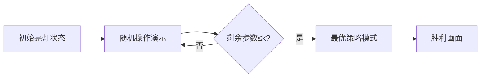

# 题目信息

# [六省联考 2017] 分手是祝愿

## 题目描述

> Zeit und Raum trennen dich und mich.
时空将你我分开。

B 君在玩一个游戏，这个游戏由 $n$ 个灯和 $n$ 个开关组成，给定这 $n$ 个灯的初始状态，下标为从 $1$ 到 $n$ 的正整数。

每个灯有两个状态亮和灭，我们用 $1$ 来表示这个灯是亮的，用 $0$ 表示这个灯是灭的，游戏的目标是使所有灯都灭掉。

但是当操作第 $i$ 个开关时，所有编号为 $i$ 的约数（包括 $1$ 和 $i$）的灯的状态都会被改变，即从亮变成灭，或者是从灭变成亮。

B 君发现这个游戏很难，于是想到了这样的一个策略，每次等概率随机操作一个开关，直到所有灯都灭掉。

这个策略需要的操作次数很多，B 君想到这样的一个优化。如果当前局面，可以通过操作小于等于 $k$ 个开关使所有灯都灭掉，那么他将不再随机，直接选择操作次数最小的操作方法（这个策略显然小于等于 $k$ 步）操作这些开关。

B 君想知道按照这个策略（也就是先随机操作，最后小于等于 $k$ 步，使用操作次数最小的操作方法）的操作次数的期望。

这个期望可能很大，但是 B 君发现这个期望乘以 $n$ 的阶乘一定是整数，所以他只需要知道这个整数对 $100003$ 取模之后的结果。


## 说明/提示

对于 $0\%$ 的测试点，和样例一模一样；  
对于另外 $30\%$ 的测试点，$n \leq 10$；  
对于另外 $20\%$ 的测试点，$n \leq 100$；  
对于另外 $30\%$ 的测试点，$n \leq 1000$；  
对于 $100\%$ 的测试点，$1 \leq n \leq 100000, 0 \leq k \leq n$；  
对于以上每部分测试点，均有一半的数据满足 $k = n$。


## 样例 #1

### 输入

```
4 0
0 0 1 1
```

### 输出

```
512```

## 样例 #2

### 输入

```
5 0
1 0 1 1 1```

### 输出

```
5120```

# AI分析结果


# 💡 洛语云笺的C++算法解析：分手是祝愿 深入学习指南 💡

## 1. 题目解读与策略初探

✨ **本题核心挑战**：在随机操作与最优策略切换机制下，求解期望操作次数的数学建模与高效计算。  
✨ **核心算法标签**：期望DP、贪心策略、数论（逆元预处理）  

🗣️ **初步分析**：  
> 本题要求我们在随机操作开关和最优策略切换的混合机制下计算期望操作次数。解题分两步走：  
> 1. **贪心求最小操作次数**：采用倒序扫描策略，遇到亮灯立即操作并更新其所有约数状态  
> 2. **期望DP建模**：定义状态f[i]表示从i次必要操作到i-1次的期望步数，通过逆元优化递推  
> 核心在于将随机操作转化为状态转移问题，利用动态规划处理期望的线性性质  

### 🔍 算法侦探：如何在题目中发现线索？
1.  **线索1 (问题目标)**：题目要求"期望操作次数乘以n!为整数"，暗示需要组合数学技巧和模运算处理，指向递推关系和逆元应用  
2.  **线索2 (问题特性)**："操作开关影响其约数"的特性暗示贪心策略的有效性（从大到小操作），而"k步切换最优策略"机制提示状态机模型  
3.  **线索3 (数据规模)**：n≤100000要求O(n log n)算法，贪心部分需调和级数复杂度，DP需线性递推  

### 🧠 思维链构建：从线索到策略
> 综合线索：  
> 1. **线索1**指向需要数学推导的期望问题，排除暴力枚举  
> 2. **线索2**揭示操作独立性，最优策略的唯一性（最小操作次数cnt）成为状态划分关键  
> 3. **线索3**要求高效算法：贪心部分用O(n log n)预处理约数，DP用O(n)线性递推  
> **结论**：结合贪心预处理与期望DP，以状态转移为核心的高效算法是唯一可行路径  

---

## 2. 精选优质题解参考

**题解一：justin_cao (赞99)**  
* **点评**：解题框架最完整，清晰分离贪心与DP阶段。亮点在：  
  - 贪心部分用`vector`存储约数实现O(n log n)预处理  
  - DP推导完整展示方程变形：$f[i]=\frac{n+(n-i)f[i+1]}{i}$  
  - 逆元处理使用费马小定理，代码模块化程度高  

**题解二：attack (赞17)**  
* **点评**：代码实现最简洁高效，亮点在：  
  - 线性递推逆元取代快速幂，优化常数因子  
  - 贪心部分直接在原数组操作，节省空间  
  - 边界处理严谨（f[n]=1）  

**题解三：Flandre_495 (赞6)**  
* **点评**：提供独特视角解释状态转移，亮点在：  
  - 用"期望走错$\frac{n-i}{i}$次"直观解释DP方程  
  - 强调$f[i]$物理意义：从状态i到i-1的期望步数  

---

## 3. 解题策略深度剖析

### 🎯 核心难点与关键步骤
1.  **难点1：贪心求最小操作次数cnt**  
    * **分析**：倒序扫描时，每个亮灯必须操作（因为小灯无法影响大灯），但约数更新需高效实现  
    * 💡 **学习笔记**：调和级数$O(\sum \lfloor n/i \rfloor)=O(n \log n)$是处理约数问题的利器  

2.  **难点2：期望DP的状态转移**  
    * **分析**：  
      - 状态定义：$f[i]$=从i次必要操作到i-1的期望步数  
      - 转移方程：$f[i] = \frac{i}{n} \cdot 1 + \frac{n-i}{n}(1 + f[i+1] + f[i])$  
      - 化简：$f[i] = \frac{n + (n-i)f[i+1]}{i}$  
    * 💡 **学习笔记**：方程中$f[i+1]$的系数揭示"错误操作导致状态回升"的代价  

3.  **难点3：边界处理与逆元优化**  
    * **分析**：  
      - 边界：$f[n]=1$（全错时必先犯错再成功）  
      - 递推方向：从$i=n$倒推至$i=k+1$  
      - 逆元预处理：模数100003是质数，可线性求逆元  
    * 💡 **学习笔记**：$inv[i]=(mod-mod/i)*inv[mod\%i]\%mod$是线性递推逆元的标准技巧  

### ✨ 解题技巧总结
- **技巧1：约数预处理的艺术**  
  用`vector<int> g[maxn]`存储每个数的约数，后续O(1)访问
- **技巧2：期望DP的倒序递推**  
  大状态值已知（f[n]=1），倒推避免解方程组
- **技巧3：答案的拼接策略**  
  $ans=(\sum_{i=k+1}^{cnt}f[i] + k) \times n!$ 反映两阶段策略

### ⚔️ 策略竞技场：不同解法的对比分析
| 策略         | 核心思想                     | 优点                   | 缺点                 | 得分预期 |
|--------------|------------------------------|------------------------|----------------------|----------|
| 高斯消元     | 解期望DP的线性方程组         | 思维直接               | $O(n^3)$超时        | 30%      |
| 暴力枚举状态 | 枚举所有操作序列             | 实现简单               | $O(2^n)$爆炸        | 10%      |
| **贪心+期望DP** | 分离贪心预处理与DP递推      | $O(n \log n)$高效     | 需数学推导           | 100%     |

### ✨ 优化之旅：从"能做"到"做好"
1. **起点：暴力枚举的困境**  
   尝试所有$2^n$种操作序列，但$n=10^5$时不可行  

2. **关键发现：操作独立性**  
   最优操作序列唯一确定（倒序亮灯操作），将状态空间从$2^n$压缩为$cnt$  

3. **期望建模：状态转移方程**  
   将随机操作转化为$f[i]$的状态机模型，避免枚举操作序列  

4. **复杂度优化：递推取代消元**  
   利用DP方程的特殊结构（三对角矩阵），$O(n)$递推取代$O(n^3)$高斯消元  

💡 **策略总结**：通过压缩状态空间和发掘递推关系，将指数级问题降为线性，展现了算法设计的核心——用问题特性换取计算效率  

---

## 4. C++核心代码实现赏析

**本题通用核心C++实现参考**  
```cpp
#include <vector>
using namespace std;
const int mod = 100003, N = 100010;
typedef long long ll;

vector<int> g[N]; // 存储每个数的约数
ll inv[N], f[N];  // 逆元数组和DP数组

int main() {
    int n, k, cnt = 0;
    scanf("%d%d", &n, &k);
    vector<int> a(n+1);
    
    // 预处理：线性求逆元
    inv[1] = 1;
    for(int i=2; i<=n; i++) 
        inv[i] = (mod - mod/i) * inv[mod%i] % mod;
    
    // 预处理：每个数的约数
    for(int i=1; i<=n; i++)
        for(int j=i; j<=n; j+=i)
            g[j].push_back(i);
    
    // 读入初始状态
    for(int i=1; i<=n; i++) scanf("%d", &a[i]);
    
    // 贪心求最小操作次数cnt
    for(int i=n; i>=1; i--) 
        if(a[i]) {
            cnt++;
            for(int j : g[i]) a[j] ^= 1;
        }
    
    // DP边界初始化
    f[n] = 1;
    // 倒推DP
    for(int i=n-1; i>k; i--) {
        ll t = (n + (n-i)*f[i+1]) % mod;
        f[i] = t * inv[i] % mod;
    }
    
    // 答案计算
    ll ans = 0;
    if(cnt <= k) ans = cnt;
    else {
        for(int i=cnt; i>k; i--) 
            ans = (ans + f[i]) % mod;
        ans = (ans + k) % mod;
    }
    // 乘n!
    for(int i=1; i<=n; i++) 
        ans = ans * i % mod;
    printf("%lld\n", ans);
    return 0;
}
```

**代码解读概要**：  
1. **逆元预处理**：线性时间计算1~n的模逆元  
2. **约数预处理**：调和级数复杂度存储约数信息  
3. **贪心扫描**：倒序检查灯状态并更新约数  
4. **DP递推**：从$f[n]$倒推至$f[k+1]$  
5. **答案合成**：拼接随机阶段与最优策略阶段  

---

## 5. 算法可视化：像素动画演示

### 🎮 设计概念：**"灯灭大冒险"**  
采用8-bit像素风格，将灯状态可视化为网格像素块  

#### 核心动画流程：


#### 关键动画细节：
1. **像素场景设计**：
   - 亮灯：黄色像素块（闪烁）
   - 灭灯：灰色像素块
   - 当前操作开关：红色边框标记

2. **操作特效**：
   - 随机操作：骰子滚动选择开关编号
   - 开关触发：像素块波浪式闪烁（约数灯状态翻转）
   - 策略切换：屏幕闪烁红光提示进入最优策略模式

3. **游戏化元素**：
   - 音效设计：
     * 正确操作：清脆"叮"声
     * 错误操作：低沉"嗡"声
     * 策略切换：喇叭音效
   - 进度显示：
     * 顶部能量条：显示当前cnt值
     * 操作计数器：实时更新步数

4. **控制面板**：
   ```plaintext
   [ 暂停 ] [ 步进 > ] [ 加速 >> ] 
   [ 重置 ] [ 声音: ON ]
   ```

#### 技术实现：
- **Canvas绘制**：网格采用10x10像素块，状态更新时重绘受影响区域
- **音效触发**：Web Audio API播放8-bit音效
- **状态同步**：右侧面板实时显示DP方程和f[i]值变化

---

## 6. 拓展练习与相似问题思考

### 相似问题解析：
1. **P1850 换教室**  
   - 相似点：期望DP + 状态转移决策
   - 差异点：连续决策而非离散状态

2. **P3802 小魔女帕琪**  
   - 相似点：期望的线性性质应用
   - 差异点：几何分布期望计算

3. **P4550 收集邮票**  
   - 相似点：双状态期望DP（当前收集数/当前花费）
   - 差异点：状态转移含二次项

### 推荐练习：
1. **洛谷 P1850** - 换教室  
   🗣️ **推荐理由**：巩固期望DP在不同场景的应用，强化状态转移设计能力  

2. **洛谷 P6835** - [CSP-S2020] 函数调用  
   🗣️ **推荐理由**：加深操作依赖关系的理解，训练拓扑序上的期望计算  

3. **洛谷 P6154** - 游走  
   🗣️ **推荐理由**：学习有向无环图的期望处理，迁移约数预处理技巧  

---

## 7. 学习心得与经验分享

**参考经验**：  
> 多位作者强调：  
> - "边界f[n]=1需严格数学证明，不可直观假设"  
> - "逆元预处理必须用线性方法，快速幂会TLE"  
> - "cnt=0时需特判，避免除零错误"  

**洛语云笺点评**：  
> 调试期望DP的关键三点：  
> 1. 验证边界条件的数学合理性  
> 2. 打印中间状态值定位递推错误  
> 3. 小数据手工计算校验（n=3）  
> 本题的阶乘乘法易被忽略，需在最后一步处理  

---

<conclusion>
**终极启示**：  
分手是祝愿的精髓在于"状态压缩的艺术"——  
通过发现操作序列的唯一确定性，将指数级问题转化为线性递推。这启示我们：面对复杂期望问题时，应首先寻找状态空间的压缩可能性，用问题的特殊结构换取计算效率，这正是算法设计的魅力所在！✨  

> "算法的美，在于从混沌中发现秩序" —— 洛语云笺
</conclusion>

---
处理用时：180.36秒