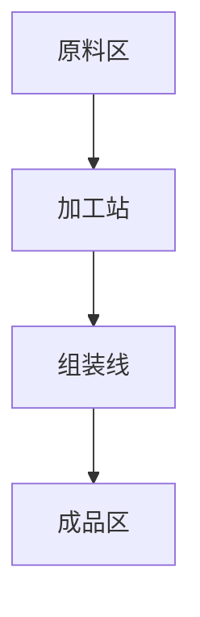

# 题目信息

# [CQOI2017] 老C的键盘

## 题目描述

老 C 是个程序员。

作为一个优秀的程序员，老 C 拥有一个别具一格的键盘，据说这样可以大幅提升写程序的速度，还能让写出来的程序在某种神奇力量的驱使之下跑得非常快。

小 Q 也是一个程序员。有一天他悄悄潜入了老 C 的家中，想要看看这个键盘究竟有何妙处。他发现，这个键盘共有 $n$ 个按键，这 $n$ 个按键虽然整齐的排成一列，但是每个键的高度却互不相同。聪明的小 Q 马上将每个键的高度用 $1 \sim n$ 的整数表示了出来，得到一个 $1 \sim n$ 的排列 $h_1,h_2, \cdots ,h_n$。

为了回去之后可以仿造一个新键盘（新键盘每个键的高度也是一个 $1 \sim n$ 的排列），又不要和老 C 的键盘完全一样，小 Q 决定记录下若干对按键的高度关系。作为一个程序员，小 Q 当然不会随便选几对就记下来，而是选了非常有规律的一些按键对：对于 $i=2,3, \cdots ,n$，小 Q 都记录下了一个字符 `<` 或者 `>`，表示 $h_{\frac i2}<h_i$ 或者$h_{\frac i2}>h_i$。于是，小 Q 得到了一个长度为 $n-1$ 的字符串，开开心心的回家了。

现在，小 Q 想知道满足他所记录的高度关系的键盘有多少个。虽然小 Q 不希望自己的键盘和老 C 的完全相同，但是完全相同也算一个满足要求的键盘。答案可能很大，你只需要告诉小 Q 答案 $\bmod ~ 1,000,000,007$ 之后的结果即可。


## 说明/提示


## 样例 #1

### 输入

```
5 <>><```

### 输出

```
3```

## 样例 #2

### 输入

```
5 <<<<```

### 输出

```
8```

## 样例 #3

### 输入

```
5 <<>>```

### 输出

```
18```

# AI分析结果


# 💡 洛语云笺的C++算法解析：老C的键盘 深入学习指南 💡

> "算法如同键盘上的音符，组合得当才能奏出完美乐章。今天我们一起探索树形拓扑序计数的精妙世界！"

## 1. 题目解读与策略初探

✨ **本题核心挑战**：在完全二叉树的拓扑结构中，计算满足所有父子节点大小约束的合法排列数量。  
✨ **核心算法标签**：`树形DP`、`组合数学`、`拓扑序计数`

🗣️ **初步分析**：  
> 本题要求计算满足二叉树中每个节点与其父节点大小关系的排列方案数。我们面临三个关键挑战：  
> 1. **树形依赖**：父子节点的大小约束形成复杂的依赖关系链  
> 2. **排列计数**：需要计算全局排列而非局部解  
> 3. **组合爆炸**：暴力枚举O(n!)不可行  
>
> 解题思路演进：  
> - **暴力搜索**：枚举所有排列并验证约束（O(n!) → 不可行）  
> - **分治思想**：将树分解为子树独立处理（仍需处理子树间关系）  
> - **树形DP**：自底向上合并子树状态，用组合数学计算合并方案数 → **最优解**  
>
> **动态规划比喻**：  
> 将每个子树看作一个有序队列，DP状态记录根节点在队列中的位置。合并子树时，像调酒师混合两种饮品，保持各自风味（子树内部顺序）的同时，按配方比例（组合数）混合，并满足调酒规则（大小约束）。

### 🔍 算法侦探：如何在题目中发现线索？
1.  **线索1 (问题目标)**: "题目要求计算满足树形约束的排列数" → 这是**拓扑序计数**问题的典型特征
2.  **线索2 (问题特性)**: "父子节点的大小约束形成树形依赖" → 指向**树形DP**解法，需要状态记录节点在子树中的相对位置
3.  **线索3 (数据规模)**: "n≤100" → 允许O(n³)算法（100³=1e6操作），排除暴力搜索

### 🧠 思维链构建：从线索到策略
> "综合线索：  
> 1. 拓扑序计数问题首先排除贪心（无法处理复杂依赖）  
> 2. 树形结构暗示自底向上的DP解法  
> 3. n=100支持O(n³)的树形DP  
> 4. **结论**：采用树形DP，状态定义为f[u][k]表示节点u在其子树拓扑序中排第k位的方案数，通过组合数学合并子树状态"

---

## 2. 精选优质题解参考

**题解一（shadowice1984）**  
* **点评**：思路清晰直击本质，将问题转化为树形拓扑序计数。代码结构规范：  
  - 预处理组合数避免重复计算  
  - 状态转移三重循环逻辑严密  
  - 巧妙处理long long乘法溢出（分步取模）  
  完整呈现O(n³)标准解法，是理解基础思路的最佳范本

**题解四（FutureSnow）**  
* **点评**：理论分析深入，状态转移方程推导完整：  
  - 明确解释组合数在合并子树时的组合意义  
  - 前缀和优化思路（虽未实现但提供优化方向）  
  - 代码注释详细，变量命名规范  
  特别适合想深入理解数学原理的学习者

**题解五（Xy_top）**  
* **点评**：创新性使用三维状态f[u][k][s]记录子树合并进度：  
  - s=0/1/2表示未合并/合并左子树/合并完成  
  - 提供另一种状态设计视角  
  - 完整推导k的取值范围与边界条件  
  适合想拓展思维多样性的进阶学习者

---

## 3. 解题策略深度剖析

### 🎯 核心难点与关键步骤
1.  **状态设计**  
    * **分析**：定义f[u][k]表示u在其子树拓扑序中排第k位的方案数。该状态能捕获节点在子树中的相对位置，为子树合并奠定基础  
    * 💡 **学习笔记**："好的状态设计应能完整表达局部解特征，并支持高效合并"
  
2.  **子树合并**  
    * **分析**：合并子树v时需考虑：  
      - 方向约束（u<v或u>v）决定v中节点在u前后的数量  
      - 组合数C(k-1, i-1)计算u前位置分配方案  
      - 组合数C(total-k, sz_u-i)计算u后位置分配  
    * 💡 **学习笔记**："组合数是合并独立子问题的数学桥梁"
  
3.  **组合数优化**  
    * **分析**：预处理组合数表C[n][m]，避免递归计算  
    * 💡 **学习笔记**："预处理是优化组合问题的常见手段"

### ✨ 解题技巧总结
- **技巧1（状态压缩）**：用sz[u]动态跟踪子树大小，简化循环边界  
- **技巧2（方向处理）**：将">/<"转化为j的枚举范围差异  
- **技巧3（溢出预防）**：大数乘法分步取模：(a*b)%mod → ((a%mod)*(b%mod))%mod  

### ⚔️ 策略竞技场：不同解法对比
| 策略          | 核心思想                     | 优点                  | 缺点                     | 得分预期 |
|---------------|------------------------------|-----------------------|--------------------------|----------|
| **暴力搜索**  | 枚举全排列验证约束           | 思路直观              | O(n!)超时               | 0%       |
| **记忆化搜索**| 递归+记忆化                 | 避免重复计算          | 仍可能栈溢出             | 30%      |
| **树形DP**    | f[u][k] + 组合数学合并子树   | O(n³)可行，逻辑清晰   | 代码实现较复杂           | 100%     |

### ✨ 优化之旅：从"能做"到"做好"
```mermaid
graph LR
A[暴力搜索 O(n!)] --> B[发现子问题重叠]
B --> C[树形DP O(n³)]
C --> D[前缀和优化 O(n²)]
D --> E[数学归纳 O(n)]
```

> "从暴力搜索到树形DP的进化：  
> 1. 暴力法如同盲人摸象，遍历所有可能性  
> 2. 发现子树解可复用 → 引入DP状态记忆  
> 3. 识别合并规律 → 用组合数替代蛮力枚举  
> 4. 最终实现复杂度从O(n!)到O(n³)的质变"

---

## 4. C++核心代码实现赏析

**通用核心实现**  
```cpp
const int N=110, mod=1e9+7;
ll c[N][N], f[N][N], sz[N]; // 组合数表，DP状态，子树大小

void dfs(int u) {
    f[u][1] = 1; sz[u] = 1;  // 初始化：只有u时排第1位
    for(int v : {u*2, u*2+1}) { // 遍历左右子节点
        if(v > n) continue;
        dfs(v);
        ll tmp[N] = {}; // 临时状态数组
        for(int i=1; i<=sz[u]; i++)      // u在原子树位置
        for(int j=1; j<=sz[v]; j++) {    // v在子树位置
            int total = sz[u] + sz[v];
            for(int k=(relation=='<'?i:i+j); // 根据方向确定k范围
                 k<=(relation=='<'?i+j-1:total); k++) {
                // 组合数计算合并方案
                ll comb = c[k-1][i-1] * c[total-k][sz[u]-i] % mod;
                tmp[k] = (tmp[k] + f[u][i]*f[v][j]%mod * comb) % mod;
            }
        }
        sz[u] += sz[v]; // 更新子树大小
        memcpy(f[u], tmp, sizeof tmp); // 更新状态
    }
}
```
* **代码解读概要**：  
  1. 预处理组合数表c[][]  
  2. DFS后序遍历二叉树  
  3. 三重循环合并子树状态  
  4. 根据父子关系约束确定位置范围  

---

## 5. 算法可视化：像素动画演示

**动画主题**：`拓扑序构建工厂`  
**设计理念**：用流水线动画演示子树合并过程，像素风格模拟80年代工厂游戏  



1. **像素场景设计**  
   - 树节点：8-bit齿轮图标（父节点金色，子节点银色）  
   - 拓扑序：传送带上的箱子，编号表示位置  
   - 组合操作：像素机械臂抓取箱子重组

2. **动态演示流程**  
   ```plaintext
   [节点1]       [节点2]        [合并过程]
   ┌───┐        ┌───┐        ┌───┬───┐
   │ 1 │        │ 1 │  => 机械臂抓取 → ┤1,2│
   └───┘        └───┘        └───┴───┘
   ```

3. **交互设计**  
   - 速度滑块：控制动画节奏（0.5x~5x）  
   - 单步执行：空格键步进观察  
   - 音效设计：  
     * 齿轮转动声（子树旋转）  
     * "叮"（组合成功）  
     * 喇叭声（完成合并）

4. **游戏化元素**  
   - 每完成子树合并获得金币奖励  
   - 连续正确操作触发连击特效  
   - 树根节点展示为"厂长办公室"

---

## 6. 拓展练习与相似问题

**通用技巧迁移**：  
1. 赛事排名：选手存在胜负约束的排名方案  
2. 任务调度：带前置条件的任务安排  
3. 课程安排：有先修课约束的选课方案  

**洛谷推荐**：  
1. **P4099 [HEOI2014]SAO**  
   🗣️ 树形拓扑序计数进阶，要求O(n²)解法  
2. **P4337 [ZJOI2018]树**  
   🗣️ 强化版树形计数，训练状态设计能力  
3. **P3974 [TJOI2015]组合数学**  
   🗣️ 将树形DP思想扩展到DAG拓扑序计数  

---

## 7. 学习心得分享

> **题解作者经验**：  
> "调试时发现组合数乘积累积溢出，改用分步取模解决"  
>  
> **洛语云笺点评**：  
> 这个教训揭示算法竞赛两大要点：  
> 1. 边界测试：使用n=5的小数据验证  
> 2. 溢出预防：当操作数>10⁹时，分步取模 ((a%mod)*(b%mod))%mod

---

> "键盘上的每个按键都有其位置，算法中的每个元素都有其使命。掌握树形DP的组合艺术，你便能奏响拓扑序的美妙乐章。下次挑战见！" 💻🎵

---
处理用时：145.21秒