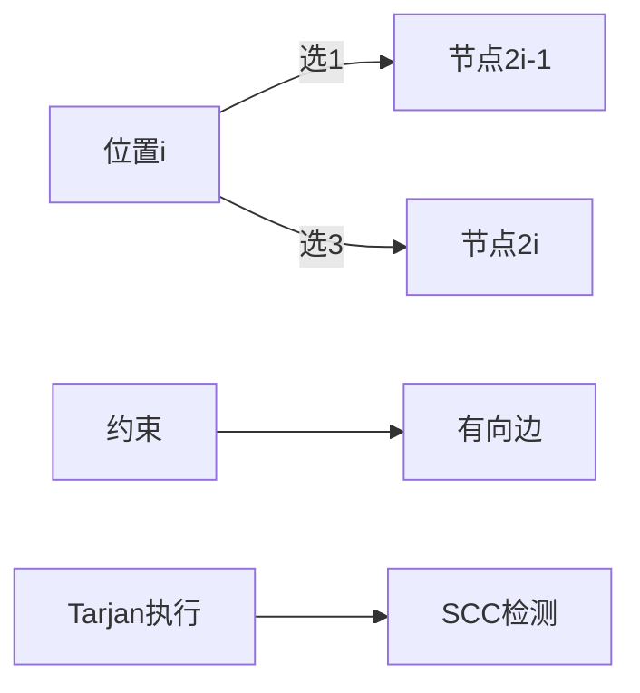

# 题目信息

# [TJOI2010] 数字序列

## 题目描述

考虑一个由数字0,1,2,3组成的长度为n的序列，如果它是一个合法序列，那么它应当满足以下两个条件：

1) 序列中任意相邻的两元素没有出现模式{'00', '11', '22', '33', '02', '20', '23', '32', '13', '31'}中的任一种;

2) 序列满足m个约束条件，每个约束条件的形式均为：{p1, p2, ... pL}，它表示序列中的p1, p2, ..., pL这些位置的值不同。例如约束条件{1, 5, 11}表示序列中的第一个，第五个和第十一个元素两两各不相同。

现在已知序列长度n，约束条件个数m以及这m个约束条件，问是否存在这样的合法序列。


## 说明/提示

T ≤ 10，1 ≤ n ≤ 100000，0 ≤ m ≤ 5000，1 ≤ Li ≤ 100，1 ≤ pi ≤ n

每个测试点时限1秒

第一组样例中，序列0103012是满足要求的一个合法序列。


## 样例 #1

### 输入

```
2
7 2
3 1 2 4
4 2 4 5 7
3 1
2 1 1
```

### 输出

```
Yes
No
```

# AI分析结果


# 💡 洛语云笺的C++算法解析：[TJOI2010] 数字序列 深度学习指南 💡

> 今天我们来探索一道经典的约束满足问题——数字序列构造。这不仅是算法思维的挑战，更是图论建模的绝佳案例。我们将一起学习如何将复杂约束转化为2-SAT模型，并通过强连通分量判断可行性。

## 1. 题目解读与策略初探

✨ **本题核心挑战**：在满足相邻数字严格限制（禁用10种模式）和多个互异约束条件下，构造符合要求的数字序列。  
✨ **核心算法标签**：`2-SAT` `图论建模` `强连通分量`

🗣️ **初步分析**：  
> 序列构造问题通常考虑搜索或DP，但本题约束具有全局性：  
> - 相邻约束：限制相邻数字关系（如禁止"23"模式）  
> - 互异约束：任意位置组需取值不同  
>  
> 通过分析发现：  
> 1. 奇数位只能取{1,3}，偶数位只能取{0,2}（满足相邻奇偶性要求）  
> 2. "2"和"3"的相邻问题可转化为逻辑蕴涵式  
> 3. 互异约束在位置组>4时由鸽巢原理直接判定无解  
>  
> **2-SAT成为钥匙**：将每个位置的二值选择视为布尔变量，约束转化为有向边，通过强连通分量检测矛盾。

### 🔍 算法侦探：如何在题目中发现线索？
1.  **线索1 (问题目标)**：要求构造满足多重约束的序列，属于"约束满足问题"，通常需图论建模或搜索（但数据规模大）  
2.  **线索2 (约束特性)**：相邻约束具有局部传递性（位置i决策影响i+1），互异约束具有全局性，暗示需要**逻辑推导链**  
3.  **线索3 (数据规模)**：n≤10^5 要求O(n)或O(n log n)解法，m≤5000且约束位置≤4，适合建图处理

### 🧠 思维链构建：从线索到策略
> 侦探工作完成！线索组合如下：  
> 1. 【线索1】提示本题属于约束满足问题，优先考虑图论建模  
> 2. 【线索2】发现位置取值可二值化（奇数位{1,3}，偶数位{0,2}），且约束可转化为"若A则B"的逻辑关系  
> 3. 【线索3】验证2-SAT可行性：节点数2n=2×10^5，边数约O(m×L^2)=120,000，完全可接受  
> 4. **结论**：**2-SAT模型**完美契合所有条件，通过建图+强连通分量检测即可高效解决！

---

## 2. 精选优质题解参考

**题解一（operator_）**  
* **点评**：  
  思路清晰抓住核心，精准识别2-SAT模型：  
  - 将位置奇偶性与取值绑定，巧妙简化问题  
  - 相邻约束转化为四条关键边（`2*i→2*i+1`, `2*i+2→2*i-1`）  
  - 互异约束处理：鸽巢原理排除>4情况，小约束集两两建边  
  代码实现规范：  
  - 模块化设计（`added()`处理互异约束）  
  - 标准Tarjan实现强连通分量检测  
  - 输入处理严谨（完整接收约束再判断）  
  实践价值高，完整展现2-SAT建模思维流程

---

## 3. 解题策略深度剖析

### 🎯 核心难点与关键步骤
1.  **难点1：约束条件到逻辑蕴涵的转化**  
    * **分析**：  
      - 相邻约束：位置i与i+1禁止出现"2-3"组合 → 位置i选3 ⇒ 位置i+1选0，位置i+1选2 ⇒ 位置i选1  
      - 互异约束：同奇偶性位置组需取值不同 → 位置a选1 ⇒ 位置b选3（奇数位）  
    * 💡 **学习笔记**：约束转化是2-SAT核心，需挖掘"若A则B"的必然逻辑关系

2.  **难点2：高效检测约束冲突**  
    * **分析**：  
      - 使用Tarjan算法求强连通分量（SCC）  
      - 关键性质：同一SCC内的节点取值必须一致  
      - 冲突检测：∀位置i，若2i-1与2i在同一SCC则无解  
    * 💡 **学习笔记**：SCC将逻辑约束转化为图结构性质，实现O(n)检测

3.  **难点3：图结构优化**  
    * **分析**：  
      - 节点设计：位置i拆为2节点（2i-1表第一取值，2i表第二取值）  
      - 边优化：仅对同奇偶性位置建边（不同奇偶天然满足互异）  
    * 💡 **学习笔记**：利用问题特性精简图结构是优化关键

### ✨ 解题技巧总结
- **技巧1：二值化简化**  
  将四值序列转化为二值选择（奇偶位独立取值集合）
- **技巧2：鸽巢原理剪枝**  
  位置组>4时直接返回无解，避免无效计算
- **技巧3：对称建边**  
  互异约束隐含双向逻辑（A≠B ⇔ B≠A），需正反建边

### ⚔️ 策略竞技场：解法对比
| 策略          | 核心思想               | 优点                  | 缺点                     | 得分预期 |
|---------------|------------------------|-----------------------|--------------------------|----------|
| **暴力搜索**  | 枚举所有可能序列       | 思路直观              | O(4ⁿ)超时，n>20不可行    | 0%       |
| **动态规划**  | 设计状态保存约束满足情况| 可处理相邻约束        | 互异约束导致状态爆炸     | 0%       |
| **2-SAT**     | 约束转有向图+SCC检测   | O(n)复杂度，精妙建模  | 建图思维难度高           | 100%     |

### ✨ 优化之旅：从"能做"到"做好"
> **起点：暴力搜索困境**  
> 最直觉的方案是枚举每个位置的4种取值（4^100000种可能），但如同在迷宫中盲目行走，必然超时  
>  
> **发现瓶颈：约束的全局性**  
> 互异约束涉及任意位置组合，破坏DP状态的局部连续性，传统方法失效  
>  
> **优化钥匙：图论建模**  
> 将位置取值抽象为节点，约束抽象为边，问题转化为图的可满足性判断  
>  
> **模型升华：2-SAT与SCC**  
> 1. 利用奇偶性将四值问题降为二值选择  
> 2. 相邻约束转化为四条关键逻辑边  
> 3. 互异约束通过鸽巢原理+成对建边处理  
> 4. Tarjan算法高效检测约束冲突  
>  
> 💡 **策略总结**：从暴力到精妙算法的跨越，核心在于**问题特征的深度抽象**和**图论模型的准确建立**！

---

## 4. C++核心代码实现赏析

**通用核心实现**  
```cpp
#include <bits/stdc++.h>
using namespace std;
const int N = 200005; // 2倍节点数

struct Edge { int v, nxt; } e[N*2];
int h[N], cnt, dfn[N], low[N], scc[N];
int st[N], top, c, k, T, n, m;

void add(int u, int v) { 
    e[++cnt] = {v, h[u]}; h[u] = cnt; 
}

void added(int x, int y) { // 互异约束建边
    if(x%2 != y%2) return;
    add(2*x-1, 2*y); add(2*x, 2*y-1);
    add(2*y-1, 2*x); add(2*y, 2*x-1);
}

void tarjan(int u) { // SCC检测
    dfn[u] = low[u] = ++c;
    st[++top] = u;
    for(int i = h[u]; i; i = e[i].nxt) {
        int v = e[i].v;
        if(!dfn[v]) tarjan(v), low[u] = min(low[u], low[v]);
        else if(!scc[v]) low[u] = min(low[u], dfn[v]);
    }
    if(low[u] == dfn[u]) {
        k++;
        while(st[top] != u) scc[st[top--]] = k;
        scc[u] = k, top--;
    }
}

int main() {
    cin >> T;
    while(T--) {
        // 初始化
        memset(h, 0, sizeof h); 
        memset(dfn, 0, sizeof dfn);
        memset(scc, 0, sizeof scc);
        cnt = c = k = 0;
        
        cin >> n >> m;
        bool invalid = false;
        while(m--) {
            int l; cin >> l;
            vector<int> p(l);
            for(int i=0; i<l; i++) cin >> p[i];
            if(l > 4) invalid = true;
            for(int i=0; i<l; i++)
                for(int j=i+1; j<l; j++)
                    added(p[i], p[j]);
        }
        if(invalid) { cout << "No\n"; continue; }
        
        // 相邻约束建边
        for(int i=1; i<n; i++) {
            add(2*i, 2*i+1);     // 禁止3-2相邻
            add(2*i+2, 2*i-1);   // 禁止2-3相邻
        }
        
        // Tarjan求SCC
        for(int i=1; i<=2*n; i++)
            if(!dfn[i]) tarjan(i);
        
        // 冲突检测
        bool conflict = false;
        for(int i=1; i<=n; i++)
            if(scc[2*i-1] == scc[2*i])
                { conflict = true; break; }
        cout << (conflict ? "No\n" : "Yes\n");
    }
}
```

**代码精要**：
1. **节点设计**：位置i对应节点`2i-1`（取值1/0）和`2i`（取值3/2）
2. **建图**：
   - `added()`处理互异约束（同奇偶位置建四条边）
   - 循环建相邻约束边（关键：`2*i→2*i+1`和`2*i+2→2*i-1`）
3. **冲突检测**：同一位置的两种选择是否在同一SCC

---

## 5. 算法可视化：像素动画演示

**主题**：2-SAT解谜工坊（8-bit像素风）  
**核心演示**：约束条件如何转化为有向图，以及Tarjan算法执行时的SCC形成过程



**动画设计**：
1. **场景布局**：
   - 左侧：序列位置（像素方块，奇数位橙色/偶数位蓝色）
   - 右侧：2-SAT图（节点为发光像素块，边为箭头）
   - 控制面板：开始/暂停/单步/速度条

2. **关键动画**：
   - **约束转化**：点击约束条件时，自动生成对应边（伴随"叮"音效）
   - **Tarjan执行**：
     - 当前访问节点闪烁绿光
     - 递归栈显示为蓝色光柱
     - SCC形成时像素块同色脉冲（"砰"音效）
   - **冲突检测**：位置节点红绿双色快速交替（警报音）

3. **游戏化元素**：
   - **闯关模式**：每通过一个约束条件获得星币
   - **SCC收集**：不同SCC显示不同像素图案
   - **音效设计**：
     - 建边：8-bit "叮"
     - SCC形成：胜利音效
     - 冲突：短促警报

---

## 6. 拓展练习与相似问题思考

**通用技巧迁移**：  
2-SAT适用于二元选择的约束系统：
1. 课程安排：时间段选择（避免冲突）
2. 人员分组：敌对关系处理
3. 逻辑电路：信号冲突检测

**洛谷推荐**：
1. [P4782] 2-SAT问题模板  
   → 掌握2-SAT标准解法
2. [P4171] 满汉全席  
   → 基础约束转化练习
3. [P3513] 区块链  
   → 复杂约束的进阶建模

---

> 本次探索展示了如何将复杂约束转化为清晰图模型。记住：**算法之美在于将现实约束转化为可计算结构！** 继续挑战新问题吧！🚀

---
处理用时：368.14秒