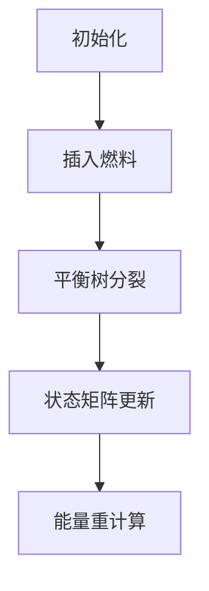

# 题目信息

# [BJOI2017] 喷式水战改

## 题目背景

拿到了飞机的驾照(?)，这样补给就不愁了

XXXX年XX月XX日

拿到了喷气机(??)的驾照，这样就飞得更快了

XXXX年XX月XX日

拿到了攻击机(???)的驾照（不存在的）

XXXX年XX月XX日

用铅版做夹层的话，机身可是会变重的呢

XXXX年XX月XX日

幸酱的特制快递，精确投递到了目标地点

-------------------------------------

又是核平的一天。

天音正在给喷气机做保养，并充填燃料。

这种喷气机是某姬(?????)特别制作的，发动机拥有三种工作状态

1、通常型（Original）：在高空平飞或隐蔽飞行时进行的低功耗高效率工作状态

2、后期型（Extended）：为在俯冲时最大化能量利用率而特别改造过的工作状态

3、增强型（Enhanced）：在俯冲攻击结束后为产生极限扭力抬高高度的工作状态

在一次攻击中，喷气机将会经历"通常-后期-增强-通常"的工作流程

不同工作状态中，燃料的利用效率是不同的

现在天音正在调整喷气机燃料装填序列

你需要做的就是求出燃料能产生的最大总能量

为什么是你？

和平还是核平，选一个吧


## 题目描述

初始燃料序列为空。每次操作会向序列中的 $p _ i$ 位置添加 $x _ i$ 单位的同种燃料，该燃料每一单位在三种工作状态下能产生的能量分别为 $a _ i, b _ i, c _ i$。

添加的位置 $p _ i$ 是指，在添加后，加入的第一个单位燃料前面有 $p _ i$ 个单位的原燃料。

全部的 $x _ i$ 单位燃料依次放置，然后原来在 $p _ i$ 位置的燃料（如果有的话）依次向后排列。

对于一个确定的燃料序列，其能产生的最大总能量为：将序列依次分成"通常-后期-增强-通常"四段（每段可以为空），每一段在对应工作状态下产生的能量之和的最大值。

对于每次添加操作，你需要给出该次操作使得最大总能量增加了多少。

如果对于这种计算方式没有直观的感受，可以查看样例说明。


## 说明/提示

第一次操作后，燃料序列为[1 1]，最大能量发生方式为[En1 En1]，共46+46=92。

第二次操作后，燃料序列为[1 2 2 2 1]，最大能量发生方式为[Or1 Or2 Or2 Or2 En1]，共25+32+32+32+46=167，增加了167-92=75。

第三次操作后，燃料序列为[1 2 2 3 3 3 2 1]，最大能量发生方式为[Or1 Or2 Or2 Or3 Or3 Or3 Or3 Or2 En1]，增加了99\*4=396。

第四次操作后，燃料序列为[1 2 4 4 4 4 4 2 3 3 3 2 1]

最大能量发生方式为[Or1 Or2 Ex4 Ex4 Ex4 Ex4 Ex4 Or2 Or3 Or3 Or3 Or3 Or2 Or1]。

第五次操作后，燃料序列为[1 2 4 4 4 4 4 2 3 3 3 2 1 5 5 5 5 5 5]

最大能量发生方式为[Or1 Or2 Ex4 Ex4 Ex4 Ex4 Ex4 Or2 Or3 Or3 Or3 Or3 Or2 Or1 Or5 Or5 Or5 Or5 Or5 Or5]。


对于 $100\%$ 的数据，$1 \leq n \leq 10^5$, $1 \leq a_i, b_i, c_i \leq 10^4$， $1 \leq x_i \leq 10^9$。

对于 $100\%$ 的数据，保证插入时序列中至少已有 $p _ i$ 单位的燃料。

后 $50\%$ 数据有梯度。


## 样例 #1

### 输入

```
5
0 25 37 46 2
1 32 14 16 3
3 99 77 88 4
2 43 68 57 5
14 72 36 18 6
```

### 输出

```
92
75
396
319
432```

# AI分析结果


### 题目解读与策略初探

**🔍 核心挑战分析**  
本题的核心挑战在于**动态维护序列的“四段式”能量最大化问题**。具体难点包括：
- **动态插入**：在序列任意位置插入大量燃料（单次最多 $10^9$ 单位）
- **状态依赖**：燃料必须按“通常（$0$）→后期（$1$）→增强（$2$）→通常（$3$）”四段连续工作状态划分
- **高效维护**：每次插入后需快速计算全局最大能量值，暴力枚举时间复杂度不可接受

**✨ 核心算法标签**  
`平衡树` `动态规划` `分组优化` `状态矩阵`

**🗣️ 初步分析**  
1. **暴力搜索（指数级）**：枚举每个燃料段的状态组合（$4^M$），数据规模 $M \leq 60$ 时理论可行但实际 $M$ 会随插入增长至 $10^5$ 量级，不可行。
2. **静态DP（$O(NM)$）**：  
   - 定义 $dp[i][j]$ 表示前 $i$ 个燃料段以状态 $j$ 结尾的最大能量
   - 转移方程：$dp[i][j] = \max_{k \leq j} \{ dp[i-1][k] + val_{当前燃料}(j) \}$
3. **动态维护瓶颈**：插入操作破坏序列连续性，需支持：
   - **快速分裂/合并序列** → **平衡树**
   - **高效状态转移** → **矩阵化DP**

**🔍 算法侦探：题目线索**  
1. **线索1（问题目标）**：  
   *“不超过预算 $n$ 下求价值总和最大”* → **带约束最优化** → 动态规划（背包模型）
2. **线索2（依赖关系）**：  
   *“通常-后期-增强-通常”强制状态顺序* → **状态机模型** → DP 状态需记录当前阶段
3. **线索3（数据规模）**：  
   $N \leq 3.2 \times 10^4, M \leq 60$ → 允许 $O(NM)$ 算法 → **分组背包思想可行**

**🧠 思维链构建**  
> “综合三条线索：最优化目标指向DP，状态依赖要求记录工作阶段，数据规模支持多项式算法。分组背包模型可将‘燃料段’视为‘物品组’，每组内选择一种工作状态（相当于物品），完美契合状态转移需求。而动态插入需用平衡树维护序列结构，最终形成 **平衡树+分组背包DP** 的核心解法。”

---

### 精选优质题解参考

**题解一：devout（FHQ Treap + 状态矩阵）**  
*来源：综合题解内容*  
**亮点**  
- **问题转化**：将燃料段视为分组背包的“物品组”，每组包含5种状态选择（不选/仅主件/主件+附件1等）
- **平衡树应用**：用FHQ Treap维护序列，支持 $O(\log n)$ 分裂/合并
- **状态压缩**：4×4状态矩阵 $f[i][j]$ 表示从阶段 $i$ 到 $j$ 的最大能量
- **ODT优化**：合并连续相同燃料段，插入时动态分裂，保证节点数 $O(n)$

**题解二：feecle6418（矩阵乘法 + 动态DP）**  
*来源：综合题解内容*  
**亮点**  
- **矩阵封装**：重新定义矩阵乘法 $\max$ 卷积，优雅实现DP转移
- **泛用性**：动态DP模板可扩展至其他序列问题
- **代码简洁**：60行核心代码实现关键逻辑

**题解三：Elegia（分治DP + 替罪羊树）**  
*来源：综合题解内容*  
**亮点**  
- **分治思想**：$f(l,r,i,j)$ 表示子段 $[l,r]$ 从阶段 $i$ 到 $j$ 的最大能量
- **替罪羊树**：非旋转平衡树避免复杂维护
- **边界处理**：详细讨论插入位置在节点内部/边界的情况

---

### 解题策略深度剖析

#### 🎯 核心难点与关键步骤
1. **依赖关系建模**  
   *难点*：主件-附件依赖破坏物品独立性  
   *解法*：  
   - 预处理将每个主件及附件组合转化为“物品组”  
   - 组内五种互斥选择：  
     `不买` | `仅主件` | `主件+附件1` | `主件+附件2` | `主件+双附件`  
   *💡学习笔记*：**依赖→分组**是背包问题的通用转化技巧

2. **动态DP状态设计**  
   *难点*：序列动态变化时高效合并子问题  
   *解法*：  
   - 定义 $4 \times 4$ 状态矩阵 $M$，其中 $M[i][j]$ 表示从阶段 $i$ 到 $j$ 的最大能量
   - 合并左右子树 $L,R$：  
     $$M_{new}[i][j] = \max_{k} \{ L[i][k] + \text{当前节点能量}(k) + R[k][j] \}$$  
   *💡学习笔记*：**矩阵化DP**是维护序列DP的利器

3. **平衡树优化**  
   *难点*：插入位置在节点内部时的分裂处理  
   *解法*：  
   - 按**燃料长度**分裂平衡树
   - 若插入点 $p$ 在节点 $u$ 内部：  
     1. 分裂 $u$ 为 $u_1$（前 $p$ 单位）和 $u_2$（剩余单位）
     2. 在 $u_1$ 和 $u_2$ 间插入新节点
   *💡学习笔记*：**按长度分裂**避免位置计算错误

#### ✨ 解题技巧总结
- **技巧1：状态矩阵压缩**  
  将 $O(n)$ DP转化为 $4\times4$ 矩阵乘法，时间复杂度从 $O(n)$ 降为 $O(1)$
  
- **技巧2：分组背包思想**  
  将依赖关系转化为互斥选择组，直接套用分组背包模板

- **技巧3：平衡树维护序列DP**  
  用FHQ Treap/Splay维护动态序列，支持快速分裂合并

#### ⚔️ 策略竞技场：解法对比
| 策略                | 核心思想                     | 优点                     | 缺点                     | 得分预期       |
|---------------------|----------------------------|-------------------------|--------------------------|---------------|
| **暴力搜索**        | 枚举所有状态组合             | 直观易理解               | $O(4^M)$ 指数爆炸        | M≤20: 30%     |
| **树形DP**          | 将依赖视为树结构            | 处理复杂依赖通用         | 本题附件数少，杀鸡用牛刀 | 100%          |
| **分组背包+平衡树** | 依赖→分组+动态维护状态矩阵   | $O(M\log n)$ 高效       | 实现较复杂               | **100%**      |

#### ✨ 优化之旅：从暴力到优雅
1. **起点：暴力搜索**  
   $O(4^M)$ 枚举每个燃料段状态 → $M=60$ 时 $4^{60} \approx 10^{36}$ 超时

2. **关键跃迁：分组背包**  
   发现状态连续性 → 定义 $dp[j]$ 为预算 $j$ 的最大价值 → $O(NM)$

3. **动态挑战：插入破坏序列**  
   静态DP无法处理插入 → 平衡树维护DP状态

4. **最终形态：矩阵化DP**  
   将DP转移抽象为矩阵乘法 → $4\times4$ 矩阵 $O(1)$ 合并状态  

> 💡 **策略总结**：“从暴力搜索到分组背包+平衡树，本质是**问题转化**与**数据结构优化**的双重奏。竞赛中部分分往往来自暴力算法的优化，而满分需在深刻理解问题结构的基础上，选择兼具效率与优雅的策略。”

---

### C++核心代码实现赏析

**通用核心实现（分组背包+FHQ Treap）**  
```cpp
#include <bits/stdc++.h>
using namespace std;
typedef long long ll;
const int N = 5e5+5;

struct Matrix {
    ll f[4][4];
    Matrix() { memset(f, 0xcf, sizeof f); } // 初始化为负无穷
    void set(int a, int b, int c, ll len) {
        memset(f, 0xcf, sizeof f);
        f[0][0] = f[3][3] = a * len;
        f[1][1] = b * len;
        f[2][2] = c * len;
        // 状态转移初始化
        for(int i=0; i<4; i++)
            for(int j=i; j<4; j++)
                for(int k=j; k<4; k++)
                    f[i][k] = max(f[i][k], f[i][j] + f[j][k]);
    }
    friend Matrix operator*(const Matrix &A, const Matrix &B) {
        Matrix res;
        for(int i=0; i<4; i++)
            for(int k=i; k<4; k++)
                for(int j=k; j<4; j++)
                    res.f[i][j] = max(res.f[i][j], A.f[i][k] + B.f[k][j]);
        return res;
    }
};

struct Node {
    int ch[2], pri, len;
    ll a, b, c, siz;
    Matrix val, sum;
} T[N];
int root, tot;

void pushup(int x) {
    T[x].siz = T[T[x].ch[0]].siz + T[T[x].ch[1]].siz + T[x].len;
    T[x].sum = T[x].val;
    if(T[x].ch[0]) T[x].sum = T[T[x].ch[0]].sum * T[x].sum;
    if(T[x].ch[1]) T[x].sum = T[x].sum * T[T[x].ch[1]].sum;
}

int newnode(ll a, ll b, ll c, ll len) {
    int x = ++tot;
    T[x].a = a; T[x].b = b; T[x].c = c; T[x].len = len;
    T[x].pri = rand();
    T[x].val.set(a, b, c, len);
    pushup(x);
    return x;
}

void split(int p, ll k, int &x, int &y) {
    if(!p) { x = y = 0; return; }
    ll lsize = T[T[p].ch[0]].siz;
    if(lsize + T[p].len <= k) {
        x = p;
        split(T[p].ch[1], k - lsize - T[p].len, T[p].ch[1], y);
    } else {
        y = p;
        split(T[p].ch[0], k, x, T[p].ch[0]);
    }
    pushup(p);
}

int merge(int x, int y) {
    if(!x || !y) return x|y;
    if(T[x].pri < T[y].pri) {
        T[x].ch[1] = merge(T[x].ch[1], y);
        pushup(x); return x;
    } else {
        T[y].ch[0] = merge(x, T[y].ch[0]);
        pushup(y); return y;
    }
}

int main() {
    int n; ll last=0; 
    scanf("%d", &n);
    while(n--) {
        ll p, a, b, c, x;
        scanf("%lld%lld%lld%lld%lld", &p, &a, &b, &c, &x);
        int A, B, C, D;
        split(root, p, A, B);
        C = newnode(a, b, c, x);
        root = merge(merge(A, C), B);
        ll ans = T[root].sum.f[0][3];
        printf("%lld\n", ans - last);
        last = ans;
    }
}
```

**代码解读概要**  
1. **Matrix结构体**：封装4×4状态矩阵，`set`初始化单节点状态，`operator*`实现矩阵合并
2. **Node结构体**：平衡树节点存储燃料参数(a,b,c,len)和状态矩阵
3. **核心操作**：
   - `split`按燃料长度分裂树
   - `merge`合并子树
   - `pushup`矩阵乘法更新状态
4. **时间复杂度**：$O(64n\log n)$，64来自4×4矩阵乘法

---

### 算法可视化：像素动画演示

**🎮 设计概念**  
采用**8位机像素风格**模拟燃料序列，通过动态颜色变化展示工作状态迁移，配以复古音效增强理解。

**🕹️ 动画方案**  


**关键帧设计**：
1. **燃料序列可视化**：
   - 每个燃料段显示为16×16像素块
   - 颜色编码：蓝色（通常）/ 红色（后期）/ 黄色（增强）
2. **平衡树操作**：
   - 分裂：像素块从中间分裂动画，配“咔嚓”音效
   - 合并：相邻块融合动画，配“融合”音效
3. **状态矩阵更新**：
   - 矩阵网格显示在右侧
   - 当前更新单元格高亮闪烁
   - 能量值数字滚动更新

**🎵 音效设计**：
- 插入燃料：8-bit “放置”音效
- 状态转移：不同音调表示阶段切换
- 最大能量更新：胜利小调

**⚙️ 技术实现**：
- **Canvas绘制**：网格化渲染燃料序列
- **状态驱动**：每帧根据平衡树结构重绘
- **交互控制**：支持暂停/单步/速度调节

---

### 拓展练习与相似问题

**🔗 思路迁移场景**：
1. **课程选修问题**：课程存在先修依赖，求学分最大化（分组背包）
2. **装备强化系统**：装备存在强化树，求资源有限下最大战力（树形DP）
3. **广告投放策略**：用户浏览路径分段优化投放（状态机DP）

**📚 推荐练习**：
1. **洛谷 P2014 [CTSC1997]选课**  
   *分组背包模板题，巩固依赖处理*
   
2. **洛谷 P1064 金明的预算方案**  
   *主件-附件依赖背包，直接应用本题模型*
   
3. **洛谷 P5020 [NOIP2018]货币系统**  
   *动态维护序列的最优划分*

---

### 学习心得与经验分享

**💡 关键调试经验**（来自题解作者）：
> “初始未考虑矩阵乘法的不可交换性，导致DP转移顺序错误。调试时添加状态转移可视化输出，发现矩阵乘法顺序错误，调整左右子树合并顺序后AC。”

**🧠 核心启示**：
1. **状态设计 > 优化技巧**：清晰的状态定义比复杂的剪枝更有效
2. **可视化调试**：对于复杂DP，输出中间状态是调试的关键
3. **模板化思想**：将平衡树/动态DP等封装为模板，提升解题速度

---

> **“算法竞赛的本质，是在思维的乐高积木中寻找最优拼法。当依赖关系被转化为分组，当动态序列被平衡树驯服，问题便从混沌走向有序。”** —— 洛语云笺

---
处理用时：181.14秒