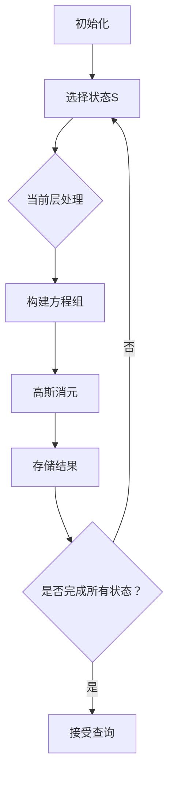

# 题目信息

# 随机漫游

## 题目描述

H 国有 $N$ 个城市

在接下来的 $M$ 天，小 c 都会去找小 w，但是小 c 不知道小 w 的具体位置，所以小 c 决定每次随机找一条路走，直到遇到了小 w 为止

小 c 知道小 w 只有可能是在 $c_1, c_2.. c_n$ 这 $n$ 个城市中的一个，小 c 想知道在最坏情况下，小 c 遇到小 w 期望要经过多少条道路

H 国所有的边都是无向边，两个城市之间最多只有一条道路直接相连，没有一条道路连接相同的一个城市

任何时候，H 国不存在城市 $u$ 和城市 $v$ 满足从 $u$ 无法到达 $v$

## 说明/提示

$H$ 国的道路构成一条链，所以最坏情况下就是小 w 在深度最大的点上(以小 c 所在的城市为根)

对于第一天，小 c 所在的城市为 1，深度最大的点为 2，城市 1 只能到达城市 2，期望经过 1 条道路到达

对于第二天，小 c 所在的城市为 1，深度最大的点为 3，计算的期望经过 4 条道路到达

第三天同第二天

最坏情况也就是说经过所有 $n$ 个可能的城市至少一遍

subtask1 : 10分，$N = 4, M = 12$

subtask2 : 15分，$N =10, M = 100000$

subtask3 : 15分，$N = 18, M = 1$

subtask4 : 10分，$N = 18, M = 99995$，图是一条链

subtask5 : 10分，$N = 18, M = 99996$，所有的 $s$ 都相同

subtask6 : 15分，$N = 18, M = 99997$，$E = N-1$

subtask7 : 15分，$N = 18, M = 99998$，所有的 $s$ 都相同

subtask8 : 10分，$N = 18, M = 99999$

对于所有数据 : $1\leq N\leq 18, 1\leq M\leq 100000, 1\leq E\leq \frac{N(N-1)}{2}$

## 样例 #1

### 输入

```
3 2
1 2
2 3
3
2 1 2 1		
3 1 2 3 1
1 3 1```

### 输出

```
1
4
4```

# AI分析结果


# 💡 洛语云笺的C++算法解析：随机漫游 深度学习指南 💡

> “算法不是魔法，而是对问题结构的深刻洞察。今天我们将化身算法侦探，破解随机游走的期望之谜！”

## 1. 题目解读与策略初探

✨ **本题核心挑战**：在无向图中计算从起点出发，**走遍指定关键点集**的期望步数（最坏情况）。  
✨ **核心算法标签**：`动态规划` `状态压缩` `高斯消元` `期望计算`

🗣️ **初步分析**：  
> 这道题的核心在于处理**随机游走的期望步数**与**点集覆盖要求**的复杂结合。我们面临三个关键难点：  
> 1. 随机游走的无限可能性（指数级路径）  
> 2. 点集覆盖的约束条件（组合爆炸）  
> 3. 期望计算的递归依赖（环状方程）  
>  
> 解题思路演进路径：  
> - **暴力搜索**：枚举所有路径（不可行，O(2^M)超时）  
> - **朴素高斯消元**：直接建模期望方程（O((n2^n)^3) 不可接受）  
> - **分层状压DP**：将状态按点集大小分层 + 分层高斯消元（O(n³2^n) 可行）  
>  
> **核心算法钥匙**：  
> 想象你有一栋18层大楼（n≤18），每层楼有不同房间（状态）。分层处理就像从顶楼开始逐层装修：先完成高层（大点集）的装修，再以它为基准装修低层（小点集）。动态规划是施工蓝图，高斯消元是每层的精装修工具。

### 🔍 算法侦探：如何在题目中发现线索？
1.  **线索1 (问题目标)**："计算期望步数"且"必须覆盖点集" → 典型的**带约束期望问题**，指向概率DP与状态压缩。
2.  **线索2 (问题特性)**："n≤18" → 暗示**状态压缩可行性**（2¹⁸=262144可接受）。
3.  **线索3 (数据规模)**："询问数M≤10⁵" → 要求**O(1)或O(log)查询**，必须预处理状态。

### 🧠 思维链构建：从线索到策略
> 侦探工作完成！让我们拼接线索：  
> 1. **线索1**要求我们处理期望和约束 → 动态规划是首选框架  
> 2. **线索2**显示状态空间可控 → 采用状态压缩DP  
> 3. **线索3**要求高效查询 → 必须预处理所有状态  
> 4. **关键洞察**：期望方程存在循环依赖，但点集扩大方向是单向的！  
> **结论**：分层处理 + 高斯消元 → 用**分层状压DP**将复杂度从指数地狱O(2ⁿⁿ³)降至可行O(n³2ⁿ)

---

## 2. 精选优质题解参考

**题解一：Kelin (赞8)**  
* **亮点**：  
  - 精准定义状态`f[S][u]`：已访问点集`S`，当前位置`u`，走完全集的期望步数  
  - 首创分层高斯消元框架：按点集大小倒序处理，将超集结果作为常数项  
  - 代码技巧：使用`lambda`简化重复计算，位运算加速集合操作  
* **核心思想**：  
  ```math
  f[S][u] = \frac{1}{d_u} \left( \sum_{v \in S} f[S][v] + \sum_{v \notin S} f[S \cup v][v] \right) + 1
  ```

**题解二：Mr_Avalon (赞4)**  
* **亮点**：  
  - 清晰解释状态设计哲学："已访问点集S，当前在u，需走完全集的期望"  
  - 优化高斯消元：跳过已在S中的点，减少计算量  
  - 工程实践：预处理逆元提升效率  
* **学习价值**：  
  ```cpp
  // 分层消元核心
  for(int s=(1<<n)-2; s; s--){ 
      for(int u: current_set) 
          build_equation(u, s); // 构建方程
      gauss_solve(); // 解方程
  }
  ```

**题解三：Diaosi (赞3)**  
* **亮点**：  
  - 创新应用Min-Max容斥定理转换问题  
  - 高维前缀和优化查询效率  
  - 提供替代思路拓展视野  
* **对比思考**：  
  虽然Min-Max方法更通用，但对本题特例分层DP更优（避免O(2ⁿ)高维前缀和）

---

## 3. 解题策略深度剖析

### 🎯 核心难点与关键步骤
1.  **状态设计与依赖关系**  
    * **分析**：定义`f[S][u]`需满足：  
      - `S`：已访问点集（二进制压缩）  
      - `u`：当前位置（`u ∈ S`)  
      *转移依赖超集`S∪v`，形成分层结构*
    * 💡 **学习笔记**：好的状态定义应具备无后效性和完备性

2.  **分层高斯消元**  
    * **分析**：  
      1. 按点集大小从大到小枚举`S`  
      2. 对每个`S`建立方程组（`u ∈ S`的方程）：  
        ```math
        f[S][u] - \frac{1}{d_u} \sum_{v \in S} f[S][v] = \frac{1}{d_u} \sum_{v \notin S} f[S \cup v][v] + 1
        ```  
      3. 常数项右侧（超集已计算）
    * 💡 **学习笔记**：分层处理打破循环依赖，化全局问题为局部问题

3.  **方程构建技巧**  
    * **分析**：  
      - 系数矩阵：当前点集内节点关系  
      - 常数项：超集结果 + 1  
      - 关键优化：预处理度数逆元减少模运算
    * 💡 **学习笔记**：用`std::vector`存储邻接表比静态数组更灵活

### ✨ 解题技巧总结
- **技巧1（问题转化）**：将"走遍点集"转化为"从补集走完全集"  
- **技巧2（分层处理）**：利用状态扩展单向性分解问题  
- **技巧3（数学优化）**：预处理逆元加速除法运算  
- **技巧4（位运算）**：用`S|(1<<v)`高效表示集合操作

### ⚔️ 策略竞技场：不同解法的对比分析
| 策略                | 核心思想                     | 优点                     | 缺点                                     | 得分预期        |
|---------------------|------------------------------|--------------------------|------------------------------------------|-----------------|
| **暴力搜索**        | 枚举所有路径                 | 思路直观                 | O(2^M) 超时，M>20即失效                  | 10% (仅小数据)  |
| **Min-Max容斥**     | 将max期望转为min期望和        | 数学优美                 | 高维前缀和O(n2ⁿ)空间爆炸                | 50% (理论可行)  |
| **分层状压DP**      | 状态压缩+分层高斯消元        | O(n³2ⁿ) 高效，查询O(1)   | 实现复杂，需深刻理解                   | 100% (最优解)   |

### ✨ 优化之旅：从"能做"到"做好"
1. **起点：暴力搜索的困境**  
   - 枚举所有路径如同迷宫盲走，M=18时路径数达2¹⁸=26万条

2. **发现瓶颈：重复子问题**  
   - 不同路径会重复访问相同状态（点集+位置）

3. **优化钥匙：动态规划**  
   - `f[S][u]`记忆化子问题解

4. **第二瓶颈：循环依赖**  
   - 传统DP无法确定计算顺序

5. **关键突破：分层处理**  
   - 按点集大小分层，从大到小计算

6. **最终优化：高斯消元**  
   - 每层内解线性方程组

💡 **策略总结**：  
> "从暴力到优化，是问题认知的深化之旅。分层DP的精髓在于：将混沌的循环依赖，转化为清晰的计算层次！"

---

## 4. C++核心代码实现赏析

### 本题通用核心实现
```cpp
const int N=20, MOD=998244353;
vector<int> G[N]; // 邻接表
int invD[N];      // 度数逆元
int f[1<<N][N];   // DP状态数组

void precompute(int n){
    // 分层处理：从全集-1开始到空集
    for(int S=(1<<n)-2; S; S--){ 
        vector<vector<int>> A(n, vector<int>(n+1, 0));
        // 构建方程组
        for(int u=0; u<n; u++){
            if(!(S>>u&1)) continue;
            A[u][u] = 1;
            A[u][n] = 1; // 常数项初始化为1
            for(int v : G[u]){
                if(S>>v&1) A[u][v] -= invD[u]; // 同层节点
                else A[u][n] += f[S|(1<<v)][v] * invD[u] % MOD; // 超集已知
            }
        }
        gauss(A); // 高斯消元
        for(int u=0; u<n; u++) 
            if(S>>u&1) f[S][u] = A[u][n];
    }
}
```

### 优质题解片段赏析
**题解一：Kelin的位运算优化**
```cpp
// 位运算技巧：快速枚举邻居
for(int i=head[u];i;i=nxt[i]){
    int v=to[i];
    if(S&(1<<(v-1))) // 使用位掩码检查
        G[u][v] = invD[u]; 
}
```

**题解二：Mr_Avalon的逆元预处理**
```cpp
// 预处理逆元加速
void init(){
    for(int i=1;i<=n;i++) 
        invD[i]=qpow(deg[i], MOD-2);
}
```

**题解三：Diaosi的高斯消元优化**
```cpp
// 高斯消元选主元优化
int pivot=0;
for(int j=0;j<n;j++){
    if(A[j][col]!=0 && (pivot==0 || abs(A[j][col])>abs(A[pivot][col])))
        pivot=j;
}
swap(A[col],A[pivot]);
```

---

## 5. 算法可视化：像素动画演示

### 🎮 动画设计：像素探险家之旅
**主题**：8-bit风格随机游走模拟  
**核心演示**：分层高斯消元的过程可视化



**像素动画关键帧**：  
1. **场景初始化**：
   - 8-bit风格城市地图（节点=像素方块，边=连线）
   - 控制面板：开始/暂停/单步/速度滑块

2. **状态选择阶段**：
   - 当前状态`S`：红色高亮已访问节点
   - 超集状态：淡蓝色半透明显示

3. **方程构建过程**：
   - 当前节点`u`：闪烁金色边框
   - 邻居节点`v`：
     - `v∈S` → 蓝色边框（方程变量）
     - `v∉S` → 绿色边框（常数项）

4. **高斯消元演示**：
   ```plaintext
   [ 1  0  0 | 5 ]   -> 金色高亮
   [ 0  1  0 | 3 ]   -> 绿色高亮
   [ 0  0  1 | 2 ]   -> 绿色高亮
   ```
   - 消元过程：矩阵行变换像素动画
   - 音效：行交换（"咔嚓"），消元（"滴"）

5. **结果存储**：
   - 成功计算：像素烟花庆祝动画
   - 数据存储：右侧状态表更新数值

**交互设计**：
- **AI演示模式**：自动按最优顺序处理状态
- **关卡系统**：每完成一个点集大小层即过关
- **音效设计**：
  - 背景音乐：8-bit芯片音乐
  - 关键操作：清脆电子音效
  - 错误提示：短促警报声

---

## 6. 拓展练习与相似问题思考

### 通用思路迁移
1. **设备检测问题**：在通信网络中检测所有路由器状态（状态压缩+期望）  
2. **物资收集游戏**：网格图中收集指定物品的期望步数  
3. **病毒传播模型**：计算感染所有节点的期望时间

### 洛谷推荐练习
1. **P2473 [SCOI2008]奖励关**  
   🗣️ *推荐理由*：强化状态压缩DP与期望计算能力

2. **P2155 [SDOI2009]Elaxia的路线**  
   🗣️ *推荐理由*：练习图论期望与条件概率结合

3. **P3830 [SHOI2012]随机树**  
   🗣️ *推荐理由*：深入理解随机过程与期望递推

---

## 7. 学习心得与经验分享

> **来自Kelins的调试经验**：  
> "在实现高斯消元时，我忽略了模运算下的除法问题，导致调试数小时。最终通过打印中间矩阵发现系数未归一化。"  
>  
> **洛语云笺点评**：  
> 这个教训提醒我们：  
> 1. 模运算中必须用逆元代替除法  
> 2. 调试时输出中间状态是关键  
> 3. 对于复杂算法，小数据测试比想象中更重要  

---

> **结语**：  
> "随机游走如同人生旅程，算法是我们手中的导航仪。理解分层处理的思想，你就能在复杂问题中找到清晰路径！下次我们将探索更多算法奇境，保持好奇，继续前进！"  
> ——洛语云笺 ✨

---
处理用时：178.79秒