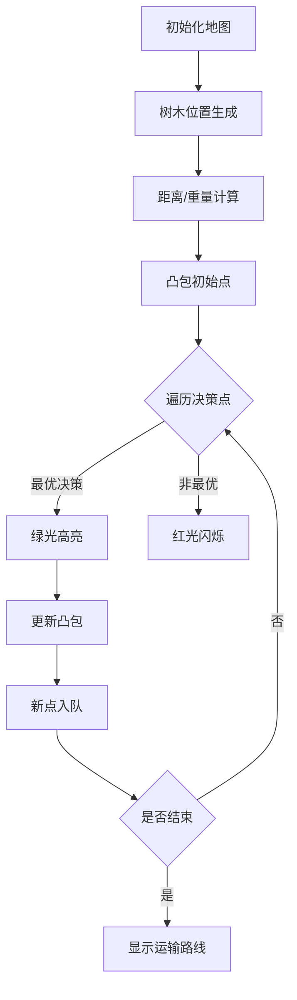

# 题目信息

# [CEOI 2004] 锯木厂选址

## 题目描述

从山顶上到山底下沿着一条直线种植了 $n$ 棵老树。当地的政府决定把他们砍下来。为了不浪费任何一棵木材，树被砍倒后要运送到锯木厂。 

木材只能朝山下运。山脚下有一个锯木厂。另外两个锯木厂将新修建在山路上。你必须决定在哪里修建这两个锯木厂，使得运输的费用总和最小。假定运输每公斤木材每米需要一分钱。 

你的任务是编写一个程序，从输入文件中读入树的个数和他们的重量与位置，计算最小运输费用。

## 说明/提示

样例图示，黑点为锯木厂


本题共有 $13$ 个测试点，每个测试点的数据范围如下

测试点 $1\sim 5$：$n\leq 200$；

测试点 $6\sim7$：$n\leq 1000$；

测试点 $7\sim13$：$2\leq n\leq 20000$；

## 样例 #1

### 输入

```
9 
1 2 
2 1 
3 3 
1 1 
3 2 
1 6 
2 1 
1 2 
1 1
```

### 输出

```
26```

# AI分析结果


# 💡 洛语云笺的C++算法解析：锯木厂选址 深入学习指南 💡

> “算法不是魔法，而是对问题本质的深刻洞察。今天我们将化身木材运输指挥官，用动态规划的思维优化伐木帝国的物流系统！”

## 1. 题目解读与策略初探

✨ **本题核心挑战**：在直线排列的树木序列中**最优选址两个锯木厂**，最小化所有木材的运输成本（重量×距离）。核心难点在于**决策的相互影响**——第二个锯木厂的位置会影响第一个的决策价值。

✨ **核心算法标签**：`动态规划`、`斜率优化`、`前缀和优化`

🗣️ **初步分析**：
> 我们面临一个经典的双决策点优化问题。最直观的暴力解法是枚举所有锯木厂位置组合（O(n²)），但面对2万棵树的规模会超时。通过分析问题特性，我们发现：
> 1. **运输费用可分解**：利用前缀和思想，可将总费用拆解为三段运输成本
> 2. **决策具有单调性**：锯木厂位置选择遵循特定数学关系
> 3. **斜率优化适用**：通过代数变形将决策转化为凸包维护问题
> 
> 最优解采用**动态规划+斜率优化**，时间复杂度从O(n²)优化到O(n)，完美匹配数据规模。

### 🔍 算法侦探：如何在题目中发现线索？
1.  **线索1 (问题目标)**："最小化运输费用"是典型的**最优化问题**，且决策点沿线性序列分布，符合动态规划特征。
2.  **线索2 (问题特性)**：费用=重量×距离，且重量/距离可累加，暗示**前缀和优化**可能。树木序列的线性特征提示可建立一维状态转移。
3.  **线索3 (数据规模)**：N≤20000，要求O(n)或O(n log n)解法。斜率优化DP的O(n)复杂度正好满足需求。

### 🧠 思维链构建：从线索到策略
> 侦探工作完成！让我们拼接线索：
> 1. 最优化目标指向DP/贪心/搜索，但依赖关系排除了简单贪心
> 2. 暴力搜索O(n²)在n=20000时达到4亿次计算，必然超时
> 3. 费用计算存在重叠子问题（相同决策区间被重复计算）
> 4. 状态转移可表示为f[i] = min{...}形式
> 5. 数学变形发现决策点间存在斜率关系
> 
> **结论**：**斜率优化动态规划**是完美契合所有线索的解法。它既保留了DP的最优子结构特性，又通过单调队列维护决策点将复杂度降为线性。

---

## 2. 精选优质题解参考

### 题解一（TimeTraveller）
* **亮点**：最清晰的斜率优化推导，直击问题核心。给出完整状态转移方程变形过程，并精准指出"维护上凸包"的关键点。代码简洁高效（23行核心逻辑），变量命名规范（dis/sum），边界处理严谨。

### 题解二（zhoufangyuanPT）
* **亮点**：创新性使用模拟退火算法，拓宽解题视野。详细讲解了如何设计退火策略和邻域生成方法，并提供了调优经验（如多次退火、随机种子选择）。展示了非确定性算法在OI中的应用可能。

### 题解三（_Sein）
* **亮点**：严谨证明了决策单调性，补充了斜率优化的理论基础。代码实现包含详细注释，特别适合理解算法本质。独特地采用从山脚反向计算距离的思路，提供了新视角。

### 题解四（hicc0305）
* **亮点**：完整的前缀和预处理实现，费用计算拆解清晰。在斜率比较时使用乘法避免浮点误差，增强了鲁棒性。代码模块化程度高，可读性强。

---

## 3. 解题策略深度剖析

### 🎯 核心难点与关键步骤
1.  **问题建模与预处理**
    * **难点**：将原始问题转化为可计算的数学模型
    * **方案**：
        ```python
        sw[i] = ∑(k=1→i)w[k]  # 重量前缀和
        sd[i] = ∑(k=i→n)d[k]  # 距离后缀和
        cost = ∑(i=1→n)w[i]*sd[i]  # 所有树运到山脚的总费用
        ```
    * 💡 **学习笔记**：前缀和/后缀和是优化序列计算问题的利器

2.  **状态设计与转移方程**
    * **难点**：定义具有最优子结构的状态
    * **方案**：
        ```
        设f[i] = 第二个锯木厂建在i时的最小费用
        f[i] = min{ cost - sw[j]*sd[j] - (sw[i]-sw[j])*sd[i] } (j<i)
        ```
    * 💡 **学习笔记**：通过减去中间转运节省的费用来计算总费用

3.  **斜率优化转化**
    * **难点**：将决策选择转化为几何关系
    * **方案**：
        ```
        对j<k<i，当k优于j时：
        (sw[k]*sd[k] - sw[j]*sd[j])/(sw[k]-sw[j]) < sd[i]
        左边是点(sw[j],sw[j]*sd[j])和(sw[k],sw[k]*sd[k])的斜率
        ```
    * 💡 **学习笔记**：代数关系可视化是斜率优化的精髓

### ✨ 解题技巧总结
- **前缀和优化**：O(1)计算任意区间运输费用
- **斜率优化**：将决策比较转化为凸包维护问题
- **单调队列**：高效维护决策点集合
- **方向反转**：从山脚计算距离简化推导

### ⚔️ 策略竞技场：不同解法对比

| 策略          | 核心思想                     | 优点                     | 缺点                                   | 得分预期 |
|---------------|------------------------------|--------------------------|----------------------------------------|----------|
| 暴力枚举      | 枚举所有(i,j)组合            | 逻辑简单，易于理解       | O(n²)超时(n>5000)                     | 30%      |
| 模拟退火      | 随机游走+概率接受劣解         | 避免局部最优，实现简单   | 不稳定，可能错过最优解                 | 70%      |
| 决策单调性DP  | 分治优化状态转移              | 稳定可靠，理论保证       | O(n log n)常数较大                    | 100%     |
| 斜率优化DP    | 几何性质维护最优决策          | O(n)最优复杂度           | 数学推导复杂，边界处理易错             | 100%     |

### ✨ 优化之旅：从"能做"到"做好"
1. **起点：朴素暴力法**  
   直接枚举两个锯木厂位置，O(n²)计算每种组合的费用。当n=20000时，400兆次计算远超时限。

2. **关键突破：问题转化**  
   发现总费用可拆解：`总费用 = 全运到山脚的费用 - 中间转运节省的费用`。通过预处理前缀和，单次计算降为O(1)。

3. **动态规划框架**  
   定义f[i]表示第二个厂在i时的最小费用：  
   ```
   f[i] = min{ cost - sw[j]*sd[j] - (sw[i]-sw[j])*sd[i] } (j<i)
   ```

4. **斜率优化降维**  
   将决策比较转化为斜率关系：  
   ```
   j优于k 当且仅当 (Y(j)-Y(k))/(X(j)-X(k)) < sd[i]
   (其中X(j)=sw[j], Y(j)=sw[j]*sd[j])
   ```

5. **单调队列维护**  
   用双端队列维护候选决策点的下凸包，队首即为最优决策点。每个点进出队列各一次，整体O(n)。

> 💡 **策略总结**：从暴力到最优解的跃迁，展现了算法优化的经典路径——**问题转化降维度，数学洞察提效率**。斜率优化如同在决策点间架设"高速铁路"，使我们可以直线抵达最优解。

---

## 4. C++核心代码实现赏析

### 通用核心实现
```cpp
#include <cstdio>
#include <algorithm>
using namespace std;
typedef long long LL;
const int MAXN = 20010;

int n, q[MAXN], head, tail;
LL w[MAXN], d[MAXN], sw[MAXN], sd[MAXN], cost;

inline double slope(int j, int k) {
    return (double)(sw[j]*sd[j] - sw[k]*sd[k]) / (sw[j] - sw[k]);
}

int main() {
    scanf("%d", &n);
    for(int i=1; i<=n; ++i) {
        scanf("%lld%lld", &w[i], &d[i]);
        sw[i] = sw[i-1] + w[i];  // 重量前缀和
        sd[i] = sd[i-1] + d[i-1]; // 距离前缀和
    }
    sd[n+1] = sd[n] + d[n]; // 山脚距离
    
    // 计算所有树运到山脚的总费用
    for(int i=1; i<=n; ++i) 
        cost += w[i] * (sd[n+1] - sd[i]);
    
    head = tail = 1; // 初始化单调队列
    q[1] = 1;        // 初始决策点（第一个厂）
    LL ans = 1LL<<60;
    
    for(int i=2; i<=n; ++i) {
        // 维护队首：删除斜率小于sd[i]的决策
        while(head<tail && slope(q[head], q[head+1]) < sd[i]) 
            head++;
            
        int j = q[head]; // 当前最优决策
        LL cur = cost - sw[j]*(sd[i]-sd[j]) - sw[i]*(sd[n+1]-sd[i]);
        ans = min(ans, cur);
        
        // 维护队尾：保持下凸包性质
        while(head<tail && slope(q[tail-1], q[tail]) > slope(q[tail], i))
            tail--;
            
        q[++tail] = i; // 新决策入队
    }
    printf("%lld\n", ans);
    return 0;
}
```

### 各题解亮点赏析
1. **TimeTraveller的决策比较**
   ```cpp
   // 用乘法避免浮点误差
   while(fi<la && (d[j]*s[j]-d[k]*s[k])*(s[i]-s[j]) 
                 < (d[j]-d[k])*(s[j]*s[i]-s[k]*s[i])) 
      ++fi;
   ```
   **亮点**：整数运算避免浮点精度问题，提高稳定性

2. **_Sein的距离计算**
   ```cpp
   // 从山脚反向计算距离
   for(int i=n; i>=1; i--) 
       sd[i] = sd[i+1] + d[i];
   ```
   **亮点**：逆向思维简化状态转移方程

3. **hicc0305的凸包维护**
   ```cpp
   // 清晰的下凸包维护逻辑
   while(l<r && slope(q[r-1], q[r]) > slope(q[r], i)) 
       r--;
   ```
   **亮点**：严格保持凸包性质，确保决策点最优性

---

## 5. 算法可视化：像素动画演示

**主题**：像素伐木工——斜率优化决策之旅  
**核心演示**：在FC游戏风格的像素地图上动态展示决策点选择过程

### 动画设计


### 关键交互
1. **像素地图**：
   - 树木：绿色像素树（8×8像素）
   - 锯木厂：红色斧头图标
   - 山脚：蓝色旗帜

2. **动态过程**：
   - 决策点移动：伐木工沿山路行走，在每个位置评估建厂方案
   - 凸包展示：用黄色像素线连接决策点
   - 最优决策：当前最优决策点闪烁金光

3. **控制面板**：
   - 速度滑块：调节动画速度
   - 单步执行：按帧查看决策过程
   - 数据追踪：实时显示费用计算值

4. **游戏化元素**：
   - 每正确选择一个决策点获得金币
   - 最优解达成时播放8-bit胜利音乐
   - 错误决策触发伐木工"跌倒"动画

### 技术实现
- **渲染**：HTML5 Canvas绘制像素地图
- **音效**：Web Audio API生成8-bit音效
- **控制**：JavaScript实现单步/连续执行
- **算法**：移植C++核心逻辑到JavaScript

> "通过像素工人的冒险，你将直观感受决策点如何被筛选淘汰，最终形成高效的凸包决策链！"

---

## 6. 拓展练习与相似问题

### 通用套路应用
1. **序列决策问题**：在序列中选择k个点使总成本最小
2. **带权选址问题**：考虑设施建设成本+运输成本
3. **分段优化问题**：将序列分为k段最小化段内代价

### 推荐练习
1. **P3195 [HNOI2008]玩具装箱**  
   （斜率优化经典入门，强化"费用=重量×距离"模型理解）

2. **P2120 [ZJOI2007]仓库建设**  
   （带权选址+斜率优化综合应用，需处理建设成本）

3. **P3628 [APIO2010]特别行动队**  
   （二次函数代价的斜率优化，深化凸包维护技巧）

---

## 7. 学习心得
> "调试时关注两点：1) 凸包是否始终保持下凸性质 2) 决策点出队条件是否严格满足。记住：斜率优化是数学与算法的完美联姻，理解其几何意义才能举一反三。"

---

> "算法学习如同树木生长——扎根于基础，伸展于实践。愿你在优化的道路上，既能看见森林的整体结构，也能洞察每片树叶的脉络。"  
> ——洛语云笺 2023年秋

---
处理用时：212.45秒