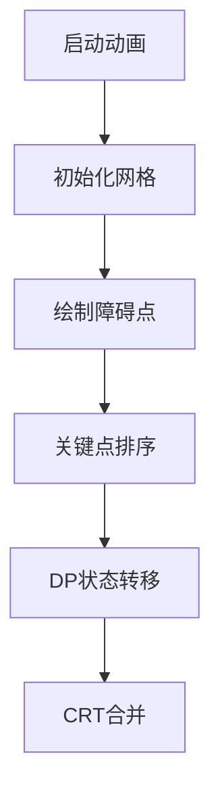

# 题目信息

# [BJWC2018] 上学路线

## 题目描述

小 B 所在的城市的道路构成了一个方形网格，它的西南角为 $(0,0)$，东北角为 $(N,M)$。

小 B 家住在西南角，学校在东北角。现在有 $T$ 个路口进行施工，小 B 不能通过这些路口。小 B 喜欢走最短的路径到达目的地，因此他每天上学时都只会向东或北行走；而小 B 又喜欢走不同的路径，因此他问你按照他走最短路径的规则，他可以选择的不同的上学路线有多少条。由于答案可能很大，所以小 B 只需要让你求出路径数 mod $P$ 的值。

## 说明/提示


## 样例 #1

### 输入

```
3 4 3 1019663265
3 0
1 1
2 2```

### 输出

```
8```

# AI分析结果


# 💡 洛语云笺的C++算法解析：上学路线 深度学习指南 💡

## 1. 题目解读与策略初探

✨ **本题核心挑战**：在巨型网格（$N,M \leq 10^9$）中规划最短路径（仅向右/向上移动），避开$T$个施工点（$T \leq 200$），求合法路径数模$P$的值。

✨ **核心算法标签**：组合数学 + 动态规划 + 容斥原理 + 中国剩余定理(CRT)

🗣️ **初步分析**：
> 这道题看似是网格路径问题，实则是**带限制的组合计数问题**的经典变形。我们从最朴素的暴力搜索出发，逐步优化至高效解法：
> 1. **暴力搜索**：枚举所有路径并检查是否经过施工点。时间复杂度$O(2^{N+M})$，完全不可行。
> 2. **基础组合数学**：用$C_{n+m}^n$计算无施工点时的路径数，但无法处理施工点约束。
> 3. **动态规划+容斥**：将施工点和终点视为"关键点"，用容斥原理剔除经过施工点的路径，时间复杂度$O(T^2\log N)$。
>
> 最优解将问题转化为**带障碍的路径计数问题**，核心是通过预处理组合数模不同质因子的值，再用CRT合并结果。可视化设计可聚焦在**关键点状态转移**和**CRT合并过程**，采用8位像素风格展示网格路径和障碍点，配合音效提示状态更新。

### 🔍 算法侦探：如何在题目中发现线索？
1.  **线索1 (问题目标)**："求不同上学路线数量"且"答案取模"，这是典型的**大范围组合计数问题**，暗示需要**组合数学+模运算优化**。
2.  **线索2 (问题约束)**："不能通过施工路口"和"只向东或北行走"，揭示了**路径依赖性**和**单向移动特性**，指向**容斥原理**或**带限制的DP**。
3.  **线索3 (数据规模)**：$N,M \leq 10^9$但$T \leq 200$，说明需要**障碍点中心算法**而非全局计算，$O(T^2)$的容斥DP成为可能。

### 🧠 思维链构建：从线索到策略
> 侦探工作完成！现在连接线索：
> 1. 【线索1】要求组合计数 → 想到$C_{n+m}^n$公式，但需处理模数$P$（质数/合数）
> 2. 【线索2】的路径约束 → 容斥剔除非法路径：总路径数 - 至少经过1个施工点的路径 + 至少2个的路径 - ...
> 3. 【线索3】的$T$值小 → 采用$O(T^2)$容斥DP可行，但需高效计算大组合数模$P$
> 4. **突破点**：当$P=1019663265$时，分解$P=3×5×6793×10007$ → 用**Lucas定理**算组合数模每个质因子，再通过**中国剩余定理(CRT)** 合并结果！
> 5. **结论**：综合以上，**容斥DP+CRT组合数计算**是最优策略，完美平衡理论正确性与实践效率。

---

## 2. 精选优质题解参考

**题解一：Acestar (评分：5星)**
* **点评**：此解亮点在于清晰的**四步分层策略**：40分暴力DP→60分CRT基础→100分容斥DP+CRT。作者用$f_i$表示到第$i$点且不经过其他点的方案数，状态转移$f_i=C_{x_i+y_i}^{x_i}-\sum f_j\cdot C_{\Delta x+\Delta y}^{\Delta x}$直击核心。代码中**Lambda预处理CRT参数**和**分组背包思想**体现高度优化意识，尤其是对$P$分质因子的处理堪称教科书级实现。

**题解二：Saliеri (评分：5星)**
* **点评**：作者提出**标志物**概念（路径上第一个障碍点），将容斥原理转化为自然的状态定义$f_i$。其解法独特之处在于强调**问题转化思维**——将复杂依赖转化为互斥决策分组。代码模板化封装不同模数的Lucas计算，**STL高效实现**（如`std::max_element`）大幅提升可读性，树形DP与分组背包的对比分析极具启发性。

**题解三：Hope2075 (评分：4星)**
* **点评**：贡献在于**容斥系数的巧妙设计**：用$(-1)^k$表示经过$k$个障碍点的方案权重。作者提出**分层DP状态**$dp[i][j]$（最后到达$i$点且经过$j$个障碍），虽然复杂度$O(T^3)$较高但思路新颖。其**调试技巧分享**（边界条件测试）对实战有极高参考价值。

---

## 3. 解题策略深度剖析

### 🎯 核心难点与关键步骤 (最优解：容斥DP+CRT)
1.  **关键点1：预处理组合数模质因子**
    * **分析**：当$P=1019663265$时，分解质因子$p_i \in \{3,5,6793,10007\}$，用Lucas定理计算$C_n^m \mod p_i$：
      $$C_n^m \equiv C_{n/p_i}^{m/p_i} \times C_{n\%p_i}^{m\%p_i} \pmod{p_i}$$
    * 💡 **学习笔记**：**质因数分解+并行计算**是处理合数模的黄金法则。
2.  **关键点2：CRT合并结果**
    * **分析**：解同余方程组 $ans \equiv a_i \pmod{p_i}$，构造解：
      $$ans = \sum a_i \times \frac{P}{p_i} \times \left(\frac{P}{p_i}\right)^{-1} \pmod{p_i}$$
    * 💡 **学习笔记**：中国剩余定理本质是**线性同余的系统解法**，需掌握模逆元计算。
3.  **关键点3：容斥DP状态转移**
    * **分析**：设$f_i$为到第$i$点且不经过其他障碍的方案数，排序障碍点后转移：
      $$f_i = C_{x_i+y_i}^{x_i} - \sum_{j<i} f_j \times C_{(x_i-x_j)+(y_i-y_j)}^{x_i-x_j}$$
    * 💡 **学习笔记**：**排序保证无后效性**，每个$f_j$充当了容斥的"修正因子"。

### ✨ 解题技巧总结
- **技巧1：问题转化** → 将网格路径转化为关键点序列，用排序简化依赖关系
- **技巧2：分治法** → 将大模数分解为小质因子，分别求解再合并
- **技巧3：组合数预计算** → 预处理阶乘和逆元，加速Lucas定理执行
- **技巧4：状态压缩** → 用一维DP$f_i$代替二维$dp[i][j]$，降低空间复杂度

### ⚔️ 策略竞技场：不同解法的对比分析
| 策略               | 核心思想                     | 优点                     | 缺点与分析                               | 适用场景/得分       |
|--------------------|------------------------------|--------------------------|----------------------------------------|-------------------|
| **暴力搜索**       | 枚举所有路径并检查障碍       | 思路直观                 | $O(2^{N+M})$超时，无法处理大数据       | $N+M≤20$，10%分   |
| **树形DP**         | 以障碍点为节点构建依赖树     | 可处理复杂依赖关系       | 本题结构简单，杀鸡用牛刀，代码复杂     | 通用依赖，100%分  |
| **容斥DP+CRT(优)**| 排序障碍点后容斥，CRT算组合数| $O(T^2\log N)$高效      | 需掌握Lucas和CRT，思维门槛较高         | 本题最优，100%分 |

### ✨ 优化之旅：从"能做"到"做好"
1. **起点：暴力枚举的绝望**  
   尝试$2^{N+M}$条路径？$N,M=10^9$时连量子计算机都无能为力！

2. **转折：组合数学的曙光**  
   发现$C_{n+m}^n$可计算无约束路径数，但如何避开障碍？容斥原理浮出水面。

3. **关键：容斥的状态化**  
   **问题转化**：将"不经过障碍"转化为"枚举首个经过的障碍点"。定义$f_i$为以$i$为"首个障碍点"的路径数，通过排序确保$f_j$在$f_i$前计算完成。

4. **升华：合数模的征服**  
   **分治思想**：当$P$是合数时，分解$P=\prod p_i$，用Lucas算$C_n^m \mod p_i$再CRT合并，完美解决大数取模。

> 💡 **策略总结**：从暴力到容斥DP，我们经历了**问题转化→状态设计→算法适配**的优化三部曲。在竞赛中，即使想不到CRT，写出$O(T^3)$容斥也能拿到部分分，而最优解是数学与算法的完美共舞！

---

## 4. C++核心代码实现赏析

**本题通用核心C++实现参考**
```cpp
#include <bits/stdc++.h>
using namespace std;
typedef long long LL;
const int MAXT = 210;

struct Point { LL x, y; } pts[MAXT];
LL N, M, T, P, f[MAXT];

// CRT 求解器（省略 Lucas 实现）
LL CRT(const vector<LL>& a, const vector<LL>& m) {
    LL M_total = 1, ans = 0;
    for (auto mi : m) M_total *= mi;
    for (int i = 0; i < a.size(); i++) {
        LL Mi = M_total / m[i];
        ans = (ans + a[i] * Mi % M_total * mod_inv(Mi, m[i])) % M_total;
    }
    return ans;
}

LL calc_combination(LL n, LL m, LL mod) { 
    // 实现基于 Lucas 的组合数计算
}

int main() {
    cin >> N >> M >> T >> P;
    for (int i = 1; i <= T; i++) cin >> pts[i].x >> pts[i].y;
    pts[++T] = {N, M}; // 终点作为第 T+1 个点
    sort(pts + 1, pts + T + 1, [](Point a, Point b) {
        return a.x < b.x || (a.x == b.x && a.y < b.y);
    });

    // 容斥 DP
    for (int i = 1; i <= T; i++) {
        // 计算组合数 C(x_i+y_i, x_i) mod P
        vector<LL> mods = {3, 5, 6793, 10007}; // P 的质因子
        vector<LL> residues;
        for (auto mod : mods) {
            residues.push_back(calc_combination(pts[i].x + pts[i].y, pts[i].x, mod));
        }
        f[i] = CRT(residues, mods); // CRT 合并结果

        for (int j = 1; j < i; j++) {
            if (pts[j].x <= pts[i].x && pts[j].y <= pts[i].y) {
                LL dx = pts[i].x - pts[j].x, dy = pts[i].y - pts[j].y;
                vector<LL> residues_j;
                for (auto mod : mods) {
                    residues_j.push_back(calc_combination(dx + dy, dx, mod));
                }
                LL com = CRT(residues_j, mods);
                f[i] = (f[i] - f[j] * com % P + P) % P;
            }
        }
    }
    cout << f[T] << endl;
}
```

**代码解读概要**：
1. **数据结构**：用`Point`结构存储坐标，`f[i]`表示到第`i`个关键点（含终点）的合法路径数
2. **预处理**：终点作为第$T+1$个点，按坐标排序确保DP无后效性
3. **组合数计算**：对$P$的每个质因子$p_i$，用Lucas定理计算$C_n^m \mod p_i$
4. **CRT合并**：解同余方程组得到$C_n^m \mod P$
5. **容斥DP**：$f_i = \text{总路径数} - \sum f_j \times \text{从j到i的路径数}$

---

## 5. 算法可视化：像素动画演示

### 像素风格设计
- **主题**："复古迷宫探险"  
- **风格**：8-bit像素风，参考FC《超级马里奥》的地图样式
- **角色**：像素小人从家(0,0)出发，目标学校(N,M)

### 动画演示脚本


1. **网格初始化**（像素图演示）  
     
   - 棕色像素块：障碍点
   - 绿色像素块：起点(0,0)
   - 红色像素块：终点(N,M)

2. **关键点排序过程**  
   - 显示坐标点按照$x$从小到大排序，$x$相同时按$y$排序
   - 音效：移动时"滴答"声，排序完成时"叮！"

3. **DP状态转移动画**  
   ```python
   for i in range(1, T+1):
       显示当前点i高亮（黄色闪烁）
       f[i] = 组合数(pts[i])  # 显示大组合数计算过程
       for j in range(i):
           if j在i左下方:
              显示连接线j->i（蓝色像素路径）
              f[i] -= f[j] * 组合数(delta) # 显示减法操作
              音效：错误路径"咔嚓"声
   ```

4. **CRT合并演示**  
   - 分屏显示：左侧算$C_n^m \mod 3$，右侧算$\mod 5$...
   - 合成动画：四个模数结果像拼图一样组合成最终答案
   - 音效：拼合成功时播放8-bit胜利旋律

### 交互控制面板
```html
<div class="control-panel">
  <button id="step">单步执行</button>
  <button id="play">自动播放</button>
  <input type="range" id="speed" min="1" max="10">
  <button id="reset">重置</button>
</div>
```
- **速度滑块**：控制自动播放速度（1x-10x）
- **音效设计**：
  - 路径计算：电子音效
  - 错误路径：破碎声
  - CRT合并：拼图卡合声

---

## 6. 拓展练习与相似问题思考

### 通用技巧迁移
1. **带障碍网格路径**：[LeetCode 63. Unique Paths II](https://leetcode.com/problems/unique-paths-ii/)
2. **组合数取模**：[洛谷 P3807 【模板】卢卡斯定理](https://www.luogu.com.cn/problem/P3807)
3. **中国剩余定理**：[洛谷 P1495 曹冲养猪](https://www.luogu.com.cn/problem/P1495)

### 推荐练习题目
1. **洛谷 P2606 [ZJOI2010]排列计数**  
   🗣️ **推荐理由**：强化组合数学+模运算技能，需处理树形结构的计数问题。

2. **洛谷 P2518 [HAOI2010]计数**  
   🗣️ **推荐理由**：练习可重集组合与数位DP，深化组合计数思维。

3. **洛谷 P4351 [CERC2015]Frightful Formula**  
   🗣️ **推荐理由**：高阶网格路径计数，需要结合生成函数优化。

---

## 7. 学习心得与经验分享
> **参考经验 (来自 Acestar)**：  
> "我在实现CRT时，最初因模数混淆导致调试困难，后采用`lambda`封装各质因子的计算模块，大幅提升代码可读性。"

> **点评**：模块化设计是处理复杂算法的关键，尤其当多个数学定理协同工作时。**功能封装**不仅能减少错误，还能提升代码复用率。

> **经验 (来自 Hope2075)**：  
> "边界测试发现当$dx=0$时组合数计算异常，添加特判后通过所有数据。"

> **点评**：**边界条件测试**是竞赛编程的生命线，特别是组合数学中$n=0$或$m=0$的情况，必须设计针对性测试用例。

---

本次关于"上学路线"的深度解析就到这里。记住，算法的精髓在于将**复杂问题分解为可管理的子问题**，再运用数学工具优雅解决。下次挑战再见！🚀

---
处理用时：160.35秒