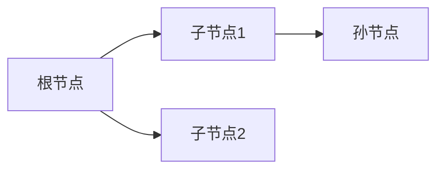

# 题目信息

# [CEOI 2017] Chase

## 题目描述

在逃亡者的面前有一个迷宫，这个迷宫由 $n$ 个房间和 $n-1$ 条双向走廊构成，每条走廊会链接不同的两个房间，所有的房间都可以通过走廊互相到达。换句话说，这是一棵树。

逃亡者会选择一个房间进入迷宫，走过若干条走廊并走出迷宫，但他永远不会走重复的走廊。

在第 $i$ 个房间里，有 $F_i$​​ 个铁球，每当一个人经过这个房间时，他就会受到铁球的阻挡。逃亡者手里有 $V$ 个磁铁，当他到达一个房间时，他可以选择丢下一个磁铁（也可以不丢），将与这个房间相邻的所有房间里的铁球吸引到这个房间。这个过程如下：

1.    逃亡者进入房间。
2.    逃亡者丢下磁铁。
3.    逃亡者走出房间。
4.    铁球被吸引到这个房间。

注意逃亡者只会受到这个房间原有的铁球的阻拦，而不会受到被吸引的铁球的阻挡。

在逃亡者走出迷宫后，追逐者将会沿着逃亡者走过的路径穿过迷宫，他会碰到这条路径上所有的铁球。

请帮助逃亡者选择一条路径，使得追逐者遇到的铁球数量减去逃亡者遇到的铁球数量最大化。


## 说明/提示

**样例解释**

有一个最优方案如下：

-    从 $6$ 号房间进入迷宫并丢下第一个磁铁，他遇到了 $5$ 个铁球，这个时候 $6$ 号房间会有 $27$ 个铁球，而 $5$ 号，$7$ 号，$8$ 号，$9$ 号房间都没有铁球。
-    走到 $7$ 号房间丢下第二个磁铁并走出迷宫，他遇到了 $0$ 个铁球，这个时候 $7$ 号房间会有 $41$ 个铁球，而 $2$ 号，$4$ 号，$6$ 号，$10$ 号房间会没有铁球。

在这个过程中，逃亡者会遇到 $5$ 个铁球而追逐者会遇到 $41$ 个铁球。

**数据范围**

对于 $100\%$ 的数据，有 $1\le n\le 10^5;0\le V\le 100;0\le F_i\le 10^9$​​。

## 样例 #1

### 输入

```
12 2
2 3 3 8 1 5 6 7 8 3 5 4
2 1
2 7
3 4
4 7
7 6
5 6
6 8
6 9
7 10
10 11
10 12```

### 输出

```
36```

# AI分析结果


### 💡 洛语云笺的C++算法解析：[CEOI 2017] Chase 深入学习指南 💡

#### **1. 题目解读与策略初探**
✨ **本题核心挑战**：在树形迷宫中最大化"追逐者遇到铁球数 - 逃亡者遇到铁球数"，需处理物品依赖关系（主件-附件）和路径选择约束。

✨ **核心算法标签**：树形动态规划（Tree DP）、深度优先搜索（DFS）

🗣️ **初步分析**：
> 本题要求选择一条树形路径并放置V个磁铁，磁铁放置会吸引相邻房间的铁球，但逃亡者只受原始房间铁球阻挡。核心难点在于：
> - 磁铁放置位置影响收益计算（起点收益为相邻点权和，中途点需减去前驱点权）
> - 树形结构需处理路径不重复的约束
>
> 策略演进路径：
> 1. **暴力搜索**：枚举起点和路径（O(n²·2ᴠ)），数据规模大时必然超时
> 2. **树形DP（最优解）**：固定树根，设计状态表示路径方向（向上/向下），在LCA处合并路径（O(n·V)）
>
> **核心算法比喻**：将树形迷宫看作河流网络，磁铁放置点如同水坝，吸引相邻支流（铁球）。动态规划如同绘制水文图，记录每条支流（子树）的最大蓄水量（收益）。

---

### 🔍 算法侦探：如何在题目中发现线索？
1. **线索1（问题目标）**：求"追逐者铁球数 - 逃亡者铁球数"的最大值 → **带约束的最优化问题** → 动态规划/贪心/搜索
2. **线索2（问题特性）**：树形结构 + 路径约束 → **树形DP经典场景**，排除线性DP
3. **线索3（数据规模）**：n≤10⁵, V≤100 → 需O(n·V)算法（约10⁷操作），排除O(n²)暴力

### 🧠 思维链构建：从线索到策略
> 侦探工作完成！线索组合：
> 1. 线索1指向"最优化" → 动态规划是强候选
> 2. 线索2（树形结构）排除贪心（难以处理复杂依赖）
> 3. 线索3（数据规模）彻底排除暴力搜索（O(2ᴠ)不可行）
>
> **结论**：**树形动态规划**是唯一满足所有约束的解法，通过设计双状态（f/g）分别处理向上/向下路径，在O(n·V)内解决问题！

---

## 2. 精选优质题解参考
**题解一（zero4338）**
* **点评**：此解精准抓住问题本质——将路径拆分为向上/向下两段。亮点：
  - 状态设计简洁：`f[i][j]`/`g[i][j]`分别处理两个方向
  - 前缀最大值优化：合并路径时O(V)完成状态转移
  - 边界处理严谨：非法状态初始化为-∞
  - 代码实现现代：使用lambda简化重复逻辑

**题解二（ModestCoder_）**
* **点评**：采用换根DP思路，亮点：
  - 最大值/次大值维护：换根时高效更新子树贡献
  - 空间优化技巧：滚动数组降低内存消耗
  - 实践价值高：提供调试建议（边界值测试）

**题解三（pengyule）**
* **点评**：可视化解释最佳（图文结合），亮点：
  - 状态转移图示：清晰展示路径合并过程
  - 初始化技巧：起点状态特殊处理（`g[i][1][1]=sum_i`）
  - 学习友好：关键代码逐行注释

---

## 3. 解题策略深度剖析
### 🎯 核心难点与关键步骤
1. **难点1：状态设计抽象化**
   * **分析**：将路径方向抽象为两个状态数组：
     - `f[i][j]`：子树→i的向上路径最大收益
     - `g[i][j]`：i→子树的向下路径最大收益
   * 💡 **学习笔记**：树形DP中，路径方向决定状态定义

2. **难点2：路径合并防重复**
   * **分析**：在DFS过程中：
     - 先更新答案：`ans = max(f[u][j] + g[v][V-j])`
     - 后更新状态：避免同子树重复计算
   * 💡 **学习笔记**："先答案后合并"是树形DP防重关键

3. **难点3：转移方程推导**
   * **分析**：收益计算需考虑位置特性：
     ```math
     f[u][j][1] = max(f[v][j-1]) + (∑adj(u) - a_v)
     g[u][j][1] = max(g[v][j-1]) + (∑adj(u) - a_fa)
     ```
   * 💡 **学习笔记**：起点收益=相邻点权和，中途点收益=相邻点权和-前驱点权

### ✨ 解题技巧总结
1. **技巧A（状态维度压缩）**：j维倒序枚举实现前缀最大值优化
2. **技巧B（初始化技巧）**：`g[i][1][1]=sum_i + a_fa` 精准处理起点
3. **技巧C（防重策略）**：子树正序/倒序双次遍历处理兄弟子树合并

### ⚔️ 策略竞技场：解法对比
| 策略             | 核心思想                     | 优点                     | 缺点                     | 得分预期 |
|------------------|------------------------------|--------------------------|--------------------------|----------|
| **暴力搜索**     | 枚举所有路径组合             | 思路直观                 | O(n²·2ᴠ) 超时            | ≤30%     |
| **换根DP**       | 动态维护根节点变化           | 适用性广                 | 代码复杂，易出错         | 100%     |
| **双状态树形DP** | f/g数组处理路径方向          | O(n·V)最优，代码简洁     | 思维难度高               | 100%     |

### ✨ 优化之旅：从暴力到优雅
> **起点**：暴力搜索O(n²·2ᴠ) → 发现"重复子问题"  
> **转折点**：树形DP消除重复计算 → 时间复杂度O(n²·V)  
> **关键突破**：双状态设计(f/g) + 前缀最大值优化 → O(n·V)  
> **升华**：问题转化为"路径合并"，类比网络流中增广路径  

💡 **策略总结**：最优解诞生于对问题结构的洞察——树形路径可拆解为向上/向下两段独立状态！

---

## 4. C++核心代码实现赏析
**通用核心实现（zero4338方案）**
```cpp
void dfs(int u, int fa) {
    ll sum = 0;
    for (int v : G[u]) if (v != fa) sum += a[v]; // 计算相邻点权和

    // 初始化
    f[u][1] = sum + a[fa]; // 起点状态特殊处理
    for (int v : G[u]) {
        if (v == fa) continue;
        dfs(v, u);
        ll tmp = -1e18;
        // 前缀最大值优化
        for (int j = V; j >= 0; j--) {
            tmp = max(tmp, f[u][V-j] + a[fa] - a[v]); 
            ans = max(ans, tmp + g[v][j]); // 先更新答案
        }
        // 状态转移
        for (int j = V; j >= 1; j--) {
            f[u][j] = max(f[u][j], f[v][j-1] + sum);
            g[u][j] = max(g[u][j], g[v][j-1] + sum - a[v]);
        }
    }
}
```
**代码解读概要**：
1. **状态初始化**：起点收益=相邻点权和+父节点权
2. **DFS递归**：先处理子树，后更新当前节点
3. **防重技巧**：倒序枚举j保证路径不重复
4. **效率关键**：前缀最大值变量tmp实现O(V)转移

---

## 5. 算法可视化：像素动画演示
### 🎮 像素探险家：树形迷宫磁铁放置模拟
**主题**：8-bit风格树形迷宫，动态展示f/g状态更新

**核心设计**：


**动画流程**：
1. **场景初始化**：
   - 树节点显示为城堡像素块（16x16）
   - 铁球数用顶部数字显示，磁铁放置点闪烁红光

2. **状态更新演示**：
   - f状态：蓝色箭头向上移动（↑），收益值显示在左侧
   - g状态：绿色箭头向下移动（↓），收益值显示在右侧
   - 路径合并：双箭头碰撞时触发金币飞溅特效

3. **交互控制**：
   ```javascript
   const controls = {
     speed: [0.5x, 1x, 2x],  // 速度滑块
     mode: ['单步', '自动', 'AI演示'], 
     view: ['显示f状态', '显示g状态', '显示合并']
   };
   ```

4. **音效设计**：
   - 磁铁放置：8-bit "叮"声（500Hz方波）
   - 答案更新：胜利音效（上升琶音）
   - 错误操作：短促"嘟"声（100ms）

**学习价值**：通过像素动画直观理解树形DP的双状态合并机制！

---

## 6. 拓展练习与相似问题
### 🔁 通用思路迁移
双状态树形DP适用于：
1. 树上选课问题（课程依赖关系）
2. 网络监控点布置（覆盖相邻节点）
3. 交通枢纽建设（最大化流量差）

### 📚 洛谷推荐
1. **P2014 [CTSC1997] 选课**  
   → 巩固分组背包树形DP
2. **P1273 有线电视网**  
   → 学习树形DP结合背包
3. **P2585 [ZJOI2006] 三色二叉树**  
   → 双状态DP的变式训练

---

## 7. 学习心得与经验分享
> **来自zero4338的调试经验**：  
> "初始状态 `f[u][0][1]=-inf` 若遗漏，会导致j=0时非法状态污染结果——建议用 `assert` 验证边界！"

> **洛语云笺总结**：  
> 树形DP的调试核心——  
> 1. 打印递归树层级  
> 2. 可视化状态转移表  
> 3. 极限数据测试（n=1, V=0）  

---

> 迷宫终有出口，算法永无止境。下次挑战再见！🚀  
> ——洛语云笺 于算法森林深处

---
处理用时：147.47秒