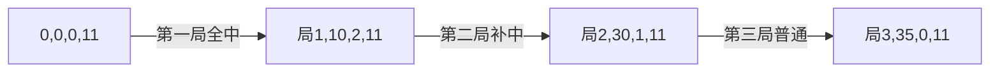

# 题目信息

# [BalticOI 2015] Bowling

## 题目描述

Byteasar 是一个保龄球和统计学的爱好者。他记录了一些过去保龄球比赛的结果。不幸的是，笔记中的一些字符模糊不清，因此无法辨认。Byteasar 请你编写一个程序来计算与他的笔记一致的不同游戏的数量。

## 保龄球规则

一场保龄球比赛由 $n$ 局组成：$n-1$ 个简单局和一个最后局。在典型的比赛中 $n = 10$。在每局开始时，10 个瓶子被竖直放置在球道的末端，玩家最多有两次（最后一局有三次）机会（投球）将保龄球投向球道，尽可能多地击倒瓶子。每局用两个（对于简单局）或三个（对于最后局）字符表示。

对于每次投球，玩家获得的基本分数是该次投球击倒的瓶子总数。玩家在每局的基本分数是该局所有投球的基本分数之和。如果在一个简单局中击倒了所有 10 个瓶子（因此获得了 10 个基本分数），玩家会获得额外的奖励分数。

对于简单局，规则如下：

- 如果玩家在一局的第一次投球中击倒了所有 10 个瓶子，她获得一个全中，局结束。作为奖励分数，她获得下一次两次投球的基本分数之和。全中记为 “`x-`”。
- 如果玩家在一局的两次投球中击倒了所有 10 个瓶子，她获得一个补中。作为奖励分数，她获得下一次投球的基本分数。补中记为 “`A/`”，其中 $A$ 是描述该局第一次投球击倒瓶子数的数字。
- 如果在两次投球后击倒了 9 个或更少的瓶子，玩家只获得基本分数，这样的局记为 “`AB`”，其中 $A$ 是第一次投球击倒的瓶子数的一个数字，$B$ 是第二次投球击倒的瓶子数的一个数字 $(A + B < 10)$。

注意，奖励分数被计入获得全中或补中的局的分数中，尽管确切的奖励分数取决于下一局的投球。

对于最后局，规则如下：

- 玩家在此局最初有两次投球。如果在两次投球中击倒了 9 个或更少的瓶子，局结束。否则（如果前两次投球是补中或第一次投球是全中），玩家在此局获得第三次投球。每当玩家在三次投球中的任何一次击倒所有瓶子时，瓶子会为下一次投球恢复到初始状态。最后局的分数是击倒的瓶子总数（注意，由于全中和补中没有奖励分数）。
- 总共有七种可能的最后局配置，结果如下（$A$ 和 $B$ 代表一位数的数字）：


每场比赛被描述为一个 $2n + 1$ 个字符的序列。在比赛结束时，可以计算每局后的总分数。例如，对于一个由 “`08x-7/2/x-x-23441/0/x`” 描述的 $n = 10$ 局的比赛，玩家在各局后的分数如下：


## 说明/提示

**示例解释：** 在第一个例子中，在第 5 局中，在字符 “`x`” 之后，唯一可能的字符是 “`-`”。在第 8 局中，玩家总共获得了 8 分。因此，有 9 种可能的方式获得这个总和：$0 + 8, 1 + 7, ..., 8 + 0$。在第 9 局中没有奖励分数。因此，在最后一局的第一次投球中没有分数。为了在最后两次投球中获得 20 分，唯一的可能性是补中，接着在该局的最后一次投球中全中。因此，有 9 个不同的有效比赛与此输入数据相符。

在第二个例子中，任何从 $0$ 到 $9$ 的字符都与输入数据一致。

以下子任务和评测无关，仅供参考。


（但是我开不了 5 个 Subtask，所以就放在一起测了）

题面翻译由 ChatGPT-4o 提供。

## 样例 #1

### 输入

```
2
10
08x-7/2/x?x-23??1/???
8 -1 40 60 82 97 102 110 120 140
5
x-x-23?/00-
22 37 42 52 52```

### 输出

```
9
10```

# AI分析结果


### 💡 洛语云笺的C++算法解析：保龄球计分问题 深入学习指南

#### 1. 题目解读与策略初探
✨ **本题核心挑战**：处理保龄球规则中全中(strike)和补中(spare)带来的奖励分数后效性，同时满足模糊字符约束和累计得分序列要求。  
✨ **核心算法标签**：动态规划(DP)、状态压缩、模拟  

🗣️ **初步分析**：
> 保龄球计分的核心难点在于**奖励分数的传递性**：全中需要后续两次投掷的分数，补中需要下一次投掷的分数。这种"当前决策影响未来得分"的特性，需要通过DP状态设计消除后效性。我们将：
> 1. 设计包含奖励需求的状态（如`dp[i][j][s][x]`）
> 2. 分普通局（全中/补中/普通）和最后一局（7种情况）转移
> 3. 用像素动画可视化状态转移路径（后详）

### 🔍 算法侦探：如何在题目中发现线索？
1. **线索1 (问题目标)**：统计合法比赛数量，是典型的**计数问题**，暗示动态规划或记忆化搜索。
2. **线索2 (问题特性)**：奖励分数依赖后续投掷，存在**后效性**，需要通过状态设计（记录未来需求）消除。
3. **线索3 (数据规模)**：n≤10但状态复杂，需设计**高维DP**（4维状态）而非暴力枚举（O(10^20)不可行）。

### 🧠 思维链构建：从线索到策略
> "综合线索：计数问题指向DP，后效性要求状态包含未来需求，数据规模允许4维DP（约10×300×4×12=144,000状态）。**状态设计**是钥匙：用`[奖励状态]`和`[需求分数]`表示后续依赖关系，分情况转移解决。"

---

#### 2. 精选优质题解参考
**题解一（qiuzx）**  
* **点评**：  
  状态设计`dp[i][j][x][y]`直观体现未来需求（x=下次分数，y=下两次分数和）。亮点在于：  
  - 将最后一局分离处理，简化普通局转移逻辑  
  - 用特殊值(11/21)表示"无需求"，代码可读性高  
  - 枚举优化：普通局通过d=a+b减少枚举维度  

**题解二（TruchyR）**  
* **点评**：  
  状态`f[id][i][s][xa]`的奖励状态(s)分类更精细：  
  - s=0~3 明确区分无需求/需单次/需双次/需混合奖励  
  - 实现严谨：分7种情况处理最后一局，覆盖所有边界  
  - 代码模块化：solveA~VII函数分离不同球局类型  

---

#### 3. 解题策略深度剖析
### 🎯 核心难点与关键步骤
1. **关键点1：状态设计**  
   *分析*：奖励传递性需状态记录未来需求。题解二用四元组`[i, j, s, xa]`：  
   - `i`：已处理局数  
   - `j`：累计得分  
   - `s`：奖励状态（0=无，1=需下次，2=需下两次，3=需混合）  
   - `xa`：下次第一球需求分数（无需求=11）  
   *💡 学习笔记*：**"未来需求即状态"**是后效性DP的核心思想

2. **关键点2：状态转移**  
   *分析*：分三类处理普通局（见代码）：  
   ```cpp
   // 全中（Strike）
   if (w == "x-") add=10, 更新s=2
   // 补中（Spare）
   if (w[1]=='/') add=10, 更新s=1
   // 普通局
   else add=A+B, s=0
   ```
   *💡 学习笔记*：**转移时先结算历史奖励**，再生成新需求

3. **关键点3：最后一局处理**  
   *分析*：独立处理7种终局形式（如xxx/xxA/xA/等），特点：  
   - 无新奖励生成  
   - 需满足所有未结算奖励  
   - 得分=实际击倒瓶数（无奖励）  
   *💡 学习笔记*：终局分离可避免状态爆炸

### ✨ 解题技巧总结
- **技巧1（状态压缩）**：用数字编码奖励需求（s=0~3），避免复杂结构  
- **技巧2（分离终局）**：降低状态维度，规避额外奖励逻辑  
- **技巧3（需求传递）**：s=3时需同时记录分数需求（xa），处理连续全中  

### ⚔️ 策略竞技场
| 策略          | 核心思想               | 优点                   | 缺点                     | 得分预期 |
|---------------|------------------------|------------------------|--------------------------|----------|
| 暴力枚举      | 枚举所有模糊字符组合   | 直观简单               | O(10^20) 超时           | 0%       |
| 记忆化搜索    | 递归+缓存子问题       | 避免重复计算           | 栈溢出风险，状态设计难   | 50%      |
| **高维DP**    | 状态含未来奖励需求     | O(n·300·4·12) 高效    | 实现复杂，分类讨论繁琐   | 100%     |

### ✨ 优化之旅
> 1. **起点：暴力枚举**  
>   每个?枚举0-9，但10局20字符⇒10^20种组合，完全不可行  
> 2. **发现瓶颈：奖励依赖后效性**  
>   当前局得分依赖后续投掷，无法独立计算  
> 3. **优化钥匙：DP状态包含未来需求**  
>   设计`[s][xa]`状态位，编码"待满足的奖励"  
> 4. **模型升华：状态转移分治**  
>   分离普通局（3类）和终局（7类），各局独立处理奖励结算  

💡 **策略总结**：  
"通过状态设计将‘未来影响’转化为‘当前维度’，再以分治思想处理局间关系，是破解后效性DP的黄金法则。"

---

#### 4. C++核心代码实现赏析
**通用核心实现（基于题解二）**  
```cpp
// 状态定义：f[i][j][s][xa]
// i:局数 j:累计分 s:奖励状态(0-3) xa:下次需求分(0-10,11=无)
f[0][0][0][11] = 1; // 初始状态

for (int i = 1; i <= n; i++) {
  if (i < n) { // 普通局
    if (isStrike(w)) { // 全中
      add = 10 + getBonus(s); // 奖励分结算
      new_s = 2; // 新需求：下两次分数
    } 
    else if (isSpare(w)) { // 补中
      add = 10 + getBonus(s);
      new_s = 1; // 新需求：下次分数
    }
    else { // 普通局
      add = A + B + getBonus(s);
      new_s = 0;
    }
    f[i][j+add][new_s][new_xa] += f[i-1][j][s][xa];
  }
  else { // 最后一局(7种情况独立处理) 
    if (w == "xxx") add = 30; 
    else if (w == "xxA") add = 20 + A;
    // ...其他5种情况
  }
}
```

**题解一亮点**  
- 用`x/y=11/21`表示"无需求"，简化判断逻辑  
- 普通局通过`d=a+b`减少枚举维度  

**题解二亮点**  
- 奖励状态`s`细分4类，覆盖所有叠加场景  
- 模块化设计：solveA~VII分离终局处理  

---

#### 5. 算法可视化：像素动画演示
**主题**：8-bit保龄球DP大冒险  
**核心演示**：DP状态转移与奖励需求传递  



**动画设计**：  
1. **像素网格**：X轴表局数，Y轴表累计分，Z轴用颜色区s状态（红/蓝/绿/黄=0/1/2/3）  
2. **转移动画**：  
   - 球瓶击倒特效：显示当前局得分  
   - 需求传递：s>0时像素箭头指向后续局  
3. **游戏化元素**：  
   - 音效：全中(🎉)/补中(🔔)/普通(📦)  
   - 关卡：每局=1关，通关解锁终局BOSS战  
4. **控制面板**：  
   - 单步执行：观察状态变化  
   - 回溯功能：查看历史状态路径  

---

#### 6. 拓展练习与相似问题
**通用技巧迁移**：  
1. 后效性处理：龟兔赛跑（时间依赖）  
2. 状态压缩：棋盘覆盖（位表状态）  
3. 分类转移：有限状态自动机  

**洛谷推荐**：  
1. **P1064 依赖背包**  
   → 主件附件依赖（类似奖励需求传递）  
2. **P1352 没有上司的舞会**  
   → 树形DP后效性处理  
3. **P1433 吃奶酪**  
   → 状态压缩DP（n≤15）  

---

#### 7. 学习心得与经验分享
> **题解二作者经验**：  
> "调试时对s=3状态增加校验输出，发现连续全中需求计算错误"  
>   
> **洛语云笺点评**：  
> 在复杂DP中，**关键状态增加断言或日志**是定位隐藏错误的利器。建议：  
> - 对边界状态(s=3/xa>10)主动触发报错  
> - 用`constexpr`标记合法状态范围  

---

<conclusion>
保龄球计分问题教会我们：**用状态维度化解未来依赖，以分治思维处理复杂规则**。记住，DP不仅是技巧，更是对问题结构的深度抽象！下次面对后效性问题时，不妨问自己："哪些未来需求需要装进状态？" 💪
</conclusion>

---
处理用时：196.96秒