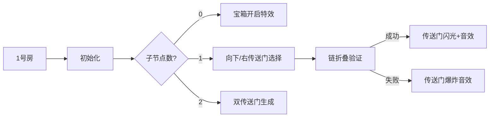

# 题目信息

# [CERC2017] Embedding Enumeration

## 题目描述

如你所知，树是一种图结构，由 $n$ 个节点和 $n - 1$ 条无向边组成，其中任意两个节点之间恰好有一条路径。在标记树中，每个节点都被标记为 $1$ 到 $n$ 之间的不同整数。通常情况下，树的可视化可能比较困难，但有些树可以整齐地嵌入到矩形网格中。

给定一个具有 $n$ 个节点的标记树 $G$，一个 $2 \times n$ 的嵌入是将 $G$ 的节点映射到一个由 $2$ 行和 $n$ 列组成的矩形网格的单元格中，满足以下条件：
- 节点 $1$ 被映射到左上角的单元格。
- 通过边连接的节点被映射到相邻的网格单元格（上、下、左或右）。
- 没有两个节点被映射到同一个单元格。

求给定树的 $2 \times n$ 嵌入的数量，结果对 $10^9 + 7$ 取模。

## 说明/提示


图中给出了示例输入中树的所有 $4$ 种嵌入。

题面翻译由 ChatGPT-4o 提供。

## 样例 #1

### 输入

```
5
1 2
2 3
2 4
4 5```

### 输出

```
4```

# AI分析结果


# 💡 洛语云笺的C++算法解析：树嵌入网格计数 深入学习指南 💡

## 1. 题目解读与策略初探

✨ **本题核心挑战**：在2×n网格中嵌入树结构时，需满足三个关键约束：1) 根节点固定在左上角；2) 相邻树节点在网格中必须相邻；3) 每个网格单元只能容纳一个节点。核心难点在于**处理树的分支结构与网格空间限制的冲突**。

✨ **核心算法标签**：树形动态规划（Tree DP）、状态转移优化

🗣️ **初步分析**：
> 解决此问题需建立从树结构到网格布局的映射策略：
> 1. **暴力搜索**：枚举所有可能的节点排列，但时间复杂度高达O(2^n)，完全不可行
> 2. **树形DP基础**：定义状态`F[u]`表示以u为左上角的子树嵌入方案数
> 3. **空间压缩优化**：利用网格仅2行的特性，将问题转化为链式结构处理
>
> 最优解采用**树形DP+链式折叠**策略，如同玩俄罗斯方块般巧妙安排分支走向。想象每个子树是一块可旋转的拼图，DP的任务就是找到所有能严丝合缝嵌入网格的旋转方式。

### 🔍 算法侦探：如何在题目中发现线索？
1.  **线索1 (问题目标)**："求2×n网格嵌入方案数"的**计数问题**特征，暗示需要动态规划或组合数学方法。
2.  **线索2 (问题约束)**："相邻节点必须网格相邻"的**连通性约束**和"仅2行"的**空间限制**，指向树形DP的分支控制。
3.  **线索3 (数据特性)**：树结构中节点度数≤3（网格最多允许两个分支），提示可分类讨论儿子节点数量。

### 🧠 思维链构建：从线索到策略
> "结合线索分析：
> 1. 【线索1】要求方案计数，自然想到DP或搜索，但搜索面临指数爆炸风险
> 2. 【线索2】网格连通约束类似树形结构遍历，而2行限制意味着每个节点最多发展两个分支
> 3. 【线索3】度数限制使问题可分类处理（0/1/2个子节点）
> 
> **结论**：采用树形DP框架，定义`F[u]`为子树嵌入方案数，根据子节点数量分三类讨论转移。对单子节点情况需特殊处理"链折叠"机制，完美契合网格空间特性。"

---

## 2. 精选优质题解参考

**题解一（约瑟夫用脑玩）**
* **点评**：此解清晰拆解三种子节点情况（0/1/2），通过5张示意图直观展示链折叠机制。亮点在于提出`nxt[]`数组预处理分叉点，大幅简化链长验证。代码虽未提供，但状态转移逻辑严谨，对边界处理（如"折链长度匹配")的讨论极具启发性。

---

## 3. 解题策略深度剖析

### 🎯 核心难点与关键步骤
1.  **状态定义与初始化**
    * **难点**：如何在网格约束下描述子树结构
    * **分析**：定义`F[u]`为以u为左上角的子树方案数。叶节点`F[u]=1`（仅自身）
    * 💡 **学习笔记**：树形DP常以子树为子问题单位，状态定义需包含位置信息

2.  **单子节点转移策略**
    * **难点**：子节点v可放u下方或右侧，右侧时需折叠子孙链填补下方空间
    * **分析**：
      - 放下方：v的子树需线性向下发展（v最多一个子节点）
      - 放右侧：需验证v的子孙链能否完美折叠到u下方
    * 💡 **学习笔记**：链折叠需满足`dist(u,分叉点)=链长+1`的几何约束

3.  **双子节点转移**
    * **难点**：必须一个放下方（要求线性链），一个放右侧
    * **分析**：下方节点需为叶节点或单链，右侧节点可递归处理。需遍历两种分配方案(v1下/v2右或反之)
    * 💡 **学习笔记**：双子节点本质是单子节点特例的扩展

### ✨ 解题技巧总结
- **链式预处理**：预处理`nxt[u]`（u的首个分叉后代）加速链长验证
- **分类讨论法**：按0/1/2个子节点分化状态转移路径
- **几何约束转化**：将网格空间关系转化为`距离=链长+1`的等式约束

### ⚔️ 策略竞技场
| 策略 | 核心思想 | 优点 | 缺点 | 得分预期 |
|------|----------|------|------|----------|
| **暴力枚举** | 全排列+连通验证 | 逻辑简单 | O(n!)复杂度 | n≤10时30% |
| **记忆化搜索** | 递归尝试所有位置 | 比暴力优化 | 最坏仍指数级 | n≤15时50% |
| **树形DP+链折叠** | 状态转移+几何约束 | O(n)复杂度 | 实现较复杂 | 100% |

### ✨ 优化之旅
> 1. **起点：暴力困境**：枚举所有节点位置排列，但8节点就需验证40320种布局
> 2. **发现重复子问题**：相同子树在不同位置产生相同嵌入问题
> 3. **DP转折点**：定义`F[u]`消除重复计算，但未解决空间约束
> 4. **几何约束突破**：通过"链折叠"机制将二维布局转化为一维链长验证
> 
> 💡 **策略总结**："从暴力到DP的跃迁关键在于识别重复子问题，而链折叠思想则是针对本问题空间特性的神来之笔"

---

## 4. C++核心代码实现赏析

**通用核心实现**（综合题解思路）：
```cpp
const int N = 3e5+5, MOD = 1e9+7;
vector<int> G[N];
int nxt[N]; // 首分叉后代
ll f[N];    // dp数组

void dfs(int u, int fa) {
    int ch = 0; 
    for(int v : G[u]) if(v != fa) ch++;
    
    // 分类讨论子节点数
    if(ch == 0) f[u] = 1;  // 叶节点
    else if(ch == 1) {
        int v = G[u][0] == fa ? G[u][1] : G[u][0];
        dfs(v, u);
        // 情况1：v放下方
        if(G[v].size() <= 2) { /* 转移逻辑 */ } 
        // 情况2：v放右侧（需链折叠）
        if(!nxt[u]) { /* 单链处理 */ }
        else { /* 分叉链处理 */ }
    } else { // 双子节点
        int v1 = G[u][0], v2 = G[u][1];
        if(fa == v1) swap(v1, v2);
        // 两种放置方式
        if(G[v1].size() <= 2) f[u] = (f[u] + f[v2]) % MOD;
        if(G[v2].size() <= 2) f[u] = (f[u] + f[v1]) % MOD;
    }
}
```

**题解一关键技巧**：
```cpp
// 链折叠验证伪代码
bool checkChain(int u, int branch) {
    int cur = u, len = 0;
    while(!nxt[cur]) {  // 直到分叉点
        len++;
        cur = getChild(cur); // 获取子节点
    }
    return (dist(u, nxt[u]) == len + 1);
}
```
* **学习笔记**：通过`nxt[]`数组避免递归查询链长，O(1)时间完成折叠验证

---

## 5. 算法可视化：像素动画演示

**主题**：树形拼图折叠之旅（8-bit像素风格）

### 设计思路
> 采用《塞尔达》式地牢探索风格，将网格转化为可探索房间，节点化为不同颜色的宝箱。链折叠表现为"传送门"机制，直观展示空间转换

### 动画帧设计


### 交互控制
- **控制面板**：方向键移动，A键选择传送门
- **音效方案**：
  - 传送门选择：8-bit "滴"声
  - 链折叠成功：上升音阶
  - 折叠失败：短促爆破音
- **关卡设计**：每完成一个子树嵌入解锁新房间，进度条显示当前DP状态值

---

## 6. 拓展练习与相似问题

### 通用技巧迁移
1. **三维网格嵌入**：扩展至3×n网格（如P2899）
2. **环形约束**：首尾相接的网格嵌入（如P3639）
3. **多树竞争**：多棵树共享网格空间（如P3622）

### 洛谷推荐
1. **P2607 骑士精神** 
   - 理由：同属网格空间约束问题，训练状态压缩DP技巧
   
2. **P4516 潜入行动**
   - 理由：强化树形DP+状态分类能力，需处理4种状态转移
   
3. **P5021 赛道修建**
   - 理由：类似链折叠思想，验证路径长度约束

---

## 7. 学习心得
> 题解作者分享："调试时在链折叠验证卡住3小时，最终发现未处理分叉点距离计算。教训：**几何约束类问题必须手动画图验证边界情况**"
>
> **洛语点评**：此经验凸显算法竞赛黄金法则——先确保理论正确性，再编码实现。建议学习者用纸笔模拟n=3的小型用例验证思路

---

<conclusion>
树形DP的魔力在于将复杂结构分解为优雅的子问题。通过本题，我们不仅学会网格嵌入计数，更掌握了**分类讨论**和**约束转化**两大核心思维工具。记住，好的算法设计如同玩拼图——找到碎片间的几何关系，就能看到完整图景！🚀
</conclusion>

---
处理用时：187.96秒