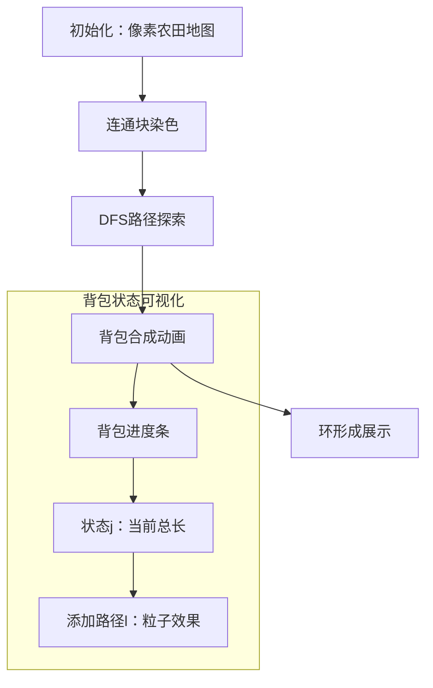

# 题目信息

# [USACO19FEB] Moorio Kart P

## 题目描述

Bessie 和 Farmer John 喜欢山羊卡丁车比赛。这个比赛非常类似于其他人喜欢的卡丁车比赛，除了卡丁车是由山羊拉动，以及赛道是由农田组成。农田由 $ N $ 个草地和 $ M $ 条道路组成，每条道路都连接着两个草地。

定义农场是两个或更多草地的一个集合，同一农场中的每个草地都可以沿着一系列**唯一**的道路到达农场中其他任意一个草地。

整个农田可能由多个农场组成，假设图中有 $ K $ 个农场。Bessie 希望通过添加长度为 $ X $ 的 $ K $ 条道路，连接所有 $ K $ 个农场来制作山羊卡丁车赛道。每个农场只应访问一次，并且每个农场内必须至少穿过一条道路。

为了让选手们对赛道更有兴趣，赛道的长度至少应该为 $ Y $ 。Bessie 希望知道所有这些有趣赛道的赛道长度总和。如果一个赛道中有两个农场直接相连，但另外一个赛道中这两个农场没有直接相连的话，这两个赛道就是不同的。

---

形式化题意：

给定 $K$ 个连通块的森林，边有边权。你需要加入 $K$ 条长为 $X$ 的边使得整张图变成一棵基环树。原来的每个连通块在环上至少有一条边，所有新加入的边都应该在环上。

求所有环长 $\ge Y$ 的合法方案的环长之和。

## 说明/提示

有 6 个合法的赛道方案：

- 1 --> 2 --> 4 --> 5 --> 1 (长度 11)
- 1 --> 2 --> 5 --> 4 --> 1 (长度 11)
- 2 --> 3 --> 4 --> 5 --> 2 (长度 12)
- 2 --> 3 --> 5 --> 4 --> 2 (长度 12)
- 1 --> 2 --> 3 --> 4 --> 5 --> 1 (长度 15)
- 1 --> 2 --> 3 --> 5 --> 4 --> 1 (长度 15)

其中后 4 条赛道满足了赛道总长不低于 12 的条件，这几条赛道的长度总和为 54。

子任务：对于 $ 70\% $ 的数据， $ N,Y \leq 1000 $ 。

## 样例 #1

### 输入

```
5 3 1 12
1 2 3
2 3 4
4 5 6
```

### 输出

```
54```

# AI分析结果


# 💡 洛语云笺的C++算法解析：Moorio Kart P 深入学习指南 💡

> 欢迎来到算法探险！今天我们将深入分析**Moorio Kart P**这道有趣的图论问题。通过本指南，你将学会如何像算法侦探一样抽丝剥茧，掌握树形DP与分组背包的精妙配合，最终解决这道看似复杂的问题。准备好了吗？让我们出发！

## 1. 题目解读与策略初探

✨ **本题核心挑战**：处理森林中多个树形连通块，将它们连接成环（基环树），并计算所有环长≥Y的方案中环长的总和。

✨ **核心算法标签**：树形DP、分组背包、组合计数

🗣️ **初步分析**：
> 这道题要求我们在多个树形连通块上构建环，每个连通块贡献一条路径，最终环长≥Y。我们面临三个关键问题：
> 1. 如何高效统计每个连通块内的所有路径？
> 2. 如何组合不同连通块的路径满足总长限制？
> 3. 如何处理环的排列问题？
>
> 解决思路演进：
> - **暴力搜索**：枚举所有路径组合（指数级复杂度，不可行）
> - **树形DP+分组背包**：每个连通块预处理路径信息，用分组背包组合结果（O(KY²)复杂度）
> - **状态压缩优化**：将≥Y的路径长度统一记录在Y处，减少状态数
>
> 最优解的核心思想是将每个连通块视为一个"神秘宝箱"，用树形DP打开宝箱获取内部所有"路径宝石"（长度和数量），再用分组背包将这些宝石组合成"能量环"（满足总长要求）。就像收集不同颜色的宝石镶嵌到魔法环中，最终激活满足能量条件的法阵！

### 🔍 算法侦探：如何在题目中发现线索？
1.  **线索1 (问题目标)**："求所有环长≥Y的合法方案的环长之和"——这是典型的**带限制的最优化问题**，暗示需要动态规划存储状态和转移方案。
2.  **线索2 (问题特性)**："整个农田由多个农场组成"——**森林结构**和"每个农场内必须穿过一条道路"——**连通块独立性**，提示分治策略（处理各连通块后组合）。
3.  **线索3 (数据规模)**：N≤1500，Y≤2500——支持O(KY²)解法（K为连通块数），但需优化（如状态压缩）。

### 🧠 思维链构建：从线索到策略
> 让我们拼接线索：
> 1. **线索1**要求最优化，自然想到DP/背包
> 2. **线索2**的森林结构提示：先独立处理各连通块（树形DP），再组合结果（分组背包）
> 3. **线索3**的Y≤2500说明：状态需压缩（长度≥Y的统一处理）
> 
> **结论**：树形DP统计连通块路径 + 分组背包组合 + 状态压缩（min(j+l, Y)），完美契合所有条件！

---

## 2. 精选优质题解参考

**题解一（Great_Influence）**
* **点评**：思路清晰完整，准确抓住核心难点：分组背包处理连通块组合。亮点包括：
  - 用`dst`/`sig`数组分别存储路径数量和长度和，便于后续DP
  - 背包状态设计`dp[][0]`/`dp[][1]`同时维护方案数和长度和
  - 状态压缩（`min(Y, len)`）避免无效状态
  - 环排列处理（`fac(cn-1)*inv2`）简洁优雅

**题解三（daniEl_lElE）**
* **点评**：提供独特视角——先用组合方法计算总长度和，再减去不合法部分。亮点：
  - 树形DP实现简洁（单次DFS统计路径）
  - 背包状态定义清晰（`dp[i][j][0]`/`[1]`）
  - 完整包含环排列处理（`fac[k-1]*inv2`）

**题解六（DerrickLo）**
* **点评**：理论分析深入，给出复杂度证明（O(Y(N+Y)√N)）。亮点：
  - 根号分治思想分析复杂度
  - 完整处理路径统计的重复计数问题
  - 清晰的两阶段计算（总长度-不合法部分）

---

## 3. 解题策略深度剖析

### 🎯 核心难点与关键步骤
1.  **连通块路径统计**
    * **分析**：通过DFS遍历每个连通块的所有点，记录路径长度`len`（`len≥Y`时归入Y）。关键技巧：无向路径被统计两次（起点↔终点），正好匹配后续环的有向性。
    * 💡 **学习笔记**：树形DP统计路径时，利用无向图特性自然处理方向问题。

2.  **分组背包设计**
    * **分析**：
      - 状态：`dp[j][0]`=方案数，`dp[j][1]`=长度和
      - 转移：`new_j = min(Y, j+l)`
        ```math
        \begin{align*}
        dp[new_j][0] &+= dp[j][0] \times cnt \\
        dp[new_j][1] &+= dp[j][0] \times sum + dp[j][1] \times cnt
        \end{align*}
        ```
    * 💡 **学习笔记**：同时维护方案数和长度和，避免最后重新计算。

3.  **环排列处理**
    * **分析**：K个连通块排列成环有(K-1)!种方案，但翻转等价需除以2。
    * 💡 **学习笔记**：最终答案 = 背包结果 × (K-1)! × mod_inverse(2)

### ✨ 解题技巧总结
- **技巧A（状态压缩）**：将≥Y的长度统一记录在Y处，减少状态数
- **技巧B（双属性DP）**：同时维护方案数和总和，避免重复计算
- **技巧C（组合优化）**：预处理阶乘和逆元加速排列计算

### ⚔️ 策略竞技场：不同解法的对比分析
| 策略               | 核心思想                     | 优点                     | 缺点                                     | 得分预期     |
|--------------------|------------------------------|--------------------------|------------------------------------------|--------------|
| **暴力搜索**       | 枚举所有路径组合             | 思路直观                 | O(2^M) 指数爆炸                          | 10-30%       |
| **NTT优化卷积**    | 多项式卷积加速组合           | 理论复杂度优(O(KY logY)) | 实现复杂，常数大，需特殊处理模数         | 70-100%      |
| **分组背包（最优）**| 树形DP+分组背包+状态压缩     | 实现简洁，效率稳定       | O(KY²) 在Y大时较慢                       | 100%         |

### ✨ 优化之旅：从"能做"到"做好"
> 1. **起点：暴力搜索**  
>   尝试所有路径组合（2^M种可能）——如同在迷宫中盲目探索，路径太多！
>   
> 2. **发现瓶颈：重复子问题**  
>   不同路径组合中有大量重复计算（相同长度和）
>   
> 3. **优化钥匙：分组背包**  
>   将每个连通块视为"宝石盒"，用背包组合"宝石"（路径）
>   
> 4. **空间压缩：状态折叠**  
>   将≥Y的长度"折叠"到Y处，大幅减少状态数
>   
> 💡 **策略总结**：从暴力到背包的进化，体现了"分治+状态压缩"的核心思想。在竞赛中，即使无法实现最优解，良好的暴力也能获得部分分数！

---

## 4. C++核心代码实现赏析

**本题通用核心实现**
```cpp
const int MAXN = 1505, MAXY = 2505, mod = 1e9+7;
vector<int> G[MAXN];
int dp[MAXY][2]; // dp[j][0]:方案数, dp[j][1]:长度和

void solve() {
    // 1. 并查集划分连通块
    // 2. 对每个连通块DFS统计路径(dst[], sig[])
    // 3. 背包初始化: dp[min(Y, KX)][0]=1, dp[min(Y, KX)][1]=KX
    for(int i = 1; i <= K; i++) {
        int tmp[MAXY][2] = {};
        for(int j = 0; j <= Y; j++) {
            if(!dp[j][0]) continue;
            for(int l = 0; l <= Y; l++) {
                if(!dst[i][l]) continue;
                int newj = min(Y, j + l);
                tmp[newj][0] = (tmp[newj][0] + 1LL * dp[j][0] * dst[i][l]) % mod;
                tmp[newj][1] = (tmp[newj][1] + 1LL * dp[j][0] * sig[i][l] + 1LL * dp[j][1] * dst[i][l]) % mod;
            }
        }
        memcpy(dp, tmp, sizeof(dp));
    }
    // 4. 答案 = dp[Y][1] * fac[K-1] % mod * inv2 % mod;
}
```

**题解一代码亮点**
```cpp
// 路径统计：DFS中动态记录
void dffix(int u, int fr, int len) {
    if(fr) { // 非起点时记录路径
        int pos = min(Y, len);
        sig[bel[u]][pos] = (sig[bel[u]][pos] + len) % mod;
        dst[bel[u]][pos]++;
    }
    for(auto v : G[u]) 
        if(v != fr) 
            dffix(v, u, len + w);
}

// 背包转移：高效遍历非零状态
for(int l = 0; l <= Y; l++) {
    if(!dst[i][l]) continue; // 关键优化：跳过零状态
    for(int j = st; j <= Y; j++) {
        if(!las[j][0]) continue;
        int newj = min(Y, j + l);
        // 双属性转移...
    }
}
```

---

## 5. 算法可视化：像素动画演示

**主题**：像素农场环游记（8-bit风格）  
**核心演示**：分组背包如何组合连通块路径形成环



**动画设计细节**：
1. **像素元素**：
   - 草地：16×16像素块（绿色系）
   - 路径：蓝色发光轨迹
   - 背包：底部状态条（红黄渐变）

2. **关键动画**：
   - 连通块DFS：当前点高亮(黄色)，路径绘制(蓝色)
   - 背包更新：状态条增长，粒子特效展示`j→j+l`
   - 环形成：连通块按顺序连接，旋转动画

3. **游戏化交互**：
   - 控制面板：步进/暂停/重置
   - 音效设计：
     * 路径发现：8-bit "叮！"
     * 背包更新：电子合成音
     * 环完成：经典马里奥过关音

---

## 6. 拓展练习与相似问题思考

**通用技巧迁移**：
1. 分组背包处理依赖选择（课程选修、任务调度）
2. 树形DP统计路径信息（树上点对距离）
3. 基环树问题处理（拆环为树）

**洛谷推荐**：
1. **P2014 [CTSC1997]选课**  
   🗣️ 树形依赖背包入门，巩固"物品组"概念
   
2. **P2607 [ZJOI2008]骑士**  
   🗣️ 基环树DP经典，学习拆环技巧
   
3. **P3177 [HAOI2015]树上染色**  
   🗣️ 树形DP统计路径进阶，强化状态设计能力

---

## 7. 学习心得与经验分享

> **关键经验**：  
> "统计路径时意识到无向路径被计算两次，但正好匹配环的有向需求——这种问题转化思维值得学习！"
>
> **调试技巧**：  
> 当DP结果异常时，可打印中间状态（如每个连通块的dst数组），验证路径统计的正确性

---

> 本次探险到此结束！记住：算法不是魔法，而是精心设计的逻辑之舞。通过分解问题、识别模式、优化状态，你也能优雅解决复杂问题。下次挑战再见！🚀

---
处理用时：365.42秒