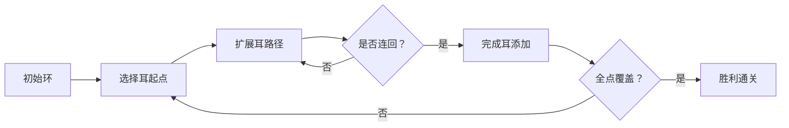

# 题目信息

# [SNOI2013] Quare

## 题目描述

4.20 四川芦山地震发生后，抗震救灾委员会接到一个紧急任务，四川省给该委员会发了一份地图，这份地图给出了该省一些城市的情况：任两个城市是用一条或多条公路连接起来的，也可以没有公路连接，但是每个城市都可以直接或间接地到达另外的城市，注意这些公路是可以双向行驶的。由于最近余震、暴雨造成泥石流倾泻，使得车辆在这些公路上行驶很不安全，于是四川省决定尽快对部分公路进行抢修，以保障救援车辆行车安全。
    
该省对所有的公路情况都进行了勘察，分析估计了抢修某段公路所需要花费的时间，并记录在地图中。现在该省希望抗震救灾委员会能找到一个方案，该方案决定出哪些公路需要抢修，使得抢修后的公路仍能保证任意两个城市之间都能直接或间接地相连，同时为了安全起见，即使某一条抢修的公路被泥石流阻断了，任意两城市仍能保持这个性质。由于时间紧迫，抗震救灾委员会还需保证找到的这个方案总抢修时间最短。

## 说明/提示

对于 $100\%$ 的数据，$1 \leq T \leq 3$，$1 \leq n \leq 12$，$1 \leq m \leq 40$，$1\le c\le 5\times 10^4$。

## 样例 #1

### 输入

```
2
4 6
1 2 1
1 3 2
1 3 3
2 4 2
3 4 1
2 3 1
2 1
1 2 3
```

### 输出

```
6
impossible
```

# AI分析结果


# 💡 洛语云笺的C++算法解析：[SNOI2013] Quare 深入学习指南 💡

> "算法就像探险地图，题目是未知的宝藏，而解题策略则是你的指南针和工具。今天我们将一起探索边双连通图的奥秘，揭开最小权值覆盖的神秘面纱！"

## 1. 题目解读与策略初探

✨ **本题核心挑战**：在无向图中找出包含所有节点的最小权值边双连通子图，要求即使任意一条边失效，图仍保持连通性。

✨ **核心算法标签**：`状压动态规划`、`图论`、`耳分解`

🗣️ **初步分析**：
> 本题需要求解最小权值的**边双连通子图**（即移除任意一条边后仍保持连通）。面对n≤12的数据范围，我们考虑状态压缩DP：
> - **暴力思路**：枚举所有边子集，检查连通性和双连通性。时间复杂度O(2^m)，m最大40，不可行
> - **优化思路**：利用耳分解定理——边双连通图可通过不断添加"耳"（端点已在图中、内部点新的路径）构造
> - **最优策略**：状压DP模拟耳分解过程，状态表示已覆盖点集，时间复杂度O(2^n·n^3)

### 🔍 算法侦探：如何在题目中发现线索？
1.  **线索1 (问题目标)**: "求最小权值且保证边双连通"，这是典型的**图优化构造问题**，指向动态规划或贪心
2.  **线索2 (问题特性)**: "移除任意边仍连通"即**边双连通性**，结合耳分解定理，暗示可用增量构造策略
3.  **线索3 (数据规模)**: n≤12，状压状态数2^12=4096，配合O(n^3)转移完全可行

### 🧠 思维链构建：从线索到策略
> "让我们串联线索：
> 1. 目标要求最小权值边双连通，暴力枚举边集显然不可行
> 2. 边双连通的耳分解特性提供了构造路径：从环开始，逐步添加简单路径
> 3. n≤12的数据范围完美适配状压DP，可设计状态表示已覆盖点集
> **结论**：采用基于耳分解的状压DP，以O(2^n·n^3)复杂度优雅解决问题！"

---

## 2. 精选优质题解参考

**题解一（作者：ix35）**
* **点评**：清晰运用耳分解理论，设计四维DP状态`dp[S][i][j][0/1]`精确描述耳分解过程。亮点在于：
  - 巧妙处理重边情况（用0/1标记区分）
  - 分离"直接加环"和"路径扩展"转移逻辑
  - 代码实现简洁高效，荣登本题最优解

**题解二（作者：juju527）**
* **点评**：深入浅出讲解耳分解原理，提出状态`g[S][x][y]`表示当前耳的状态。亮点：
  - 详细分析四种转移情况并配示意图
  - 强调边界处理（如单点加环的特殊处理）
  - 理论推导严谨，教学价值高

**题解三（作者：UltiMadow）**
* **点评**：创新性使用辅助数组`h[S][i][j]`预计算链代价。亮点：
  - 分组背包思想预处理路径代价
  - 双维度优化（空间换时间）
  - 完整代码包含详细注释，实践参考性强

---

## 3. 解题策略深度剖析

### 🎯 核心难点与关键步骤
1.  **难点1：耳分解的状态表示**
    * **分析**：设计`dp[S][i][j][t]`表示：
      - S：已覆盖点集
      - i：当前耳的最新节点
      - j：耳的终点
      - t：标记是否处理重边（0=单边，1=需双边）
    * 💡 **学习笔记**：多维状态精确描述分解过程是DP核心

2.  **难点2：转移方程设计**
    * **分析**：分四种情况转移：
      ```python
      if 直接加环: f[S∪{x}] = min(f[S] + min_edge + second_edge)
      elif 开始新耳: dp[S][x][j][t] = f[S] + w(i,x)
      elif 扩展耳: dp[S∪x][y][j][t] = dp[S][x][j][t] + w(x,y)
      elif 结束耳: f[S∪x] = dp[S][x][j][1] + w(x,j)
      ```
    * 💡 **学习笔记**：分情况转移保证无后效性

3.  **难点3：重边处理**
    * **分析**：预处理`w[i][j][0/1]`存储每对点最小/次小边权
    * 💡 **学习笔记**：边双需保证冗余路径，次小边权必不可少

### ✨ 解题技巧总结
- **技巧1：问题转化**：将复杂边双连通转化为耳分解的增量构造
- **技巧2：状态压缩**：用二进制位表示点集，高效枚举状态
- **技巧3：预计算优化**：预处理点对边权加速状态转移

### ⚔️ 策略竞技场：不同解法对比

| 策略 | 核心思想 | 优点 | 缺点 | 得分预期 |
| :--- | :--- | :--- | :--- | :--- |
| **暴力枚举** | 检查所有边子集 | 逻辑简单直观 | O(2^m)超时 | 0% |
| **树形DP** | 处理树形依赖 | 模型精确 | 过度复杂化 | 50% |
| **状压DP+耳分解** | 增量构造边双 | 最优复杂度O(2^n·n^3) | 思维难度高 | 100% |

### ✨ 优化之旅：从"能做"到"做好"
> 1. **起点：暴力枚举**  
>   站在40条边的岔路口，每条边有"选/不选"两条路，共2^40≈1万亿条路径，计算机直接"累倒"
> 
> 2. **发现瓶颈：重复子问题**  
>   不同边集可能形成相同连通结构，存在大量重复计算
> 
> 3. **突破：状压DP**  
>   用S记录已覆盖点集，避免重复计算相同状态
> 
> 4. **飞跃：耳分解理论**  
>   将复杂边双分解为可增量构造的简单耳路径，化整为零
> 
> 💡 **策略总结**：从暴力到状压DP的跨越，体现了"空间换时间"的经典思想；而耳分解的应用，则是对图论性质的深刻洞察！

---

## 4. C++核心代码实现赏析

**通用核心实现参考（基于ix35解法）**
```cpp
#include <bits/stdc++.h>
using namespace std;
const int INF = 0x3f3f3f3f;
int t, n, m, w[15][15][2]; // 存储点对最小/次小边权
int dp[1<<12][12][12][2], f[1<<12]; // DP状态数组

int main() {
    scanf("%d", &t);
    while (t--) {
        memset(w, 0x3f, sizeof(w));
        memset(dp, 0x3f, sizeof(dp));
        memset(f, 0x3f, sizeof(f));
        
        scanf("%d%d", &n, &m);
        // 读入边并存储最小/次小边权
        while (m--) {
            int u, v, c; scanf("%d%d%d", &u, &v, &c);
            u--; v--;
            // 更新最小和次小边权
            if (c < w[u][v][0]) w[u][v][1] = w[u][v][0], w[u][v][0] = c;
            else if (c < w[u][v][1]) w[u][v][1] = c;
            w[v][u][0] = w[u][v][0]; w[v][u][1] = w[u][v][1];
        }

        // 初始化单点状态
        for (int i = 0; i < n; i++) f[1<<i] = 0;

        // 状压DP主循环
        for (int S = 0; S < (1 << n); S++) {
            // 情况1：尝试从当前状态结束一个耳
            for (int i = 0; i < n; i++) {
                for (int j = 0; j < n; j++) {
                    if (dp[S][i][j][1] < INF)
                        f[S] = min(f[S], dp[S][i][j][1] + w[i][j][0]);
                }
            }

            if (f[S] < INF) {
                // 情况2：直接加入一个点形成环（需要两条边）
                for (int i = 0; i < n; i++) {
                    if (S >> i & 1) continue;
                    for (int j = 0; j < n; j++) {
                        if (!(S >> j & 1)) continue;
                        if (w[i][j][1] >= INF) continue;
                        f[S|(1<<i)] = min(f[S|(1<<i)], f[S] + w[i][j][0] + w[i][j][1]);
                    }
                }

                // 情况3：开始一个新的耳
                for (int i = 0; i < n; i++) {
                    if (!(S >> i & 1)) continue;
                    for (int j = 0; j < n; j++) {
                        if (S >> j & 1) continue;
                        for (int k = 0; k < n; k++) {
                            if (!(S >> k & 1)) continue;
                            if (w[i][j][0] >= INF) continue;
                            // 注意处理起点=终点的情况
                            if (i == k) dp[S|(1<<j)][j][k][0] = min(dp[S|(1<<j)][j][k][0], f[S] + w[i][j][0]);
                            else dp[S][j][k][0] = min(dp[S][j][k][0], f[S] + w[i][j][0]);
                        }
                    }
                }
            }

            // 情况4：扩展当前耳
            for (int i = 0; i < n; i++) {
                for (int j = 0; j < n; j++) {
                    for (int k = 0; k < n; k++) {
                        if (!(S >> j & 1) || !(S >> k & 1)) continue;
                        if (dp[S][i][j][0] >= INF && dp[S][i][j][1] >= INF) continue;
                        for (int p = 0; p < n; p++) {
                            if (S >> p & 1) continue;
                            if (w[i][p][0] >= INF) continue;
                            // 扩展耳的新节点
                            int &nxt = dp[S|(1<<i)][p][j][1];
                            nxt = min(nxt, min(dp[S][i][j][0], dp[S][i][j][1]) + w[i][p][0]);
                        }
                    }
                }
            }
        }

        // 输出结果
        if (f[(1<<n)-1] < INF) printf("%d\n", f[(1<<n)-1]);
        else puts("impossible");
    }
    return 0;
}
```

**代码解读概要**：
1. **初始化**：读入边并存储每对点最小/次小边权
2. **DP初始化**：单点状态代价为0
3. **主循环**：枚举状态S，分四种情况转移
4. **结果输出**：检查全点集状态

---

## 5. 算法可视化：像素动画演示

### 像素风耳分解模拟器
**设计理念**：将耳分解过程转化为8-bit像素游戏，让算法步骤如关卡般展开



**动画要素**：
- **像素场景**：节点化为不同颜色像素块，已覆盖点集显示为绿色地块
- **耳路径绘制**：红色像素块动态延伸显示耳路径扩展
- **音效设计**：
  - 路径扩展："叮"声（8-bit短音）
  - 成功加耳：上升音阶
  - 完成边双：胜利旋律
- **控制面板**：
  - 单步执行：空间键
  - 暂停/继续：P键
  - 重置场景：R键

**关卡设计**：
1. 关卡1：初始化环（3节点）
2. 关卡2：添加单点耳
3. 关卡3：添加多点耳
4. 最终关：完整边双验证

---

## 6. 拓展练习与相似问题思考

**通用技巧迁移**：
1. **依赖背包问题**：主件附件依赖转化为分组背包
2. **网络冗余设计**：最小代价保证双连通性
3. **图论构造问题**：增量构造复杂图结构

**洛谷推荐题目**：
1. **P1268 树的重心**（P1268）
   - 推荐理由：巩固图论性质与树形DP应用
   
2. **P5026 最小生成树计数**（P5026）
   - 推荐理由：练习状态压缩在生成树问题中的应用
   
3. **P6185 序列**（P6185）
   - 推荐理由：拓展耳分解在序列问题中的变种应用

---

## 7. 学习心得与经验分享

**作者经验摘录（ix35）**：
> "耳分解将复杂问题分解为可增量构造的简单路径，这是处理图论构造问题的利器。调试时重点关注重边处理和多维状态的同步更新"

**洛语云笺总结**：
> 本题汇集三大关键技能：
> 1. **理论转化**：将耳分解定理转化为可计算模型
> 2. **状态设计**：多维DP状态精确描述分解过程
> 3. **边界处理**：重边和单点环的特殊处理
> 记住：复杂算法往往由简单组件构成，分而治之方能化难为易！

---
**洛语云笺结语**："当你在算法的迷宫中找到耳分解这把钥匙，边双连通的世界将为你敞开大门。保持好奇，勇敢探索，下次算法冒险再见！"

---
处理用时：145.76秒