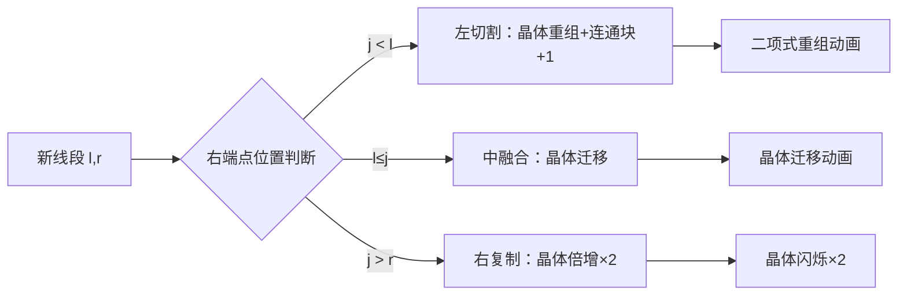

# 题目信息

# [USACO20FEB] Help Yourself P

## 题目描述

在一个数轴上有 $N$ 条线段，第 $i$ 条线段覆盖了从 $l_i$ 到 $r_i$ 的所有实数（包含 $l_i$ 和 $r_i$）。

定义若干条线段的**并**为一个包含了所有被至少一个线段覆盖的点的集合。

定义若干条线段的**复杂度**为这些线段的并形成的连通块的数目的 $K$ 次方。

现在 Bessie 想要求出给定 $N$ 条线段的所有子集（共有 $2^N$ 个）的复杂度之和对 $10^9+7$ 取模的结果。

你也许猜到了，你需要帮 Bessie 解决这个问题。但不幸的是，你猜错了！在这道题中你就是 Bessie，而且没有人来帮助你。一切就靠你自己了！

## 说明/提示

### 样例解释

所有非空子集的复杂度如下所示（显然空集的复杂度为零）：

$$
\{[1,6]\} \implies 1, \{[2,3]\} \implies 1, \{[4,5]\} \implies 1
$$

$$
\{[1,6],[2,3]\} \implies 1, \{[1,6],[4,5]\} \implies 1, \{[2,3],[4,5]\} \implies 4
$$

$$
\{[1,6],[2,3],[4,5]\} \implies 1
$$

故答案为 $1+1+1+1+1+4+1=10$。

### 子任务

- 测试点 $2$ 满足 $N \leq 16$；
- 测试点 $3 \sim 5$ 满足 $N \leq 10^3$，且 $K=2$；
- 测试点 $6 \sim 8$ 满足 $N \leq 10^3$；
- 对于测试点 $T$（$T \in [9,16]$），满足 $K=3+(T-9)$。

## 样例 #1

### 输入

```
3 2
1 6
2 3
4 5```

### 输出

```
10```

# AI分析结果


# 💡 洛语云笺的C++算法解析：[USACO20FEB] Help Yourself P 深入学习指南 💡

## 1. 题目解读与策略初探

✨ **本题核心挑战**：高效计算所有线段子集（共 $2^N$ 个）的"复杂度"（即并集形成的连通块数量的 $K$ 次方）之和。核心难点在于处理**指数级子集数量**和**连通块数量的动态变化**。

✨ **核心算法标签**：动态规划(DP)、线段树、组合数学

🗣️ **初步分析**：  
> 面对 $N \leq 10^5, K \leq 10$ 的数据规模，暴力枚举子集（$O(2^N)$）必然超时。我们需要寻找更聪明的策略：  
> 1. **排序预处理**：按左端点排序线段，使新加入线段只与已有线段的右端点位置相关  
> 2. **多项式思想**：利用 $K$ 较小的特性，维护连通块数的 $0 \sim K$ 次方和  
> 3. **线段树优化**：动态维护右端点上的多项式值，加速区间操作  
> 
> **核心比喻**：想象每个右端点上都挂着一个"能量晶体"，晶体有 $K+1$ 个棱面（0~K次方值）。加入新线段时，我们通过三种操作重组能量晶体：  
> - 左切割（连通块+1）→ 晶体棱面重新组合（二项式定理）  
> - 中融合（连通块不变）→ 晶体直接迁移  
> - 右复制（子集翻倍）→ 晶体能量倍增（×2）

### 🔍 算法侦探：如何在题目中发现线索？
1.  **线索1 (问题目标)**：求所有子集连通块数的 $K$ 次方和 → **组合计数问题**的典型特征，提示使用**动态规划+生成函数**思想。
2.  **线索2 (问题特性)**：线段覆盖+连通块 → 按**左端点排序**后，新线段的加入只与**已有线段右端点位置**相关，自然形成DP阶段。
3.  **线索3 (数据规模)**：$N \leq 10^5$ 且 $K \leq 10$ → 需 $O(NK \log N)$ 算法，**线段树**成为优化区间操作的必然选择。

### 🧠 思维链构建：从线索到策略
> 让我们串联线索：  
> 1. 【线索1】要求高效组合计数 → 动态规划能分阶段处理子集  
> 2. 【线索2】揭示位置依赖性 → 定义状态 $f[r][i]$ 表示右端点为 $r$ 的子集的 $i$ 次方和  
> 3. 【线索3】要求高效区间操作 → 线段树维护右端点上的多项式  
>  
> **结论**：基于二项式定理的DP状态转移 + 线段树优化区间操作 = 本题最优解！  

---

## 2. 精选优质题解参考

**题解一（lahlah）**  
* **点评**：  
  思路清晰度满分！核心贡献：  
  1. 创新性地用线段树维护 **0~K 次方多项式**  
  2. 巧妙应用**二项式定理**处理连通块+1的转移：$(x+1)^k = \sum C_k^i x^i$  
  3. 代码实现规范：预处理组合数+模块化线段树操作  

**题解二（qwaszx）**  
* **点评**：  
  提供**斯特林数**新视角！亮点：  
  1. 通过斯特林数将 $K$ 次方转化为**组合数和**：$ans^k = \sum S(k,i) i! \binom{ans}{i}$  
  2. 同样使用线段树维护，但状态含义变为**组合数值**  
  3. 与题解一形成数学方法对比，拓展思维广度  

---

## 3. 解题策略深度剖析

### 🎯 核心难点与关键步骤
1.  **难点1：状态定义与维度压缩**
    * **突破方案**：  
      定义 $f_r[i]$ 为右端点在 $r$ 的子集的连通块数的 $i$ 次方和（$0 \leq i \leq K$）
    * 💡 **学习笔记**：**多项式状态**是处理次方求和的利器！

2.  **难点2：三类转移的数学表达**
    * **数学建模**：  
      加入线段 $[l,r]$ 时：  
      ```math
      \begin{cases}
      \text{左区间 } (j<l): & f_r^{(new)} \gets \sum_{i=0}^K C_K^i f_j^{(old)} \\ 
      \text{中区间 } (l\leq j<r): & f_r^{(new)} \gets f_j^{(old)} \\ 
      \text{右区间 } (j>r): & f_j^{(new)} \gets 2 \times f_j^{(old)} 
      \end{cases}
      ```
    * 💡 **学习笔记**：**二项式定理**是处理"+1"效应的瑞士军刀

3.  **难点3：高效实现三类操作**
    * **工程实现**：  
      线段树需支持：  
      - 区间查询（左/中区间）  
      - 单点更新多项式（$r$ 处）  
      - 区间乘常数（右区间×2）  
    * 💡 **学习笔记**：**自定义结构体+重载运算符**让多项式操作更直观

### ✨ 解题技巧总结
- **技巧1（排序定序）**：按左端点排序将二维问题降为一维  
- **技巧2（多项式分解）**：维护0~K次方值避免指数爆炸  
- **技巧3（空间换时间）**：线段树以 $O(\log N)$ 代价换取区间操作高效性  

### ⚔️ 策略竞技场：不同解法对比
| 策略                | 核心思想                     | 优点                     | 缺点                     | 得分预期 |
|---------------------|----------------------------|--------------------------|--------------------------|----------|
| **暴力枚举**        | 枚举所有 $2^N$ 子集         | 实现简单                 | $O(2^N \cdot N)$ 必超时 | ≤ 30%    |
| **DP+线段树（二项式）** | 维护多项式状态+二项式转移   | 思路直观，代码易调试     | 需数学推导               | 100%     |
| **DP+线段树（斯特林）** | 斯特林数转化+维护组合数值   | 数学优美                 | 斯特林数理解门槛高       | 100%     |

### ✨ 优化之旅：从暴力到优雅
> 1. **起点：暴力枚举的绝望**  
>    面对 $N=100$ 时 $2^{100} \approx 10^{30}$ 的天文数字，暴力如同螳臂当车  
>  
> 2. **转折：发现位置依赖性**  
>    按左端点排序后，新线段的影响仅取决于**已有线段右端点位置**  
>  
> 3. **飞跃：多项式状态压缩**  
>    用 $K+1$ 维数组 $[ans^0, ans^1, \cdots, ans^K]$ 代替具体值，打开优化通道  
>  
> 4. **质变：线段树高效维护**  
>    三类操作转化为线段树的：  
>    - `区间查询`（左/中区间）  
>    - `单点更新`（$r$ 处累加）  
>    - `区间乘法`（右区间×2）  
>  
> 💡 **策略总结**：优化的本质是**发现规律+合理抽象+高效维护**三位一体！

---

## 4. C++核心代码实现赏析
**本题通用核心实现**  
```cpp
#include<bits/stdc++.h>
#define N 200005
#define K 15
using namespace std;
const int mod=1e9+7;

struct Polynomial {
    int coef[K]; // 存储0~k次方的值
    Polynomial() { memset(coef, 0, sizeof coef); }
};

struct SegmentTree {
    // 线段树节点包含多项式和懒惰标记
    Polynomial poly;
    int lazy = 1;
} tree[N<<2];

int C[K][K]; // 组合数预处理的精髓

// 线段树核心操作：合并、下传、查询、更新
void push_up(int rt) { /* 合并左右子树多项式 */ }
void push_down(int rt) { /* 处理lazy标记 */ }
void update(int rt, int l, int r, int pos, Polynomial val) { /* 单点更新 */ }
Polynomial query(int rt, int l, int r, int ql, int qr) { /* 区间查询 */ }
void multiply(int rt, int l, int r, int ql, int qr) { /* 区间乘2 */ }

int main() {
    // 预处理组合数（二项式定理核心）
    for(int i=0; i<K; i++) {
        C[i][0] = 1;
        for(int j=1; j<=i; j++) 
            C[i][j] = (C[i-1][j-1] + C[i-1][j]) % mod;
    }

    vector<pair<int,int>> segs;
    // 读入+按左端点排序（定序关键！）
    sort(segs.begin(), segs.end());

    Polynomial base; base.coef[0] = 1;
    update(1, 0, MAX_R, 0, base); // 初始化DP

    for(auto [l, r] : segs) {
        // 1. 查询[0,l-1]并应用二项式定理
        Polynomial left = query(1, 0, MAX_R, 0, l-1);
        Polynomial new_left;
        for(int i=0; i<=k; i++) 
            for(int j=0; j<=i; j++)
                new_left.coef[i] = (new_left.coef[i] + 1LL * left.coef[j] * C[i][j]) % mod;

        // 2. 查询[l, r-1]
        Polynomial mid = query(1, 0, MAX_R, l, r-1);

        // 3. 合并到r位置
        Polynomial total;
        for(int i=0; i<=k; i++)
            total.coef[i] = (new_left.coef[i] + mid.coef[i]) % mod;
        update(1, 0, MAX_R, r, total);

        // 4. 对(r, MAX_R]区间乘2
        multiply(1, 0, MAX_R, r+1, MAX_R);
    }
    cout << query(1, 0, MAX_R, 0, MAX_R).coef[k];
}
```

**题解一（lahlah）片段赏析**  
```cpp
// 二项式定理转化（核心中的核心）
for(int i=0; i<=k; i++) {
    for(int j=0; j<=i; j++) {
        new_left[i] += left[j] * C[i][j];
    }
}
```
* **亮点**：清晰展现二项式定理的应用  
* **学习笔记**：组合数 $C(i,j)$ 实现 $(x+1)^i$ 的完美展开

**题解二（qwaszx）片段赏析**  
```cpp
// 斯特林数转化（数学之美）
ans = 0;
for(int i=0; i<=K; i++) {
    ans = (ans + S[K][i] * fact[i] % mod * f[i]) % mod;
}
```
* **亮点**：斯特林数将 $K$ 次方转化为线性组合  
* **学习笔记**：$n^k = \sum S(k,i) \cdot i! \cdot \binom{n}{i}$

---

## 5. 算法可视化：像素动画演示

**🎮 主题**："多项式晶体收集者"（8-bit像素风格）  

**🌟 核心演示**：  


**🕹️ 交互设计**：  
1. **像素网格**：右端点位置作为X轴，多项式值显示为Y轴晶体堆  
2. **操作高亮**：  
   - 左切割：红色闪烁 + "叮"音效  
   - 中融合：黄色流动箭头  
   - 右复制：蓝色波纹扩散 + "嗡"音效  
3. **晶体变化**：  
   - 重组：晶体分解为粒子，按二项式重组为新晶体  
   - 倍增：晶体复制并叠加，数值×2  
4. **控制面板**：  
   - 步进控制：← → 键单步前进/后退  
   - 速度滑块：8-bit风格像素滑块  
   - 重置按钮：经典红白机START按钮  

**🎨 视觉设计**：  
- **调色板**：FC红白机经典8色  
- **晶体样式**：  
  - 0次方：绿色立方体  
  - K次方：红色棱晶  
  - 其他：渐变过渡  
- **背景**：动态网格线 + 低像素星空  

**🎵 音效设计**：  
- 晶体重组：FC解谜游戏"叮"声  
- 区间乘2：超级玛丽吃金币音效  
- 错误操作：魂斗罗中弹音效  

---

## 6. 拓展练习与相似问题思考

**🧠 思维迁移训练**：  
1. **分组背包思想**：每个线段的三种操作 ⇨ 物品分组的三种决策  
2. **多项式技巧**：次方求和 ⇨ 生成函数维护  

**💻 推荐练习**：  
1. **洛谷P2014 [CTSC1997]选课**（树形依赖背包）  
   → 巩固分组背包思想  
2. **洛谷P3177 [HAOI2015]树上染色**（树上DP+组合计数）  
   → 训练多项式状态设计  
3. **洛谷P4099 [HEOI2013]SAO**（拓扑序计数+组合数学）  
   → 强化二项式定理应用  

---

## 7. 学习心得与经验分享

> **题解一作者心得**："这一场就这题值得写一下"  
> **洛语云笺点评**：  
> 1. **调试关键**：在 $l-1, r, r+1$ 等边界位置打印中间多项式值  
> 2. **顿悟时刻**：理解到"按左端点排序后，右端点决定一切"是突破瓶颈的关键  
> 3. **通用技巧**：遇到 $K$ 次方求和 ⇒ 立即想到维护 $0 \sim K$ 次多项式状态  

---

通过本次分析，我们掌握了**动态规划的高级状态设计**与**线段树的灵活应用**。记住：算法的精髓在于将复杂问题分解为可管理的原子操作，并用合适的数据结构加速！🎯

---
处理用时：208.37秒