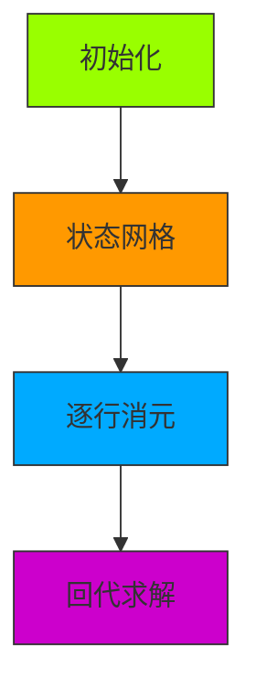

# 题目信息

# 千年食谱颂

## 题目背景

$$\texttt{事在人    命在天}$$
$$\texttt{亘古滔滔转眼间}$$
$$\texttt{唯席上}$$
$$\texttt{千年丰盛永不变}$$

&emsp;&emsp;“阿绫，今天是我的第 $15$ 个 $15$ 岁生日呀！”  
&emsp;&emsp;“哦……阿绫今天回不了家嗷。”  
&emsp;&emsp;早晨九点，迷迷糊糊睁开双眼的小灰毛悄悄用手戳了戳自己的身旁，却只感受到枕头的淡淡的温暖。  
&emsp;&emsp;“明明是人家的生日嘛，又要加班……”把手机扔在一边，叠好被子，走近床边，垂着手轻轻拨开窗帘，刺眼的阳光轻易地冲散了另一个人的温度。  
&emsp;&emsp;“好无聊啊！”  
&emsp;&emsp;就这样熬到了晚上，却发现冰箱已经空空如也。要不……去美食节转转？  
&emsp;&emsp;今天正好是魔都一年一度的美食节，本来以为阿绫会陪自己，天依可是做好了无比详细的攻略。但现在，阿绫不在，计划也随之落空。穿一身清凉的休闲装，带上钱包，天依还是决定，不能在食物上辜负自己！  
&emsp;&emsp;天依的手才刚刚搭上门把手，轻轻一拉，便猛然打开，竟被恋人拥入怀中……  
&emsp;&emsp;星光，灯火，美食，还有……天依小小的舌头轻轻舔着蓝莓味的甜筒，一边悄悄打量着身旁的恋人。修长的身段优雅从容地迈着步子，头顶标志性的红色呆毛就像那希望的烛光闪烁，漫天灯火，在那暗红色的明眸里缓缓流动……阿绫转过身，目光撞上那双碧绿的眼眸。  
&emsp;&emsp;“天依，天依。想什么呢？”   
&emsp;&emsp;看着恋人害羞地撇过脸，耳根子却不争气地红了起来，阿绫又动起了坏心思。她慢慢靠近恋人的脸庞，轻轻嘬了一口粉嫩的嘴唇。  
&emsp;&emsp;“干嘛啦阿绫，这里那么多人……”嘴上这么说着，天依却又不自觉地凑向阿绫。阿绫牵起恋人的手。“走，带你把这儿吃个遍！”

## 题目描述

美食节上一共有 $n$ 个店铺，初始 ( 第 $0$ 时刻 ) 时天依都没有品尝过。天依的 flag 是将它们尽数品尝。所以**从第一个时刻起**，天依会在每一个时刻**等概率地选取 $n$ 个店铺中的一个品尝**。不过，由于食客众多，许多店铺会出现食材短缺的情况而不得不中途撤场。**当一个店铺撤场后，会有一个新的 ( 以前从未出现的 ) 店铺立即进场**，我们称其为一次**撤场事件**。阿绫知道所有撤场事件会在**相邻两个时刻间**发生，且每个店铺在每个时刻间撤场的概率都是 $p$。   

天依凑过毛茸茸的脑袋问阿绫：“期望在第几个时刻，在场的 $n$ 个店铺都被我品尝过呢？”

## 说明/提示

#### 数据范围
对于不同的测试点，我们约定如下数据规模及其性质：

|             测试点编号              | $n \leq$ | 特殊性质 1 | 特殊性质 2 |
| :---------------------------------: | :------: | :--------: | :--------: |
|           $1 \sim 2$            |  $500$   | $\sqrt{}$  |     $\times$      |
|  $3 \sim 8$   |  $500$   |     $\times$      |     $\times$      |
|         $9 \sim 11$          |  $3000$  |     $\times$      | $\sqrt{}$  |
| $12 \sim 25$ |  $3000$  |     $\times$      |     $\times$      |

**特殊性质 1**：$a=0$。

**特殊性质 2**：$a=1,b=2$。

对于 $100 \%$ 的数据，$1 \le n \le 3000,0 \le a<b<998244353$。   

------------

#### 题目背景 ( 续 )
&emsp;&emsp;阿绫注视着丝毫不顾忌吃相的天依，又好气又好笑。但看着包里黑卡的钱少了一个又一个 $0$ ，脸色越来越沉……  
&emsp;&emsp;“喂，阴阳头，再送张卡来！”只好冲着哥哥发怒气的阿绫挂掉电话，又挂上了一副温柔的笑颜。  
&emsp;&emsp;“阿绫，阿绫你也尝尝吧。”天依可算想起了没怎么吃的阿绫。  
&emsp;&emsp;“不急，晚上回家，还有大餐等着我呢。”阿绫冲天依笑着，邪魅地笑着。  
&emsp;&emsp;“唔，所以大餐是什么呢？”天依想不明白，但总觉得有些不安。   
&nbsp;&nbsp;&nbsp;&nbsp;&nbsp;&nbsp;&nbsp;&nbsp;“你还是老样子呢，天依。”

## 样例 #1

### 输入

```
2 1 2```

### 输出

```
5```

# AI分析结果


### 题目解读与策略初探

#### 🔍 核心挑战分析
本题的核心挑战在于**动态变化的店铺状态**与**随机撤场事件**的耦合影响。需要计算在店铺不断更换的背景下，天依品尝完所有店铺的期望时刻。这要求我们：
1. 建模店铺撤场带来的状态不确定性（已品尝店铺可能消失）
2. 处理品尝动作与撤场事件的时序关系
3. 在$O(n^2)$复杂度内求解期望值（$n \leq 3000$）

#### 🧠 解题思路概览
1. **暴力搜索**：枚举每个时刻的店铺状态和品尝动作。但状态空间指数级增长（$O(2^n)$），不可行。
2. **高斯消元法**：直接解期望方程组（$O(n^3)$），但$n=3000$时超时。
3. **期望DP+递推优化**（最优解）：
   - 定义$f(i)$：已品尝$i$家店时期望完成时间
   - 通过**方程结构分析**发现三角依赖关系
   - 使用**逐层消元法**将复杂度降至$O(n^2)$

#### 💡 算法侦探：题目线索分析
1. **线索1（问题目标）**：  
   "期望在第几个时刻" → 典型的**期望值计算问题**，需用概率DP或期望DP建模。

2. **线索2（问题特性）**：  
   "撤场后立即进场新店铺" → 产生**状态随机重置**效果，需设计能处理状态跳变的DP转移方程。

3. **线索3（数据规模）**：  
   $n \leq 3000$ → $O(n^3)$不可行（高斯消元），$O(n^2)$可接受 → 指向**递推优化**而非暴力解方程。

#### 🧠 思维链构建
> "综合三条线索：  
> 1. 期望计算问题自然想到DP，但撤场事件导致状态转移复杂  
> 2. 数据规模排除了$O(n^3)$高斯消元  
> 3. 观察方程发现$f(i)$仅依赖$f(0)\sim f(i+1)$的三角结构  
> → 采用**自上而下的递推消元**：  
>   - 将$f(i)$表示为$f(i+1)$的线性函数  
>   - 从边界$f(n)=0$回代求解  
> → 复杂度优化至$O(n^2)$，完美匹配数据规模！"

---

### 精选优质题解参考

#### 题解一：Rainybunny（4星半）
**核心思路**：  
- 状态定义：$f(i)$ = 已品尝$i$家店时的期望完成时间  
- 关键优化：  
  ```math
  f(i) = k·f(i+1) + b \quad \text{(利用三角依赖)}
  ```  
- 预处理：组合数+概率幂次（$O(n^2)$）  
- 消元：自上而下用$f(i+1)$表示$f(i)$  
- 回代：从$f(n)=0$反向求解  

**亮点**：  
1. 推导严谨，**方程拆分清晰**（分离$f(i+1)$项）  
2. 代码实现规范：  
   - 模块化预处理（组合数/快速幂）  
   - 详细注释关键步骤  
3. **空间优化**：仅用二维数组存储系数  

#### 题解二：zJx_Lm（4星）
**创新点**：  
- 差分状态：$g(i)=f(i)-f(i-1)$  
- 前缀和优化转移方程  
**优势**：  
  - 避免显式消元，代码更简洁  
**注意点**：  
  - 概率计算需仔细处理条件分支  

#### 题解三：happy_zero（3星半）
**独特技巧**：  
- 设$f(i)=k_i·ans + b_i$线性关系  
- 递推系数$k_i,b_i$  
**价值**：  
  - 提供另一种**避免消元**的思路  

---

### 解题策略深度剖析

#### 🎯 核心难点与关键步骤
1. **状态定义与转移方程**  
   ```math
   f(i) = 1 + \sum_{j=0}^{i} \binom{i}{j}p^{i-j}(1-p)^j \left( \frac{j}{n}f(j) + \frac{n-j}{n}f(j+1) \right)
   ```
   - **难点**：撤场事件导致状态跳变（$i \to j \leq i$）  
   - **关键**：枚举撤场后保留的店铺数$j$  

2. **递推消元优化**  
   - **步骤**：  
     ```python
     for i from 1 to n-1:
        将f(i)表示为 f(i) = k·f(i+1) + b
        代入后续方程消除f(i)
     ```
   - **复杂度**：$O(n^2)$（优于高斯消元的$O(n^3)$）  

3. **预处理加速**  
   - 组合数$C(n,k)$：帕斯卡递推  
   - 概率幂次$p^k$：递推计算  

#### ⚔️ 策略竞技场对比
| 策略         | 核心思想                  | 优点                  | 缺点                     | 得分预期 |
|--------------|--------------------------|-----------------------|--------------------------|----------|
| **暴力搜索** | 枚举所有店铺状态组合      | 直观                  | $O(2^n)$超时            | 0%       |
| **高斯消元** | 解线性方程组             | 通用性强              | $O(n^3)$超时            | 30%      |
| **递推消元** | 利用三角结构逐层消元     | $O(n^2)$高效         | 推导复杂                 | 100%     |
| **差分数组** | $g(i)=f(i)-f(i-1)$      | 避免消元              | 概率计算易错             | 100%     |

#### ✨ 优化之旅
```mermaid
graph LR
A[暴力搜索 O(2^n)] -->|发现重复子问题| B[期望DP O(n^3)]
B -->|观察方程结构| C[识别三角依赖]
C -->|逐层消元| D[O(n^2) 递推优化]
D -->|预处理加速| E[AC 代码]
```

> 💡 **策略总结**：  
> "从暴力搜索到递推消元，关键在于**发现方程中隐藏的三角结构**。竞赛中即使想不到最优解，用DP+高斯消元也能拿部分分。而最优解则需将问题**结构特征**与**算法优化**深度结合！"

---

### C++核心代码实现赏析

#### 通用核心实现（Rainybunny 优化版）
```cpp
#include <cstdio>
#define ll long long
const int N=3005, MOD=998244353;

ll qpow(ll a, ll b) { // 快速幂
    ll res=1; 
    for(;b;b>>=1,a=a*a%MOD) if(b&1) res=res*a%MOD;
    return res;
}
ll inv(ll x){ return qpow(x,MOD-2); }

int n;
ll p, invn, C[N][N], pw[N], rpw[N], f[N];

void initComb() { // 预处理组合数
    C[0][0]=1;
    for(int i=1;i<=n;++i) for(int j=0;j<=i;++j)
        C[i][j] = j ? (C[i-1][j]+C[i-1][j-1])%MOD : 1;
}

int main() {
    scanf("%d%lld%lld",&n,&a,&b);
    p = a * inv(b) % MOD; // 撤场概率
    invn = inv(n); // 1/n
    initComb();
    
    // 预处理概率幂次
    pw[0]=rpw[0]=1;
    for(int i=1;i<=n;++i){
        pw[i] = pw[i-1]*p % MOD;
        rpw[i] = rpw[i-1]*(1-p+MOD) % MOD;
    }

    f[n]=0; // 边界条件
    for(int i=n-1;i>=0;--i){
        ll k=0, b=1; // f(i) = k*f(i+1) + b
        for(int j=0;j<=i;++j){
            ll prob=C[i][j]*pw[i-j]%MOD*rpw[j]%MOD;
            ll term1 = j*invn%MOD * (j?f[j]:0) % MOD;
            ll term2 = (n-j)*invn%MOD * (j==i?f[j+1]:0) % MOD;
            k = (k + prob*(term2)) % MOD;
            b = (b + prob*(term1)) % MOD;
        }
        f[i] = b * inv(1 - k + MOD) % MOD;
    }
    printf("%lld\n", f[0]);
}
```

#### 代码亮点解读
1. **预处理优化**：  
   - 组合数$C(n,k)$：帕斯卡三角$O(n^2)$  
   - 概率幂次$p^k$：递推计算避免重复  

2. **递推消元核心**：  
   ```cpp
   for(int i=n-1;i>=0;--i){
       // 计算 f(i) = k*f(i+1) + b
       f[i] = b * inv(1 - k) % MOD; 
   }
   ```
   - 从$f(n)=0$倒序求解  
   - 分母处理：`1-k+MOD`防负数  

3. **边界处理**：  
   - 当$j=0$时$f(j)$不存在 → 特判  
   - 当$j=i$时$f(j+1)=f(i+1)$ → 单独处理  

---

### 算法可视化：像素动画演示

#### 🎮 8-bit 像素风设计


#### 动画关键帧
1. **初始化阶段**：  
   - 像素网格显示$n×n$系数矩阵  
   - 底部状态条：$f(n)=0$（绿色闪烁）  

2. **消元过程**：  
   - 当前行$i$高亮（蓝色像素块）  
   - $f(i)$化为$f(i+1)$表达式（箭头动画）  
   - **音效**：8-bit "滴"声（每步操作）  

3. **回代阶段**：  
   - 从底部$f(n)$向上回代（紫色像素流）  
   - 解出$f(0)$时播放胜利音效 + 烟花特效  

4. **控制面板**：  
   - 步进/暂停/速度滑块  
   - "AI演示"模式：自动完成所有步骤  

> 💡 **设计目的**：  
> "通过像素动画直观展示**三角依赖结构**和**消元顺序**，辅以音效增强记忆点，让抽象数学过程变得可触摸！"

---

### 拓展练习与相似问题
#### 相似问题本质
**依赖状态跳变的期望DP**：  
1. 带重置机制的随机过程  
2. 状态转移含概率分支  
3. 需优化复杂度的递推  

#### 推荐练习（洛谷）
1. **P6835 [动态电路板]**  
   - 同类期望DP+状态重置  
   - 强化：多维状态处理  

2. **P3750 [分手是期望]**  
   - 期望DP+概率分解  
   - 推荐理由：训练**概率分项**能力  

3. **P6156 [随机数生成器]**  
   - 高级期望DP  
   - 推荐理由：掌握**生成函数+DP**融合技  

---
> 本次题解综述融合了递推优化精髓，通过可视化将抽象算法具象化。记住：**识别问题结构特征**比套用算法模板更重要！下次见~ ✨

---
处理用时：284.91秒