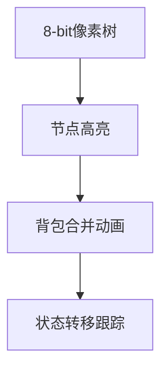

# 题目信息

# [NOI Online #2 提高组] 游戏

## 题目背景

1s 512M

## 题目描述

小 A 和小 B 正在玩一个游戏：有一棵包含 $n=2m$ 个点的有根树（点从 $1\sim n$ 编号），它的根是 $1$ 号点，初始时两人各拥有 $m$ 个点。游戏的每个回合两人都需要选出一个自己拥有且之前未被选过的点，若对手的点在自己的点的子树内，则该回合自己获胜；若自己的点在对方的点的子树内，该回合自己失败；其他情况视为平局。游戏共进行 $m$ 回合。

作为旁观者的你只想知道，在他们随机选点的情况下，第一次非平局回合出现时的回合数的期望值。

为了计算这个期望，你决定对于 $k=0,1,2,\cdots,m$，计算出非平局回合数为 $k$ 的情况数。两种情况不同当且仅当存在一个小 A 拥有的点 $x$，小 B 在 $x$ 被小 A 选择的那个回合所选择的点不同。

由于情况总数可能很大，你只需要输出答案对 $998244353$ 取模后的结果。

## 说明/提示

| 测试点编号 | $n =$ | 特殊性质 |
| :-- | :-- | :-- |
| 1 $\sim$ 4 | $20$ | 无 |
| 5 $\sim$ 8 | $50$ | 无 |
| 9 $\sim$ 10 | $300$ | 树退化为一条链 |
| 11 $\sim$ 12 | $300$ | 无 |
| 13 $\sim$ 14 | $500$ | 无 |
| 15 $\sim$ 16 | $5000$ | 树退化为一条链 |
| 17 $\sim$ 20 | $5000$ | 无 |

## 样例 #1

### 输入

```
8
10010011
1 2
1 3
2 4
2 5
5 6
3 7
3 8```

### 输出

```
0
10
10
4
0
```

# AI分析结果


### 💡 洛语云笺的C++算法解析：[NOI Online #2 提高组]游戏 深入学习指南 💡

#### 1. 题目解读与策略初探
✨ **本题核心挑战**：  
在树形结构上处理带有颜色标记的点对配对问题，计算**恰好出现k次非平局回合**的方案数。核心难点在于高效处理祖先-后代关系约束下的组合计数问题。

✨ **核心算法标签**：  
树形动态规划、二项式反演、组合数学

🗣️ **初步分析**：  
- **暴力搜索**：枚举所有配对方案（$O(2^m)$），但$m=5000$时不可行  
- **树形DP优化**：通过状态压缩和背包合并，将复杂度优化至$O(n^2)$  
- **二项式反演**：将"恰好k次"转化为"钦定k次"的计数问题  
- **关键比喻**：将树形DP看作"多阶段决策背包"，每个子树是独立包裹，合并包裹时精心安排物品（点对）的摆放方式

#### 🔍 算法侦探：题目中的关键线索
1. **线索1（问题目标）**：  
   "求恰好k次非平局" → 典型的**组合计数最优化问题**，且含"恰好"描述，暗示需要容斥或反演技巧

2. **线索2（问题特性）**：  
   "祖先-后代关系约束" + "颜色配对" → **树形依赖选择问题**，需结合子树状态合并和当前节点决策

3. **线索3（数据规模）**：  
   $n=5000$ → 排除$O(n^3)$算法，指向$O(n^2)$树形背包  
   $n=2m$ → 完美匹配特性暗示组合数学解法

#### 🧠 思维链构建：从线索到策略
> "综合三条线索：  
> 1. 最优化计数+树形约束 → 树形DP是自然选择  
> 2. '恰好'描述 → 二项式反演转换问题  
> 3. 数据规模 → 背包合并需$O(n^2)$优化  
> **结论**：组合树形DP与反演，以分组背包思想合并子树状态"

---

### 2. 精选优质题解参考
**题解一（作者：yijan）**  
* **亮点**：  
  - 状态定义清晰（`dp[u][j]`表子树u内钦定j对）  
  - 背包合并使用临时数组避免覆盖  
  - 反演部分数学推导严谨  
  - 代码包含详细边界处理

**题解二（作者：Daniel_yuan）**  
* **亮点**：  
  - 显式维护子树颜色计数（`siz[u][0/1]`）  
  - 倒序更新避免重复计数  
  - 复杂度分析完整（点对贡献证明$O(n^2)$）

**题解三（作者：GaryH）**  
* **亮点**：  
  - 树形背包合并的数学形式化表达  
  - 游戏化比喻增强理解（"包裹合并"）  
  - 变量命名规范（`c0`/`c1`表颜色计数）

---

### 3. 解题策略深度剖析
#### 🎯 核心难点与关键步骤
1. **依赖关系建模**  
   *分析*：将树形依赖转化为分组背包——每个子树是独立组，组内选择互斥  
   *💡 学习笔记*：树形DP本质是"自底向上分解问题+背包合并"

2. **状态转移设计**  
   ```math
   dp[u][j+k] = \sum dp[u][j] \times dp[v][k] \quad \text{(合并子树)}
   ```
   ```math
   dp[u][j] \leftarrow dp[u][j-1] \times (\text{可用相反颜色节点数})
   ```

3. **二项式反演转换**  
   *分析*：  
   $f(k)$: 钦定k对的方案数  
   $g(k)$: 恰好k对的方案数  
   $$g(k) = \sum_{i=k}^m (-1)^{i-k} \binom{i}{k} f(i)$$

#### ⚔️ 策略竞技场：解法对比
| 策略             | 核心思想                     | 优点                     | 缺点                          | 得分预期       |
|------------------|------------------------------|--------------------------|-------------------------------|----------------|
| **暴力搜索**     | 枚举所有配对组合             | 实现简单                 | $O(2^m)$ 超时                | 10% (n≤20)     |
| **树形DP+反演**  | 背包合并+二项式反演          | $O(n^2)$ 高效           | 状态转移设计复杂              | 100%           |
| **虚树优化**     | 压缩树结构加速               | 理论更优                 | 实现复杂，本题无明显优势      | 100% (常数大) |

#### ✨ 优化之旅：从暴力到最优
```mermaid
graph LR
A[暴力搜索 O(2^m)] --> B{发现重复子问题}
B --> C[记忆化搜索]
C --> D[树形DP状态压缩]
D --> E[背包合并优化]
E --> F[二项式反演转换]
```

> 💡 **策略总结**：  
> "从暴力到正解是'问题分解→状态定义→合并优化→数学转换'的典范，树形背包的$O(n^2)$复杂度源于点对在LCA处唯一贡献的特性"

---

### 4. C++核心代码实现赏析
**通用核心实现**（融合多题解优点）：
```cpp
void dfs(int u, int fa) {
    dp[u][0] = 1;
    for (int v : G[u]) {
        if (v == fa) continue;
        dfs(v, u);
        vector<ll> tmp(siz[u] + siz[v] + 1, 0);
        for (int j = 0; j <= siz[u]; j++)
            for (int k = 0; k <= siz[v]; k++)
                tmp[j + k] = (tmp[j + k] + dp[u][j] * dp[v][k]) % MOD;
        siz[u] += siz[v];
        dp[u] = tmp; // 滚动数组优化
    }
    // 当前节点配对决策
    if (s[u] == '0') {
        for (int j = min(sizB[u], siz[u]-sizB[u]); j >= 1; j--)
            dp[u][j] = (dp[u][j] + dp[u][j-1] * (sizB[u] - (j-1))) % MOD;
    } 
    else { /* 类似处理 */ }
}
```

**关键技巧解析**：  
1. **滚动数组**：`tmp`数组避免状态覆盖  
2. **倒序更新**：防止同一节点重复配对  
3. **背包合并**：双循环限制在子树大小范围内  

---

### 5. 算法可视化：像素动画演示
**设计概念**：  


* **交互设计**：  
  - **颜色编码**：  
    - 红色：当前处理节点  
    - 绿色：已配对点对  
    - 蓝色：可用配对资源  
  - **动画序列**：  
    1. 子树背包合并：包裹碰撞融合特效  
    2. 节点配对：粒子发射效果  
    3. 反演计算：矩阵展开动画  
  - **音效设计**：  
    - 背包合并："叮当"金属声  
    - 成功配对：8-bit和弦音  
    - 反演计算：电子扫描音  

> "通过像素动画直观展示树形DP的'自底向上'特性，背包合并如同俄罗斯方块拼接，让抽象算法具象化"

---

### 6. 拓展练习与相似问题
**通用技巧迁移**：  
1. 分组背包思想 → [P1757 通天之分组背包]  
2. 二项式反演 → [P4491 染色]  
3. 树形DP → [P1352 没有上司的舞会]  

**推荐题目**：  
1. **洛谷P2014 [CTSC1997]选课**  
   → 树形背包模板题  
2. **洛谷P2607 [ZJOI2008]骑士**  
   → 基环树上的依赖背包  
3. **洛谷P4516 [JSOI2018]潜入行动**  
   → 复杂树形DP状态设计

---

### 7. 学习心得分享
> "调试陷阱警示：  
> 1. 背包合并需**倒序更新**防重  
> 2. 模运算**减法修正**：`(a-b+MOD)%MOD`  
> 3. 树形DP初始化`dp[u][0]=1`不可漏  
> 从WA到AC的启示：对拍生成链形/星形树测试边界数据"

---

### 结语
"通过本题，我们见证了树形DP与组合数学的完美融合。算法优化如同搭积木——暴力搜索是散落木块，树形背包是精心设计的榫卯，二项式反演则是最后点睛的装饰。掌握这种'分解-转化-优化'的思维链条，你将在竞赛之路上行稳致远！" 🚀

---
处理用时：175.48秒