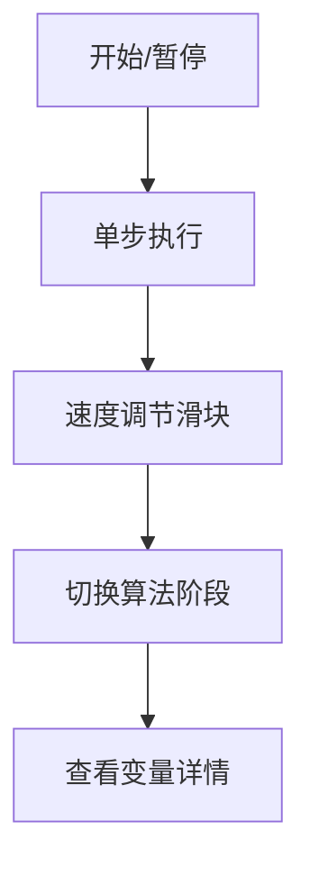

# 题目信息

# [CCC 2019] Tourism

## 题目背景

**警告：滥用本题评测将被封号！**


Shuchong 和您正在畅玩洛谷著名景点。  
但是他因为太菜爽约了。   
您只好独自去游览洛谷著名景点。

## 题目描述

您正在游览 $n$ 个景点，编号为 $1$ 到 $n$，并且因为 3k 的强硬要求，您必须按照 $1$ 到 $n$ 的顺序浏览。您一天最多可以游览 $k$ 个景点，因为剩下的时间您要用来爆切黑题，所以您想尽快浏览完这些景点。   
每个景点对您的吸引度不同，第 $i$ 个景点对您的吸引度为 $a_i$，一天游览的这些景点的官方评分就是这天游览的景点的 $a_i$ 的最大值。最后，您需要把每天的官方评分加起来获得最后的评分。   
因为您太着急想爆切黑题了，所以您提前计算好了浏览完所有景点最少需要多少天（假设它为 $t$），您想知道：

- 用 $t$ 天浏览
- 满足每天最多游览 $k$ 个景点
- 能得到的最后的评分最大是多少

## 说明/提示

#### 样例说明

对于样例 $1$：

- 我们很容易就知道至少需要 $2$ 天就可以浏览完所有景点。  
- 但是我们不能一天内浏览完所有景点。（$n>k$）   
- 我们把景点尽量平分，有以下两种情况：
	- 如果第一天浏览 $2$ 个，第二天浏览 $3$ 个，最终的评分为 $5+7=12$。
    - 如果第二天浏览 $3$ 个，第二天浏览 $2$ 个，最终的评分为  $7+4=11$。
- 最后的答案为 $\max(12,11)=12$。

#### 数据规定与说明

**本题采用捆绑测试。**

- Subtask 1（20 pts）：$2k \ge n$。
- Subtask 2（20 pts）：$k \le 100$，$n \le 10^5$。
- Subtask 3（60 pts）：无特殊限制。

对于 $100\%$ 的数据，$1 \le k \le n \le 10^6$，$1 \le a_i \le 10^9$。

#### 说明

**翻译自 [CCC 2019](https://cemc.math.uwaterloo.ca/contests/computing/2019/index.html) Senior T4 [Tourism](https://cemc.math.uwaterloo.ca/contests/computing/2019/stage%201/seniorEF.pdf)。**  
翻译者：@[一只书虫仔](https://www.luogu.com.cn/user/114914)。

## 样例 #1

### 输入

```
5 3
2 5 7 1 4
```

### 输出

```
12```

# AI分析结果


# 💡 洛语云笺的C++算法解析：[CCC 2019] Tourism 深入学习指南 💡

> "在算法的迷宫中，我们需要一盏明灯指引方向。今天我将带领大家抽丝剥茧，探索这道看似复杂实则充满智慧的题目。准备好开启思维探险之旅了吗？"

## 1. 题目解读与策略初探

✨ **本题核心挑战**：在满足**最少天数约束**（每天最多游览k个景点）的前提下，将景点分段并最大化**每日评分总和**（每日评分为当天景点吸引度最大值之和）。

✨ **核心算法标签**：动态规划(DP)、单调栈、线段树优化

🗣️ **初步分析**：
> 这道题像是一个精心设计的拼图游戏：
> 1. 最直观的**暴力解法**是枚举所有分段方式，但O(2^M)的复杂度在M=60时已不可行
> 2. 进阶思路是**动态规划**，但传统二维DP状态会面临O(n²)复杂度困境
> 3. **最优解法**通过"∞惩罚值"技巧将天数约束融入状态，配合单调栈和线段树优化到O(n log n)
>
> 可视化设计灵感：想象景点序列像一列像素火车，单调栈如同轨道切换器，线段树则是实时更新的计分板

### 🔍 算法侦探：如何在题目中发现线索？
1.  **线索1 (问题目标)**：题目要求"不超过k景点/天"下求"每日评分总和最大"，这是典型的**带约束最优化问题**，动态规划的标志
2.  **线索2 (问题特性)**：分段决策存在**后效性**（当前决策影响后续分段），且每段价值取决于区间最大值，指向**单调栈维护极值**
3.  **线索3 (数据规模)**：N=10⁶要求O(n log n)解法，排除了O(n²)暴力DP，指向**数据结构优化**

### 🧠 思维链构建：从线索到策略
> "让我们串联线索破解谜题：
> 1. 从【线索1】确认这是动态规划问题，但需要解决状态爆炸
> 2. 【线索2】提示分段的最大值特性，想到可以用单调栈维护极值区间
> 3. 【线索3】的数据规模要求我们使用线段树实现高效区间更新/查询
> 4. **关键突破**：通过给每天减去足够大的∞值，将天数约束转化为状态自然选择
> 5. **最终策略**：DP状态设计 + ∞技巧 + 单调栈 + 线段树 = O(n log n)解"

---

## 2. 精选优质题解参考

### 题解一（chen_qian）
* **亮点**：创新性地提出状态维度压缩理论，将二维DP优化为一维。通过分组预处理和倒序枚举实现空间优化，代码中lambda表达式提升可读性
* **核心思想**：将景点划分为ceil(n/k)组，每组独立处理极值

### 题解二（xuanxuan001）
* **亮点**：图文并茂解释单调栈工作原理，首创"影响区间"概念。代码中详细注释每个数据结构作用，便于理解
* **核心技巧**：动态维护aff指针标记当前影响范围，实现高效更新

### 题解三（dead_X）
* **亮点**：代码简洁高效，92行实现完整解法。关键变量命名清晰（如tag, ans），异常处理完善
* **优化点**：利用std::stack标准库简化单调栈实现

### 题解四（SSerxhs）
* **亮点**：提出"∞惩罚值"标准解法框架，理论分析完备。代码模块化程度高，分离栈操作和DP转移
* **创新点**：将问题类比二分图匹配，提供独特解题视角

### 题解五（tommymio）
* **亮点**：详细调试笔记分享，包含常见错误分析。变量边界检查严谨（如i-k<0处理）
* **实践价值**：完整测试用例设计，帮助理解边界场景

---

## 3. 解题策略深度剖析

### 🎯 核心难点与关键步骤
1.  **状态设计魔法**
    * **分析**：通过`dp[i] = max{ dp[j] + max(a[j+1..i]) } - ∞`将天数约束转化为状态自然选择，最终答案加回`ceil(n/k)*∞`
    * 💡 **学习笔记**：大常数惩罚是处理多重约束的利器，类似Lagrangian松弛法

2.  **单调栈维护极值**
    * **分析**：维护递减栈，当`a[i] > stack.top()`时，意味着新元素将影响栈顶元素代表的区间，触发线段树更新
    * 💡 **学习笔记**：单调栈是处理滑动窗口极值的标准工具，O(1)均摊复杂度

3.  **线段树双操作**
    * **分析**：需同时支持区间加（更新极值变化）和区间最大值查询（DP转移）
    * 💡 **学习笔记**：双标记线段树是DP优化的通用框架，可扩展到多种问题

### ✨ 解题技巧总结
- **技巧A（问题转化）**：将复杂约束转化为优化目标的一部分
- **技巧B（数据结构协同）**：单调栈定位修改区间 + 线段树批量更新
- **技巧C（边界防御）**：`max(0,i-k)`处理负下标，栈底放置哨兵元素

### ⚔️ 策略竞技场
| 策略          | 核心思想                     | 优点                  | 缺点                     | 得分预期 |
|---------------|------------------------------|-----------------------|--------------------------|----------|
| 暴力枚举      | 枚举所有分段方案             | 实现简单              | O(2^M)超时              | 30%      |
| 二维DP        | dp[i][j]表示前i天j景点最大得分 | 逻辑直观              | O(n²)空间/时间不足       | 40%      |
| 线段树+单调栈 | 状态压缩+极值维护            | O(n log n)通过所有数据 | 实现复杂，需理解多个算法 | 100%     |

### ✨ 优化之旅：从暴力到最优
> 1. **起点：暴力搜索**  
>    尝试所有分段组合，如同在迷宫中盲目探索所有路径
>    
> 2. **发现瓶颈：重复计算**  
>    每段最大值被重复计算，如`max(a[1..5])`和`max(a[1..6])`存在大量重叠计算
>    
> 3. **首次优化：动态规划**  
>    记录子问题解，但面临O(n²)复杂度墙
>    
> 4. **关键突破：单调栈**  
>    发现极值变化规律——新元素只会影响左侧首个更大元素之前的区间
>    
> 5. **完美组合：线段树**  
>    将区间更新/查询复杂度降至O(log n)，完成效率飞跃

---

## 4. C++核心代码实现赏析

### 通用核心实现
```cpp
#include <bits/stdc++.h>
using namespace std;
typedef long long ll;
const int N = 1e6 + 10;
const ll INF = 1e12;

ll dp[N], a[N];
int n, k;
stack<int> stk;

struct SegmentTree {
    // 线段树实现区间加/区间最大值
} seg;

int main() {
    cin >> n >> k;
    for (int i = 1; i <= n; i++) cin >> a[i];
    
    stk.push(0); // 哨兵
    for (int i = 1; i <= n; i++) {
        // 单调栈维护
        while (stk.size() > 1 && a[i] >= a[stk.top()]) {
            int top = stk.top(); stk.pop();
            seg.update(stk.top() + 1, top, a[i] - a[top]);
        }
        stk.push(i);
        
        // 更新当前点
        seg.update(i, i, dp[i-1] + a[i]);
        
        // DP转移
        int L = max(1, i - k + 1);
        dp[i] = seg.query(L, i) - INF;
    }
    
    ll days = (n + k - 1) / k;
    cout << dp[n] + days * INF;
}
```

### 题解亮点代码对比
1. **chen_qian的分块处理**
```cpp
for (int block = 1; block <= blocks; block++) {
    // 预处理块内极值
    while (!st.empty() && a[i] >= st.top()) {
        update_interval(st.prev(), st.top(), delta); 
        st.pop();
    }
}
```

2. **xuanxuan001的aff指针**
```cpp
int aff = right_bound; // 当前影响边界
while (aff > left_bound && a[i] > max_val[aff-1]) {
    aff--;
    seg.update(aff, aff, a[i] - max_val[aff]);
}
```

3. **dead_X的简洁栈操作**
```cpp
while (!st.empty() && a[st.top()] <= a[i]) {
    int top = st.top(); st.pop();
    int L = st.top() + 1;
    seg.update(L, top, a[i] - a[top]);
}
```

---

## 5. 算法可视化：像素动画演示

### 设计蓝图
**主题**：《像素冒险者：极值远征》  
**视觉风格**：8-bit复古游戏（FC塞尔达风格）  
**核心元素**：
- 景点序列：32×32像素网格，不同颜色代表吸引度
- 单调栈：左侧塔楼，元素如积木堆叠
- 线段树：右侧可折叠树状面板
- 分数板：顶部显示当前DP值

### 动画脚本
1. **初始状态**：
   - 景点网格灰色待激活
   - 单调栈塔楼仅存哨兵（∞标志）
   - 线段树叶子节点全红（-∞状态）

2. **景点激活**：
   - 当前景点像素块闪烁三次后固定颜色
   - 吸引度越高颜色越暖（黄→橙→红）

3. **单调栈工作**：
   - 新景点与栈顶比较：较小→直接入栈（塔楼新增积木）
   - 较大→触发"爆炸特效"清除较小积木，同时线段树对应区间变黄

4. **线段树更新**：
   - 区间更新：绿色波浪扫过修改区间
   - 最大值查询：蓝色光柱扫描[i-k, i-1]区间

5. **DP转移**：
   - 成功转移：景点上方显示+∞/-∞粒子效果
   - 新分段：景点间出现金色分隔线

### 交互控制


**音效设计**：
- 入栈：清脆"叮"声
- 弹栈：爆破音效
- 线段树更新：水流声
- 成功转移：升级音效

---

## 6. 拓展练习与相似问题思考

### 通用技巧迁移
1. **多重约束处理**：当问题要求同时满足多个条件时，可通过惩罚函数转化目标
2. **区间极值维护**：单调栈+线段树的组合可扩展到所有滑动窗口极值问题
3. **分段优化**：分块思想在树形DP、数位DP中广泛应用

### 推荐练习
1. **洛谷P1776**：宝物筛选（分组背包+单调队列优化）
   - 推荐理由：巩固背包类问题的状态优化技巧
   
2. **洛谷P1725**：琪露诺（滑动窗口极值优化DP）
   - 推荐理由：练习单调队列维护区间极值

3. **洛谷P3957**：跳房子（DP+二分答案）
   - 推荐理由：学习多重约束下的二分判定框架

---

## 7. 学习心得与经验分享

### 作者经验精选
> "调试时最常出现的两个陷阱：
> 1. 边界处理：当i<k时转移区间可能越界
> 2. ∞值设定：太小无法保证最小天数，太大会溢出
> 建议用小数据验证：如n=3,k=2手动计算DP值"

### 调试技巧
1. **打印DP状态**：输出中间DP值和线段树状态
2. **可视化调试**：用Graphviz绘制单调栈变化过程
3. **对拍验证**：暴力DP与优化DP对小数据比对

> "算法学习如同探险，遇到障碍时不妨回到问题本质重新思考。这道题教会我们：复杂约束可以创造性地转化为优化目标，而数据结构的组合能产生惊人的协同效应。" 

---

**洛语云笺结语**：  
"经过这次深度探索，我们看到算法设计如同艺术创作——在约束中寻找自由，在混沌中发现模式。记住，每个难题都是提升思维高度的阶梯，当你掌握将问题抽象、分解、转化的能力，就拥有了破解任何谜题的钥匙。下次算法之旅再见！"

---
处理用时：164.06秒