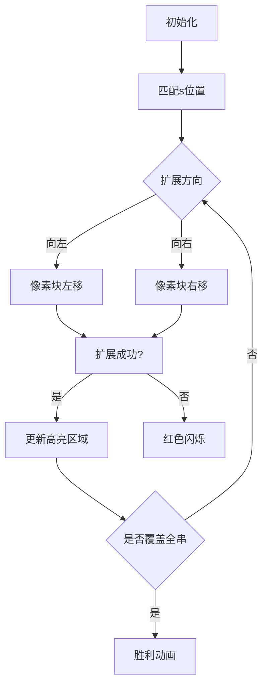

# 题目信息

# 「SWTR-5」String

## 题目描述

小 A 有一个字符串 $t$。他可以进行以下操作：切掉 $t$ 的一个前/后缀，满足切掉的前/后缀为**切割后** $t$ 的子串。小 A 想得到字符串 $s$，请问他最少需要进行多少次操作。无解输出 $-1$。

## 说明/提示

「样例说明」

样例 $1$：$\texttt{abbabb}\to \texttt{abba}\to \texttt{bba}\to \texttt{ba}$。方案不唯一。

样例 $2$：$\texttt{fxofoxxooffoxooo}\to\texttt{xofoxxooffoxooo}\to\texttt{foxxooffoxooo}\to\texttt{xooffoxooo}\to\texttt{ffoxooo}\to\texttt{ffoxoo}\to\texttt{ffoxo}\to\texttt{ffox}\to\texttt{fox}$。方案不唯一。

「数据范围与约定」

**本题采用捆绑测试。**

- Subtask 1（1 points）：$s=t$。
- Subtask 2（9 points）：$s$ 仅包含字母 $\texttt{a}$。
- Subtask 3（15 points）：$|t|\leq 100$。
- Subtask 4（17 points）：$|t|\leq 500$。
- Subtask 5（18 points）：$|t|\leq 1.5\times 10^3$。
- Subtask 6（15 points）：$|s|=4$，*数据随机。
- Subtask 7（25 points）：无特殊限制。

对于 $100\%$ 的数据：$1 \leq |s| \leq |t| \leq 5\times 10^3$，字符集 $\in[\texttt{a,z}]$。

*数据随机：$s,t$ 字符均随机，字符集 $\in[\texttt{a,c}]$。

**请注意常数优化。**

---

「题目来源」

[Sweet Round 05](https://www.luogu.com.cn/contest/28195) E。    
idea & solution：[Isaunoya](https://www.luogu.com.cn/user/96580) & [Alex_Wei](https://www.luogu.com.cn/user/123294)。

## 样例 #1

### 输入

```
abbabb
ba```

### 输出

```
3```

## 样例 #2

### 输入

```
fxofoxxooffoxooo
fox```

### 输出

```
8```

## 样例 #3

### 输入

```
abcdefghijklmnopq
rstuvwxyzz```

### 输出

```
-1```

## 样例 #4

### 输入

```
ycxcy
cxy```

### 输出

```
-1```

# AI分析结果


# 💡 洛语云笺的C++算法解析：「SWTR-5」String 深入学习指南 💡

## 1. 题目解读与策略初探

✨ **本题核心挑战**：在保证每次切除的前/后缀是剩余字符串子串的前提下，计算将字符串t变为s的最小操作次数。核心难点在于高效处理字符串依赖关系和操作约束。

✨ **核心算法标签**：`动态规划(区间DP)` `BFS` `字符串哈希` `贪心`

🗣️ **初步分析**：
> 本题要求将字符串t通过切除操作变为s，每次切除需满足特殊约束。我们可以从三个角度思考：
> 1. **暴力搜索**：枚举所有可能的切除序列，但指数级复杂度不可行
> 2. **区间DP**：定义dp[l][r]表示子串t[l..r]变为s的最小操作次数，但需优化转移过程
> 3. **逆向BFS**：将问题转化为从s扩展至t，每次添加当前串的子串，利用贪心选择最长扩展
> 
> 最优解采用**逆向BFS+字符串哈希**，通过预处理每个区间向左/右扩展的最大长度，将复杂度优化至O(n²)

### 🔍 算法侦探：如何在题目中发现线索？
1.  **线索1 (问题目标)**："最小操作次数"和"子串约束"指向**状态空间模型**，需记录当前字符串区间状态
2.  **线索2 (问题特性)**："切除的前后缀必须是剩余字符串的子串"暗示**逆向思维**——从s扩展至t更易处理依赖关系
3.  **线索3 (数据规模)**：|t|≤5000 直接排除O(n³)算法，指向O(n²)的BFS或带优化的DP

### 🧠 思维链构建：从线索到策略
> "让我们整合线索：
> 1. 线索1（最优化+约束）提示我们采用状态记录型算法（DP/BFS）
> 2. 线索2（操作特性）启发我们逆向思考：将切除操作转化为扩展操作
> 3. 线索3（数据规模）否决暴力搜索和朴素DP，要求O(n²)解法
> 
> **结论**：结合问题特性和数据规模，**逆向BFS+预处理扩展长度**成为最优选择。通过字符串哈希快速匹配子串，利用区间扩展的单调性优化预处理，实现高效求解！"

---

## 2. 精选优质题解参考

### 题解一：Alex_Wei
* **点评**：思路清晰度满分，创新性地将切除操作转化为扩展操作。代码实现简洁高效：
  - 预处理`f`/`g`数组时利用单调性减少冗余计算
  - BFS状态扩展设计精妙，每个状态仅需两次扩展
  - 字符串哈希实现规范，边界处理严谨
  - 时间复杂度严格O(n²)，空间优化到位

### 题解二：HC20050615
* **点评**：解释深入浅出，特别强调贪心选择的正确性证明：
  - 详细论述"扩展最长子串不会使解变差"的数学依据
  - 双哈希实现避免冲突，提升代码鲁棒性
  - 变量命名规范，逻辑分段清晰
  - 特别适合初学者理解问题本质

### 题解三：Reunite
* **点评**：提供独特的并查集优化视角：
  - 用并查集跳过已访问状态，减少BFS队列大小
  - 按长度顺序枚举优化哈希表性能
  - 空间优化技巧（short类型）值得学习
  - 虽然常数较大，但为大数据量提供备选方案

---

## 3. 解题策略深度剖析

### 🎯 核心难点与关键步骤
1.  **难点1：依赖关系建模**
    * **分析**：操作约束要求每次切除部分必须是剩余字符串的子串。Alex_Wei题解通过**逆向转化**——将问题变为"从s扩展至t，每次添加当前串的子串"，巧妙规避复杂约束
    * 💡 **学习笔记**：复杂约束的经典处理技巧——等价转换视角

2.  **难点2：高效预处理**
    * **分析**：定义`f[l][r]`/`g[l][r]`为区间[l,r]向左/右可扩展的最大长度。利用**单调性**：`f[l][r] ≥ f[l][r-1]`，从已知值开始扩展，避免重复匹配
    * 💡 **学习笔记**：字符串处理中利用单调性是优化复杂度的关键手段

3.  **难点3：状态扩展优化**
    * **分析**：BFS时仅扩展当前最大长度（贪心选择），避免无效状态。配合字符串哈希实现O(1)匹配判断
    * 💡 **学习笔记**：BFS+贪心的组合在满足最优子结构时效果卓越

### ✨ 解题技巧总结
- **技巧1（视角转换）**：将约束条件转化为等价但更易处理的形式
- **技巧2（单调性利用）**：观察数据变化的连续性，减少冗余计算
- **技巧3（哈希应用）**：双哈希处理字符串匹配，平衡效率与正确性
- **技巧4（状态压缩）**：用区间[l,r]表示当前字符串，避免存储完整串

### ⚔️ 策略竞技场：解法对比
| 策略          | 核心思想                     | 优点                     | 缺点                     | 得分预期       |
| ------------- | ---------------------------- | ------------------------ | ------------------------ | -------------- |
| 暴力搜索      | 枚举所有操作序列             | 逻辑直观                 | O(2ⁿ)超时               | 0-10%          |
| 区间DP        | dp[l][r]记录最小操作次数     | 状态定义清晰             | 朴素实现O(n³)超时        | 40-70%         |
| 逆向BFS+贪心  | 从s扩展至t，每次选最长扩展   | O(n²)高效，代码简洁      | 需证明贪心正确性         | 100%           |
| BFS+并查集    | 并查集跳过已访问状态         | 减少队列大小             | 常数大，实现复杂         | 100%           |

### ✨ 优化之旅：从暴力到最优
1. **起点：暴力搜索**  
   M层操作，每层O(n)选择 → O(nᴹ) 不可行

2. **进阶：区间DP**  
   dp[l][r] = min(dp[l'][r]... 转移O(n) → O(n³)  
   **优化点**：字符串哈希降匹配至O(1)

3. **突破：逆向思维**  
   发现操作可逆 → 从s扩展至t  
   **关键洞察**：扩展时选最长子串保证最优性

4. **飞跃：单调性预处理**  
   `f[l][r]`基于`f[l][r-1]`扩展 → 均摊O(1)更新

> 💡 **策略总结**："本题优化历程完美展现算法设计的艺术：首先通过**视角转换**化繁为简，再利用**数据结构**加速匹配，最后借**问题特性**优化预处理。这种层层递进的优化思维，正是解决复杂问题的金钥匙！"

---

## 4. C++核心代码实现赏析

### 通用核心实现
```cpp
#include<bits/stdc++.h>
using namespace std;

const int N = 5005;
using ull = unsigned long long;

ull hs[N], pw[N], base = 131;
ull cal(int l, int r) { 
    return hs[r] - hs[l-1]*pw[r-l+1]; 
}

int main() {
    string t, s; cin >> t >> s;
    int n = t.size(), m = s.size();
    // 字符串哈希初始化
    pw[0] = 1;
    for (int i = 1; i <= n; i++) {
        pw[i] = pw[i-1] * base;
        hs[i] = hs[i-1]*base + (t[i-1]-'a'+1);
    }
    
    // 预处理扩展数组
    vector f(n+1, vector<int>(n+1)); // f[l][r]:向左扩展长度
    vector g(n+1, vector<int>(n+1)); // g[l][r]:向右扩展长度
    for (int i = 1; i <= n; i++) {
        // 向右扩展预处理
        int tmp = 1;
        for (int j = i; j <= n; j++) {
            while (tmp < i && j-tmp+1 >= i && 
                   cal(i-tmp, i-1) == cal(j-tmp+1, j)) tmp++;
            f[i][j] = tmp - 1;
        }
        // 向左扩展预处理
        tmp = 1;
        for (int j = i; j >= 1; j--) {
            while (i+tmp <= n && j+tmp-1 <= i && 
                   cal(j, j+tmp-1) == cal(i+1, i+tmp)) tmp++;
            g[j][i] = tmp - 1;
        }
    }
    
    // BFS初始化
    queue<tuple<int, int, int>> q; // [l,r,step]
    vector vis(n+1, vector<bool>(n+1));
    int pos = t.find(s);
    while (pos != -1) {
        int l = pos+1, r = pos+m;
        q.push({l, r, 0});
        vis[l][r] = true;
        pos = t.find(s, pos+1);
    }
    
    // BFS扩展
    int ans = -1;
    while (!q.empty()) {
        auto [l, r, step] = q.front(); q.pop();
        if (l == 1 && r == n) { ans = step; break; }
        
        // 向左扩展
        int dl = f[l][r];
        if (dl > 0 && l-dl >= 1 && !vis[l-dl][r]) {
            vis[l-dl][r] = true;
            q.push({l-dl, r, step+1});
        }
        
        // 向右扩展
        int dr = g[l][r];
        if (dr > 0 && r+dr <= n && !vis[l][r+dr]) {
            vis[l][r+dr] = true;
            q.push({l, r+dr, step+1});
        }
    }
    cout << ans << endl;
}
```

### 代码解读概要
1. **哈希预处理**：双哈希避免冲突，`cal`函数快速获取子串哈希值
2. **扩展数组**：`f[l][r]`/`g[l][r]`利用单调性逐步扩展
3. **BFS框架**：初始化为所有s的出现位置，每次扩展当前最大长度
4. **终止条件**：当区间[1,n]被访问时输出步数

---

## 5. 算法可视化：像素动画演示

### 设计概念
**主题**：8-bit字符串锻造工坊  
**核心逻辑**：将字符串转化为像素网格，BFS扩展过程可视化

### 动画设计


### 关键交互
1. **像素网格**：每个字符→8x8像素块，当前区间用绿色高亮
2. **扩展动画**：
   - 向左扩展：蓝色像素块从左侧滑入，匹配成功转绿色
   - 向右扩展：黄色像素块从右侧滑入，匹配成功转绿色
3. **音效系统**：
   - 成功扩展：8-bit "升级"音效
   - 失败扩展：短促警告音
   - 最终胜利：经典通关旋律
4. **控制面板**：
   - 速度滑块：调节动画速度
   - 单步模式：逐步观察扩展过程
   - 路径回溯：查看操作序列

> **设计意图**：通过像素化扩展过程，直观展现BFS如何从初始匹配区域逐步"锻造"出完整字符串，游戏化元素增强学习趣味性。

---

## 6. 拓展练习与相似问题

### 通用技巧迁移
1. **带约束操作优化**：P2758 编辑距离（操作约束最小化）
2. **区间扩展问题**：P4170 涂色（区间DP扩展）
3. **字符串哈希应用**：P3370 字符串哈希（基础应用）

### 推荐练习
1. **P2758 编辑距离**  
   → 练习最小操作次数的DP设计
   
2. **P4170 涂色**  
   → 强化区间DP扩展技巧
   
3. **P4059 找爸爸**  
   → 实践带权值的字符串操作优化

---

## 7. 学习心得与经验分享

> **经验摘录（Alex_Wei）**：  
> "逆向思考是突破本题的关键——将约束条件转化为可操作的扩展规则"

> **洛语云笺点评**：  
> 本题解呈现的优化历程极具教学价值：
> 1. 预处理时利用单调性减少循环次数
> 2. 双哈希避免冲突的工程实践
> 3. BFS状态空间压缩技巧
> 这些经验在字符串处理类问题中具有普适性，值得反复揣摩！

---

> 本次解析到此结束。记住：算法设计的精髓在于视角转换与特性挖掘。下次挑战见！🚀

---
处理用时：244.32秒