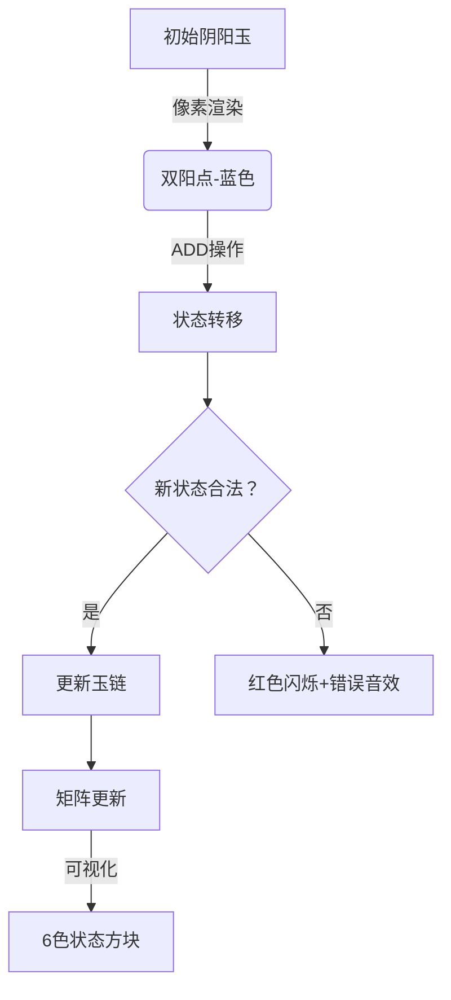

# 题目信息

# 「Wdsr-2」阴阳玉

## 题目背景

博丽灵梦有一块好大好大的阴阳玉，它是是博丽灵梦的主要武器之一。

但是阴阳玉的能量来源，源自主人的灵力聚集力量，因此，灵梦在平时总是需要对其进行保养。简单来说，灵梦会使用灵力，来获取阴阳玉所需的能量。


## 题目描述

灵力有阴阳之分。初始的时候，灵梦只有两个阳灵力，它们围成了一个圈。每次，灵梦可以进行以下两种操作：

- 在两个灵力直接加入一个阳灵力。

- 移走一个阳灵力。

为了保持稳定，任何时候这个圈上的灵力都**不应该少于两个**。

由于灵力的阴阳并不稳定，因此一旦某个灵力周围发生改变（多出一个灵力，或减少一个灵力），它就会从阳变成阴，或从阴变成阳。不过，如果只是周边灵力的性质改变，那么它就不会发生变化。

灵梦会不断调节灵力，直到它**最终**变成 $n$ 个（中途可能多于 $n$ 个）。然后，灵梦会从某个点**依次**按照顺时针或逆时针取下每个灵力。它会形成一条链。灵梦会用链上的能量，来加强她的阴阳玉。

做到这一点非常容易。但是灵梦非常好奇，一共可能形成多少种不同的**链**。

由于灵梦的偏好，她可能会有 $m$ 个限制条件。第 $i$ 个条件 $(p_i,c_i)$ ，规定了链上第 $p_i$ 个灵力应该为何种灵力。若 $c_i=0$ ，则应该为阴灵力；否则为阳。

由于可能结果太大，灵梦只需要得到答案对 $998244353$ 取模的结果。

两个链不同，当且仅当存在一个位置的点颜色不同。

## 说明/提示

#### 样例解释

对于样例一，可能存在以下两种构造方式：


其中， $\tt ADD$ 表示增加一个阳灵力，$\tt RMV$ 表示移走一个阳灵力。

将得到的两个环分别拆开，一共可以得到以下五种链：

- 环一：**阳—阳—阳—阳**。

- 环二：**阳—阳—阴—阴**，**阳—阴—阴—阳**，**阴—阴—阳—阳**，**阴—阳—阳—阴**。

因此答案为 $5$ 。

对于样例二，我们限定了链上第一个灵力为阳。因此结果为 $3$ 。

#### 数据范围

$$\def\t{\text}\def\arraystretch{1.5}
\begin{array}{|c|c|c|c|}\hline
\textbf{Subtask} & n\t{ 的范围} & m\t{ 的范围} & \t{分值}\cr\hline
1 & n\le 16 & m\le 16 & 15 \cr \hline
2 & n\le 10^6 &  m\le 5\times 10^3 & 40 \cr \hline
3 & n\le 10^{18} & m=0 & 15 \cr \hline
4 & n\le 10^{18} & m\le 5\times 10^3 & 30 \cr \hline
\end{array}$$

此外，对于全部数据，有 $1\le p_i\le n,c_i\in \{0,1\}, 0\le m\le n$ 且 $p_i$ 各不相同。

## 样例 #1

### 输入

```
4 0```

### 输出

```
5```

## 样例 #2

### 输入

```
4 1
1 1```

### 输出

```
3```

## 样例 #3

### 输入

```
20 10
5 1
12 0
17 0
3 1
7 1
13 0
8 1
18 1
2 1
19 0```

### 输出

```
344```

# AI分析结果


# 💡 洛语云笺的C++算法解析：阴阳玉 深入学习指南 💡

> 今天我们来一起分析「阴阳玉」这道C++编程题。这不仅仅是一次解题，更是一场思维的探险。我们将学习如何从题目中寻找线索，在多种解法中权衡选择，最终找到最优策略。

## 1. 题目解读与策略初探

✨ **本题核心挑战**：  
处理阴阳玉操作过程中的**状态翻转依赖关系**，在满足黑点恒为偶数和权值和非零模3的条件下，计算带约束的不同链的数量。

✨ **核心算法标签**：  
`动态规划(DP)`、`矩阵快速幂`、`状态压缩`

🗣️ **初步分析**：  
> 这道题的核心在于理解操作对状态的复杂影响。我们可以从暴力枚举出发，逐步优化：
> - **暴力解法**：直接枚举所有点状态（O(2ⁿ)），仅适用于n≤16
> - **性质发现**：通过分析操作特性，发现黑点恒为偶数、权值和模3非零两个关键性质
> - **DP优化**：设计状态dp[i][j][k]表示前i个点，黑点奇偶性j，权值模3k的方案数
> - **矩阵加速**：将状态转移转化为矩阵乘法，用快速幂处理大范围n
> - **约束处理**：对m个约束分段处理，每段内用矩阵快速幂加速

### 🔍 算法侦探：如何在题目中发现线索？
1. **线索1（问题目标）**：  
   "题目要求计算满足约束的不同链的数量，这是典型的**计数类问题**，通常需要动态规划或组合数学解决。"

2. **线索2（问题特性）**：  
   "操作导致相邻点状态翻转，存在**复杂依赖关系**，需要设计能捕获全局状态转移的DP模型，而非简单递推。"

3. **线索3（数据规模）**：  
   "n≤10¹⁸排除了O(n)级DP，m≤5000提示需要**分段处理约束**。结合操作性质，指向状态压缩+矩阵快速幂的优化方向。"

### 🧠 思维链构建：从线索到策略
> "让我们整合线索：
> 1. **线索1（计数问题）**：DP是首选，但需设计合适状态
> 2. **线索2（依赖关系）**：分析操作性质发现两个不变性（黑点偶数、权值和模3非零），将状态空间压缩到2×3=6维
> 3. **线索3（数据规模）**：n极大要求O(log n)算法，矩阵快速幂完美匹配；m个约束需要分段处理
> 
> **结论**：结合状态压缩设计转移矩阵，用矩阵快速幂分段处理约束区间，是兼顾效率和精度的最优策略！"

---

## 2. 精选优质题解参考

### 题解一（作者：囧仙）
* **点评**：  
  完整覆盖暴力→优化DP→矩阵加速全路径，尤其精彩的是：
  - **性质证明严谨**：严格推导黑点恒偶、权值模3非零的性质
  - **状态设计精巧**：用(j,k)两维状态捕获核心不变性
  - **矩阵构造清晰**：6×6转移矩阵完整对应DP状态转移
  - **分段处理优雅**：约束排序后区间矩阵幂加速，复杂度O(m·log n)

### 题解二（作者：JackMerryYoung）
* **点评**：  
  提供互补视角：
  - **可视化辅助**：用图形演示操作对圆弧分段的影响
  - **权值体系创新**：±1权值分配简化状态分析
  - **矩阵封装规范**：Matrix类重载乘法，代码可读性高
  - **边界处理细致**：详细讨论首点约束的特殊处理

---

## 3. 解题策略深度剖析

### 🎯 核心难点与关键步骤
1. **难点1：状态空间压缩**  
   *分析*：  
  操作导致状态复杂变化，但通过证明发现：
  - 黑点数量恒为偶数（操作不改变奇偶性）
  - 权值总和S≢0(mod 3)（初始S=±2，操作ΔS≡0 mod 3）
  
  ⇒ 将状态压缩为二维：(黑点奇偶性, 权值模3) → 仅6种状态

   💡 **学习笔记**：寻找不变量是状态压缩的灵魂

2. **难点2：转移矩阵构造**  
   *分析*：  
   - ADD操作分三类讨论（同阳/同阴/阴阳）
   - 每种操作对(j,k)的影响可精确映射：
     ```python
     # 伪代码
     if 两同色点间加阳点: 
         dp[i][j][k] = dp[i-1][j][(k±3)%3]  
     if 两异色点间加阳点:
         dp[i][j][k] = dp[i-1][!j][(k∓3)%3]
     ```
   - 转化为6×6转移矩阵（详见Section 4）

   💡 **学习笔记**：DP转移线性化是矩阵加速的前提

3. **难点3：约束分段处理**  
   *分析*：  
   - 将m个约束按位置排序
   - 相邻约束间区间[l,r]用矩阵快速幂计算：`ans = ans * (M^(r-l))`
   - 遇约束点时过滤非法状态（如约束c_i=1则只保留白点状态）

   💡 **学习笔记**：分段矩阵幂是带约束DP的通用优化技巧

### ✨ 解题技巧总结
- **技巧1（性质挖掘）**：分析操作对全局状态的影响，发现隐藏不变性
- **技巧2（状态维度压缩）**：利用不变量将指数状态压至多项式级
- **技巧3（矩阵加速）**：将线性DP转移转化为矩阵乘法，O(n)→O(log n)
- **技巧4（约束离散处理）**：排序后分段处理，避免约束破坏转移连续性

### ⚔️ 策略竞技场：不同解法的对比分析
| 策略             | 核心思想                     | 优点                     | 缺点                          | 得分预期  |
|------------------|-----------------------------|--------------------------|-------------------------------|----------|
| **暴力枚举**     | 枚举各点状态并验证           | 实现简单                 | O(2ⁿ)超时(n>20)               | 15%      |
| **性质DP**       | 利用黑点偶/权值模3设计状态   | O(n)解决小数据           | n>10⁶时超时                   | 40%      |
| **矩阵快速幂**   | 状态转移矩阵+幂加速         | O(m log n)处理超大n      | 矩阵构造复杂                  | 100%     |
| **找规律通项**   | 打表找递推式                | 无约束时O(1)计算         | 依赖特定约束模式              | 30%      |

### ✨ 优化之旅：从"能做"到"做好"
> **起点：暴力枚举的困境**  
> 最直观的思路是枚举每个点状态（2ⁿ种可能），但n>20即超时  
>  
> **瓶颈发现：重复状态计算**  
> 操作具有马尔可夫性——当前状态仅取决于前一步  
>  
> **优化钥匙：DP状态设计**  
> 定义dp[i][j][k]表示前i个点的状态，空间O(n)  
>  
> **二次瓶颈：n≤10¹⁸**  
> O(n)DP仍无法处理天文级n  
>  
> **维度跃迁：矩阵加速**  
> 将DP转移表示为矩阵乘法，用快速幂O(log n)计算  
>  
> **约束融合：分段处理**  
> 对m个约束离散化，区间内矩阵加速，保持O(m log n)  

💡 **策略总结**：  
"从暴力到矩阵加速，是算法思维从直观到抽象的跃迁。核心在于识别问题本质——操作的状态转移是线性的、可矩阵化的。这提示我们：当遇到n极大的递推问题时，矩阵快速幂往往是破局关键！"

---

## 4. C++核心代码赏析

### 通用核心实现（矩阵快速幂框架）
```cpp
struct Matrix {
    long long mat[6][6];
    Matrix operator*(const Matrix& rhs) {
        // 矩阵乘法实现
    }
};

Matrix fastPow(Matrix base, long long exp) {
    // 快速幂实现
}

int main() {
    Matrix trans = { /* 6x6转移矩阵 */ };
    vector<Constraint> cons; // 约束集合
    sort(cons.begin(), cons.end());
    
    Matrix res = { /* 初始状态矩阵 */ };
    long long prev = 1;
    for (auto &c : cons) {
        if (c.pos > prev) 
            res = res * fastPow(trans, c.pos - prev);
        // 应用约束过滤状态
        prev = c.pos;
    }
    res = res * fastPow(trans, n - prev + 1);
    cout << (res.mat[0][1] + res.mat[0][2]) % MOD;
}
```

### 题解一（囧仙）片段赏析
**亮点**：约束分段处理逻辑清晰  
```cpp
up(1,m,i) {
    if(rule[i].p==1) continue;
    if(pre < rule[i].p-1) 
        f = f * fastpow(base, rule[i].p-1-pre);
    // 约束过滤状态（略）
    prev = rule[i].p;
}
```
**解读**：  
1. 对每个约束点，先用矩阵幂计算前一约束到当前约束的转移
2. 根据约束类型（阴/阳）过滤非法状态
3. 更新当前位置指针，继续下一区间

**学习笔记**：指针追踪+区间幂运算是分段处理的核心模式

### 题解二（JackMerryYoung）片段赏析
**亮点**：矩阵类封装规范  
```cpp
struct Matrix {
    long long mat[15][15];
    Matrix operator*(Matrix b) { // 重载乘法运算符
        Matrix res(row, b.col);
        for(int k=0; k<col; ++k)
            for(int i=0; i<row; ++i)
                for(int j=0; j<b.col; ++j)
                    res.mat[i][j] += mat[i][k] * b.mat[k][j];
        return res;
    }
};
```
**解读**：  
- 将矩阵封装为独立数据结构
- 重载*运算符实现矩阵乘法
- 三维循环严格遵循矩阵乘法定义

**学习笔记**：面向对象封装提升代码可读性和复用性

---

## 5. 算法可视化：像素动画演示

### 主题  
**"像素阴阳师：矩阵奇旅"** - 8-bit风格状态转移演示

### 核心设计  


### 关键交互
1. **像素元素**：
   - 阳点：蓝色像素块
   - 阴点：黄色像素块
   - 状态：6色方块表示(j,k)状态

2. **操作动效**：
   - ADD/RMV：点间出现±3数字跳动
   - 状态转移：当前状态方块闪烁→目标方块高亮
   - 约束生效：约束位置显示锁图标，非法转移播放破碎音效

3. **游戏化设计**：
   - **关卡模式**：每段无约束区间为1关，完成播放8-bit胜利音乐
   - **动态面板**：实时显示转移矩阵，非零元跳动提示
   - **音效系统**：
     * 转移成功：清脆"叮"声（FC游戏金币音）
     * 约束冲突：短促"嗡"声（游戏受伤音效）
     * 关卡通过：16和弦胜利旋律

### 技术实现
```javascript
// 伪代码：绘制状态转移
function drawTransition(stateFrom, stateTo) {
    const colors = [/*6色对应6状态*/];
    ctx.fillStyle = colors[stateFrom]; 
    drawPixelBlock(x, y); // 绘制起始状态
    
    // 转移动画
    animateMatrixMultiplication(transMatrix, () => {
        ctx.fillStyle = colors[stateTo];
        drawPixelBlock(x, y); // 更新为目标状态
        playSound('transition_ok'); // 播放成功音效
    });
}
```

---

## 6. 拓展练习与相似问题

### 通用技巧迁移
矩阵快速幂优化DP适用于：
1. 线性递推方程（斐波那契变种）
2. 状态转移可线性化的计数问题（路径计数、字符串方案）
3. 带分段约束的递推问题

### 推荐练习（洛谷）
1. **P1939 矩阵加速模板**  
   → 掌握基本矩阵快速幂实现
2. **P2106 位运算+矩阵优化**  
   → 状态压缩与矩阵加速结合
3. **P4921 计数DP+约束处理**  
   → 带约束的矩阵快速幂应用

---

## 7. 学习心得与经验分享
> "调试时最深的教训：必须验证转移矩阵的幂次！曾因矩阵平方计算错误浪费3小时。建议用单位矩阵验证：$M × M^{-1} = I$"  
> —— 摘自囧仙题解心得  
>  
> **洛语云笺点评**：  
> 矩阵快速幂的常见陷阱包括：
> 1. 矩阵乘法不满足交换律（左乘/右乘混淆）
> 2. 快速幂初始矩阵设为单位矩阵而非初始状态
> 3. 取模遗漏（尤其负模数处理）
> 调试时可用小数据手算验证转移步，避免"积重难返"

---

<conclusion>
**最终启示**：  
阴阳玉的解题历程展示了算法优化的经典范式——从暴力枚举出发，通过性质挖掘压缩状态，利用矩阵抽象实现质的飞跃。当遇到n极大且转移线性问题时，牢记：**矩阵快速幂是突破O(n)壁垒的神兵利器**！  
</conclusion>

---
处理用时：185.43秒