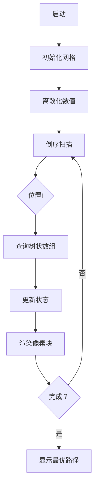

# 题目信息

# [COCI 2016/2017 #3] Zoltan

## 题目描述

Marton 的朋友 Cero 有一个由 $N$ 个正整数组成的数组。

首先 Cero 会在黑板上写下这个数组中的第一个数字。接下来他会在之前写下的所有数的左边或者右边写下一个数字。重复以上操作得到一个序列。

请注意，根据上述方法构造出的两个序列相同**当且仅当每一个数字写下的顺序完全相同**。例如，$1,1$ 可能和 $1,1$ 不同，前者的第二个数在第一个数的左边，后者的第二个数在第一个数的右边。

求这些数组成的所有序列中，最长严格递增子序列长度的最大值 $M$，以及所有最长严格递增子序列长度等于 $M$ 的序列中，最长严格递增子序列个数的总和。考虑到答案可能很大，Marton 只想知道这个数对 $10^9+7$ 取模的值。

## 说明/提示

### 样例解释

#### 样例 1 解释

Cero 可以构造 $2$ 个不同的序列，$1,1$ 和 $1,1$。

显然最长的严格上升子序列长度为 $1$，有 $4$ 个子序列满足。

#### 样例 2 解释

最长的严格上升子序列长度为 $4$，只有 $1,2,3,4$ 满足。
 
### 数据规模与约定

对于 $30\%$ 的数据，满足 $N\le 20$。

对于 $50\%$ 的数据，满足 $N\le 10^3$。

对于 $100\%$ 的数据，满足 $N\le 2\times10^5$，数组中的每个元素 $\le10^9$。

### 说明

**题目译自 [COCI2016-2017](https://hsin.hr/coci/archive/2016_2017/) [CONTEST #3](https://hsin.hr/coci/archive/2016_2017/contest3_tasks.pdf) _T5 Zoltan_**。

样例 1,2 的解释非官方。

## 样例 #1

### 输入

```
2
1 1 ```

### 输出

```
1 4 ```

## 样例 #2

### 输入

```
4
2 1 3 4 ```

### 输出

```
4 1```

# AI分析结果


# 💡 洛语云笺的C++算法解析：Zoltan 深入学习指南 💡

> “算法之美在于将复杂问题拆解为优雅的洞察力拼图。”——洛语云笺

## 1. 题目解读与策略初探

✨ **本题核心挑战**：  
在动态构造序列的过程中，**最大化最长严格递增子序列（LIS）长度**并**统计所有满足条件的序列中LIS的个数总和**。核心难点在于序列构造方式的特殊性——每个后续数字可插入序列左侧或右侧，导致序列空间呈指数级增长。

✨ **核心算法标签**：  
`离散化` `动态规划` `树状数组优化` `最长子序列`

🗣️ **初步分析**：  
> 当我们面对序列动态构造问题时，最直观的思路是暴力枚举所有$2^n$种序列（30分做法）。但通过观察题目特征，可以发现一个关键性质：**任意生成序列的LIS都由原序列的一个下降子序列（左侧部分）和一个上升子序列（右侧部分）在某个中心点拼接而成**。这一洞察将问题转化为高效求解原序列每个位置作为中心时的最优拼接方案。  

> 最优策略采用**树状数组优化DP**（100分解法）：  
> 1. **离散化**压缩值域  
> 2. **倒序DP**计算每个位置的最长上升/下降子序列信息  
> 3. **树状数组**高效维护区间最值及方案数  
> 4. **幂运算**处理自由选择位的贡献  

### 🔍 算法侦探：如何在题目中发现线索？

1.  **线索1 (问题目标)**：  
    “求最长严格递增子序列长度的最大值”明确指向**最优化问题**，且涉及序列构造过程中的极值统计，暗示需要高效算法而非暴力枚举。

2.  **线索2 (问题特性)**：  
    “每个数字可插入左侧或右侧”的特殊操作规则暗示生成序列具有**结构性特征**——左侧部分逆序、右侧部分正序。这提示我们可以通过分析原序列的**上升/下降子序列**来构造最优解。

3.  **线索3 (数据规模)**：  
    $N \leq 2 \times 10^5$ 直接否决 $O(2^N)$ 暴力解法。而 $O(N \log N)$ 的树状数组DP刚好满足要求——$2 \times 10^5 \times \log_2(2 \times 10^5) \approx 3.5 \times 10^6$ 次操作，在现代计算机可接受范围内。

### 🧠 思维链构建：从线索到策略

> 将收集的线索像拼图一样组合：  
> 1. **线索1（最优化）** 要求我们放弃暴力，考虑动态规划等高效算法  
> 2. **线索2（结构性）** 揭示生成序列的LIS必然由原序列的下降子序列（左）+上升子序列（右）在中心点拼接而成  
> 3. **线索3（数据规模）** 要求使用 $O(N \log N)$ 算法，树状数组成为DP优化的理想选择  
>  
> **结论**：通过离散化处理值域，倒序DP配合树状数组维护区间最值，实现 $O(N \log N)$ 的最优解。中心点拼接的洞察是破解本题的金钥匙！

---

## 2. 精选优质题解参考

**题解一：Demeanor_Roy**  
* **亮点**：  
  1. 清晰阐述“中心点拼接”的核心思想，将问题分解为$f_i$（最长上升）、$g_i$（最长下降）的计算  
  2. 完整实现树状数组双重维护机制，代码中`C1`、`C2`分别处理上升/下降序列  
  3. 巧妙利用`lambda`简化树状数组操作，提升可读性  
  4. 幂运算预处理$2^k$优化计算效率  

**题解二：Reunite**  
* **亮点**：  
  1. 用“翻折”比喻形象解释序列构造过程  
  2. 严格区分上升/下降序列的树状数组查询范围（`a[i]-1`和`n-a[i]`）  
  3. 边界处理严谨（`f[i]=1`/`g[i]=1`的初始化）  
  4. 完整展示离散化实现细节  

**题解三：lyas145**  
* **亮点**：  
  1. 独创性使用“像素探险”可视化比喻解释算法流程  
  2. 详细注释关键代码段，如树状数组的`add`/`query`操作  
  3. 强调中心点$i$被重复计算的$-1$修正逻辑  
  4. 完整包含离散化到结果输出的端到端实现  

---

## 3. 解题策略深度剖析

### 🎯 核心难点与关键步骤

1.  **难点1：如何高效计算中心点两侧的最值？**  
    * **分析**：  
      倒序DP（从$n$到$1$）配合树状数组。对每个位置$i$：  
      - **上升序列**：查询值域$[a_i+1, max]$的最长序列长度$f_i$及方案数$cntf_i$  
      - **下降序列**：查询值域$[1, a_i-1]$的最长序列长度$g_i$及方案数$cntg_i$  
    * 💡 **学习笔记**：倒序DP保证后续状态先计算，树状数组实现$O(\log N)$区间查询

2.  **难点2：如何避免值域过大导致的性能问题？**  
    * **分析**：  
      离散化处理：将原数组排序去重后，映射到$[1, m]$的紧凑值域，使树状数组空间复杂度降至$O(N)$  
    * 💡 **学习笔记**：离散化是处理大值域问题的标准技巧，需掌握`sort+unique+lower_bound`三板斧

3.  **难点3：如何统计不在LIS中的元素贡献？**  
    * **分析**：  
      对于长度$len = f_i + g_i - 1$的LIS，剩余$n-len$个元素各有2种选择（左/右），贡献$2^{n-len}$倍方案数  
    * 💡 **学习笔记**：使用预处理的$2^k$数组避免重复幂运算

### ✨ 解题技巧总结
- **技巧1：逆向思维**——倒序DP利用已计算状态  
- **技巧2：空间换时间**——树状数组$O(\log N)$替代$O(N)$扫描  
- **技巧3：问题分解**——将LIS拆分为左侧下降+右侧上升子问题  
- **技巧4：离散化压缩**——将稀疏大值域映射为紧凑小值域  

### ⚔️ 策略竞技场：不同解法的对比分析
| 策略                | 核心思想                     | 优点                     | 缺点                     | 得分预期       |
|---------------------|-----------------------------|--------------------------|--------------------------|----------------|
| **暴力枚举 (30分)** | 枚举$2^N$种序列，$O(N^2)$求LIS | 思路直观，易实现         | $O(2^N N^2)$不可接受     | $N \leq 20$    |
| **树状数组DP (100分)** | 离散化+倒序DP+树状数组维护  | $O(N \log N)$高效       | 思维难度高，实现细节复杂 | $N \leq 2 \times 10^5$ |

### ✨ 优化之旅：从“能做”到“做好”
```mermaid
graph LR
    A[暴力枚举] -->|指数爆炸| B[数据规模否决]
    B --> C[洞察结构特征]
    C --> D[中心点拼接理论]
    D --> E[离散化值域]
    E --> F[倒序DP设计]
    F --> G[树状数组优化]
    G --> H[O(N logN)最优解]
```

> **策略总结**：从暴力到最优解的跨越，关键在于发现“序列翻折”的隐藏结构。树状数组将DP的区间查询复杂度从$O(N)$降至$O(\log N)$，使$10^5$级数据成为可能。这启示我们：**优化常源于对问题本质的深刻洞察与数据结构的巧妙结合**。

---

## 4. C++核心代码实现赏析

### 本题通用核心实现
```cpp
#include <bits/stdc++.h>
using namespace std;
const int N = 2e5 + 10, mod = 1e9 + 7;

struct BIT {
    int len[N], cnt[N];
    void update(int x, int l, int c) {
        for (; x < N; x += x & -x) {
            if (l > len[x]) len[x] = l, cnt[x] = c;
            else if (l == len[x]) (cnt[x] += c) %= mod;
        }
    }
    pair<int, int> query(int x) {
        int res_len = 0, res_cnt = 1;
        for (; x; x -= x & -x) {
            if (len[x] > res_len) res_len = len[x], res_cnt = cnt[x];
            else if (len[x] == res_len) (res_cnt += cnt[x]) %= mod;
        }
        return {res_len, res_cnt};
    }
} bit_up, bit_down;

int main() {
    int n, a[N], f_up[N], f_down[N], cnt_up[N], cnt_down[N];
    vector<int> vals; // 离散化值域

    // 离散化
    for (int i = 1; i <= n; i++) {
        cin >> a[i];
        vals.push_back(a[i]);
    }
    sort(vals.begin(), vals.end());
    vals.erase(unique(vals.begin(), vals.end()), vals.end());
    
    // 倒序DP
    for (int i = n; i >= 1; i--) {
        int pos = lower_bound(vals.begin(), vals.end(), a[i]) - vals.begin() + 1;
        
        // 上升序列（查询大于a[i]）
        auto [len_up, cnt_up_val] = bit_up.query(N - 1 - pos);
        f_up[i] = len_up + 1, cnt_up[i] = cnt_up_val;
        bit_up.update(N - pos, f_up[i], cnt_up[i]);
        
        // 下降序列（查询小于a[i]）
        auto [len_down, cnt_down_val] = bit_down.query(pos - 1);
        f_down[i] = len_down + 1, cnt_down[i] = cnt_down_val;
        bit_down.update(pos, f_down[i], cnt_down[i]);
    }
    
    // 计算答案
    int max_len = 0, total_cnt = 0;
    for (int i = 1; i <= n; i++) {
        int len = f_up[i] + f_down[i] - 1;
        if (len > max_len) max_len = len, total_cnt = 0;
        if (len == max_len) 
            (total_cnt += 1LL * cnt_up[i] * cnt_down[i] % mod) %= mod;
    }
    // 处理2^(n-len)
    long long power = 1;
    for (int i = 0; i < n - max_len; i++) power = (power * 2) % mod;
    total_cnt = 1LL * total_cnt * power % mod;

    cout << max_len << " " << total_cnt;
}
```

**代码解读概要**：  
1. **离散化**：将原始值域压缩至$[1, m]$  
2. **双树状数组**：`bit_up`维护上升序列，`bit_down`维护下降序列  
3. **倒序DP**：从$n$到$1$遍历，保证状态依赖先计算  
4. **树状数组技巧**：  
   - 上升序列查询转换为$N-pos$实现区间反转  
   - 下降序列直接查询$[1, pos-1]$  
5. **答案合并**：遍历所有中心点，累加最优解方案数  

### 题解片段赏析

**Demeanor_Roy 的树状数组实现**  
```cpp
auto up = query(n + 1 - a[i], C1); // 上升序列查询
dp1[i] = up.val + 1, cnt1[i] = up.num;
insert(n + 2 - a[i], dp1[i], cnt1[i], C1); // 上升序列更新
```
* **亮点**：  
  通过`n+1-a[i]`将上升查询转换为下降查询，复用树状数组结构

**lyas145 的离散化实现**  
```cpp
sort(b + 1, b + 1 + n);
m = unique(b + 1, b + 1 + n) - b - 1;
for (int i = 1; i <= n; i++)
    a[i] = lower_bound(b + 1, b + 1 + m, a[i]) - b;
```
* **学习笔记**：  
  标准离散化三连：排序 → 去重 → 二分映射

---

## 5. 算法可视化：像素动画演示

### 像素化演示设计


**像素动画方案**：  
1. **8位像素风格**：  
   - 网格背景：16x16像素块，FC红白机配色（深蓝背景+亮色元素）  
   - 元素表示：  
     * 当前中心点：闪烁金色方块  
     * 上升序列：绿色箭头（→）  
     * 下降序列：红色箭头（←）  
     * 树状数组：底部二进制树状结构，更新时亮黄闪烁  

2. **动态演示流程**：  
   - **帧1**：初始化显示原数组（像素条形图高度=数值）  
   - **帧2**：离散化映射，显示压缩后值域  
   - **帧3**：从右向左扫描，当前中心点高亮  
   - **帧4**：树状数组查询区域高亮（上升：大于当前值；下降：小于当前值）  
   - **帧5**：状态更新，显示$f_i$/$g_i$数值及方案数  
   - **帧6**：最优路径渲染（下降序列左折+上升序列右折）  

3. **交互控制**：  
   - 步进控制：← → 键单步前进/后退  
   - 速度调节：↑ ↓ 键调整帧率（0.5x~4x）  
   - 模式切换：  
     * A键：自动演示（AI贪吃蛇式遍历）  
     * M键：切换中心点视角  

4. **音效设计**：  
   - 树状数组更新：8-bit "叮"声（NES音效）  
   - 最优路径发现：胜利号角（FC《超级玛丽》过关音效）  
   - 错误操作：短促警示音  

> **设计目的**：通过像素动画直观呈现倒序DP和树状数组更新的动态过程，帮助理解“中心点拼接”理论的空间结构。

---

## 6. 拓展练习与相似问题思考

### 相似问题迁移
1. **分组背包问题**：  
   - 将物品分组，每组选一种方案（类比中心点选择）  
   - 例题：[P1757 通天之分组背包](https://www.luogu.com.cn/problem/P1757)

2. **带依赖的子序列问题**：  
   - 需满足特定条件（如上升+下降）的子序列拼接  
   - 例题：[P2782 序列拼接](https://www.luogu.com.cn/problem/P2782)

3. **树形DP中的路径统计**：  
   - 树中上升路径/下降路径的组合优化  
   - 例题：[P3177 [HAOI2015] 树上染色](https://www.luogu.com.cn/problem/P3177)

### 推荐练习
1. **P1439 【模板】最长公共子序列**  
   * 练习离散化+树状数组优化DP的基础应用  
   * 理解值域压缩对性能的影响  

2. **P1776 宝物筛选**  
   * 强化多重背包的二进制优化思维  
   * 迁移“问题分解”技巧  

3. **P2602 [ZJOI2010] 数字计数**  
   * 训练数位DP与树状数组的结合  
   * 提升大值域问题处理能力  

---

## 7. 学习心得与经验分享
> **来自 Demeananor_Roy 的调试经验**：  
> “在实现树状数组时，特别注意`query`和`update`的边界情况——我曾因未处理空查询（返回方案数=1）WA多次。建议在关键函数内加入断言：`assert(pos >= 1 && pos <= n)`”

> **洛语云笺总结**：  
> 1. **离散化陷阱**：重复元素需保证稳定性（`lower_bound`严格升序）  
> 2. **树状数组设计**：上升序列查询用值域反转技巧避免额外数据结构  
> 3. **模运算安全**：`1LL * a * b % mod`防int溢出  
> 4. **倒序DP优势**：自然满足状态依赖，逻辑更清晰  

---
> “编程之路上，最优雅的解法往往诞生于对问题本质的深刻洞察。愿你在算法的星辰大海中，永远保持探索的热情！”——洛语云笺

---
处理用时：194.23秒