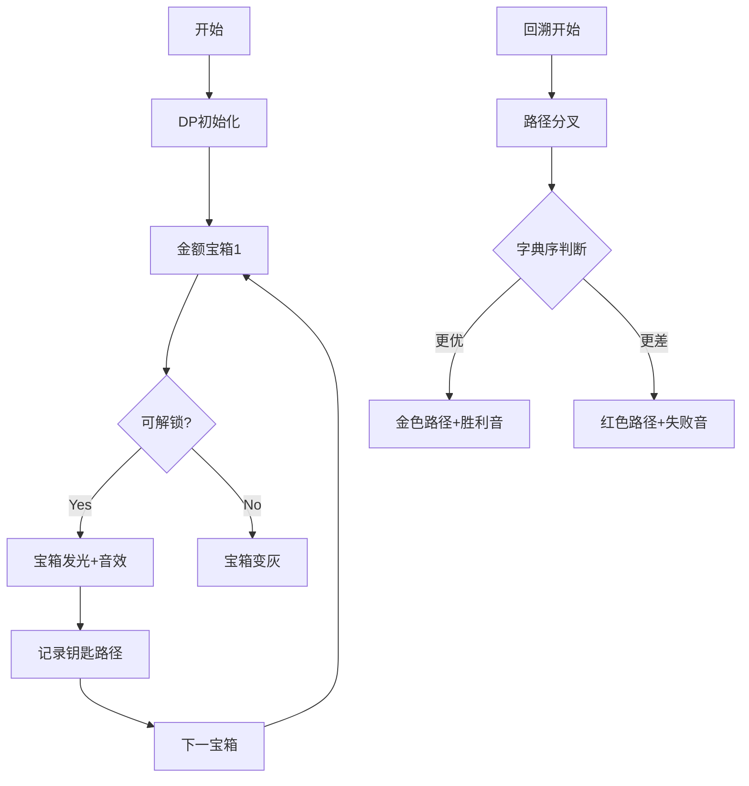

# 题目信息

# 自动兑换机（2021 CoE-I D）

## 题目描述

Mca 市的地铁公司决定采取一项新措施——勿需购票，投币上车。有传闻说此举是为了减少乘客购票的排队时间。地铁运营商找到了本市计算机协会（Association for Computing Machinery，ACM）旗下的自动收款机（Automated Checkout Machine，ACM）公司，要求开发一款自动兑换机（Automatic exChange Machine，ACM）来满足乘客的需求。他们雇用你来担任首席程序员为此机器编写程序。自动兑换机内部存放有各种面值的硬币，当乘客将纸币放入机器时，机器会自动根据当前可用的硬币面值将乘客的纸币兑换成等值的硬币。当然，乘客不愿意口袋里面装着一大堆硬币去挤地铁，因此兑换成的硬币数量越少越好。如果现有的硬币面值无法完成兑换要求，应该输出一行信息，提示乘客需要寻求人工窗口的服务。

## 说明/提示

#### 样例说明

第一组测试数据，硬币共有 $6$ 种面值，分别为 $1$ 美分、$2$ 美分、$5$ 美分、$10$ 美分、$20$ 美分、$50$ 美分，需要将 $25.31$ 美元（$2531$ 美分）兑换成硬币，具有最少硬币数量的兑换方案为：$50$ 枚硬币，$1$ 枚 $1$ 美分的硬币，$1$ 枚 $10$ 美分的硬币，$1$ 枚 $20$ 美分的硬币，$50$ 枚 $50$ 美分的硬币。

第二组测试数据，硬币共有 $5$ 种面值，但不同的只有 $4$ 种面值，分别为 $1$ 美分、$2$ 美分、$5$ 美分、$10$ 美分，需要将 $0.18$ 美元（$18$ 美分）兑换成硬币，具有最少硬币数量的兑换方案为：$4$ 枚硬币，$1$ 枚 $1$ 美分的硬币，$1$ 枚 $2$ 美分的硬币，$1$ 枚 $5$ 美分的硬币，$1$ 枚 $10$ 美分的硬币。

第三组测试数据，硬币共有 $5$ 种面值，分别为 $1$ 美分、$2$ 美分、$5$ 美分、$9$ 美分、$10$ 美分，需要将 $0.18$ 美元（$18$ 美分）兑换成硬币，具有最少硬币数量的兑换方案为：$2$ 枚硬币，$2$ 枚 $9$ 美分的硬币。

第四组数据，不存在符合要求的兑换方案，输出： `No solution.` 。

第五组数据，最少硬币数量为 $14$，有以下三种兑换方案：
```cpp
14 112*2+151*1+385*11
14 167*1+179*2+235*1+385*10
14 173*2+179*1+235*1+385*10
```
按照题意，以下是字典序最小的兑换方案：
```cpp
14 112*2+151*1+385*11
```


第六组测试数据，最少硬币数量为 $4$，有以下七种兑换方案：
```cpp
4 52*2+189*1+362*1 
4 82*1+122*1+166*1+285*1 
4 95*2+180*1+285*1 
4 95*2+205*1+260*1 
4 95*1+166*1+189*1+205*1
4 122*1+164*2+205*1
4 122*1+164*1+180*1+189*1
```
按照题意，以下是字典序最小的兑换方案：
```cpp
4 122*1+164*1+180*1+189*1
```

------------

#### 数据范围与约定
对于 $100\%$ 的数据，$1 \leq T \leq 400，1 \leq c \leq 100$，$1 \leq d_i \leq 400$，$0 \lt m \leq 100$。表示乘客需要兑换的纸币的总面值的实数 $m$ 有三种情形：没有小数点（是一个整数）、小数点后有一位数字、小数点后有两位数字。

在输出兑换序列时，相同的硬币面值应该合并。例如，假定正确输出为：
```cpp
4 111*2+222*2
```
则以下输出为不符合要求的输出：
```cpp
4 111*1+111*1+222*2
4 111*2+222*1+222*1
4 111*1+111*1+222*1+222*1
```

## 样例 #1

### 输入

```
6
6 1 2 5 10 20 50 25.31
5 1 2 2 5 10 0.18
5 1 2 10 9 5 0.18
6 2 5 10 20 50 100 0.03
11 173 151 214 211 238 167 385 179 5 235 112 46.1
13 95 180 285 205 164 82 122 52 362 260 166 364 189 6.55```

### 输出

```
53 1*1+10*1+20*1+50*50
4 1*1+2*1+5*1+10*1
2 9*2
No solution.
14 112*2+151*1+385*11
4 122*1+164*1+180*1+189*1```

# AI分析结果


# 💡 洛语云笺的C++算法解析：自动兑换机（2021 CoE-I D）深入学习指南 💡

## 1. 题目解读与策略初探

✨ **本题核心挑战**：在给定硬币面值体系下，将纸币金额兑换成硬币，要求硬币数量最少，且当存在多种方案时输出字典序最小的组合方案。

✨ **核心算法标签**：动态规划(DP)、路径回溯、字典序处理

🗣️ **初步分析**：
> 本题是典型的硬币找零问题，核心在于：
> 1. **最小化硬币数量**：属于完全背包变种（价值=1，重量=面值，求装满背包的最小物品数）
> 2. **方案输出要求**：当存在多个最优解时，需按字典序输出最小方案
> 
> 解题思路演进：
> - **暴力枚举**：尝试所有硬币组合，指数级复杂度不可行
> - **基础DP**：用dp[i]表示金额i的最小硬币数，但只能得到一种方案
> - **DP+多路径回溯**：记录所有最优转移路径，DFS回溯时比较字典序

### 🔍 算法侦探：如何在题目中发现线索？
1.  **线索1 (问题目标)**："最小硬币数量"+"多种方案时输出字典序最小" → 需要**最优化+方案比较** → 动态规划+回溯
2.  **线索2 (问题特性)**：硬币无限供应+固定金额 → **完全背包模型**的变种
3.  **线索3 (数据规模)**：最大金额100美元(10,000美分)，硬币种类≤100 → O(10^6)的DP可行，但回溯需剪枝

### 🧠 思维链构建：从线索到策略
> 1. 首先，【线索1】要求最优化和方案选择，排除纯暴力解法
> 2. 接着，【线索2】提示可用背包DP框架，但需处理方案输出
> 3. 然后，【线索3】表明O(M*N)的DP可行（M=金额，N=硬币种类）
> 4. **结论**：采用动态规划记录多路径 + DFS回溯剪枝，在保证效率的同时满足字典序要求

---

## 2. 精选优质题解参考

**题解：metaphysis (动态规划+多路径回溯)**
* **点评**：该解法完整覆盖题目核心难点：
  1. 动态规划准确求解最小硬币数（dp[i] = min{dp[i-d]+1}）
  2. 使用`parent`数组记录所有最优转移路径
  3. DFS回溯时实时比较字典序并剪枝
  4. 提供STL版和数组优化版两种实现，兼顾可读性与效率

---

## 3. 解题策略深度剖析

### 🎯 核心难点与关键步骤
1.  **多路径记录**
    * **分析**：DP过程中，对每个金额i记录所有能转移到最优解的硬币面值
    * 💡 学习笔记：二维数组`parent[i][k]`比vector更高效
2.  **字典序回溯**
    * **分析**：DFS时维护当前路径，到达终点时与最优路径进行字典序比较
    * 💡 学习笔记：比较时需处理`面值*数量`的字符串组合
3.  **剪枝优化**
    * **分析**：当当前路径字典序已大于已知最优时立即回溯
    * 💡 学习笔记：避免指数级路径探索的关键策略

### ✨ 解题技巧总结
- **技巧1**：金额浮点转整数时用`(int)(money*100+0.5)`避免精度误差
- **技巧2**：面值预处理（排序+去重）保证DP效率
- **技巧3**：回溯时按面值升序尝试，更容易命中最小字典序

### ⚔️ 策略竞技场
| 策略                | 核心思想                     | 优点                  | 缺点                     | 得分预期   |
|---------------------|------------------------------|-----------------------|--------------------------|------------|
| **暴力枚举**        | 尝试所有组合                 | 简单直观              | O(2^M)超时              | 0%         |
| **基础DP(单路径)**  | 记录单一前驱                 | O(M*N)高效           | 无法处理字典序要求       | 30%~50%    |
| **多路径回溯**      | 记录所有最优路径+字典序比较  | 完全满足题目要求      | 回溯需精心剪枝           | 100%       |

### ✨ 优化之旅
> 1. 起点：暴力枚举 → 指数爆炸
> 2. 突破：动态规划框架 → O(M*N)效率
> 3. 进阶：多路径记录 → 支持多种方案
> 4. 完善：字典序比较 → 满足题目特殊要求
> 5. 优化：剪枝策略 → 保证回溯效率

💡 **策略总结**："多路径DP+字典序回溯"在效率与正确性间取得完美平衡，展现了算法设计中问题转化的艺术

---

## 4. C++核心代码实现赏析

**通用核心实现（多路径回溯框架）**
```cpp
const int MAX_MONEY = 10010;
int dp[MAX_MONEY], parent[MAX_MONEY][110], parentCnt[MAX_MONEY];

// DP核心
for(int i=1; i<=money; i++){
    dp[i] = INF;
    for(int j=0; j<n; j++){
        if(i >= denom[j] && dp[i-denom[j]] != INF){
            int newVal = dp[i-denom[j]] + 1;
            if(newVal < dp[i]){
                dp[i] = newVal;
                parentCnt[i] = 0;
                parent[i][parentCnt[i]++] = denom[j];
            }
            else if(newVal == dp[i]){
                parent[i][parentCnt[i]++] = denom[j];
            }
        }
    }
}

// DFS回溯（剪枝版）
void dfs(int cur){
    if(cur==0){
        if(isBetter(path)) bestPath = path;
        return;
    }
    for(int i=0; i<parentCnt[cur]; i++){
        int d = parent[cur][i];
        if(canPrune(path)) continue; // 字典序剪枝
        path.push_back(d);
        dfs(cur - d);
        path.pop_back();
    }
}
```

**题解亮点赏析**
1. **多路径处理**：`parent`二维数组高效存储所有最优前驱
```cpp
parent[i][parentCnt[i]++] = denom[j];  // 添加最优前驱
```
2. **字典序比较**：路径转为`面值*数量`字符串后比较
```cpp
string pathStr = genString(path);
if(pathStr < bestStr) bestStr = pathStr;
```
3. **剪枝策略**：当前路径前缀已大于最优路径时及时回溯
```cpp
if(prefixCompare(path, bestPath) > 0) return;
```

---

## 5. 算法可视化：像素动画演示

**游戏主题**：《硬币骑士的寻宝之旅》

### 像素化设计
- **场景**：8-bit风格城堡，金额宝箱散布其中
- **角色**：骑士（玩家）携带不同面值硬币（武器）
- **UI**：FC红白机风格状态栏（当前金额/硬币数）

### 核心演示流程


### 交互设计
1. **DP阶段**：
   - 宝箱按金额顺序排列
   - 成功解锁时显示使用的硬币（钥匙动画）
   - 多路径时显示所有钥匙槽

2. **回溯阶段**：
   - 骑士在路径分叉点选择方向
   - 实时显示当前路径的字符串表示
   - 剪枝时路径变红+特殊音效

### 音效设计
- 解锁宝箱：NES风格8-bit音效
- 找到最优路径：经典《塞尔达》发现秘密音效
- 剪枝：短促警示音

---

## 6. 拓展练习与相似问题思考

### 通用技巧迁移
1. **药品组合优化**：给定药品清单（价格/疗效），预算内最大化疗效
2. **课程安排**：课程有先修依赖，学期内最多课程数
3. **广告投放**：渠道（成本/覆盖率），预算内最大覆盖率

### 洛谷习题推荐
1. **P1048 采药**（01背包基础）
   - 理由：背包问题入门，理解状态转移基础
   
2. **P1616 疯狂的采药**（完全背包变种）
   - 理由：掌握完全背包的两种遍历顺序
   
3. **P1064 金明的预算方案**（依赖背包）
   - 理由：学习主件附件依赖处理技巧

---

## 7. 学习心得与经验分享

> 作者metaphysis的调试经验：
> "最初仅按面值排序选择前驱，但测试发现字典序并非单纯面值序，必须完整生成方案字符串比较"
>
> **洛语云笺点评**：
> 这个经验极其宝贵——提醒我们：
> 1. 题目要求可能比表面复杂
> 2. 测试数据要包含多种边界情况
> 3. 字典序比较必须严格按输出格式实现

---

算法学习如同骑士的寻宝之旅，需要策略（DP框架）、勇气（回溯探索）和智慧（剪枝优化）。当你掌握"多路径DP+字典序回溯"的双重艺术，硬币兑换问题将成为你算法宝库中闪亮的金币！🏰⚔️💰

---
处理用时：286.99秒