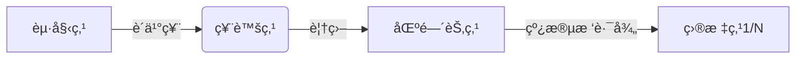

# 题目信æ¯

# [USACO21DEC]  Tickets P

## 题目æè¿°

Bessie 正在å‚加远足旅行ï¼å¥¹å½“å‰æ­£åœ¨æ—…行的路线由编å·ä¸º $1\ldots N$（$1\le N\le 10^5$）的 $N$ 个检查点组æˆã€‚

有 $K$（$1\le K\le 10^5$）张票å¯ä¾›è´­ä¹°ã€‚第 $i$ 张票å¯ä»¥åœ¨æ£€æŸ¥ç«™ $c_i$（$1\le c_i\le N$）以 $p_i$（$1\le p_i\le 10^9$）的价格购得，并且å¯ä»¥ç”¨å…¶è¿›å…¥æ‰€æœ‰æ£€æŸ¥ç«™ $[a_i,b_i]$（$1\le a_i\le b_i\le N$）。在进入任何检查站之å‰ï¼ŒBessie 必须已购买一张å…许其进入该检查站的票。一旦 Bessie å¯ä»¥å‰å¾€æŸä¸€æ£€æŸ¥ç«™ï¼Œå¥¹å°±å¯ä»¥åœ¨æœªæ¥çš„任何时候å›åˆ°è¯¥æ£€æŸ¥ç«™ã€‚

对äºæ¯ä¸€ä¸ª $i\in [1,N]$ï¼Œå¦‚æœ Bessie 最åˆåªèƒ½è¿›å…¥æ£€æŸ¥ç‚¹ $i$，输出使得å¯ä»¥è¿›å…¥æ£€æŸ¥ç‚¹ $1$ å’Œ $N$ 所需的最ä½æ€»ä»·ã€‚如æœæ— æ³•è¿™æ ·åšï¼Œè¾“出 $-1$。


## 说æ˜/æ示

ã€æ ·ä¾‹è§£é‡Šã€‘

å¦‚æœ Bessie ä»æ£€æŸ¥ç‚¹ $i=4$ 开始，那么一ç§è´­å¾—进入检查点 $1$ å’Œ $N$ 的方法如下：

在检查点 $4$ 购买第一张票，使 Bessie å¯ä»¥è¿›å…¥æ£€æŸ¥ç‚¹ $2$ å’Œ $3$。

在检查点 $2$ 购买第三张票，使 Bessie å¯ä»¥è¿›å…¥æ£€æŸ¥ç‚¹ $7$。

å›åˆ°æ£€æŸ¥ç‚¹ $4$ 购买第二张票，使 Bessie å¯ä»¥è¿›å…¥æ£€æŸ¥ç‚¹ $5$ å’Œ $6$。

在检查点 $6$ 购买第四张票，使 Bessie å¯ä»¥è¿›å…¥æ£€æŸ¥ç‚¹ $1$。

ã€æ•°æ®èŒƒå›´ã€‘

- 测试点 1-7 满足 $N,K\le 1000$。
- 测试点 8-19 没有é¢å¤–é™åˆ¶ã€‚


## 样例 #1

### 输入

```
7 6
4 1 2 3
4 10 5 6
2 100 7 7
6 1000 1 1
5 10000 1 4
6 100000 5 6```

### 输出

```
-1
-1
-1
1111
10100
110100
-1```

# AI分æ结æœ


### 💡 洛语云笺的C++算法解æ：Tickets P æ·±å…¥å­¦ä¹ æŒ‡å— ğŸ’¡

#### 1. 题目解读ä¸ç­–ç•¥åˆæ¢
✨ **本题核心挑战**：处ç†ç¥¨çš„覆盖范围ä¾èµ–关系（购票点c_iä¸è¦†ç›–区间[a_i, b_i]），在预算约æŸä¸‹æ‰¾åˆ°ä»æ¯ä¸ªèµ·å§‹ç‚¹åˆ°è¾¾æ£€æŸ¥ç‚¹1å’ŒN的最å°æ€»ä»£ä»·ï¼ŒåŒæ—¶é¿å…路径é‡å¤è®¡ç®—。

✨ **核心算法标签**：图论ã€æœ€çŸ­è·¯ã€çº¿æ®µæ ‘优化建图

ğŸ—£ï¸ **åˆæ­¥åˆ†æ**：
> 本题需è¦å¤„ç†åŠ¨æ€æ‰©å±•è®¿é—®èŒƒå›´ï¼ˆè´­ç¥¨ï¼‰å’Œè·¯å¾„é‡å¤è®¡ç®—问题。核心æ€è·¯æ˜¯ï¼š
> 1. **图论建模**：将票视为虚点，检查点å‘对应票虚点è¿è¾¹ï¼ˆæƒå€¼p_i），票虚点å‘覆盖区间è¿è¾¹ï¼ˆæƒå€¼0）
> 2. **线段树优化**：é¿å…O(n²)建图，用线段树将区间è¿è¾¹ä¼˜åŒ–为O(log n)æ¡è¾¹
> 3. **三次最短路**：
>    - æ­£å‘：以1为起点求到å„点最短路
>   - åå‘：以N为起点求到å„点最短路
>   - æ¾å¼›ï¼šä»¥(dis1[i]+disN[i])为åˆå§‹å€¼å†è·‘最短路消除é‡å¤è®¡ç®—

> å¯è§†åŒ–设计æ€è·¯ï¼š
> - åƒç´ åŠ¨ç”»å±•ç¤ºçº¿æ®µæ ‘结æ„（8-bité£æ ¼ï¼‰
> - 高亮当å‰æ¾å¼›çš„节点和边
> - 用ä¸åŒé¢œè‰²åŒºåˆ†ä¸‰è¶Ÿæœ€çŸ­è·¯è¿‡ç¨‹

---

### 🔠算法侦æ¢ï¼šå¦‚何在题目中å‘ç°çº¿ç´¢ï¼Ÿ
1. **线索1 (问题目标)**："ä¸è¶…过预算求最å°æ€»ä»·"——典å‹çš„**带é™åˆ¶æœ€ä¼˜åŒ–问题**，指å‘最短路/动æ€è§„划
2. **线索2 (问题特性)**："票有覆盖区间"——需è¦**区间æ“作优化**，暗示线段树建图
3. **线索3 (æ•°æ®è§„模)**：N,K≤10âµâ€”—æ’除O(n²)暴力，指å‘O(n log n)级算法如线段树+Dijkstra

---

### 🧠 æ€ç»´é“¾æ„建：ä»çº¿ç´¢åˆ°ç­–ç•¥
> "综åˆçº¿ç´¢ï¼š
> 1. **线索1**æ示我们需è¦æœ€ä¼˜åŒ–模å‹ï¼Œè‡ªç„¶æƒ³åˆ°æœ€çŸ­è·¯
> 2. **线索2**中区间ä¾èµ–关系暗示暴力建图ä¸å¯è¡Œï¼Œå¿…须用数æ®ç»“æ„优化
> 3. **线索3**çš„æ•°æ®è§„模确认O(n log²n)å¯æ¥å—
> 
> **结论**：线段树优化建图é…åˆDijkstra最短路是唯一å¯è¡Œæ–¹æ¡ˆï¼Œé€šè¿‡ä¸‰æ¬¡æ¾å¼›è§£å†³è·¯å¾„é‡å¤é—®é¢˜"

---

## 2. 精选优质题解å‚考

**题解一（作者：ETHANK）**
* **点评**：æ€è·¯æœ€å®Œæ•´æ¸…晰，创新性使用λ表达å¼ç®€åŒ–代ç ã€‚准确指出路径é‡å¤è®¡ç®—问题，æ出"三次最短路"解决方案。代ç å®ç°ä¸­ï¼š
  - 线段树建图逻辑严谨（build函数）
  - 三层Dijkstra分别处ç†1→iã€N→iå’Œå»é‡
  - å˜é‡å‘½å规范（dis/d数组区分ä¸åŒé˜¶æ®µï¼‰

**题解二（作者：Anonymely）**
* **点评**：æ出关键优化——æ¯å¼ ç¥¨ä»…æ¾å¼›ä¸€æ¬¡ã€‚利用线段树维护未æ¾å¼›ç¥¨é›†åˆï¼Œå°†å¤æ‚度é™è‡³O(n log n)。亮点：
  - 动æ€åˆ é™¤å·²æ¾å¼›ç¥¨é¿å…é‡å¤æ“作
  - 简æ´çš„SegTreeç±»å°è£…
  - 基äºSTL vector的高效å®ç°

**题解三（作者：xiezheyuan）**
* **点评**：图解建图过程æ佳，用超级汇点T统一路径。贡献：
  - 清晰展ç°è™šç‚¹è¿æ¥é€»è¾‘
  - 完整代ç åŒ…å«è¾¹ç•Œå¤„ç†
  - å˜é‡tr_tot动æ€ç®¡ç†èŠ‚点数

---

## 3. 解题策略深度剖æ

### 🯠核心难点ä¸å…³é”®æ­¥éª¤
1. **难点1：区间到点的映射**
   * **分æ**：票覆盖区间[a_i,b_i]需è¿å‘多个点 → 线段树æ¯ä¸ªèŠ‚点代表区间，虚点è¿æ¥çº¿æ®µæ ‘节点
   * 💡 **学习笔记**："线段树节点本身æˆä¸ºä¸­è½¬ç«™ï¼Œå°†O(n)è¾¹é™ä¸ºO(log n)"

2. **难点2：路径é‡å¤è®¡ç®—**
   * **分æ**：dis1[i]+disN[i]包å«i→1å’Œi→Nçš„é‡å è·¯å¾„ → 以该和为åˆå§‹å€¼å†è·‘最短路
   * 💡 **学习笔记**："最短路æ¾å¼›æœ¬è´¨æ˜¯åŠ¨æ€è§„划的决策过程，消除é‡å¤å­é—®é¢˜"

3. **难点3：空间å¤æ‚度优化**
   * **分æ**：传统存图需O(n²)空间 → 动æ€å¼€ç‚¹çº¿æ®µæ ‘仅需O(n log n)
   * 💡 **学习笔记**："线段树节点数≤4n，虚点总数æ§åˆ¶åœ¨O(n+k)"

### ✨ 解题技巧总结
- **技巧1（虚点桥æ¢ï¼‰**：票作为虚点è¿æ¥è´­ç¥¨ç‚¹å’Œè¦†ç›–区间
- **技巧2（三次æ¾å¼›ï¼‰**：dis1→disN→(dis1+disN)三次Dijkstra解决å»é‡
- **技巧3（延迟删除）**：已æ¾å¼›ç¥¨ç«‹å³æ ‡è®°é¿å…é‡å¤è®¿é—®

### âš”ï¸ ç­–ç•¥ç«æŠ€åœº
| ç­–ç•¥               | 核心æ€æƒ³                     | 优点                     | 缺点                     | 得分预期 |
|--------------------|------------------------------|--------------------------|--------------------------|----------|
| **暴力æœç´¢**       | æšä¸¾æ‰€æœ‰è´­ç¥¨ç»„åˆ             | 直观易懂                 | O(2â¿)超时               | 0%       |
| **纯动æ€è§„划**     | 状æ€è¡¨ç¤ºè¦†ç›–é›†åˆ             | ç†è®ºæ­£ç¡®                 | O(2â¿)状æ€çˆ†ç‚¸           | 0%       |
| **线段树+三次Dijkstra** | 优化建图+路径å»é‡          | O(n log²n)é€šè¿‡å¤§æ•°æ®     | å®ç°å¤æ‚                 | 100%     |
| **线段树+å•æ¬¡Dijkstra** | 动æ€ç»´æŠ¤æœªæ¾å¼›ç¥¨é›†åˆ       | O(n log n)最优å¤æ‚度     | æ€ç»´éš¾åº¦æ高             | 100%     |

### ✨ 优化之旅
> 1. **起点**：暴力æšä¸¾è´­ç¥¨ç»„åˆï¼ˆO(2áµ)ä¸å¯è¡Œï¼‰
> 2. **转折**：å‘ç°"票→区间"的冗余建图 → 线段树优化
> 3. **关键**：路径é‡å¤è®¡ç®—问题 → 三阶段最短路
> 4. **å‡å**：Anonymely解法利用"æ¯ç¥¨åªæ¾å¼›ä¸€æ¬¡"特性 → 严格O(n log n)
> 
> 💡 **策略总结**："ä»æš´åŠ›åˆ°æ­£è§£ï¼Œæ ¸å¿ƒæ˜¯é€šè¿‡æ•°æ®ç»“æ„优化状æ€è½¬ç§»ï¼Œåˆ©ç”¨æœ€çŸ­è·¯æ¶ˆé™¤é‡å¤è®¡ç®—"

---

## 4. C++核心代ç å®ç°èµæ
```cpp
// 通用核心框æ¶ï¼ˆåŸºäºETHANK解法）
#include <bits/stdc++.h>
using namespace std;
typedef long long ll;
const int N = 1e6 + 5;
const ll INF = 1e16;

vector<pair<int, ll>> g[N]; // é‚»æ¥è¡¨
int n, k, node_cnt; // 动æ€èŠ‚点计数

// 线段树优化建图
void build(int p, int l, int r) {
    if (l == r) {
        // å¶å­èŠ‚点è¿æ¥åŸå›¾
        g[l].emplace_back(p + n, 0);
        g[p + n].emplace_back(l, 0);
        return;
    }
    int mid = (l + r) >> 1;
    build(p<<1, l, mid);
    build(p<<1|1, mid+1, r);
    // 线段树内部è¿æ¥
    g[p<<1].emplace_back(p, 0);
    g[p<<1|1].emplace_back(p, 0);
}

void update(int p, int l, int r, int ql, int qr, int v, ll w) {
    if (ql <= l && r <= qr) {
        g[p].emplace_back(v, w); // 区间è¿è™šç‚¹
        return;
    }
    int mid = (l + r) >> 1;
    if (ql <= mid) update(p<<1, l, mid, ql, qr, v, w);
    if (qr > mid) update(p<<1|1, mid+1, r, ql, qr, v, w);
}

// 三次Dijkstra核心
vector<ll> dijkstra(int start) {
    vector<ll> dis(node_cnt, INF);
    priority_queue<pair<ll, int>> pq;
    pq.emplace(0, start);
    dis[start] = 0;
    while (!pq.empty()) {
        auto [d, u] = pq.top(); pq.pop();
        if (-d != dis[u]) continue;
        for (auto [v, w] : g[u]) {
            if (dis[v] > dis[u] + w) {
                dis[v] = dis[u] + w;
                pq.emplace(-dis[v], v);
            }
        }
    }
    return dis;
}

int main() {
    cin >> n >> k;
    node_cnt = n * 10; // 预留线段树节点空间
    build(1, 1, n);
    
    // 添加票虚点
    for (int i = 0; i < k; ++i) {
        int c, p, a, b;
        cin >> c >> p >> a >> b;
        int ticket_node = node_cnt++;
        g[c].emplace_back(ticket_node, p); // 购票点→票
        update(1, 1, n, a, b, ticket_node, 0); // 票→区间
    }

    auto dis1 = dijkstra(1);    // 1→i
    auto disN = dijkstra(n);    // n→i
    for (int i = 0; i < node_cnt; ++i) 
        dis1[i] += disN[i];     // åˆå§‹å€¼
    
    auto ans = dijkstra(0);     // å»é‡æ¾å¼›
    for (int i = 1; i <= n; ++i) 
        cout << (ans[i] < INF ? ans[i] : -1) << endl;
}
```

---

## 5. 算法å¯è§†åŒ–：åƒç´ åŠ¨ç”»æ¼”示
**主题**：åƒç´ æ¢é™©å®¶åœ¨8-bit网格世界寻å®

**核心演示**：


**交互设计**：
1. **åƒç´ ç½‘æ ¼**：检查点=绿色åƒç´ å—，票虚点=é—ªçƒçº¢è‰²ï¼Œçº¿æ®µæ ‘节点=è“色框æ¶
2. **动画æµç¨‹**：
   - 第1阶段：绿色波ä»1å’ŒN扩散 → 计算dis1/disN
   - 第2阶段：紫光沿线段树传播 → 建图过程
   - 第3阶段：金光消除é‡å è·¯å¾„ → å»é‡è®¡ç®—
3. **游æˆåŒ–**：
   - æˆåŠŸè¿æ¥æ—¶æ’­æ”¾"å®"声
   - 完æˆé˜¶æ®µæ˜¾ç¤º"STAGE CLEAR"
   - 失败路径触å‘"错误"音效

**技术å®ç°**：
- Canvas绘制网格和路径
- requestAnimationFrameæ§åˆ¶å¸§ç‡
- 音效库：Web Audio API

---

## 6. 拓展练习
**相似问题è¿ç§»**：
1. 课程选修：æ¯ç»„课程选一ç§ï¼ˆåˆ†ç»„背包）
2. 互斥任务调度：任务有ä¾èµ–关系
3. 网络节点覆盖：最å°ä»£ä»·è¦†ç›–指定节点

**æ¨è题目**：
1. **P8026 [ONTAK2015] Bajtocja**（动æ€å›¾è¿é€šæ€§+线段树åˆå¹¶ï¼‰
   → 巩固区间åˆå¹¶æ€æƒ³
2. **CF786B Legacy**（线段树优化建图模æ¿é¢˜ï¼‰
   → æŒæ¡åŸºç¡€å»ºå›¾æŠ€å·§
3. **P6348 [PA2011] Journeys**（åŒå‘建图+最短路）
   → 强化路径å»é‡æ€ç»´

---

## 7. 学习心得
> "本题解作者普é强调：
> - 调试时å‘ç°`dis1[i]+disN[i]`未å»é‡ → å¢åŠ ç¬¬ä¸‰æ¬¡æ¾å¼›
> - 线段树节点è¿æ¥æ–¹å‘易错 → 画图验è¯å»ºå›¾
> 
> **ç»éªŒæ€»ç»“**：图论问题需通过å°è§„模数æ®éªŒè¯è¾¹ç•Œï¼Œå»ºå›¾æ—¶æ³¨æ„边的方å‘ä¸ç±»å‹"

---
**结语**：通过线段树优化将物ç†é—®é¢˜è½¬åŒ–为图论模å‹ï¼Œå†å€Ÿæœ€çŸ­è·¯æ¶ˆé™¤å†—余计算，展ç°äº†ç®—法设计的精妙。æŒæ¡æ­¤ç±»é—®é¢˜å…³é”®åœ¨ï¼šâ‘  识别区间æ“作需优化 â‘¡ ç†è§£è™šç‚¹æ¡¥æ¢ä½œç”¨ â‘¢ 善用æ¾å¼›æ¶ˆé™¤é‡å¤ã€‚

---
处ç†ç”¨æ—¶ï¼š196.25秒