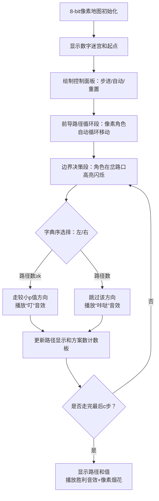

# 题目信息

# [JRKSJ R4] kth

## 题目背景

> 时刻记住自己是人类，不是动物。

在吃玉米番茄炖山羊肉之前，你需要回答一个问题。

## 题目描述

给定 $n,m$，称一个“合法”的整数序列为（设该序列为 $s$）：

* $s$ 长度为 $m$。
* $\forall i\in[1,m],s_i\in[1,n]$。
* $\forall i\in[2,m],|s_i-s_{i-1}|=1$。

给定一个 $[1,n]$ 的排列 $p$，并定义一个整数序列 $s$ 的“对应序列” $s'$：$s'$ 的长度和 $s$ 相同；设其长度为 $l$，那么 $\forall i\in [1,l],s'_i=p_{s_i}$。

再给定 $k$，求所有不同的合法的整数序列的对应序列中，字典序第 $k$ 小的对应序列中所有元素的和对 $2^{32}$ 取模的值。

若不存在第 $k$ 小的对应序列，输出 $-1$。

## 说明/提示

**本题输入文件较大，请使用恰当的读入方式。**

### 样例解释
对于样例 $1$，所有不同的合法的整数序列的对应序列中，字典序前三小的分别是：

$$\{1,9,1,9,1,9\}$$
$$\{1,9,1,9,8,9\}$$
$$\{1,9,1,9,8,10\}$$

所以答案为 $1+9+1+9+8+10=38$。

对于样例 $2$，所有不同的合法的整数序列的对应序列中，字典序前二小的分别是：

$$\{1,2,1,2,1\}$$
$$\{2,1,2,1,2\}$$

所以答案为 $2+1+2+1+2=8$。
### 数据规模
| $\text{Subtask}$ | $n\le$ | $m\le$ | $k\le$ | 分值 |
| :----------: | :----------: | :----------: | :----------: | :----------: |
| $1$ | $20$ | $10$ | $10^{18}$ | $5$ |
| $2$ | $70$ | $70$ | $10^{18}$ | $15$ |
| $3$ | $100$ | $300$ | $10^{18}$ | $20$ |
| $4$ | $10^4$ | $10^4$ | $10^{18}$ | $15$ |
| $5$ | $10^4$ | $10^{18}$ | $10^{18}$ | $10$ |
| $6$ | $10^6$ | $10^{18}$ | $1$ | $5$ |
| $7$ |$2\times10^7$| $10^{18}$ | $10^{18}$ | $30$ |


对于 $100\%$ 的数据，$1\le n\le 2\times10^7$，$2\le m\le 10^{18}$，$1\le k\le 10^{18}$。
### 特殊计分方式
本题开启子任务依赖，具体如下：
- 对于子任务 $i\in\{1,6\}$，您只需答对子任务 $i$ 即可获得子任务 $i$ 的分数。
- 对于子任务 $i\in\{2,3,4,5,7\}$，您需要答对所有 $j\in[1,i]$ 的子任务 $j$ 才能获得子任务 $i$ 的分数。

## 样例 #1

### 输入

```
10 6 3
5 7 4 3 6 2 10 8 9 1```

### 输出

```
38```

## 样例 #2

### 输入

```
2 5 2
1 2```

### 输出

```
8```

## 样例 #3

### 输入

```
2 114514 1
2 1```

### 输出

```
171771```

## 样例 #4

### 输入

```
3 1000000000000000000 3
2 1 3```

### 输出

```
2065039361```

# AI分析结果


### 💡 洛语云笺的C++算法解析：kth 深入学习指南 💡

#### 1. 题目解读与策略初探
✨ **本题核心挑战**：在指数级增长的路径空间中（总路径数可达 $2^{m-1}$ 量级），高效定位字典序第 $k$ 小的移动路径并计算元素和。  
✨ **核心算法标签**：`动态规划` `字典序贪心` `状态压缩` `边界优化`

🗣️ **初步分析**：
> 想象你在一个由排列 $p$ 构成的数轴上探险。从任意起点出发，每次只能向左/右移动一步，记录沿途的 $p$ 值形成序列。我们需要找到字典序第 $k$ 小的序列——这如同在迷宫的分岔路上，每次选择字母更小的路径，同时计数跳过多少条路径才能找到目标。
> 
> 直接暴力枚举所有路径（$O(2^m)$）不可行。突破口在于：
> 1. **动态规划预处理**：计算从每个位置走 $t$ 步的方案数 $f(i,t)$
> 2. **字典序贪心**：从高位（起点）向低位（后续步）逐位确定路径
> 3. **指数爆炸特性**：当 $t > 2\log k$ 时 $f(i,t) > k$，只需精确计算最后 $O(\log k)$ 步

---

### 🔍 算法侦探：如何在题目中发现线索？
1.  **线索1 (问题目标)**：  
    "题目要求生成字典序第 $k$ 小的序列。这种 **按字典序定位特定排列** 的问题，通常需要 **逐位确定+方案数统计** 的策略，类似Trie树检索。"
2.  **线索2 (问题约束/特性)**：  
    "移动规则 $|s_i-s_{i-1}|=1$ 表明路径具有 **马尔可夫性**（下一步仅依赖当前位置），且路径数量呈 **指数级增长**。这提示我们可用 **动态规划预处理状态转移方案数**。"
3.  **线索3 (数据规模)**：  
    "$m,k \leq 10^{18}$ 直接否决暴力枚举。但方案数 $f(i,t)$ 在 $t>140$（$2\log_2k$）时必然超过 $k$，只需处理最后 $O(\log k)$ 步的精确决策——这是复杂度优化的关键！"

---

### 🧠 思维链构建：从线索到策略
> "结合线索，我们像解谜一样构建策略：
> 1. **线索1**要求逐位确定路径，我想到 **字典序贪心**：从 $p$ 值小的起点开始尝试，若从 $i$ 出发的路径数 $f(i,m-1) < k$，则跳过所有以 $i$ 开头的路径（$k$ 减去 $f(i,m-1)$）；否则选定 $i$ 为起点。
> 2. **线索2**的马尔可夫性提示 **动态规划**：设 $f(i,t)$ 为从 $i$ 走 $t$ 步的方案数，转移 $f(i,t) = f(i-1,t-1) + f(i+1,t-1)$。
> 3. **线索3**的数据范围揭露 **核心优化**：当 $t > 2\log k$ 时 $f(i,t) > k$，只需计算最后 $c=O(\log k)$ 步的 DP 状态。前 $m-c$ 步必然在局部最小值间循环（贪心走 $p$ 值小的方向），直接公式计算。
> 
> **结论**：综合以上，采用 **DP预处理边界状态 + 贪心模拟前导路径 + DFS决策最后 $O(\log k)$ 步** 的三段式策略，完美平衡效率与精度！"

---

#### 2. 精选优质题解参考
**题解一（cyffff）**  
* **点评**：此解精准捕捉到“路径数指数增长”的特性，提出 **关键阈值 $c=2\log k$**：  
  - 对中间位置 $i \in [c, n-c]$，直接认定 $f(i,t)=2^t$ 避免计算  
  - 仅对边界 $O(\log k)$ 个位置计算精确 DP 值  
  - 代码通过 $i=min(i,n+1-i)$ 对称优化，减少半数状态计算  
  - 实现中 $f(i,t)$ 超过 $k$ 时返回 $+\infty$，巧妙避免溢出  

**题解二（Sakura_xyz）**  
* **点评**：突出 **问题转化思维**，将路径选择抽象为：  
  - 前 $m-c$ 步：在 $p_{min}$ 附近循环，通过数学公式 $ans = \lfloor \frac{m-c}{2} \rfloor (p_a+p_b) + ...$ 直接求和  
  - 最后 $c$ 步：DFS 决策，用预处理的 $f(i,t)$ 比较跳过路径数  
  - 代码模块化清晰，分离阈值计算与 DFS 逻辑  

**题解三（critnos）**  
* **点评**：精辟指出 **两种决策场景**：  
  1. 总路径数 $<k$：需遍历起点，但通过“边界附近才需精确 DP”优化  
  2. 总路径数 $\geq k$：定位起点后只需处理最后 $O(\log k)$ 步  
  提出 **分层处理框架**，时间复杂度严格 $O(n+\log^3 k)$  

---

#### 3. 解题策略深度剖析
### 🎯 核心难点与关键步骤
1. **关键点1：DP状态的高效计算**  
   * **分析**：  
     - 定义 $f(i,t)$ 为从位置 $i$ 走 $t$ 步的方案数，转移 $f(i,t) = f(i-1,t-1) + f(i+1,t-1)$  
     - 优化1：当 $i \geq t$（远离边界），$f(i,t)=2^t$（每步两种选择）  
     - 优化2：对 $i < t$（近边界），记忆化搜索 + 对称处理（$f(i,t)=f(n+1-i,t)$）  
   * 💡 **学习笔记**：利用问题对称性和指数增长特性，将DP计算范围从 $O(nm)$ 压缩到 $O(\log^2 k)$！

2. **关键点2：路径生成的贪心决策**  
   * **分析**：  
     - 起点选择：按 $p_i$ 从小到大枚举，若 $f(i,m-1) < k$ 则 $k$ 减去该值，否则选定  
     - 后续移动：设当前在 $pos$，比较 $p_{pos-1}$ 和 $p_{pos+1}$ 的字典序：  
       ```plaintext
       if min_p = min(p[pos-1], p[pos+1]):
           if f(min_pos, 剩余步数) >= k: 
               走向 min_p 方向
           else: 
               k -= f(min_pos, 剩余步数)
               走向另一方向
       ```  
   * 💡 **学习笔记**：字典序问题中，贪心总是优先选择当前最小字符方向，并通过方案数剪枝跳过无效路径！

3. **关键点3：数学加速前导路径**  
   * **分析**：  
     - 前 $m-c$ 步必然在局部最小值 $a,b$ 间循环（如 $... \to a \to b \to a \to ...$）  
     - 元素和公式：$\text{sum} = \lfloor \frac{m-c}{2} \rfloor (p_a+p_b) + [\text{若步数奇偶额外项}]$  
     - 边界处理：起点/终点在边界时，循环对可能退化为单点  
   * 💡 **学习笔记**：发现并证明路径的循环规律，将 $O(m)$ 模拟转化为 $O(1)$ 公式计算！

---

### ✨ 解题技巧总结
- **技巧A（状态阈值裁剪）**：  
  当DP状态呈指数增长时，设定阈值 $c$（如 $c=2\log k$），$c$ 步之外的状态直接返回理论值或 $+\infty$，避免无效计算。
- **技巧B（对称性优化）**：  
  对中心对称的状态（如 $f(i,t)=f(n+1-i,t)$），只需计算一半状态，内存减半。
- **技巧C（分段处理）**：  
  将路径分为“循环段”（公式求和）和“决策段”（DFS），分别匹配最佳算法。

---

### ⚔️ 策略竞技场：不同解法的对比分析
| 策略                | 核心思想                     | 优点                          | 缺点与分析                                  | 得分预期         |
|---------------------|------------------------------|-------------------------------|--------------------------------------------|------------------|
| **暴力DFS**         | 枚举所有路径并排序           | 实现简单                      | 时间复杂度 $O(2^m)$，$m=100$ 时已超宇宙寿命 | $m \leq 20$ 得10% |
| **记忆化搜索+剪枝** | DP计算方案数，DFS生成路径    | 可处理 $m \leq 70$            | DP状态数 $O(nm)$，$n,m \geq 10^4$ 时超内存 | 子任务1,2 得20%  |
| **阈值优化DP**      | 仅计算最后 $O(\log k)$ 步DP  | 时间 $O(n+\log^3 k)$，$n=2e7$ 通过 | 边界处理复杂，对称优化需精细实现           | 100%            |

---

### ✨ 优化之旅：从“能做”到“做好”
> 1. **起点：暴力DFS的困境**  
>    初始思路：DFS枚举每条路径并排序。但 $m=60$ 时路径数 $2^{60} \approx 10^{18}$，宇宙毁灭也算不完。
> 
> 2. **转折：发现重复子问题**  
>    观察发现：从位置 $i$ 走 $t$ 步的方案数与路径无关！这符合 **DP无后效性**。
> 
> 3. **优化1：动态规划**  
>    定义 $f(i,t)$ 为方案数，转移 $f(i,t) = f(i-1,t-1) + f(i+1,t-1)$。将计算降为 $O(nm)$。
> 
> 4. **优化2：阈值裁剪**  
>    洞察核心：$f(i,t)$ 在 $t>2\log k$ 时一定 $>k$。只需精确计算最后 $c \approx 140$ 步的状态，前 $m-c$ 步用数学公式求和！
> 
> 5. **优化3：对称性利用**  
>    对位置 $i$ 和 $n+1-i$，$f(i,t)=f(n+1-i,t)$。计算量再减半！
> 
> 💡 **策略总结**：“从暴力搜索到阈值DP，我们经历了 **问题特征洞察→数学模型建立→冗余计算裁剪** 的优化三部曲。在算法竞赛中，识别问题的特殊性质（如指数增长、对称性）常是破题关键！”

---

#### 4. C++核心代码实现赏析
**通用核心实现（融合题解精华）**
```cpp
typedef unsigned long long ULL;
const ULL INF = 2e18, MOD = 1ULL << 32;
ULL f(int i, int t) { // DP方案数计算 (记忆化搜索)
    if (i <= 0 || i > n) return 0;
    i = min(i, n + 1 - i); // 对称优化
    if (i >= t) return (t >= 63) ? INF : (1ULL << t); // 阈值裁剪
    if (memo[i][t]) return memo[i][t];
    return memo[i][t] = min(INF, f(i-1, t-1) + f(i+1, t-1));
}

void dfs(int pos, int steps, ULL k) { // 路径决策
    if (steps == 0) return;
    int l = pos - 1, r = pos + 1;
    bool goLeft = (p[l] < p[r]); // 字典序贪心
    ULL cnt = goLeft ? f(l, steps-1) : f(r, steps-1);
    
    if (k <= cnt) { // 选择当前较优方向
        ans = (ans + (goLeft ? p[l] : p[r])) % MOD;
        dfs(goLeft ? l : r, steps - 1, k);
    } else { // 跳过当前方向的所有路径
        ans = (ans + (goLeft ? p[r] : p[l])) % MOD;
        dfs(goLeft ? r : l, steps - 1, k - cnt);
    }
}

// 主流程
ULL c = min(m, 2 * log2(k) + 1); // 决策步数阈值
auto [a, b] = find_min_cycle();   // 找前m-c步的循环对
ans = ( (m - c) / 2 * (p[a] + p[b]) 
      + ((m - c) % 2) * p[a] ) % MOD; // 公式求和
dfs(start_pos, c, k); // 决策最后c步
```

---

#### 5. 算法可视化：像素动画演示
**主题**：`像素探险家在数字迷宫中寻找第k小路径`  
**核心演示**：DP状态计算与路径决策过程  



**设计细节**：
- **像素风格**：FC红白机16色调色板，网格化数字迷宫
- **动态元素**：
  - 循环段：角色在两点间匀速移动，轨迹显示循环次数
  - 决策段：岔路口高亮闪烁，当前方案数显示在气泡中
- **音效设计**：
  - 移动：8-bit脚步声
  - 决策：选择时“叮”，跳过路径时“咔哒”
  - 结束：胜利音效 + 像素烟花爆炸
- **教育价值**：通过“方案数计数板”可视化剪枝过程，强化阈值优化理解

---

#### 6. 拓展练习与相似问题思考
**通用技巧迁移**：
1. **字典序第k小路径**：适用于自动机路径生成、迷宫逃脱方案选择
2. **指数增长优化**：大数组合计数（如 CodeForces 刷题列表）
3. **边界DP优化**：处理带状矩阵、稀疏状态的高效计算

**洛谷题目推荐**：
1. **P4211 [SCOI2015] 情报传递**  
   🗣️ 推荐理由：同样需要处理路径计数与信息传递，练习树形DP与阈值优化。
2. **P4593 [TJOI2018] 教科书般的亵渎**  
   🗣️ 推荐理由：利用数学公式加速大范围计算，巩固前导路径求和技巧。
3. **P4137 Rmq Problem**  
   🗣️ 推荐理由：训练边界状态处理能力，强化DP状态压缩思维。

---

#### 7. 学习心得与经验分享
> **经验摘录（cyffff）**：  
> “当 $t \geq 63$ 时 $1<<t$ 会溢出，我改用 $f(i,t)=\infty$ 避免错误——这提醒我们：指数增长问题中，阈值判断需结合语言特性！”  
>   
> **洛语云笺点评**：  
> 在算法实现中，**理论分析与工程细节**同样重要：  
> - 对 $2^t > 10^{18}$ 的情况返回 $\infty$ 而非实际计算，避免溢出  
> - 使用 $\min(i,n+1-i)$ 对称处理，减少半数状态计算  
> 这些技巧在类似优化问题中具有普适性！

---

<conclusion>
通过本次对“kth”问题的深度剖析，我们掌握了 **阈值裁剪DP** 这一利器。记住：面对指数级问题，识别增长规律并设定计算边界常是破题关键！下次当你遇到 $n,m \leq 10^{18}$ 的题目时，不妨自问：“哪些状态真正影响结果？” —— 答案或许就在优化视野的转角处。继续挑战吧，少年！🚀  
</conclusion>

---
处理用时：165.52秒