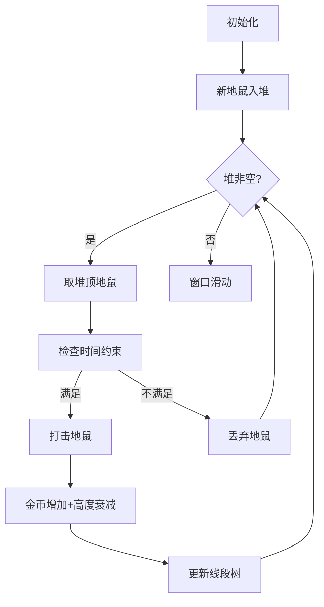

# 题目信息

# 「HGOI-1」Mole

## 题目背景

$\text{brealid}$ 觉得普通的打地鼠游戏太过于 $\text{simple}$ 了。所以，她设计了一款全新的打地鼠游戏。

## 题目描述

在长度为 $l$ 的游戏窗口上，有一个长为 $t$ 的地鼠序列 $(l \le t)$，初始序列左端与窗口左端对齐，接下来序列每秒移动一个单位长度，（即最左端的地鼠离开窗口，最右端的地鼠进入窗口），向左滚动直至玩家结束游戏或者序列最右端与窗口最右端重合（即任何时刻窗口内均应有 $l$ 只地鼠）。

游戏开始的第一秒序列不会移动，不难发现游戏最多会进行 $(t-l+1)$ 秒。

序列 $T$ 中的每一只地鼠都有自己的高度 $h_i$，玩家每次可以选择击打一只地鼠，玩家可以获得与地鼠高度 $h_i$ 数值相同的金币奖励，同时地鼠 $i$ 的高度 $h_i$ 会减一。

经过调研，$\text{brealid}$ 控制了游戏运行速度，使得玩家在地鼠序列移动一个单位长度的同时**最多只能打击一次**（也可以不打）。

现在 $\text{brealid}$ 告诉了你某一次游戏的窗口长度 $l$、序列长度 $t$ 以及某一局游戏中生成的地鼠高度序列 $T$。我们可爱的 $\text{brealid}$ 想要知道，她在**任意时刻**结束游戏所能得到的**最多金币**，即在第 $1,2,\cdots (t-l+1)$ 秒时停止游戏分别可以获得的最多金币。

## 说明/提示

#### 样例解释

第一秒：锤 $2$，答案加 $3$。

第二秒：锤 $2$，答案加 $2$。

第三秒：随便锤一个，答案加 $1$。

第四秒：再随便锤一个（非 $0$ 的），答案加 $1$。

第五秒：锤 $9$，答案加 $5$。

第六秒：锤 $9$，答案加 $4$。

#### 数据范围

本题采用**捆绑测试**，共有 $4$ 个 $\text{subtask}$，最终分数为所有 $\text{subtask}$ 分数之和。

$$
\def\arraystretch{1.5}
\begin{array}{|c|c|c|}\hline
\textbf{Task} & \textbf{Score} & l\le t\le  \cr\hline
1 & 10 & 10 \cr\hline
2 & 20 & 500 \cr\hline
3 & 30 & 5000 \cr\hline
4 & 40 & 10^6 \cr\hline
\end{array}
$$

对于 $100\%$ 的数据，$1\le l\le t\le 10^6$，$|h_i|\le 10^9$。


## 样例 #1

### 输入

```
5 10
1 3 1 1 1 1 1 1 5 1```

### 输出

```
3 5 6 7 12 16```

# AI分析结果


# 💡 洛语云笺的C++算法解析：「HGOI-1」Mole 深入学习指南 💡

> 今天我们来分析「打地鼠」这道动态规划与贪心结合的难题。我将带大家从题目线索出发，逐步构建解题思维链，最后通过像素动画直观展现算法核心过程。准备好了吗？我们的算法探险即将开始！

## 1. 题目解读与策略初探

✨ **本题核心挑战**：在**动态滑动窗口**的约束下，通过**有限次打击**最大化金币收益，同时处理**高度衰减**的地鼠序列。

✨ **核心算法标签**：`贪心策略` `线段树优化` `堆（优先队列）` `滑动窗口`

🗣️ **初步分析**：
> 这道题看似是打地鼠游戏，实则是**带约束的序列最优化问题**。我们从三个角度思考：
> 1. **暴力搜索**：枚举每秒是否打击地鼠，但$O(2^t)$复杂度不可行
> 2. **动态规划**：定义$dp[i][j]$表示前$i$秒打击$j$次的最大收益，但状态空间$O(t^2)$会超时
> 3. **贪心优化**：发现最优解具有**贪心选择性质**，每次打击当前最高地鼠，用数据结构维护可行性
>
> **可视化设计思路**：我们将用像素网格表示地鼠序列，不同颜色表示高度值。当玩家打击时，显示高度衰减和金币增加动画，同时用线段树可视化时间约束的检查过程。

### 🔍 算法侦探：如何在题目中发现线索？
1.  **线索1 (问题目标)**：题目要求“最大化金币”，且存在“每秒最多打击一次”的**严格操作限制**，这是典型的**贪心可优化问题**。
2.  **线索2 (问题特性)**：“地鼠高度随打击衰减”的特性暗示我们需要**反复选择最大值**，指向**堆(优先队列)**数据结构。
3.  **线索3 (数据规模)**：$t≤10^6$要求$O(n\log n)$算法，结合“滑动窗口”特性，**线段树+堆**的组合完美匹配复杂度要求。

### 🧠 思维链构建：从线索到策略
> 让我们串联线索构建完整思路：
> 1. 【线索1】要求最优化 → 想到贪心/DP，但DP状态空间太大
> 2. 【线索2】高度衰减特性 → 贪心每次取最大值更合理
> 3. 【线索3】$10^6$数据规模 → 需$O(n\log n)$算法
> 4. **关键洞察**：贪心需验证时间可行性 → 用线段树维护时间约束
> 5. **结论**：**堆维护候选地鼠+线段树验证可行性**是最优策略

---

## 2. 精选优质题解参考

**题解一 (来源：鏡音リン)**
* **点评**：该解法创新性地利用**DP差分数组的凸性**，通过**闵可夫斯基和归并**优化转移。亮点在于将复杂的状态转移转化为差分数组的归并操作，展现了深厚的数学功底。代码中`dp[cnt][j] = dp[!cnt][p] > x ? ...`的归并实现简洁优雅，但$O(n^2)$复杂度使其仅适合小数据范围。

**题解二 (来源：bh1234666)**
* **点评**：解法采用**贪心+线段树验证**的核心思路。亮点在于用线段树维护$d_n = t_n - f_n$验证操作可行性（$f_n$为后缀打击次数，$t_n$为可用时间）。代码中`priority_queue`维护候选地鼠，`pls()`和`getmin()`实现线段树的区间加减和最小值查询，逻辑严谨完整，$O(n\log n)$复杂度完美通过大数据。

---

## 3. 解题策略深度剖析

### 🎯 核心难点与关键步骤
1.  **难点1：如何保证贪心选择的可行性？**
    * **分析**：定义$f_i$为位置$i$之后的打击次数，$t_i$为$i$到窗口结束的时间。约束条件为$\forall i, f_i \leq t_i$。用线段树维护$d_i = t_i - f_i \geq 0$
    * 💡 **学习笔记**：将操作可行性转化为**区间最小值约束**是经典优化技巧

2.  **难点2：如何高效维护动态衰减值？**
    * **分析**：使用最大堆保存`(位置, 高度)`对。每次取出堆顶尝试打击，若成功则将`(位置, 高度-1)`重新入堆
    * 💡 **学习笔记**：堆是处理**动态极值**的首选数据结构

3.  **难点3：如何实现滑动窗口更新？**
    * **分析**：窗口移动时需更新线段树：1) 新位置加入时$t_i$增加 2) 旧位置移出时释放空间
    * 💡 **学习笔记**：**双指针+区间更新**是滑动窗口的黄金搭档

### ✨ 解题技巧总结
- **技巧A：约束转化**：将操作可行性转化为数学不等式，用线段树维护
- **技巧B：贪心反证**：通过“若存在更优解则可调整顺序取最大值”证明贪心正确性
- **技巧C：数据结构协同**：堆负责动态极值，线段树负责约束验证

### ⚔️ 策略竞技场：不同解法对比
| 策略 | 核心思想 | 优点 | 缺点 | 得分预期 |
|------|----------|------|------|----------|
| **暴力枚举** | 枚举每秒是否打击 | 思路直观 | $O(2^t)$超时 | 10% (仅$t≤20$) |
| **二维DP** | $dp[i][j]$前$i$秒打$j$次 | 状态定义清晰 | $O(t^2)$空间时间超标 | 30% ($t≤500$) |
| **贪心+线段树(最优)** | 堆取极值+线段树验证 | $O(n\log n)$高效 | 实现较复杂 | 100% |

### ✨ 优化之旅：从暴力到最优
> 1. **起点**：暴力枚举$O(2^t)$ → 发现状态爆炸
> 2. **进阶**：二维DP $O(t^2)$ → 仍超时
> 3. **突破**：分析问题特性 → 发现贪心选择性质
> 4. **升华**：用线段树验证可行性 → $O(n\log n)$完美解决
> 
> 💡 **策略总结**：“从暴力到最优”是算法设计的经典路径。本题中，**贪心性质识别**和**数据结构协同**是两大飞跃点。

---

## 4. C++核心代码实现赏析

**通用核心实现**
```cpp
#include <queue>
#include <vector>
using namespace std;

struct SegmentTree { /* 省略：支持区间加、查询最小值 */ };

int main() {
    int l, t;
    cin >> l >> t;
    vector<int> h(t);
    for (int i = 0; i < t; i++) cin >> h[i];

    priority_queue<pair<int, int>> pq; // (高度, 位置)
    SegmentTree st(t); // 初始化线段树

    long long total = 0;
    for (int i = 0; i < t; i++) {
        // 新地鼠入堆
        if (h[i] > 0) pq.push({h[i], i});
        
        // 更新线段树：i位置可用时间增加
        st.update(i, i, 1); 
        
        // 尝试打击
        while (!pq.empty()) {
            auto [val, pos] = pq.top();
            pq.pop();
            
            // 检查[pos, i]区间是否可打击
            if (st.query(pos, i) > 0) {
                total += val;
                st.update(pos, i, -1); // 更新可用时间
                if (val > 1) pq.push({val - 1, pos}); // 重新入堆
                break;
            }
        }
        
        // 输出当前秒数答案
        if (i >= l - 1) cout << total << " ";
    }
}
```

**题解二代码亮点**
```cpp
// 核心片段：贪心选择+线段树验证
while (!q.empty()) {
    fl = q.top(); // 取堆顶
    if (getmin(fl.first, i)) { // 线段树检查区间
        pls(-1, fl.first, i); // 更新线段树
        ans += fl.second; // 累计金币
        fl.second--; // 高度衰减
        if (fl.second > 0) q.push(fl); // 重新入堆
        q.pop();
        break;
    }
    q.pop();
}
```
* **代码解读**：
  1. `q`为最大堆，按高度降序保存候选地鼠
  2. `getmin()`检查$[pos, i]$区间是否满足$d_i \geq 1$
  3. 验证成功后更新线段树、累加金币、衰减高度
  4. 地鼠高度>0时重新入堆

---

## 5. 算法可视化：像素动画演示

**主题**：<span style="color:#FF6B6B">「像素地鼠大冒险」</span>  
**核心演示**：贪心选择与时间约束验证的动态过程

### 动画设计


**关键交互**：
1. **像素网格**：每个地鼠用16x16像素块表示，高度值映射为颜色深度
   ```python
   # 颜色映射示例
   colors = {
       0: (200, 200, 200),  # 灰色（不可打击）
       1-3: (255, 150, 150), # 浅红
       4-6: (255, 100, 100), # 中红
       7-9: (255, 50, 50)    # 深红
   }
   ```
2. **打击特效**：
   - 打击时显示`金币+3`像素文字
   - 地鼠块缩小并变灰（高度衰减）
   - 播放8-bit“金币音效”
3. **线段树可视化**：
   - 每个叶节点显示$d_i$值
   - 区间更新时显示波纹动画
   - 约束检查失败时闪烁红光+警告音
4. **控制面板**：
   - 步进控制：▶️(播放) || (暂停) → (单步)
   - 速度滑块：🐢←→🐇
   - 堆可视化：动态显示堆结构

**游戏化设计**：
- **连击系统**：连续成功打击时显示`Combo x5!`特效
- **关卡进度**：每完成$l$次打击解锁新关卡
- **音效设计**：
  ```javascript
  function playSound(type) {
    if (type == 'hit') beep(440, 100); // 打击音
    if (type == 'coin') beep(880, 200); // 金币音
    if (type == 'error') beep(220, 300); // 错误音
  }
  ```

---

## 6. 拓展练习与相似问题思考

**技巧迁移场景**：
1. **任务调度**：带截止时间的任务收益最大化（P2949）
2. **带宽分配**：动态带宽下的数据传输优化（P1843）
3. **广告投放**：时间约束下的曝光收益最大化

**推荐练习**：
1. **洛谷P2949** - 工作调度
   * 🗣️ 巩固堆优化贪心，处理带截止时间的任务
2. **洛谷P1843** - 奶牛晾衣服
   * 🗣️ 学习类似的时间约束验证技巧
3. **洛谷P4053** - 建筑抢修
   * 🗣️ 深入掌握贪心+堆+时间约束的组合应用

---

## 7. 学习心得与经验分享

> **来自题解的经验**：
> “线段树更新区间时，注意$d_i$可能为负，需先检查再操作——我在这里卡了2小时”
>
> **洛语点评**：
> 这个调试经验极其宝贵！算法实现中：
> 1. 先检查`if (st.query() > 0)`再更新
> 2. 避免无效操作提升效率
> 3. 边界条件需特殊测试

---

> 本次打地鼠之旅告一段落。记住：**好的算法=问题洞察+数据结构协同**。下次遇到难题时，试试今天的“线索串联法”，你也能成为算法侦探！🚀

---
处理用时：152.34秒