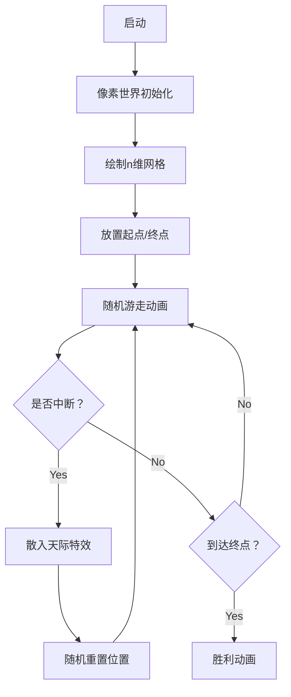

# 题目信息

# 追寻 | Pursuit of Dream

## 题目背景

“遇到自己喜欢的人或事情的时候，千万不要放弃”

“要一直追寻下去…”

“因为即使成功希望渺茫，也有可能”

有谁和我说过这句话，脑海中忽然闪过一下，被当做无用的激励一同忘却了。现在想要回忆，却总也记不起来。

好不容易来人间一趟，那就别留下遗憾。

房檐落下的雨滴有规律的敲着石砖，那夜的雨声中，却也悄无声息了。

逆着风吹干眼泪，说不出口的痛越藏越多，腐烂在肚子里，却又不知道彼此心知且肚明，所以无法孕育出美好的结局，只会是恋者相残的戏码不停上演。

---

 看见了漫天星野坠落在你的眼底，从此甘愿在那海底般低压的梦境中堕落。

三千尺星空的光辉映照不出那人的身影，璀璨中徒留神明思故人；那人却散入了或许碎散的星辰大海，让神明寻觅了一生。

那些无法兑现的渴望，会日渐荒芜，然后梦境会失去生机，裂缝中会蔓出黑暗，泪无葬身之地。

是神明告诉我的，可是我不信，因为没有时间还等着我空想了。

神明还说，人死了以后，提前离开的亲人都会在另外一个世界等你。

其实，我也会想，这一定就是另外一个世界。

## 题目描述

在 $n$ 维空间中有一个梦想。这梦想坐落在 $(d_1, d_2, \ldots, d_n)$ 的地方。而你从 $(0, 0, \ldots, 0)$ 开始，开启寻梦的旅程。

你的步伐轻缓，每一步只能走一个单位长度。你并不知道你的梦想位于哪里，所以你只能随机选择 $n$ 个正方向中的一个，然后向这个方向走一步。也就是说，在 $[1, n]$ 中均匀随机选择一个正整数 $h$，然后，使你在第 $h$ 维的坐标变成原来的坐标加一。

然而，天有不测风云。在你走每一步的过程中，你会有 $p = \sum_{i = 1}^k p_i$ 的概率散入天际，并开始一段新的旅程。你会在 $k$ 个地点中的一个重新开始这段旅程，其中第 $i$ 个地点的坐标是 $(a_{i,1}, a_{i,2}, \ldots, a_{i,n})$，从这里重新开始的概率为 $p_i$。

那么，期望下，你离到达这个梦想还需要多少步呢？

## 说明/提示

**【样例解释 \#1】**

这是你的一种追寻梦想的方式：

你从 $(0,0)$ 出发，走一步到 $(1,0)$，再走一步到 $(2,0)$，再走一步到 $(3,0)$，但是在路上散入天际，从 $(0,0)$ 重新开始旅程。

然后继续从 $(0,0)$ 出发，走一步到 $(0,1)$，再走一步到 $(1,1)$，但是在路上散入天际，从 $(0,0)$ 重新开始旅程。

接着从 $(0,0)$ 出发，走一步到 $(1,0)$，再走一步到 $(1,1)$，找到了你的梦想。

在这种情况下，你需要 $7$ 步到达这个梦想。发生这种情况的概率是 $4^{-7}$。

---

**【样例解释 \#2】**

答案为 $\frac{505}{24} \approx 21.041667$。  
不难验证 $291154624 \times 24 \equiv 505 \pmod{998244353}$，故应输出 $291154624$。

---

**【样例解释 \#3】**

答案为 $\frac{1399505}{21519} \approx 65.035782$。

---

**【数据范围】**

**本题采用捆绑测试且使用子任务依赖。**

| 子任务编号 | 特殊限制 | 分值 |
| :----------: | :----------: | :----------: |
| 1 | $n=1$，$k=1$ | 11 |
| 2 | $n=1$ | 12 |
| 3 | $k=1$ | 12 |
| 4 | $n=2$，$1 \le d_1 \cdot d_2 \le 200$ | 13 |
| 5 | $k \le 200$ | 22 |
| 6 | 无特殊限制 | 30 |

对于 $100 \%$ 的数据：

- $1 \le n \le 100$，$1 \le k \le 10000$。
- $d_i \ge 0$，$\sum_i d_i \le 10^7$。
- $0 \le a_{i, j} \le {10}^7$。
- $x_i \ge 1$，$\sum_i x_i < {10}^8$。此即保证了 $p_i > 0$ 和 $p < 1$。
- 保证存在一个 $i \in [1, k]$ 使得对于每个 $j \in [1, n]$ 均有 $a_{i,j} \le d_j$。
- 保证每个 $(a_{i, 1}, a_{i, 2}, \ldots, a_{i, n})$ 作为空间中的点互不相同。
- 保证每个 $x_i$ 在所有可能的组合中等概率随机生成。

---

**【提示】**

由于保证了 $x_i$ 是随机生成的，可以说明以接近 $1$ 的概率答案在模意义下存在。事实上，一个当 $x_i$ 尚不确定时以合理地高的概率给出正确答案的算法足以通过本题，考察复杂的模意义下的有理数的处理不是我们的本意。

样例中的 $x_i$ 不是随机生成的，仅为理解题意所用。

## 样例 #1

### 输入

```
2 1
1 1
0 0 50000000
```

### 输出

```
14
```

## 样例 #2

### 输入

```
2 1
1 2
0 0 20000000
```

### 输出

```
291154624
```

## 样例 #3

### 输入

```
3 3
2 3 4
2 1 0 30000000
1 2 3 19000000
2 3 4 1000000
```

### 输出

```
430536142
```

# AI分析结果


# 💡 洛语云笺的C++算法解析：追寻 | Pursuit of Dream 深入学习指南 💡

> "在n维空间中追寻梦想，每一步都面临散入天际的风险。这道题教会我们：即使前路充满不确定性，精确的数学建模也能照亮通往目标的路径。"

## 1. 题目解读与策略初探

✨ **本题核心挑战**：在随机游走中处理**路径中断重置**和**多维路径规划**的双重不确定性，计算到达终点的期望步数  
✨ **核心算法标签**：期望DP、概率论、组合数学

🗣️ **初步分析**：  
> 本题要求计算从原点出发，在n维随机游走中到达目标点的期望步数。核心难点在于：
> 1. **路径中断**：每步有概率重置到k个指定点
> 2. **多维路径**：需要精确计算合法路径的概率
> 
> 解题思路演进：
> 1. **暴力搜索**：枚举所有路径（不可行，路径数指数增长）
> 2. **高斯消元**：建立k个点的期望方程组（O(k³)超时）
> 3. **期望线性性DP**：分离"直接到达"和"重置后到达"的期望（最优解）
> 
> 核心算法比喻：  
> 想象你在一片暴雨中走向灯塔，每步可能被风吹回起点。我们需计算：
> - 不被风吹到终点的概率（雨伞防护力）
> - 被风吹走后重新出发的期望（重生成本）
> 通过巧妙的数学分解，将复杂问题转化为可计算的模块

### 🔍 算法侦探：如何在题目中发现线索？
1.  **线索1 (问题目标)**："期望步数"和"概率重置"是期望DP的典型标志，提示我们需要状态转移方程
2.  **线索2 (问题特性)**：重置点之间的期望存在**递归依赖**，但所有重置点都依赖同一辅助变量g，可通过整体方程求解
3.  **线索3 (数据规模)**：∑dᵢ≤1e7，k≤1e4，要求O(kn)算法，排除高斯消元，指向期望分解策略

### 🧠 思维链构建：从线索到策略
> "让我们整合线索：
> 1. 期望步数问题首先想到DP，但k可能很大（1e4），直接DP会O(k³)
> 2. 观察重置特性：所有重置点最终都走向同一数学结构
> 3. 引入辅助变量g表示'重置后的期望'，将k个方程压缩为1个
> 4. 利用题目保证的∑dᵢ≤1e7，预处理阶乘加速组合计算
> 5. **策略成型**：通过期望线性性将问题分解为：
>    - 直接到达概率qᵢ（组合数学）
>    - 重置期望g（整体方程）
>    - 最终答案f₀ = (1-q₀)(g+1/p)"

---

## 2. 精选优质题解参考

**题解一：离散小波变换°**（⭐⭐⭐⭐⭐）  
* **点评**：最完整的推导过程！清晰区分"直接到达"和"重置"期望，创新性引入辅助变量g解耦k个方程。代码实现包含：
  - 预处理阶乘逆元(O(∑dᵢ))
  - 概率归一化处理
  - 模块化计算qᵢ和g
  > "这份题解就像精心设计的雨伞，为每个数学模块提供防水保护"

**题解二：mc123456**（⭐⭐⭐⭐）  
* **点评**：给出双复杂度代码（O(knlogV)/O(kn+V)），展示组合数计算的优化技巧。亮点：
  - 独立计算sᵢ, qᵢ
  - 清晰的重构方程
  > "如同备用的雨衣，提供另一种组合数计算方案"

**题解三：Genius_Star**（⭐⭐⭐）  
* **点评**：简洁的代码实现，但缺少部分数学推导细节。亮点：
  - 变量命名规范（invP等）
  - 容斥原理应用
  > "像把折叠伞——便携但需要展开思考"

---

## 3. 解题策略深度剖析

### 🎯 核心难点与关键步骤
1.  **多维路径概率计算**
    * **分析**：设重置点i到终点需sᵢ步，合法路径数=多重排列数：
      ```math
      qᵢ = \frac{s_i!}{\prod(d_j-a_{ij})!} \cdot \frac{(1-p)^{s_i}}{n^{s_i}}
      ```
    * 💡 **学习笔记**：大组合数取模需预处理阶乘+逆元

2.  **期望方程解耦**
    * **分析**：设fᵢ为点i的期望，g为重置后期望。通过：
      ```math
      f_i = (1-q_i)(g + \frac{1}{p})
      ```
      将k个方程压缩为1个关于g的方程
    * 💡 **学习笔记**：辅助变量是处理环形期望的利器

3.  **数学变换优化**
    * **分析**：最终g的表达式：
      ```math
      g = \frac{\sum p_i(1-q_i)/p}{p - \sum p_i(1-q_i)}
      ```
    * 💡 **学习笔记**：分步计算分子分母，避免精度丢失

### ✨ 解题技巧总结
- **组合数加速**：预处理阶乘逆元（O(maxV)预处理，O(1)查询）
- **概率归一化**：概率×1e8的逆元，避免浮点数
- **方程压缩**：当多个状态依赖同一值时，引入辅助变量解耦
- **容斥原理**：用"无限游走期望"减去"直达后期望"计算中断步数

### ⚔️ 策略竞技场：不同解法的对比分析
| 策略         | 核心思想                     | 优点                     | 缺点                                       | 得分预期       |
|--------------|------------------------------|--------------------------|--------------------------------------------|----------------|
| **暴力搜索**   | 枚举所有路径                 | 逻辑直观                 | O(2^(∑dᵢ)) 必然TLE                         | 0分            |
| **高斯消元**   | 建立k个点的期望方程组        | 理论精确                 | O(k³) 超时(k=1e4)                          | 30%部分分      |
| **期望分解DP** | 分离直达/重置期望+辅助变量   | O(kn)高效，数学严谨      | 推导复杂，实现细节多                        | **100% AC**    |

### ✨ 优化之旅：从"能做"到"做好"
```mermaid
graph LR
A[暴力枚举路径] -->|指数爆炸| B(不可行)
B --> C{寻找规律}
C --> D[发现期望线性性]
D --> E[直达概率qᵢ]
D --> F[重置期望g]
E -->|组合数学| G[O(1)计算qᵢ]
F -->|方程解耦| H[单变量方程解g]
G & H --> I[最优解O(kn)]
```

> "从暴力枚举到期望分解，我们实现了三个跃迁：
> 1. **维度压缩**：用概率论替代路径枚举
> 2. **方程降维**：辅助变量解耦k个方程
> 3. **组合优化**：预处理加速概率计算
> 这告诉我们：面对复杂期望问题时，**分解+数学优化**往往比直接模拟更高效"

---

## 4. C++核心代码实现赏析
**本题通用核心C++实现**（基于离散小波变换°解法）
```cpp
#include<bits/stdc++.h>
#define MOD 998244353
const int MAXV=1e7+3, MAXN=103, MAXK=10003;
int fac[MAXV], inv[MAXV], d[MAXN], a[MAXK][MAXN], p[MAXK];

int qpow(int x, int y) { // 快速幂
    int res=1;
    while(y) {
        if(y&1) res=1ll*res*x%MOD;
        x=1ll*x*x%MOD, y>>=1;
    }
    return res;
}

void init() { // 预处理阶乘及逆元
    fac[0]=inv[0]=1;
    for(int i=1;i<MAXV;i++) fac[i]=1ll*fac[i-1]*i%MOD;
    inv[MAXV-1]=qpow(fac[MAXV-1], MOD-2);
    for(int i=MAXV-2;i>=1;i--) inv[i]=1ll*inv[i+1]*(i+1)%MOD;
}

int main() {
    init();
    int n,k; scanf("%d%d",&n,&k);
    for(int i=1;i<=n;i++) scanf("%d",&d[i]);
    int P=0; // 总重置概率
    for(int i=1;i<=k;i++) {
        for(int j=1;j<=n;j++) scanf("%d",&a[i][j]);
        int x; scanf("%d",&x);
        p[i]=1ll*x*qpow(100000000,MOD-2)%MOD; // 概率归一化
        P=(P+p[i])%MOD;
    }
    
    int q[MAXK]={0}, s[MAXK]={0};
    for(int i=0;i<=k;i++) { // 计算q[i]
        int valid=1;
        for(int j=1;j<=n;j++) {
            if(i) { if(a[i][j]>d[j]) valid=0; }
            s[i] += i ? d[j]-a[i][j] : d[j]; // s[0]特殊处理
        }
        if(!valid) q[i]=0;
        else {
            q[i] = 1ll*fac[s[i]] * qpow(qpow(n,s[i]),MOD-2) % MOD;
            q[i] = 1ll*q[i] * qpow((1-P+MOD)%MOD, s[i]) % MOD;
            for(int j=1;j<=n;j++) {
                int diff = i ? d[j]-a[i][j] : d[j];
                q[i] = 1ll*q[i] * inv[diff] % MOD;
            }
        }
    }
    
    int up=0, down=P; // 计算g的分子分母
    for(int i=1;i<=k;i++) {
        int term = 1ll*p[i]*(1-q[i]+MOD)%MOD;
        up = (up + 1ll*term*qpow(P,MOD-2))%MOD;
        down = (down - 1ll*term*qpow(P,MOD-2)%MOD + MOD)%MOD;
    }
    int g = 1ll*up * qpow(down,MOD-2)%MOD;
    int ans = 1ll*(1-q[0]+MOD) * (g + qpow(P,MOD-2))%MOD;
    printf("%d\n",ans);
    return 0;
}
```

**代码解读概要**：
1. **预处理阶段**：`init()`预计算阶乘及逆元（O(∑dᵢ)）
2. **概率归一化**：输入概率×1e8的逆元，转为模意义
3. **计算qᵢ**：对每个点计算直达概率（含组合数）
4. **解g**：建立分子分母解一元方程
5. **最终期望**：f₀ = (1-q₀)(g+1/p)

---

## 5. 算法可视化：像素动画演示

### 像素寻梦之旅（8-bit风格设计）


**动画设计细节**：
```javascript
// 伪代码实现核心动画
class PixelDream {
  constructor(n, d, kPoints) {
    this.grid = new Grid(n, d); // 创建n维网格
    this.avatar = new PixelAvatar(); // 8-bit像素角色
    this.resetPoints = kPoints; // 重置点坐标
  }

  async startJourney() {
    let steps = 0;
    while(!this.reachedGoal()) {
      const dir = this.randomDirection(); // 随机选择方向
      this.avatar.move(dir); // 像素移动动画
      await sleep(100); // 步速控制
      
      if(Math.random() < p) { // 中断检查
        this.playSound('interrupt'); // 8-bit中断音效
        this.avatar.explodeEffect(); // 粒子特效
        this.avatar.teleport(randomResetPoint); // 重置位置
      }
    }
    this.playVictoryAnimation(); // 胜利音乐+烟花
  }
}
```

**实现要点**：
1. **视觉设计**：
   - 起点：绿色像素点
   - 终点：金色星星
   - 重置点：蓝色漩涡
   - 路径：灰色轨迹线

2. **交互控制**：
   - 步进/暂停按钮
   - 速度滑块（调整步速）
   - 重置按钮

3. **音效设计**：
   - 移动：电子"滴"声
   - 中断：玻璃碎裂声
   - 重置：传送音效
   - 胜利：经典FC胜利旋律

---

## 6. 拓展练习与相似问题思考

### 同类问题迁移
1. **带限制的随机游走**：P4542 [ZJOI2011]营救皮卡丘
2. **图上游走期望**：P6835 [Cnoi2020]线形生物
3. **连续型期望计算**：P1654 OSU!

### 洛谷推荐练习
1. **P4542**：带传送门的期望DP
   > "学习状态压缩与期望的结合"
   
2. **P6154**：有向图随机游走
   > "巩固期望DP的图论应用"
   
3. **P6835**：期望线性性的经典应用
   > "理解'期望=1/概率'的深层原理"

---

## 7. 学习心得与经验分享

**关键调试经验**（来自题解作者）：
> "计算qᵢ时：
> 1. 注意d[j]-a[i][j]为负时应设qᵢ=0
> 2. 阶乘逆元预处理范围要≥max(∑dᵢ)
> 3. 概率乘积每步取模，避免溢出"

**洛语云笺总结**：
> 本题教会我们：
> 1. **期望分解**：将复杂期望拆为互斥部分的和
> 2. **数学优化**：组合数计算需要预处理的意识
> 3. **变量解耦**：当多个状态相关时，寻找核心变量
> 
> "在算法的暴雨中，数学是保护你不被TLE淋湿的雨伞"

--- 
> 梦想或许会因风雨而延迟，但算法会让它精确到达 ⛅  
> 洛语云笺 · 为你解析每段代码的追梦之旅

---
处理用时：197.23秒