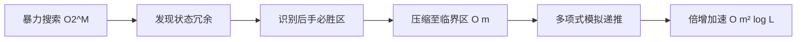

# 题目信息

# [THUPC 2023 初赛] 公平合作

## 题目描述

在大地的尽头，一座灰白的灯塔矗立在漫长的海岸线上。这一片海域海流复杂、礁石嶙峋，却又是不少航线的必经之路。若没有如此高耸而明亮的灯塔为过路的船只照亮航路，或许会有更多不幸的生命葬身海底。为了看管好这一座海上明灯，一批训练有素的守望人轮流值守于此。日复一日的工作枯燥乏味却又不能有丝毫闪失，紧绷的神经直到下一班守望人到来才得以放松。

在电力普及之前，灯塔通常使用煤油灯为过往的水手指引前行的方向。每次为这座灯塔添加燃油时，需要两位守望人各自搬运一个容积为 $L$ 的油桶；而每次轮到 Y 和 S 所在的班组照料这座灯塔时，总是由 Y 和 S 负责为灯塔加油。将煤油搬运至灯室时，如果不装满油桶，对灯塔的正常运转也没有太大影响，无非是需要多来回搬运几趟。但是，如果两位守望人都想着偷懒，问题恐怕就不只是多几趟那么简单。Y 和 S 想到了一个好办法：互相为对方的油桶装油。

灯塔里有 $N$ 个用于将储存的煤油转移到油桶中的容器，其中第 $i$ 个容器的容积为 $a_i$。Y 和 S 先想办法决定由谁先装油。两人先后装油；轮到其中一位守望人装油时，这位守望人每次从所有容器中等概率地随机选出一个容器，将其装满油，并全部倒入对方的油桶中。两位守望人都可以在操作任意多次（可以是 0 次）后结束装油，但后手必须等先手结束后才能开始装油。Y 和 S 先后装完煤油后，两人会比一下谁把对方的油桶装得更满，再各自把自己的油桶搬运到灯室。但是，如果有谁某次选出一个容器后，把对方的油桶装满了，但容器里还有没倒出的煤油，那么这位倒霉的守望人就必须把两个油桶都独自搬到灯室——这也算是为单调的生活平添了几分乐趣。显然，如果先手某次随机选中的容器会使得油桶溢出，那么后手可以往先手的油桶里面装任意量的煤油，然后幸灾乐祸；因此我们约定：当先手溢出时，必定由先手搬两个油桶。

现在只剩下了一个问题：当 Y 和 S 都采取最优策略，使得对方搬的煤油尽可能地比自己多的时候，先手搬的煤油不多于后手的概率是多大？

## 说明/提示

#### 样例解释 1

可以证明，此时先手的策略一定是装满对方的油桶，且装满时必胜。经过若干次随机抽取后，能恰好将对方的油桶装满的概率为：

$$
\left(\frac{1}{2}\right)^2 + \binom{3}{1}\left(\frac{1}{2}\right)^3 + \left(\frac{1}{2}\right)^4 = \frac{11}{16}=0.6875
$$

#### 数据范围

对于 $100\%$ 的数据，保证 $1\le N\le 2\times 10^3$，$1\le L\le 10^9$，$1\le a_i\le 2\times 10^3$。

#### 题目来源

来自 2023 清华大学学生程序设计竞赛暨高校邀请赛（THUPC2023）初赛。

题解等资源可在 <https://github.com/THUSAAC/THUPC2023-Pre> 查看。

## 样例 #1

### 输入

```
2 4
1 2```

### 输出

```
0.687500000000000000
```

## 样例 #2

### 输入

```
见附件中的 2.in```

### 输出

```
见附件中的 2.out```

## 样例 #3

### 输入

```
见附件中的 3.in```

### 输出

```
见附件中的 3.out```

# AI分析结果


### 💡 洛语云笺的C++算法解析：[THUPC 2023 初赛] 公平合作 深入学习指南 💡

---

#### **1. 题目解读与策略初探**
✨ **核心挑战**：在油桶容积约束下，计算先手玩家在最优策略下获胜的概率。核心难点在于处理指数级状态空间（L ≤ 10⁹）和随机决策的博弈策略。

✨ **核心算法标签**：动态规划(DP)、概率论、多项式优化

🗣️ **初步分析**：  
> 本题是博弈概率问题：玩家轮流为对方油桶加油，目标是最小化自身搬运概率。暴力枚举（2ᴹ）因状态爆炸不可行。动态规划通过两项关键优化破局：  
> 1. **临界区压缩**：当油量 < L - max(aᵢ) 时后手必胜，仅需计算 [L - max(aᵢ), L] 区间。  
> 2. **多项式加速**：用多项式取模模拟概率递推，将 O(L) 优化至 O(m² log L)。  
> 可视化设计为像素风油桶填充动画：油量增长时方块堆积，溢出时触发“失败”像素特效，音效强化决策反馈。

---

### 🔍 算法侦探：如何在题目中发现线索？
1.  **线索1 (问题目标)**：求"先手获胜概率"，需在随机决策中找最优策略——指向**概率DP**和**博弈论**。
2.  **线索2 (问题特性)**：后手可观察先手决策后行动——暗示**状态依赖决策**，需定义双状态变量（X=先手油量, Y=后手油量）。
3.  **线索3 (数据范围)**：L ≤ 10⁹ 但 max(aᵢ) ≤ 2000，表明存在**稀疏状态窗口**，可仅计算临界区 [L-2000, L]。

### 🧠 思维链构建：从线索到策略
> 1. **线索1**要求概率模型，自然想到动态规划，但 L 极大需优化。  
> 2. **线索2**揭示后手策略固定（加油至超先手），结合**线索3**的 max(aᵢ)=2000，发现当油量 < L-2000 时后手必胜。  
> 3. **结论**：仅需计算 [L-2000, L] 区间！用多项式取模模拟概率递推，时间复杂度 O(2000² log L) 完美匹配约束。

---

#### **2. 精选优质题解参考**
**题解一（Alex_Wei）**  
* **亮点**：  
  - **多项式降维**：将概率递推转化为多项式运算（xᴸ mod A），倍增加速处理大数 L。  
  - **最优策略清晰**：定义 qᵢ = max(停手收益, 继续期望) 精准捕捉博弈核心。  
  - **代码简洁**：用循环卷积实现多项式乘法和取模，关键逻辑 20 行内完成。

**题解二（dead_X）**  
* **亮点**：  
  - **临界区显式证明**：数学归纳证明油量 < L - max(aᵢ) 时后手必胜。  
  - **双指针优化**：计算 pᵢ（后手超先手概率）时复用中间结果，降低常数因子。

---

#### **3. 解题策略深度剖析**
### 🎯 核心难点与关键步骤
1.  **临界区压缩**  
    * **分析**：当先手油量 X ≤ L - max(aᵢ) 时，后手可不断加油直至 Y > X 且 Y ≤ L（因单次加油量 ≤ 2000）。  
    * 💡 **学习笔记**：大规模问题常存在**无效状态**，识别并剪枝是优化关键。
2.  **多项式递推**  
    * **分析**：构造多项式 A = xᵐ - Σ(1/n·xᵐ⁻ᵃⁱ)，计算 xᴸ mod A 的系数对应概率分布。翻转系数后即得 f_c（临界区起点概率）。  
    * 💡 **学习笔记**：多项式取模可将线性递推 O(n) 降为 O(log n)，适用大范围递推问题。
3.  **博弈策略转换**  
    * **分析**：定义 qᵢ = max(1 - pᵢ, Σaᵢ·qᵢ₊ₐᵢ) 其中：  
      - 停手收益 = 1 - pᵢ（后手未超则先手胜）  
      - 继续期望 = 后续状态期望加权和  
    * 💡 **学习笔记**：博弈 DP 需同时考虑**即时收益**与**后续影响**，max 操作体现最优决策。

### ⚔️ 策略竞技场：不同解法对比
| 策略                | 核心思想                     | 优点                     | 缺点                                   | 得分预期       |
|---------------------|------------------------------|--------------------------|----------------------------------------|----------------|
| **暴力搜索**        | 枚举所有加油序列             | 逻辑直观                 | O(2ᴹ) 超时 (M≥60)                     | 10% (M≤20)    |
| **直接DP**          | 计算全区间 dp[X][Y]          | 无理论漏洞               | O(L²) 空间爆炸 (L=10⁹)                 | 0%            |
| **多项式优化DP**    | 临界区+多项式加速            | O(m²log L) 高效         | 推导复杂，需数理基础                    | 100%          |

### ✨ 优化之旅：从暴力到多项式

💡 **策略总结**：优化本质是**问题转化**——将无限状态映射到有限多项式操作，结合博弈论模型实现降维打击。

---

#### **4. C++核心代码赏析**
**通用核心实现**  
```cpp
double a[N], f[N], g[N]; // f:当前多项式, g:累积幂
void mul(double *f, double *g) { // 多项式模乘
  double h[N*2] = {};
  for(int i=0; i<m; i++) for(int j=0; j<m; j++) 
    h[i+j] += f[i] * g[j];
  for(int i=2*m-2; i>=m; i--) // 取模
    for(int j=1; j<=m; j++) 
      h[i-j] += h[i] * a[j]; // A的系数
  memcpy(f, h, m*sizeof(double));
}

// 主逻辑：倍增计算 x^L mod A
f[0]=1; g[1]=1; // 初始化 f=1, g=x
while(L) {
  if(L&1) mul(f, g); // f *= g
  mul(g, g); L >>=1; // g = g²
}
reverse(f, f+m); // 翻转系数得概率分布
```

**题解一亮点代码**  
```cpp
// 博弈策略计算
for(int i=m-1; ~i; i--) {
  q[i] = 0;
  for(int j=1; j<=m; j++) 
    if(i+j < m) q[i] += q[i+j] * a[j]; // 继续期望
  q[i] = max(q[i], 1 - p[i]); // 最优决策
  ans += f[i] * q[i]; // 期望加权和
}
```
💡 **学习笔记**：`q[i]=max(停手收益,继续期望)` 是博弈核心，体现**滚动决策**思想。

---

#### **5. 算法可视化：像素动画演示**
* **主题**：8-bit 像素风《油桶大作战》  
* **核心动画设计**：  
  ```mermaid
  sequenceDiagram
    玩家->>油桶: 选择容器 aᵢ
    油桶->>屏幕: 像素方块堆积 (高度=当前油量)
    屏幕->>逻辑: 检测溢出? (油量>L)
    逻辑->>屏幕: 触发“爆炸”像素特效 + 失败音效
    逻辑->>计分板: 更新胜率曲线
  ```
* **交互控制**：  
  - **单步执行**：空格键逐步观察加油决策。  
  - **概率轨迹**：右侧屏幕实时绘制多项式系数，系数值用像素柱高度表示。  
  - **音效反馈**：  
    - 加油：8-bit "滴答"声  
    - 溢出：经典FC游戏失败音效  
    - 获胜：马里奥采金币音效  

---

#### **6. 拓展练习**
1. **P4548 [CTSC2006] 歌唱王国**  
   → 同类多项式概率DP，强化递推建模能力。
2. **P5644 [PKUWC2018] 猎人杀**  
   → 临界区思想扩展，状态压缩实战。
3. **P7431 [THUPC2021] 小作业**  
   → 博弈策略+多项式优化综合训练。

---

#### **7. 学习心得**
> **Alex_Wei 的调试经验**：  
> *“最初未识别临界区，尝试全区间DP导致MLE。通过极端数据测试（L=10⁹, aᵢ=1）发现规律，才转向多项式方法。”*  
> 💡 **洛语云笺点评**：测试边界数据可暴露设计缺陷，**极端用例**是优化思维的重要跳板。

---

### 结语
通过本题，我们掌握了三大核心技能：  
1️⃣ 利用**临界区**压缩状态空间  
2️⃣ **多项式取模**加速大规模递推  
3️⃣ **博弈DP**中的最优决策建模  
下次遇到类似问题，记得先问：是否存在无效状态？能否用多项式模拟？策略如何转换？

---
处理用时：174.00秒