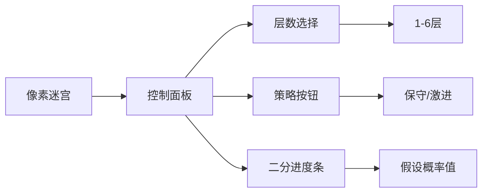

# 题目信息

# [THUPC 2023 初赛] 最后的活动

## 题目背景

各位亲爱的《La Lumière: Scarlet Intense Flame》玩家：

感谢您一直给予《La Lumière: Scarlet Intense Flame》的支持与厚爱。我们非常遗憾地宣布，《La Lumière: Scarlet Intense Flame》将于 2023 年 3 月 5 日 16:00 停止运营服务。

停止运营相关时间表如下：

……

## 题目描述

元老级二次元手游《La Lumière: Scarlet Intense Flame》将于今年 3 月停止运营服务。作为这款游戏的忠实玩家，小 S 希望能在游戏的最后一次活动中刷到一个特殊的分数，以此为近十年来与这款游戏共度的难忘时光画上一个圆满的句号。

《La Lumière: Scarlet Intense Flame》中的每种活动都有其独特的规则，而最后一次活动是 Chase Festival。在 Chase Festival 中，玩家需要多次攻略每次随机生成的多层迷宫，每次退出迷宫时根据在迷宫中各层击杀怪物的评价独立结算本次随机迷宫的分数。每次挑战迷宫时的流程简化如下：

1. 选择挑战的随机迷宫的难度。小 S 是这款游戏的资深玩家，因此在本题中假定小 S 总是挑战最高难度的迷宫。最高难度的迷宫最深为 $N$ 层。确定难度后，从随机生成的迷宫的第 1 层开始挑战。

2. 进行第 $i$ 层的挑战。挑战第 $i$ 层时，小 S 有可能挑战失败，挑战成功并获得普通评价，或者挑战成功并获得高评价。如果小 S 选择保守的挑战策略，则有 $p_{i,0}$ 的概率挑战失败，有 $p_{i,1}$ 的概率挑战成功并获得普通评价，有 $p_{i,2}$ 的概率挑战成功并获得高评价；如果小 S 选择激进的挑战策略，则有 $q_{i,0}$ 的概率挑战失败，有 $q_{i,1}$  的概率挑战成功并获得普通评价，有 $q_{i, 2}$ 的概率挑战成功并获得高评价。
   
   - 获得普通评价时，在当前层获得 $s_{i,1}$ 的分数；获得高评价时，在当前层获得 $s_{i,2}$ 的分数。这部分获得的分数**不会直接加算**到玩家的总分数中，而是**在退出迷宫时结算**。如果挑战成功，且当前不是最后一层（$i<N$），则跳转到第 3 步，选择是否继续挑战；否则（$i=N$），退出迷宫并跳转到第 4 步进行结算。
   
   - 如果挑战失败，则强制退出迷宫，跳转到第 4 步。

3. 如果当前不是最后一层，玩家可以选择是否继续挑战下一层。如果选择继续，则返回第 2 步；否则退出当前迷宫，跳转到第 4 步进行结算。

4. 本次迷宫的分数结算：如果因为失败而强制退出，则当前层不获得任何奖励，且**本次迷宫中之前各层**累积的分数需要乘上惩罚系数 $c$（为了使最终分数为整数，游戏会对惩罚后的分数先求和再下取整）；除了强制退出之外，玩家主动退出或者通关迷宫后退出都可以获得全部尚未结算的分数。

小 S 想得到的目标分数是一个比较大的分数，因此小 S 需要先大量刷最高难度的迷宫，再在接近目标分数时根据当前剩余的分数选择相对稳定的策略，以确保活动结束时能恰好获得目标分数。小 S 不会编程，因此小 S 找到了你，希望你能帮忙计算当剩余分数在 $1$ 至 $M$ 分之间，仅按照上述的流程挑战迷宫，并采用最佳策略时，最终能够恰好达到目标分数的最大概率。

## 说明/提示

#### 子任务

对于 $100\%$ 的数据，保证 $1\le N\le 6$，$1\le M\le 10000$，$0\le c'\le 100$，$1\le s_{i,1}\le s_{i, 2}\le 10000$，$0\le u_{i, 0}, u_{i, 1}, u_{i, 2}, v_{i, 0}, v_{i, 1}, v_{i, 2}\le 10000$，$u_{i,1}+u_{i,2}\ge 1$，$v_{i,1}+v_{i,2}\ge 1$。

#### 提示

《La Lumière: Scarlet Intense Flame 2》将于 2023 年春暖花开的时节与大家相见！

#### 题目来源

来自 2023 清华大学学生程序设计竞赛暨高校邀请赛（THUPC2023）初赛。

题解等资源可在 <https://github.com/THUSAAC/THUPC2023-Pre> 查看。

## 样例 #1

### 输入

```
2 8 50
3 4 0 1 1 0 1 1
4 5 1 2 1 1 1 2
```

### 输出

```
0.125000000000000000 0.140625000000000000 0.515625000000000000 0.564453125000000000 0.135009765625000000 0.328369140625000000 0.548858642578125000 0.625278472900390625
```

## 样例 #2

### 输入

```
见附件中的 2.in```

### 输出

```
见附件中的 2.ans```

# AI分析结果


# 💡 洛语云笺的C++算法解析：[THUPC 2023 初赛] 最后的活动 深入学习指南 💡

## 1. 题目解读与策略初探

✨ **本题核心挑战**：在多层迷宫挑战中通过最佳策略选择（保守/激进）和继续/退出决策，精确计算获得1~M分的最大概率，同时处理分数结算的循环依赖问题。

✨ **核心算法标签**：动态规划(DP)、概率计算、二分搜索、决策树

🗣️ **初步分析**：
> 本题要求玩家在多层迷宫挑战中通过策略选择最大化获得特定分数的概率。核心难点在于决策的嵌套性（当前决策影响后续状态）和分数结算的循环依赖（失败惩罚导致状态相互依赖）。我们将从暴力搜索出发，逐步演进到结合二分搜索的动态规划解法。
> 
> **策略演进路径**：
> - **暴力搜索**：枚举每层所有选择（策略+继续/退出），但状态空间指数级增长（3^N）
> - **动态规划**：定义f[i]表示获得i分的概率，但循环依赖阻碍直接求解
> - **二分+DP**：通过二分假设概率值，打破循环依赖，高效求解
> 
> **可视化设计**：采用像素风迷宫界面，分层展示决策路径，用颜色区分策略选择，通过进度条动态演示二分收敛过程。

### 🔍 算法侦探：如何在题目中发现线索？
1.  **线索1 (问题目标)**: "题目要求计算恰好获得1~M分的最大概率。这种【精确概率最优化】问题，是动态规划（特别是期望DP）的典型应用场景。"
2.  **线索2 (问题约束/特性)**: "多层决策的嵌套性（每层选择影响后续状态）和失败惩罚导致的分数循环依赖（f[i]可能依赖f[j]且j>i），这排除了常规的线性DP，需要特殊处理。"
3.  **线索3 (数据规模)**: "N≤6（层数少）但M≤10000（分数范围大）。这提示我们可以用DFS枚举层间决策（O(3^N)），但对每个分数状态需要用O(log(1/ε))时间求解。"

### 🧠 思维链构建：从线索到策略
> "从线索中我们可以构建完整思考链：
> 1.  【线索1】指向动态规划，但【线索2】显示的循环依赖意味着状态转移不是拓扑序
> 2.  暴力搜索（线索3中O(3^N)）在N=6时可行（约729种路径），但必须处理分数状态的循环
> 3.  二分搜索能有效解耦循环依赖：将概率值作为假设变量，把原问题转化为判定问题
> 4.  **结论**：结合DFS枚举层间决策和二分处理状态依赖，形成O(3^N*M*log(1/ε))解法
> 这正是解决本题的'钥匙'——通过假设验证打破循环依赖！"

---

## 2. 精选优质题解参考

**题解一（Alex_Wei）**
* **点评**：此解法精准抓住循环依赖核心矛盾，创新性使用二分法解耦概率状态。DFS设计简洁高效：①用lambda封装边界处理；②双层max决策（继续/退出）清晰体现最优子结构；③概率计算模块化。代码中归一化概率处理展现严谨性，30次二分迭代平衡效率与精度。

**题解二（Eraine）**
* **点评**：提供二分策略的数学证明，揭示"假设值-计算值"关系本质。通过公式推导证明f_calc>f_guess ⇒ f_true>f_guess，为二分方向提供理论依据。虽无代码，但理论分析弥补了其他题解的解释空白，帮助理解算法正确性。

**题解三（cmk666）**
* **点评**：强调二分法的必要性（"不加二分会超时"），呼应循环依赖的实际影响。提出"精度与效率权衡"的实践洞见，提醒学习者根据场景调整迭代次数。

---

## 3. 解题策略深度剖析

### 🎯 核心难点与关键步骤
1.  **循环依赖破解**
    * **分析**：失败惩罚导致f[i]依赖f[j]（j可能>i）。通过二分假设f[i]=mid，将原问题转化为判定问题：用DFS计算在该假设下是否能达到更高概率
    * 💡 **学习笔记**："假设-验证"是解环状依赖的通用框架，类似解方程中的迭代法

2.  **多层决策建模**
    * **分析**：DFS函数`dfs(pos,acc,aim)`中：
      - 参数：当前层pos，累计分acc，目标aim
      - 决策1：选择保守/激进策略 → 得到u/v两个概率分支
      - 决策2：成功时选择继续/退出 → 通过max(p1,p2)实现最优决策
    * 💡 **学习笔记**：max嵌套完美处理"继续挑战得分" vs "立即退出得分"的权衡

3.  **概率整合**
    * **分析**：将策略结果分为三个互斥事件：
      - 失败：概率p_fail，得分⌊acc*c/100⌋
      - 普通：概率p_normal，得分acc+s1
      - 优秀：概率p_excellent，得分acc+s2
    * 💡 **学习笔记**：事件分解是概率DP的通用手段，注意概率需归一化

### ✨ 解题技巧总结
- **环状DP处理**：当状态转移成环时，用二分假设将问题转化为非环判定问题
- **决策嵌套**：用max函数自动选择最优子决策（如继续vs退出），简化代码逻辑
- **概率归一化**：输入概率可能未归一，需先除以前项和保证∑p=1

### ⚔️ 策略竞技场
| 策略             | 核心思想                     | 优点                  | 缺点                                  | 得分预期        |
|------------------|-----------------------------|----------------------|---------------------------------------|---------------|
| **暴力搜索**     | 枚举所有策略组合             | 直观易理解           | O(3^N*M)超时，无法处理M=10000         | 30%（N≤3）    |
| **迭代DP**       | 重复更新f[i]直至收敛         | 实现简单             | 收敛慢，最坏情况O(M^2)                | 50%（小M）    |
| **二分+DFS**     | 假设概率值+DFS验证          | O(3^N*M*log1/ε)高效 | 代码复杂度稍高                        | 100%          |

### ✨ 优化之旅
> 1. **起点：暴力搜索**  
>   枚举每层3种选择（保守/激进/退出），共3^N条路径。但需处理分数循环依赖，且M=10000时状态爆炸。
> 
> 2. **发现瓶颈：状态依赖环**  
>   失败惩罚使f[i]依赖f[⌊j*c⌋]，而j可能>i，形成闭环，传统DP无法处理。
> 
> 3. **关键突破：二分假设**  
>   将f[i]视为未知量x，原问题转化为：是否存在决策使概率≥x？通过二分x将问题拆解。
> 
> 4. **决策优化：DFS剪枝**  
>   利用N≤6的特性，DFS枚举层间决策时，通过max函数自动剪除非优分支。
> 
> 💡 **策略总结**："二分假设+DFS验证"的组合拳，既处理了循环依赖，又利用了小N的特性。这种'分解-验证'的思维模式在解决复杂依赖问题时极具威力！"

---

## 4. C++核心代码实现赏析

**通用核心实现**
```cpp
double dfs(int pos, int acc, int aim) {
    if(pos > n) return 0;
    auto F = [&](int c){ return c > aim ? 0 : f[aim - c]; };
    
    double p1 = max(F(acc+s1[pos]), dfs(pos+1, acc+s1[pos], aim));
    double p2 = max(F(acc+s2[pos]), dfs(pos+1, acc+s2[pos], aim));
    
    int sc = acc * c / 100;
    double u = u0[pos]*F(sc) + u1[pos]*p1 + u2[pos]*p2;
    double v = v0[pos]*F(sc) + v1[pos]*p1 + v2[pos]*p2;
    return max(u, v);
}
// 主循环
for(int i=1; i<=m; ++i) {
    double l=0, r=1;
    for(int _=0; _<30; ++_) {
        double mid = (l+r)/2;
        f[i] = mid;
        if(dfs(1,0,i) < mid) r = mid;
        else l = mid;
    }
    printf("%.9f ", f[i]);
}
```

**题解一赏析（Alex_Wei）**
* **亮点**：lambda函数封装边界条件，决策逻辑分层清晰
* **学习笔记**：`auto F = [&](int c){...}` 捕获当前aim值，简化失败处理逻辑

**题解二赏析（Eraine）**
* **亮点**：给出二分收敛性证明
* **学习笔记**：若计算值f_calc > 假设值f_guess，则真实值f_true必>f_guess

---

## 5. 算法可视化：像素动画演示

**主题**：8-bit风格"概率迷宫探险"  
**核心交互**：


**动画流程**：
1. **初始化**：8-bit迷宫界面，左侧控制面板含策略按钮/二分进度条
2. **决策演示**：
   - 每层显示两种策略按钮（像素化图标）
   - 选择后播放音效：保守策略（低音）、激进策略（高音）
3. **二分可视化**：
   - 底部进度条显示当前二分区间[L,R]
   - 红点标记当前mid值，绿点标记DFS计算值
   - 当绿点<红点时播放"错误音效"，红点右移
4. **路径回溯**：
   - 成功路径显示为金色通道
   - 失败路径灰化并显示惩罚分数

**游戏化设计**：
- 每通过一层获得"概率宝石"（按实际概率值计分）
- BOSS层（第6层）通关播放16-bit胜利音乐
- 积分板显示累计概率精度

---

## 6. 拓展练习与相似问题

**通用迁移场景**：
1. 带折扣因子的期望DP（如：P1850 换教室）
2. 含自环的概率问题（如：LightOJ 1030）
3. 策略型博弈问题（如：CodeForces 1493D）

**洛谷推荐**：
1. **P1850 [NOIP2016] 换教室**  
   → 练习期望DP+概率整合
2. **P1280 尼克的任务**  
   → 强化决策时刻的逆向思维
3. **P2150 [NOI2015] 寿司晚宴**  
   → 复杂决策的建模训练

---

> 本次关于"[THUPC 2023 初赛] 最后的活动"的解析就到这里。记住：好的算法不是死记硬背，而是理解问题本质后的自然演绎。下次挑战再见！🚀

---
处理用时：275.24秒