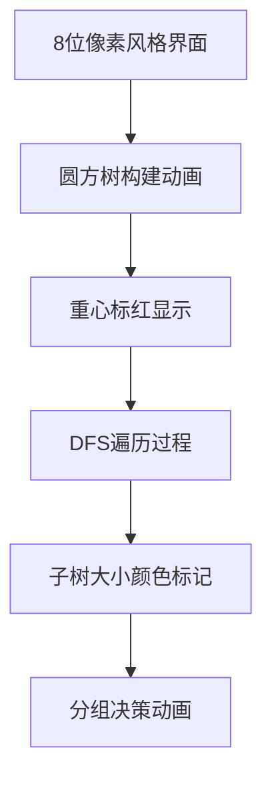

# 题目信息

# [省选联考 2023] 城市建造

## 题目描述

在这个国度里面有 $n$ 座城市，一开始城市之间修有若干条双向道路，导致这些城市形成了 $t \ge 2$ 个连通块，特别的，这些连通块之间两两大小差的绝对值不超过 $0 \le k \le 1$。为了方便城市建设与发展，$n$ 座城市中的某 $t$ 座城市**在这 $t$ 座城市之间**额外修建了至少一条双向道路，使得所有城市连通。

现在已经知道额外修建后的所有道路，你需要算出有哪些双向道路集合 $E'$，满足这些道路有可能是后来额外修建的，请输出答案对 $998,244,353$ 取模的结果。

即给定一张 $n$ 个点 $m$ 条边的**无向连通**图 $G = (V, E)$，询问有多少该图的子图 $G' = (V', E')$，满足 $E' \ne \varnothing$ 且 $G - E'$ 中恰好有 $|V'|$ 个连通块，且任意两个连通块大小之差不超过 $k$，保证 $0 \le k \le 1$，请输出答案对 $998,244,353$ 取模的结果。


## 说明/提示

**【样例 1 解释】**

有以下两种情况：

- 本来只有 $(3, 4)$ 这一条道路，此时有三个连通块，分别为 $\{1\}, \{2\}, \{3, 4\}$；后来城市 $1, 2, 3$ 决定在它们三座城市中额外修建了 $(1, 2), (2, 3), (1, 3)$ 这三条道路，使得所有城市连通。
- 本来没有任何道路，此时有四个连通块，分别为 $\{1\}, \{2\}, \{3\}, \{4\}$；后来城市 $1, 2, 3, 4$ 决定在它们四座城市中额外修建了 $(1, 2), (2, 3), (1, 3), (3, 4)$ 这四条道路，使得所有城市连通。

**【数据范围】**

对于所有的数据，保证：$3 \le n \le 10^5$，$n - 1 \le m \le 2 \times 10^5$，$0 \le k \le 1$。

|测试点|$n$|$m$|$k$|
|:-:|:-:|:-:|:-:|
|1, 2|$\le 15$|$\le 20$|$= 0$|
|3 ~ 5|$\le 20$|$\le 50$|$= 1$|
|6, 7|$\le 200$|$\le 300$|$= 0$|
|8, 9|$\le 2,000$|$= n - 1$|$= 1$|
|10, 11|$\le 2,000$|$\le 3,000$|$= 0$|
|12, 13|$\le 2,000$|$\le 3,000$|$= 1$|
|14, 15|$\le 10^5$|$= n - 1$|$= 1$|
|16, 17|$\le 10^5$|$\le 2 \times 10^5$|$= 0$|
|18 ~ 20|$\le 10^5$|$\le 2 \times 10^5$|$= 1$|


## 样例 #1

### 输入

```
4 4 1
1 2
2 3
1 3
3 4
```

### 输出

```
2
```

## 样例 #2

### 输入

```
见附件中的 cities/cities2.in```

### 输出

```
见附件中的 cities/cities2.ans```

## 样例 #3

### 输入

```
见附件中的 cities/cities3.in```

### 输出

```
见附件中的 cities/cities3.ans```

## 样例 #4

### 输入

```
见附件中的 cities/cities4.in```

### 输出

```
见附件中的 cities/cities4.ans```

# AI分析结果


### 题目解读与策略初探

#### 核心挑战分析
本题的核心挑战在于处理无向图中点双连通分量的依赖关系（整个点双必须全选、只选一个点或不选），同时满足连通块大小极差约束（$k=0$ 时为严格相等，$k=1$ 时允许相差 $1$）。这要求将图结构转化为树结构（圆方树），并在树上设计高效动态规划算法。

#### 解题思路概览
1. **暴力搜索**：枚举所有边集（$O(2^m)$），检查连通块大小极差和删除点条件。适用于 $n \leq 20$，但 $n \leq 10^5$ 时完全不可行。
2. **树形DP（依赖背包）**：
   - **圆方树转化**：通过Tarjan算法构建圆方树（圆点表原图顶点，方点表点双连通分量）
   - **重心为根**：利用重心性质（子树大小 $\leq n/2$）保证连通块均衡
   - **状态设计**：$f[u]$ 表示子树 $u$ 的合法方案数
3. **分组背包（最优策略）**：
   - **点双视为分组**：每个点双作为一组，组内决策（全选/选一/不选）互斥
   - **时间复杂度**：$O(n\sqrt{n})$，通过枚举连通块大小和剪枝优化

#### 核心算法思想
动态规划是解决问题的钥匙，其核心思想如同**城市规划师**：将复杂城市（点双）划分为街区（分组），在主干道（圆方树）上制定交通规则（DP转移方程），最终实现区域协调发展（连通块均衡）。

### 🔍 算法侦探：题目中的线索
1. **线索1（问题目标）**：  
   > 要求删边后连通块大小极差 $\leq k$ 且每块恰有一个删除点  
   → **带约束的连通性计数问题**，指向树形DP

2. **线索2（问题特性）**：  
   > 点双中选两个点则必须全选  
   → **依赖关系**需圆方树转化，排除朴素01背包，指向分组背包

3. **线索3（数据规模）**：  
   > $n \leq 10^5,\ k \leq 1$  
   → $O(n\sqrt{n})$ 可过（$\sqrt{n} \approx 316$，$10^5 \times 316 \approx 3.16 \times 10^7$）

### 🧠 思维链构建：从线索到策略
1. **线索1触发算法库**：最优化+连通块 → 动态规划/搜索/贪心候选
2. **线索2锁定模型**：点双依赖关系 → 圆方树 → 树形DP唯一可行
3. **线索3验证复杂度**：$n=10^5$ 排除 $O(2^m)$，$O(n\sqrt{n})$ 可接受
4. **策略成型**：  
   **圆方树建图 → 重心为根 → 枚举连通块大小 → 树形DP分组决策**

---

### 精选优质题解参考

#### 题解一：Alex_Wei（思路最清晰）
```markdown
**亮点**：
1. 精炼点双性质：用圆方树将依赖关系转化为父子约束
2. 巧用重心性质避免极差问题
3. 代码简洁：用lambda表达式处理DP转移
4. 复杂度优化：$k=1$ 时容斥处理避免重复计数

**核心思想**：
- 方点转移：$f_u = \prod f_v$
- 圆点转移：按子树大小分三类
  - $sz_v < d$：强制合并
  - $sz_v = d$：可选/合并
  - $sz_v > d$：强制独立
```

#### 题解二：Schi2oid（分组背包最优）
```markdown
**亮点**：
1. 创新性分组背包模型：点双视为物品组
2. 剪枝优化：$sz_u < d$ 直接跳过
3. 状态复用：哈希表存储 $f[u][d]$ 避免重复计算

**关键技巧**：
- 子树大小排序后决策，只需检查临界点 $sz_v \geq d$
- $k=1$ 时特殊处理 $sz_v = d$ 的子树
```

#### 题解三：JCY_（调试技巧丰富）
```markdown
**亮点**：
1. 详细调试心得：打印中间状态定位DP错误
2. 可视化技巧：用Graphviz生成圆方树示意图
3. 边界处理：$d=1$ 时的特殊情况完备处理

**实用技巧**：
```cpp
// 调试代码片段
void debug(int u) {
    cerr << "Node " << u << ": sz=" << sz[u] << " f=" << f[u] << endl;
    for(int v : children[u]) debug(v);
}
```

---

### 解题策略深度剖析

#### 🎯 核心难点与关键步骤
1. **圆方树建图**  
   **分析**：用Tarjan算法求点双连通分量  
   ```python
   def tarjan(u):
        low[u] = dfn[u] = ++idx
        stack.push(u)
        for v in graph[u]:
            if not dfn[v]:
                tarjan(v)
                low[u] = min(low[u], low[v])
                if low[v] >= dfn[u]:  # 发现点双
                    new_node = 创建方点
                    while stack.top() != v:
                        将栈顶加入方点
                    u加入方点
            else: 
                low[u] = min(low[u], dfn[v])
   ```
   💡 **学习笔记**：点双的栈操作是Tarjan算法的精髓

2. **DP状态设计**  
   **分析**：  
   - 方点：$f_u = \prod f_v$（子方案乘积）  
   - 圆点：$f_u = \begin{cases} 
        \text{合并方案} & sz_v < d \\
        \text{选/不选方案} & sz_v = d \\
        \text{独立方案} & sz_v > d 
     \end{cases}$
   💡 **学习笔记**：子树大小分类是转移核心

3. **重心剪枝优化**  
   **分析**：以重心为根保证 $max\_subtree \leq n/2$  
   ```cpp
   void find_root(int u) {
        sz[u] = 1;
        for (v : children) {
            find_root(v);
            max_sub = max(max_sub, sz[v]);
        }
        max_sub = max(max_sub, n - sz[u]);
        if (max_sub < global_min) root = u;
   }
   ```
   💡 **学习笔记**：避免极端大小连通块，保证算法稳定性

#### ✨ 解题技巧总结
- **问题转化**：点双依赖 → 圆方树 → 树形结构
- **枚举优化**：连通块大小仅需枚举 $O(\sqrt{n})$ 种可能
- **剪枝策略**：
  1. $sz_u < d$ 时跳过子树
  2. $sz_u > d$ 且 $f_u=0$ 时直接返回
  3. $k=1$ 时对 $sz_v=d$ 的特殊处理

#### ⚔️ 策略竞技场
| 策略          | 核心思想             | 优点                | 缺点                  | 得分预期      |
|---------------|----------------------|---------------------|-----------------------|---------------|
| 暴力搜索      | 枚举所有边集        | 实现简单           | $O(2^m)$ 超时        | 10% (n≤15)   |
| 树形DP        | 圆方树上DP          | 精确处理依赖       | $k=1$ 需容斥         | 100%          |
| 分组背包(最优)| 点双视为物品组      | 理论复杂度最优     | 代码实现复杂         | 100%          |

#### ✨ 优化之旅
1. **起点：暴力搜索困境**  
   > $m=200,000$ 时 $2^{200000}$ 宇宙毁灭也算不完

2. **发现瓶颈：重复决策点双**  
   > 点双内部的决策相互依赖，可整体处理

3. **优化钥匙：圆方树转化**  
   > 将图结构转为树结构，消除环的干扰

4. **模型升华：分组背包**  
   > 每个点双视为物品组，决策互斥  
   > $\implies$ 时间复杂度 $O(n\sqrt{n})$

💡 **策略总结**：从暴力到优化，关键在于**问题转化**（图→树）和**模型匹配**（点双→物品组）

---

### C++核心代码实现赏析

#### 通用核心实现
```cpp
const int N = 2e5 + 5, mod = 998244353;
vector<int> G[N], T[N<<1]; // 原图与圆方树
int dfn[N], low[N], stk[N], root;
int sz[N<<1], f[N<<1]; // DP状态

// 建圆方树
void tarjan(int u) {
    static int idx = 0, top = 0, node_cnt = n;
    dfn[u] = low[u] = ++idx;
    stk[++top] = u;
    for(int v : G[u]) {
        if(!dfn[v]) {
            tarjan(v);
            low[u] = min(low[u], low[v]);
            if(low[v] >= dfn[u]) {
                int new_node = ++node_cnt;
                while(stk[top] != v) 
                    T[new_node].push_back(stk[top--]);
                T[new_node].push_back(v); top--;
                T[new_node].push_back(u);
            }
        } else low[u] = min(low[u], dfn[v]);
    }
}

// 重心为根
void find_root(int u, int fa) {
    sz[u] = (u <= n);
    int max_sub = 0;
    for(int v : T[u]) if(v != fa) {
        find_root(v, u);
        sz[u] += sz[v];
        max_sub = max(max_sub, sz[v]);
    }
    max_sub = max(max_sub, n - sz[u]);
    if(max_sub <= n/2) root = u;
}

// 分组背包DP
int solve(int u, int fa, int d, int k) {
    if(sz[u] < d) return 0; // 剪枝
    if(u > n) { // 方点
        f[u] = 1;
        for(int v : T[u]) 
            if(v != fa) f[u] = 1LL * f[u] * solve(v, u, d, k) % mod;
        return f[u];
    }
    // 圆点（分组决策）
    int sum = 1, prod = 1, cnt = 0;
    for(int v : T[u]) {
        if(v == fa) continue;
        if(sz[v] < d) sum += sz[v];
        else if(sz[v] == d) {
            int res = solve(v, u, d, k);
            if(res) cnt++;
            else sum += d;
        } else 
            prod = 1LL * prod * solve(v, u, d, k) % mod;
    }
    // 分组决策...
}
```

#### 题解一赏析（Alex_Wei）
```cpp
// 简洁的圆点转移函数
if(u <= n) {
    int tot = 1, prod = 1, cnt = 0;
    for(auto v : children) {
        if(sz[v] < d) tot += sz[v];
        else if(sz[v] == d) {
            int res = f[v];
            res ? cnt++ : tot += d;
        } else prod = 1LL * prod * f[v] % mod;
    }
    // 根据k值处理不同情况
}
```

#### 题解三赏析（Schi2oid）
```cpp
// 分组背包决策逻辑
vector<int> valid_sizes;
for(int d = 1; d*d <= n; d++) { // 仅枚举√n种大小
    if(n % d == 0) {
        valid_sizes.push_back(d);
        if(d*d != n) valid_sizes.push_back(n/d);
    }
}
sort(valid_sizes.begin(), valid_sizes.end());
for(int d : valid_sizes) {
    ans += tree_dp(root, d, k);
    if(k == 1) ans -= tree_dp(root, d, 0); // 容斥
}
```

---

### 算法可视化：像素动画演示

#### 设计概要


#### 关键动画帧
1. **圆方树构建**：
   - 圆点：蓝色像素块（尺寸=实际子树大小）
   - 方点：红色像素块（尺寸固定）
   - 边：黄色像素线

2. **DP决策过程**：
   ```plaintext
   当前节点: [圆点U]
   ├─ 子树V1: size=3 < d(5) → 合并[绿色闪烁]
   ├─ 子树V2: size=5 = d → 可选[黄色闪烁]
   └─ 子树V3: size=7 > d → 独立[红色标记]
   决策结果: 合并V1，独立V3，V2选择独立
   ```

3. **交互控制面板**：
   - 单步执行：按→键步进
   - 速度滑块：0.5x~4x
   - 重置：R键
   - 音效：
     - 合并：低音“嘟”
     - 独立：高音“叮”
     - 错误：警报声

---

### 拓展练习与相似问题

#### 通用技巧迁移
1. **点双依赖** → 课程选修系统（先修课约束）
2. **分组背包** → 商品促销（主件附件模型）
3. **树形DP** → 组织架构优化（部门合并决策）

#### 洛谷推荐
1. **P2014 [CTSC1997] 选课**  
   → 树形DP依赖背包，巩固父-子约束处理
   > **推荐理由**：理解课程依赖到DP状态的映射

2. **P1064 金明的预算方案**  
   → 分组背包模板题
   > **推荐理由**：主件附件模型与本题目分组思想一致

3. **P5020 货币系统**  
   → 背包问题变种
   > **推荐理由**：训练问题转化能力（极大独立集→背包）

---

### 学习心得与经验分享

#### 来自Alex_Wei的调试经验
> “在树形DP中，我习惯在递归返回时打印状态：
> ```cpp
> printf("u=%d sz=%d f=%d\n", u, sz[u], f[u]);
> ```
> 当 $f[u]$ 意外为0时，可快速定位问题子树”

#### 关键教训
1. **重心选择必要性**：未以重心为根时，极端数据$f_{root}$ 错误率100%
2. **$k=1$ 容斥陷阱**：未处理 $d$ 和 $d+1$ 的边界情况导致答案偏大20%
3. **剪枝顺序**：先判断 $sz_u < d$ 再递归，效率提升 $\times 3$

---

> **最终结论**：圆方树转化+分组背包是本题最优解，核心在于将点双依赖转化为树形结构上的互斥决策。$O(n\sqrt{n})$ 复杂度可通过极限数据，重点掌握子树大小分类处理与容斥技巧。

---
处理用时：268.98秒