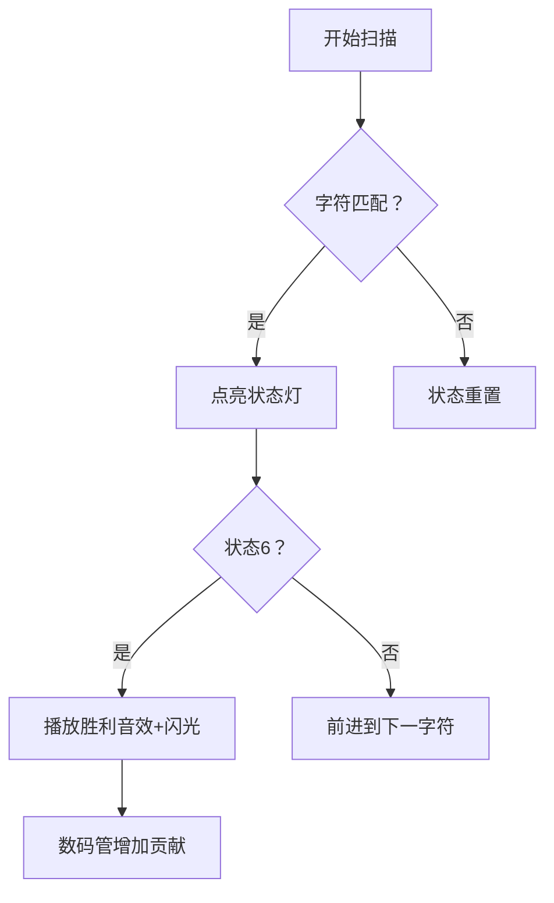

# 题目信息

# [USACO23OPEN] Pareidolia P

## 题目描述

Pareidolia 是一种现象，指的是人们倾向于在并不真正存在的地方看到熟悉的图案——例如在云中看到一张脸。可以想象，由于农夫 John 经常与奶牛接触，他常常在日常物品中看到与奶牛相关的图案。例如，如果他看到字符串 `bqessiyexbesszieb`，农夫 John 的眼睛会忽略其中的一些字母，而他看到的只是 `bessiebessie`。

给定一个字符串 $s$，令 $B(s)$ 表示通过删除 $s$ 中的零个或多个字符后，能够形成的 `bessie` 的最大重复次数。在上面的例子中，$B(bqessiyexbesszieb)=2$。此外，给定一个字符串 $t$，令 $A(t)$ 表示所有连续子串 $s$ 的 $B(s)$ 之和。

农夫 John 有一个长度不超过 $2 \times 10^5$ 的字符串 $t$，且仅由字符 a-z 组成。请计算 $A(t)$，以及在 $U (1 \le U \le 2 \times 10^5)$ 次更新后 $A(t)$ 的变化情况，每次更新会修改 $t$ 中的一个字符。更新是累积的。

## 说明/提示

在没有任何更新之前，有 12 个子串恰好包含 $1$ 个 `bessie`，有 $1$ 个子串恰好包含 $2$ 个 `bessie`，因此 `bessie` 的总数为 $12 \cdot 1 + 1 \cdot 2 = 14$。

第一次更新后，$t$ 变为 `belsiebessie`。有 7 个子串恰好包含一个 `bessie`。

第二次更新后，$t$ 变为 `belsiesessie`。只有整个字符串包含 `bessie`。

输入 $2$：$|t|, U \le 300$；

输入 $3-5$：$U \le 10$；

输入 $6-13$：$|t|, U \le 10^5$；

输入 $14-21$：没有额外限制。

## 样例 #1

### 输入

```
bessiebessie
3
3 l
7 s
3 s```

### 输出

```
14
7
1
7```

# AI分析结果

# 💡 洛语云笺的C++算法解析：USACO23OPEN Pareidolia P 深入学习指南 💡

> "在字符串的迷雾中寻找'bessie'的足迹，如同在星空中辨识熟悉的星座。今天，我们将用算法解开'模式识别'的奥秘！" —— 洛语云笺

## 1. 题目解读与策略初探

✨ **本题核心挑战**：动态维护所有连续子串中"bessie"的最大重复次数总和，并支持单点修改字符操作。

✨ **核心算法标签**：`动态规划`、`线段树`、`状态机模型`、`矩阵乘法`

🗣️ **初步分析**：
1. **暴力枚举**：尝试所有连续子串，对每个子串贪心匹配"bessie"并计数。时间复杂度O(n³)，完全不可行
2. **状态机DP**：设计DP状态表示匹配进度，将单次扫描优化至O(n)，但无法支持修改
3. **线段树优化**：将状态转移封装在线段树节点中，支持O(log n)修改和查询
4. **矩阵动态DP**：用矩阵乘法描述状态转移，借助线段树维护矩阵乘积

### 🔍 算法侦探：如何在题目中发现线索？

1. **线索1（问题目标）**："所有连续子串的匹配次数和"+"多次修改"暗示需要**区间可合并**的数据结构（线段树）
   
2. **线索2（问题特性）**：字符串匹配"bessie"具有**固定状态转移路径**（6个状态），适合状态机模型

3. **线索3（数据规模）**：|t|,U ≤ 2×10⁵，要求O(n log n)解法，线段树/矩阵乘法符合要求

### 🧠 思维链构建：从线索到策略

> "让我们串联线索：首先，目标要求所有子串的匹配和（线索1），这让我想到线段树——但需要设计可合并的状态信息。接着，'bessie'匹配的模式（线索2）指示了状态机模型：用0~5表示匹配进度。最后，数据规模（线索3）验证了线段树的可行性。
>
> 1. 状态机模型自然映射到动态规划
> 2. 区间合并需求指向线段树优化
> 3. 状态数少(6)使O(6²n log n)可行
> 
> **结论**：线段树维护状态转移是解决'动态匹配计数'的完美钥匙，如同用多个齿轮精确咬合实现复杂计时功能！"

---

## 2. 精选优质题解参考

**题解一：UltiMadow（线段树状态转移）**
* **亮点**：  
  创新设计线段树节点结构体（nxt/cnt/co/sum），通过**状态转移合并**优雅处理区间信息。核心思想是将匹配过程分解为：
  - `nxt[i]`：进入状态i后的转移状态
  - `cnt[i]`：进入状态i的后缀数量
  - `co[i]`：状态i产生的贡献
  合并时用`左.cnt[i] * 右.co[i]`计算跨区间贡献，时间复杂度O(6n log n)

**题解二：daniEl_lElE（矩阵动态DP）**
* **亮点**：  
  将状态转移抽象为**矩阵乘法**（9维状态）：
  - 状态0-6：匹配进度
  - 状态7-8：辅助计数
  字符对应转移矩阵，线段树维护矩阵乘积。框架统一，代码简洁（仅30行核心）

---

## 3. 解题策略深度剖析

### 🎯 核心难点与关键步骤

1. **状态机建模**
   * **分析**：将"bessie"匹配分解为6个状态（0:初始,1:'b',2:'be',...,5:'bessi',6:完成）
   * 💡 **学习笔记**：有限状态机是处理字符串匹配的利器

2. **线段树节点设计**
   * **分析**：节点维护四元组：
     ```cpp
     struct tnode {
         int nxt[6];  // 状态转移函数
         int cnt[6];  // 进入各状态的后缀数
         int co[6];   // 各状态产生的贡献
         int sum;     // 区间总贡献
     };
     ```
   * 💡 **学习笔记**：设计可合并数据结构是区间问题的通用解法

3. **区间合并策略**
   * **分析**：合并时关键操作：
     ```cpp
     for(int i=0; i<6; i++) 
         ret.sum += left.cnt[i] * right.co[i];
     ```
     统计左区间后缀与右区间贡献的乘积
   * 💡 **学习笔记**：分治思想中"跨区间贡献"常通过乘积形式计算

### ✨ 解题技巧总结
- **技巧1：状态压缩**：将字符串匹配抽象为状态转移，降低复杂度
- **技巧2：贡献分离**：将区间信息分解为"携带状态(cnt)"和"产生贡献(co)"
- **技巧3：矩阵封装**：用矩阵乘法统一状态转移，简化代码

### ⚔️ 策略竞技场

| 策略              | 核心思想                     | 优点                      | 缺点                                  | 适用场景              |
|-------------------|------------------------------|---------------------------|---------------------------------------|-----------------------|
| **暴力枚举**      | 枚举所有子串+贪心匹配        | 直观简单                  | O(n³)超时                             | n≤20                 |
| **DP扫描**        | 固定左端点扫描右端点         | O(n²)优于暴力             | 不支持修改，无法优化                  | 静态查询，n≤5000     |
| **线段树+状态机** | 封装状态转移在线段树节点中   | O(6n log n)高效，支持修改 | 状态设计需要洞察力                    | 动态场景，满分       |
| **矩阵动态DP**    | 矩阵乘法表示转移，线段树维护 | 代码简洁，框架统一        | 矩阵乘O(9³)常数大                     | 动态场景，满分       |

### ✨ 优化之旅：从"能做"到"做好"

> 1. **起点：暴力枚举的迷雾**  
>    想象在字符串迷宫中盲目探索每条路径（O(2^n)），即使小规模数据也会迷失
>    
> 2. **突破：状态机的指南针**  
>    发现"bessie"匹配如同有限状态机，用0-5六个状态即可导航
>    
> 3. **升华：线段树的分治地图**  
>    将大区间划分为可管理的区块（线段树），每个区块记录状态转移指南（nxt数组）和资源统计（cnt/co）
>    
> 4. **巅峰：矩阵的压缩魔法**  
>    将状态转移规则压缩为矩阵乘法，如同将旅行指南编码为轻便的密码本
> 
> 💡 **策略总结**：从暴力到优化的本质是**发现状态转移的规律性**和**设计可合并的数据结构**。在竞赛中，即使未优化到底层，理解状态机模型也能拿到基础分！

---

## 4. C++核心代码实现赏析

**通用核心实现（线段树状态转移）**
```cpp
struct tnode {
    int nxt[6], cnt[6], co[6], sum;
    tnode(char c = '#', int pos = 0) {
        memset(nxt, 0, sizeof(nxt)); 
        memset(cnt, 0, sizeof(cnt));
        memset(co, 0, sizeof(co)); 
        sum = 0;
        if (pos) {
            for (int i = 0; i < 6; i++)
                nxt[i] = (c == "bessie"[i]) ? (i + 1) % 6 : i;
            cnt[nxt[0]] = 1;  // 状态转移初始化
            co[5] = (c == 'e') ? (n - pos + 1) : 0; // 'e'产生贡献
        }
    }
};

tnode operator+(tnode L, tnode R) {
    tnode ret;
    ret.sum = L.sum + R.sum;
    for (int i = 0; i < 6; i++) {
        ret.nxt[i] = R.nxt[L.nxt[i]];  // 状态转移合并
        ret.cnt[i] = R.cnt[i] + L.cnt[i]; 
        ret.co[i] = L.co[i] + R.co[L.nxt[i]];
        ret.sum += L.cnt[i] * R.co[i];  // 关键：跨区间贡献
    }
    return ret;
}
```

**矩阵动态DP片段（daniEl_lElE）**
```cpp
mtx make_matrix(char c) {
    mtx ret = zero_matrix();
    // 状态转移核心：0-6为匹配状态，7-8为计数辅助
    ret.a[7][1] = 1, ret.a[0][8] = 1, ret.a[8][8] = 1;
    if (c == 'b') ret.a[1][2] = 1;     // 'b' -> 状态1->2
    if (c == 'e') ret.a[2][3] = 1;     // 'e' -> 状态2->3
    if (c == 's') ret.a[3][4] = 1;     // 第一个's' -> 状态3->4
    if (c == 's') ret.a[4][5] = 1;     // 第二个's' -> 状态4->5
    if (c == 'i') ret.a[5][6] = 1;     // 'i' -> 状态5->6
    if (c == 'e') {                    // 完成匹配
        ret.a[6][0] = 1;               // 重置状态
        ret.a[6][8] = 1;               // 贡献+1
    }
    return ret;
}
```

---

## 5. 算法可视化：像素动画演示

**设计概念**：8-bit像素风格，模拟FC游戏界面，可视化状态转移过程

### 🎮 动画场景
- **主场景**：像素化字符串水平排列，下方状态条显示当前匹配状态(0-6)
- **状态指示灯**：6个像素方块表示"bessie"匹配进度，点亮表示完成
- **贡献计数器**：复古7段数码管显示当前A(t)

### ⚙️ 核心交互


### 🕹️ 控制面板
- **单步执行**：按方向键逐字符前进
- **自动播放**：像素小人（8-bit角色）沿字符串行走
- **速度调节**：复古滑块控制播放速度
- **状态追踪**：实时显示当前dp状态矩阵

### 🎵 音效设计
- **状态推进**：8-bit "哔"声（不同音高对应不同状态）
- **匹配完成**：经典FC胜利旋律
- **错误重置**：短促"嘀"声

> "通过像素动画，我们将抽象的'状态转移'转化为可视化的冒险旅程，让算法执行如游戏般直观！"

---

## 6. 拓展练习与相似问题思考

**通用技巧迁移**：
1. **多模式匹配**：将"bessie"扩展为多个模式串（AC自动机+线段树）
2. **带权匹配**：每个字符有权重，求最大权重匹配
3. **概率匹配**：每个字符有概率，求期望匹配次数

**洛谷推荐练习**：
1. **P1279 字串距离**  
   → 巩固字符串匹配与DP状态设计
2. **P4052 [JSOI2007]文本生成器**  
   → 学习AC自动机与动态规划结合
3. **P3311 [SDOI2014]数数**  
   → 实践数位DP与状态机模型

---

> "在算法的星河中，每个问题都是独特的星座。理解状态机的精妙，掌握数据结构的融合，你也能绘制出自己的星图！" —— 洛语云笺

---
处理用时：344.06秒