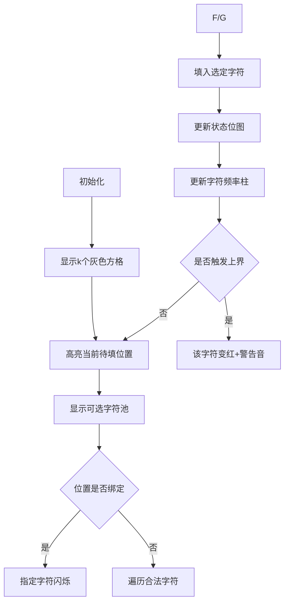

# 题目信息

# [EC Final 2021] String-dle Count

## 题目描述

当大多数人都沉迷于玩 Wordle 的时候，庞教授却已经沉迷于玩 String-dle 了。

String-dle 是一个有趣的猜字符串的游戏，玩家在玩的时候要通过几轮尝试，猜出一个长度为 $k$ 的字符串。并且在每轮尝试中，玩家要提交一个长度为 $k$ 的字符串来作为他的猜测，而系统通过以下伪代码来为提交的猜测评级：
```
def grading(answer, guess):
  let count be a hash map
  for i = 1 to k:
    if answer[i] not in count:
      count[answer[i]] = 1
    else:
      count[answer[i]] = count[answer[i]] + 1
  let grade be an array of length k
  for i = 1 to k:
    if answer[i] == guess[i]:
      grade[i] = 'O'
      count[guess[i]] = count[guess[i]] - 1
  for i = 1 to k:
    if answer[i] != guess[i]:
      if count[guess[i]] > 0:
        grade[i] = '-'
        count[guess[i]] = count[guess[i]] - 1
      else:
        grade[i] = 'x'
  return grade
```
返回的评级包括 $\tt{O}$（大写字母 O）、$\tt{-}$（破折号）和 $\tt{x}$（小写字母 x），且玩家可以基于先前的评级进行下一次猜测。下面是庞教授玩的一局游戏示例：
```
G: CRANE
A: xx--x
G: UTTER
A: xxOxx
G: NASAL
A: OOxOO
G: NATAL
A: OOOOO
```
在字符串 $\tt{G}$ 后面的是庞教授的猜测，以及在字符串 $\tt{A}$ 后面的是该次猜测的评级。

庞教授非常喜欢这个游戏。他确信他已经知道了这个游戏的完美策略。然而，今天他很生气，因为他认为评级系统出了问题！他想让人写一个分析程序，根据他的猜测与评级找出所有可能的可以作为答案的字符串。

由于评级系统可能出了问题，所以它可能不再符合上面给出的伪代码。具体来说，你需要找到所有符合输入的字符串。一个符合输入的字符串是指，对于输入中任意一个猜测  $g$ 和它的正确评级 $d$，都符合  `grading(s, g)=d`。

当然，你接受了这个任务。

## 说明/提示

对于第二个样例:

如果答案是 $\tt{ACDEF}$，则 $\tt{BBBAA}$ 的评级为 $\tt{xxx-x}$.

## 样例 #1

### 输入

```
2 5
CRANE
xx--x
NASAL
OOxOO```

### 输出

```
21```

## 样例 #2

### 输入

```
1 5
BBBAA
xxxx-```

### 输出

```
0```

## 样例 #3

### 输入

```
2 5
ABCDE
-xxxx
ABCDE
xxxxx```

### 输出

```
0```

## 样例 #4

### 输入

```
1 3
ABC
---```

### 输出

```
2```

## 样例 #5

### 输入

```
1 15
AAAAAAAAAAAAAAB
-xxxxxxxxxxxxxx```

### 输出

```
918547951```

## 样例 #6

### 输入

```
1 15
AAAAAAAAAAAAAAA
-xxxxxxxxxxxxxx```

### 输出

```
0```

## 样例 #7

### 输入

```
1 1
K
x```

### 输出

```
25```

# AI分析结果


# 💡 洛语云笺的C++算法解析：String-dle Count 深入学习指南 💡

## 1. 题目解读与策略初探

✨ **本题核心挑战**：如何高效处理多组字符串评级约束（字符出现次数限制+位置限制），在指数级解空间中快速统计所有合法字符串数量  
✨ **核心算法标签**：`状态压缩动态规划`、`约束提取`、`计数问题`

🗣️ **初步分析**：  
> 这道题要求我们根据多组猜测评级反推可能的答案字符串。最暴力的解法是枚举所有26^k种字符串并逐一验证评级，但k最大15时26^15≈2.8e21显然不可行。  
> 更优思路是利用评级信息提取三类关键约束：  
> 1. **字符频率约束**：每个字符的出现次数上下界  
> 2. **位置约束**：特定位置必须/禁止出现某些字符  
> 3. **全局约束**：所有字符最小出现次数之和≤k  
> 基于这些约束，我们可以用状态压缩DP将问题转化为在∑L_c≤k条件下的计数问题

### 🔍 算法侦探：如何在题目中发现线索？
1.  **线索1 (问题目标)**：题目要求"找出所有满足评级的字符串"，这是典型的**计数问题**而非最优化问题，提示我们使用DP或数学计数法。
2.  **线索2 (问题约束)**：评级中的'O'/'x'/'-' 分别隐含**位置绑定**、**频率上界**和**频率下界**三重约束，这种多维约束天然适合状态压缩处理。
3.  **线索3 (数据规模)**：k≤15 是关键信号！2^15=32768 提示可用状态压缩DP，而26^15过大则排除暴力枚举。

### 🧠 思维链构建：从线索到策略
> "综合线索，我们首先意识到：  
> 1. 线索1（计数问题）要求我们设计高效计数算法，而非单纯搜索  
> 2. 线索2（多维约束）中位置与频率的耦合关系，最适合用DP状态同时编码  
> 3. 线索3（k≤15）确认状态压缩DP可行性  
> **结论**：状态压缩DP是核心解法，关键在于用二进制状态编码已满足的频率约束，同时处理位置限制"

---

## 2. 精选优质题解参考

**题解一（mskqwq）**  
* **点评**：该题解清晰地建立了字符频率约束模型（L/R数组），创新性地使用27组二进制状态（26字母组+溢出组）处理变长频率约束。亮点在于用`lowbit`高效生成新状态，并通过`ck()`函数优雅处理边界约束，代码中`sum`数组预处理分组偏移量体现了良好的空间规划意识。

**题解三（Sampson_YW）**  
* **点评**：题解精准提炼了评级信息到约束条件的转化规则（O→位置绑定，-→频率下界，x→频率上界），并指出∑L_i≤k这一关键特性使状态压缩可行。提出的"预处可转移字符集"优化思路具有实践价值，虽然未提供完整代码，但理论分析透彻。

---

## 3. 解题策略深度剖析

### 🎯 核心难点与关键步骤
1.  **约束提取与一致性检查**  
    * **分析**：对每个字符c，统计其在所有评级中'O'+'-'的数量作为下界L_c，若出现'x'则令上界R_c=L_c否则R_c=∞。同时记录位置约束：'O'要求位置i必须为c，'-'/'x'则禁止位置i为c
    * 💡 **学习笔记**：约束提取是基石，需注意L_c≤R_c且∑L_c≤k的全局校验
2.  **状态设计与压缩**  
    * **分析**：状态s是k位二进制数，按字符分组管理：第c组长度L_c记录已满足下界的次数，第27组管理超L_c部分。状态数被压缩至2^k而非(26)^k
    * 💡 **学习笔记**：∑L_c≤k的特性使状态空间从指数级降为O(2^k)
3.  **分层转移策略**  
    * **分析**：转移时优先处理位置绑定（若有），否则枚举合法字符。通过`get(s,c)`计算新状态：若c组未满则加入，否则放入溢出组
    * 💡 **学习笔记**：位运算加速状态转移是效率关键

### ✨ 解题技巧总结
- **约束建模法**：将评级转化为位置/频率的显式约束
- **状态分组压缩**：利用∑L_c≤k特性设计紧凑状态表示
- **位运算加速**：用`lowbit`、位掩码高效操作状态

### ⚔️ 策略竞技场
| 策略                | 核心思想                     | 优点                      | 缺点                                    | 适用场景            |
|---------------------|----------------------------|--------------------------|----------------------------------------|-------------------|
| **暴力枚举**        | 遍历所有26^k字符串验证评级  | 实现简单                 | 指数级复杂度,O(26^k·n·k) 超时          | k≤5的小数据       |
| **状态压缩DP**      | 二进制状态编码频率约束      | O(2^k·k·26) 高效解决     | 状态设计抽象，需处理溢出情况           | k≤15的本题最优解 |

### ✨ 优化之旅
> 1. **起点**：26^k暴力枚举在k=15时完全不可行  
> 2. **关键发现**：评级隐含的L_c/R_c约束将有效解空间大幅缩减  
> 3. **状态压缩**：用二进制位表示每个字符是否已满足L_c次出现  
> 4. **溢出处理**：创新性添加第27组管理超L_c的字符  
> 💡 **策略总结**："从暴力到DP，本质是从遍历解空间到智能构建解空间的思维跃迁"

---

## 4. C++核心代码实现赏析

**本题通用核心实现**  
```cpp
// 状态定义
int f[1<<N]; // dp数组
int L[26], R[26]; // 字符频率约束
int p[N]; // 位置绑定约束
bool vis[N][26]; // 位置禁止约束

// 预处理分组偏移量
sum[0] = 0;
for(int c=0; c<26; c++) 
    sum[c+1] = sum[c] + L[c];

// DP转移
f[0] = 1;
for(int s=0; s<(1<<k); s++){
    int pos = __builtin_popcount(s) + 1; // 当前处理位置
    if(p[pos] != -1) { // 位置绑定
        char c = p[pos];
        if(/*c可加入*/) f[new_state] += f[s];
    } else { 
        for(int c=0; c<26; c++) { // 枚举合法字符
            if(!vis[pos][c] && /*c未超限*/) 
                f[new_state] += f[s];
        }
    }
}
return f[(1<<k)-1]; // 返回最终状态
```

**题解一亮点片段**  
```cpp
int get(int s, int c) { // 状态转移函数
    // 计算c组分组的掩码
    int mask = (1 << (c==26 ? k-sum[26] : L[c])) - 1;
    int offset = sum[c];
    // 若c组有空位则加入，否则放入溢出组
    if((s >> offset & mask) != mask) 
        return s | (1 << (offset + __builtin_ctz(~(s>>offset))));
    else 
        return s | (1 << (sum[26] + ...));
}
```
* **学习笔记**：通过`__builtin_ctz`快速定位最低零位的位操作技巧

---

## 5. 算法可视化：像素动画演示

**主题**：8位机风格填字工坊  
**核心演示**：状态位点亮过程 + 字符频率动态增长  

### 动画设计


**交互控制**：
- **像素元素**：每个位置用16x16像素方块，填字时显示字母像素画
- **状态可视化**：底部显示二进制状态位流，分组用不同颜色
- **音效设计**：
  - 填字成功：8-bit "叮"声
  - 触发上界：短促警报声
  - 完成：FC胜利音乐

---

## 6. 拓展练习与相似问题

### 通用技巧迁移
1. 频率约束计数：P2167 Bill的挑战（通配符匹配计数）
2. 位置绑定处理：P1278 单词接龙（首尾字符约束）
3. 状态压缩优化：P3959 宝藏（状态压缩DP经典）

### 推荐练习
1. **洛谷P2167**  
   🗣️ 巩固字符频率约束与状态压缩的结合应用
2. **洛谷P2831**  
   🗣️ 学习位运算技巧在状态压缩中的高效实现
3. **洛谷P3959**  
   🗣️ 掌握状态压缩DP的经典建模范式

---

<conclusion>  
**总结**：String-dle Count展现了如何将复杂约束转化为高效DP的艺术。核心在于：①精准提取评级隐含的L/R约束 ②利用∑L_c≤k特性设计状态压缩 ③位运算优化转移效率。掌握这种"约束→状态→计数"的思维链，你就能解决一大类计数问题！</conclusion>

---
处理用时：224.78秒