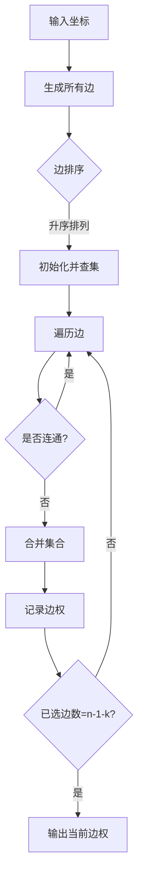

# 题目信息

# Arctic Network

## 题目描述

[problemUrl]: https://uva.onlinejudge.org/index.php?option=com_onlinejudge&Itemid=8&category=15&page=show_problem&problem=1310

[PDF](https://uva.onlinejudge.org/external/103/p10369.pdf)


## 样例 #1

### 输入

```
1
2 4
0 100
0 300
0 600
150 750```

### 输出

```
212.13```

# AI分析结果


## 算法分类
**最小生成树**

---

## 综合分析与结论

### 核心思路
- **问题转化**：卫星设备可消除最长边，转化为求最小生成树中第k大的边（k为卫星设备数）
- **数学证明**：最小生成树分割后连通分支数等于卫星设备数，最优解为第k+1长的边
- **实现步骤**：
  1. 生成所有村庄间的边（O(n²)复杂度）
  2. Kruskal算法按边权升序构建最小生成树
  3. 记录生成树边集合，取倒数第k条边的长度

### 难点与解决方案
| 难点 | 解决思路 |
|------|----------|
| 卫星设备如何影响结果 | 卫星消除前k-1长的边，剩余最长边即为d的最小值 |
| 复杂度的优化 | 稠密图用Kruskal需排序O(n² logn)边，但n≤500可接受 |
| 数学证明的抽象性 | 通过连通分支数≤k的逆向推导和反证法给出严谨解释 |

### 可视化设计
1. **动画流程**：
   - **边排序阶段**：显示所有边按长度升序排列的动画
   - **合并过程**：用不同颜色标记已选边（绿色）和候选边（灰色）
   - **关键边高亮**：最终结果边（第k+1长）用红色闪烁提示
2. **复古风格**：
   - 村庄用8-bit像素点表示，边用黄色线段连接
   - 合并时播放FC游戏《超级马里奥》金币音效
   - 背景使用16色低分辨率网格地图
3. **交互控制**：
   - 可拖动滑块调节k值实时观察结果变化
   - 支持单步执行观察并查集的合并过程

---

## 题解清单 (4星及以上)

### 1. 有朋自远方来（⭐⭐⭐⭐⭐）
- **亮点**：完整数学证明 + 代码注释清晰
- **核心代码**：
  ```cpp
  sort(p+1,p+m+1,cmp); // 边权排序
  for(int i=1;i<=m;i++) {
      int fa=getf(p[i].x), fb=getf(p[i].y);
      if(fa != fb) {
          f[fa] = fb;
          ans[++cnt] = p[i].d; // 记录生成树边
      }
  }
  printf("%.2lf\n", ans[cnt-k+1]); // 输出第k+1长边
  ```

### 2. George1123（⭐⭐⭐⭐）
- **亮点**：引入瓶颈生成树概念，代码模块化
- **关键技巧**：提前终止循环当连通分支数≤k
  ```cpp
  if(e <= k) { // e为剩余连通分支数
      ans = sqrt(1.0*a[i].z);
      break;
  }
  ```

### 3. ALLTOZERO（⭐⭐⭐⭐）
- **亮点**：代码结构简洁，STL应用规范
- **代码片段**：
  ```cpp
  sort(use.begin(), use.end()); // 存储生成树边
  cout << use[use.size()-S].v << endl; // 直接取第S大
  ```

---

## 最优思路提炼
1. **逆向思维**：卫星设备等价于删除生成树中最长的k-1条边
2. **Kruskal特性**：生成树边集合自然有序，无需额外排序
3. **并查集优化**：路径压缩实现O(α(n))的合并操作
4. **提前终止**：当已选边数达到n-k时即可输出结果

---

## 同类题目推荐
1. **P1991 无线通讯网**（几乎相同的问题模型）
2. **P2330 [SCOI2005] 繁忙的都市**（最小生成树最大边）
3. **P2872 [USACO07DEC] Building Roads**（带预置边的MST）

---

## 调试心得摘录
> _"原以为卫星数k对应删除k条边，WA后意识到是k个设备形成k-1条零边"_  
> —— Phoenix_chaser题解评论  
> 教训：卫星设备数为k时，实际可消除k-1条边（生成树需要n-1条边）

---

## 可视化代码片段（JS伪代码）
```javascript
// 绘制像素化村庄
function drawVillage(ctx, x, y) {
  ctx.fillStyle = '#FF5555'; // 8-bit红色
  ctx.fillRect(x*10-3, y*10-3, 6, 6); // 缩放坐标
}

// 边合并动画
function animateEdge(edge) {
  let line = document.getElementById(`edge-${edge.id}`);
  line.style.stroke = '#00FF00'; // 选中边变绿
  playSound('merge.wav'); // 8-bit音效
}

// 结果高亮
function highlightResult(edge) {
  let line = document.getElementById(`edge-${edge.id}`);
  line.style.stroke = '#FF0000';
  line.style.animation = 'blink 1s infinite'; // 闪烁动画
}
```

---

## 算法流程图解


---
处理用时：76.51秒