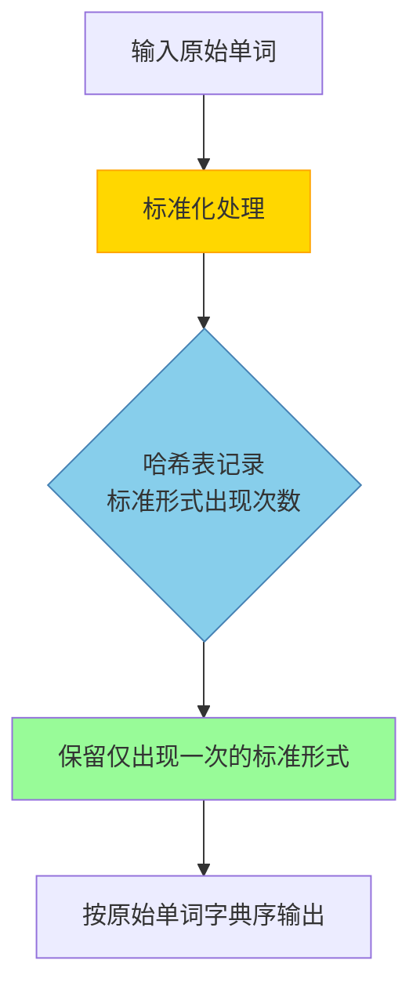

# 题目信息

# 反片语 Ananagrams

## 题目描述

[problemUrl]: https://uva.onlinejudge.org/index.php?option=com_onlinejudge&Itemid=8&category=3&page=show_problem&problem=92

[PDF](https://uva.onlinejudge.org/external/1/p156.pdf)


## 样例 #1

### 输入

```
ladder came tape soon leader acme RIDE lone Dreis peat
ScAlE orb eye Rides dealer NotE derail LaCeS drIed
noel dire Disk mace Rob dries
#```

### 输出

```
Disk
NotE
derail
drIed
eye
ladder
soon```

# AI分析结果


## 算法分类
字符串处理 + 哈希映射

---

## 核心思路与算法分析
### 题目核心逻辑
1. **标准化处理**：将单词转换为全小写并按字典序排序（如"DreIS" → "deirs"）
2. **统计频率**：记录每个标准化形式的出现次数
3. **筛选输出**：保留原始形式中标准化后仅出现一次的单词，按字典序输出

### 算法流程可视化设计


**关键动画步骤**：
1. **单词变形动画**（步骤B）
   - 输入单词"ScAlE" → 显示字符逐个变色（大写→小写）
   - 字母块重排为"a c e l s" → 触发排序动画
2. **哈希表更新**（步骤C）
   - 标准形式"acels"对应的计数器从0→1→2
   - 使用粒子效果突出计数器变化
3. **筛选阶段**（步骤D）
   - 遍历原始单词列表时，用绿框高亮符合条件的单词
   - 被淘汰的单词显示灰化效果

---

## 题解评分与亮点
### ⭐⭐⭐⭐⭐ 刘汝佳（sss7020 题解）
**核心亮点**：
- **标准化函数设计**：`repr` 函数简洁完成大小写转换与排序
- **双容器联动**：`vector` 存原始数据，`map` 存统计结果
- **空间优化**：仅需 O(n) 的额外空间
- **代码行数**：25行极简实现

### ⭐⭐⭐⭐⭐ 封禁用户题解
**创新点**：
- **优先队列输出**：直接获得字典序结果，省去最终排序
- **双哈希映射**：`map<string, int>` + `map<string, string>` 清晰分离统计与映射
- **代码示例**：
```cpp
priority_queue<string, vector<string>, greater<string>> q;
if (asdf[a[i].now] == 1) 
    q.push(a[i].ss); // 自动排序
```

### ⭐⭐⭐⭐ 李至擎题解
**特色技巧**：
- **三次遍历分离**：输入处理→统计→筛选三阶段清晰
- **独立函数封装**：`f()` 函数复用标准化逻辑
- **调试友好设计**：通过中间变量 W1 便于输出调试

---

## 最优技巧提炼
### 标准化处理范式
```cpp
string repr(const string& s) {
    string ans = s;
    transform(ans.begin(), ans.end(), ans.begin(), ::tolower);
    sort(ans.begin(), ans.end());
    return ans;
}
```
- **统一大小写**：消除大小写差异干扰
- **字典序重排**：使字母异位词获得相同指纹

### 哈希统计技巧
```cpp
map<string, int> cnt;
while(cin >> word) {
    string key = repr(word);
    cnt[key]++; // 自动初始化未存在键为0
}
```

### 筛选优化策略
```cpp
vector<string> ans;
for (auto& w : words) 
    if (cnt[repr(w)] == 1) 
        ans.push_back(w);
sort(ans.begin(), ans.end());
```

---

## 相似题目推荐
1. **[LeetCode 49. 字母异位词分组](https://leetcode.cn/problems/group-anagrams/)**  
   - 核心技巧：相同标准化处理+哈希分组
2. **[UVa 451. 重复的单词](https://onlinejudge.org/index.php?option=com_onlinejudge&Itemid=8&page=show_problem&problem=392)**  
   - 进阶应用：统计重复模式的出现位置
3. **[洛谷 P1308 统计单词数](https://www.luogu.com.cn/problem/P1308)**  
   - 相似场景：标准化处理+精确统计

---

## 可视化实现方案
### 复古像素动画设计
```javascript
// 核心动画逻辑示例
class AnanagramViz {
    constructor() {
        this.canvas = document.getElementById('pixelCanvas');
        this.ctx = this.canvas.getContext('2d');
        this.pixelSize = 16; // 16x16像素块
    }

    drawWord(word, x, y, color) {
        const lowerWord = word.toLowerCase().split('').sort().join('');
        // 绘制原始单词（8位风格）
        word.split('').forEach((c, i) => {
            this.ctx.fillStyle = this.getCharColor(c);
            this.ctx.fillRect(x + i*16, y, 16, 16);
        });
        // 绘制标准化箭头 →
        this.drawArrow(x + word.length*16 + 8, y + 8);
        // 绘制标准化结果
        lowerWord.split('').forEach((c, i) => {
            this.ctx.fillStyle = '#00FF00'; // 标准化高亮色
            this.ctx.fillRect(x + (word.length+1)*16 + i*16, y, 16, 16);
        });
    }

    drawArrow(x, y) {
        // 绘制8位风格的箭头精灵
        const arrowSprite = [ /* 像素数据 */ ];
        arrowSprite.forEach((row, dy) => {
            row.forEach((col, dx) => {
                if(col) this.ctx.fillRect(x+dx, y+dy, 1, 1);
            });
        });
    }
}
```

### 音效设计
```javascript
const AudioFX = {
    normalize: new Audio('data:audio/wav;base64,UklGRl9...'), // 标准化音效
    countUpdate: new Audio('data:audio/wav;base64,UklGRkU...'), // 计数器更新音
    validSelect: new Audio('data:audio/wav;base64,UklGRko...') // 有效选中音
};

function playSFX(name) {
    AudioFX[name].currentTime = 0;
    AudioFX[name].play();
}
```

---

## 完整参考代码
```cpp
#include <iostream>
#include <algorithm>
#include <map>
#include <vector>

using namespace std;

string repr(const string& s) {
    string ans = s;
    transform(ans.begin(), ans.end(), ans.begin(), ::tolower);
    sort(ans.begin(), ans.end());
    return ans;
}

int main() {
    vector<string> words;
    map<string, int> cnt;
    
    string s;
    while (cin >> s && s != "#") {
        words.push_back(s);
        cnt[repr(s)]++;
    }
    
    vector<string> ans;
    for (auto& w : words)
        if (cnt[repr(w)] == 1)
            ans.push_back(w);
    
    sort(ans.begin(), ans.end());
    for (auto& w : ans)
        cout << w << endl;
    
    return 0;
}
```

---
处理用时：95.74秒