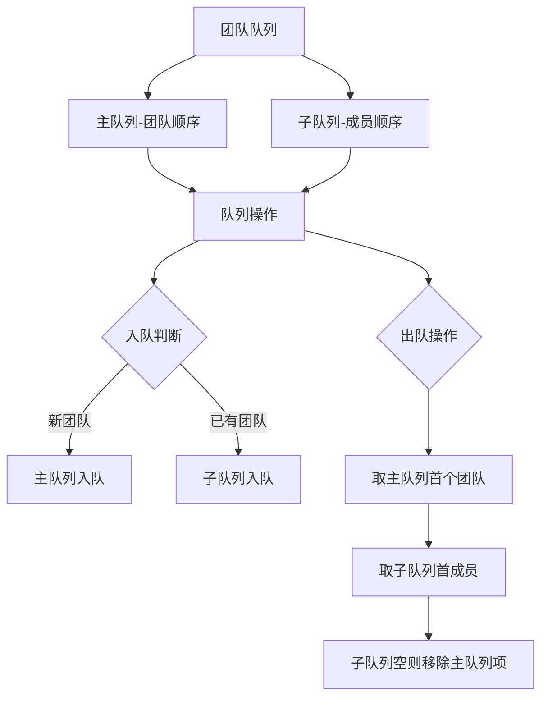

# 题目信息

# 团体队列 Team Queue

## 题目描述

有 $t$ 个团队的人正在排长队。每有一个新来的人时，他会从队首开始向后搜寻，如果发现有队友正在排队，他就会插队到他队友的身后；如果没有发现任何一个队友排队，他就只好站在长队的队尾。

输入每个团队中所有队员的编号，要求支持如下 $3$ 种指令：

`ENQUEUE x`：编号为 $x$ 的人进入长队。

`DEQUEUE`：长队的队首出队。

`STOP`：停止模拟。

对于每个 `DEQUEUE` 指令，输出出队的人的编号。

## 样例 #1

### 输入

```
2
3 101 102 103
3 201 202 203
ENQUEUE 101
ENQUEUE 201
ENQUEUE 102
ENQUEUE 202
ENQUEUE 103
ENQUEUE 203
DEQUEUE
DEQUEUE
DEQUEUE
DEQUEUE
DEQUEUE
DEQUEUE
STOP
2
5 259001 259002 259003 259004 259005
6 260001 260002 260003 260004 260005 260006
ENQUEUE 259001
ENQUEUE 260001
ENQUEUE 259002
ENQUEUE 259003
ENQUEUE 259004
ENQUEUE 259005
DEQUEUE
DEQUEUE
ENQUEUE 260002
ENQUEUE 260003
DEQUEUE
DEQUEUE
DEQUEUE
DEQUEUE
STOP
0```

### 输出

```
Scenario #1
101
102
103
201
202
203

Scenario #2
259001
259002
259003
259004
259005
260001```

# AI分析结果


## 唯一算法分类  
队列的应用

---

## 综合分析与结论  
### 核心算法流程  
1. **双队列结构**：使用主队列记录团队顺序，每个团队维护一个子队列
2. **快速查询**：通过哈希表/数组实现成员到团队的映射（`team[x] = group_id`）
3. **入队逻辑**：
   - 查询成员的团队号
   - 若该团队子队列为空，将团队号加入主队列
   - 将成员加入对应子队列
4. **出队逻辑**：
   - 取主队列首部的团队号
   - 弹出该团队子队列的队首元素
   - 若子队列空，从主队列移除该团队号

### 解决难点对比  
| 题解对比项          | Punny 题解               | Sparda 题解             | Anguei 题解            |
|-------------------|-------------------------|------------------------|-----------------------|
| **数据结构**        | 数组+队列数组            | map+队列数组            | map+队列数组          |
| **空间复杂度**      | O(1000)                 | O(1e6)                 | O(1e6)               |
| **团队查询方式**     | 预存数组直接访问 O(1)     | map查询 O(logN)        | map查询 O(logN)       |
| **空队列处理**       | 出队时循环检查主队列      | 出队后立即检查          | 出队后立即检查        |

---

## 题解清单 (4星以上)
### 1. Punny 题解 ⭐⭐⭐⭐
- **亮点**：数组预存团队编号，O(1)时间查询，内存更紧凑
- **代码片段**：
```cpp
if(p[team[num]].empty()) q.push(team[num]);  // 主队列插入逻辑
printf("%d\n",p[q.front()].front());        // 出队逻辑
```

### 2. ZRHan 题解 ⭐⭐⭐⭐
- **亮点**：队列结构清晰，维护小组段顺序
- **关键注释**：
```cpp
// base队列维护小组段顺序，q数组维护各小组内部成员
if(q[gro].empty()) base.push(gro);
```

### 3. Anguei 题解 ⭐⭐⭐⭐
- **亮点**：使用 STL 队列，代码规范易扩展
- **优化点**：通过`map`动态管理团队，适合团队数未知的场景

---

## 最优思路与技巧  
### 核心数据结构  
```cpp
queue<int> main_queue;      // 存储团队编号顺序
queue<int> team_queue[1000];// 每个团队的成员队列
int belong[1000000];        // 成员到团队的映射
```

### 关键操作动画演示设计  
  
1. **入队动画**：  
   - 新成员显示为黄色方块  
   - 若对应团队队列空，主队列添加蓝色团队标识块  
   - 成员滑入对应团队队列尾部  

2. **出队动画**：  
   - 主队列首部团队标识块闪烁红光  
   - 该团队队列首部成员爆炸消失  
   - 若团队队列空，团队标识块从主队列消失

---

## 同类题目推荐  
1. **UVA540 Team Queue**（原题加强版，大数据量）  
2. **P2058 海港**[NOIP2016]（多队列时间窗口管理）  
3. **CF754D 团队礼物**（优先级队列变种）

---

## 复古像素化可视化方案  
### 设计要素  
```javascript
// 画布初始化（像素风格）
const canvas = document.getElementById('pixel-canvas');
ctx.imageSmoothingEnabled = false;  // 关闭抗锯齿

// 音效配置
const sfx = {
  enqueue: new Audio('data:audio/wav;base64,UklGRl...'), // 8-bit 插入音
  dequeue: new Audio('data:audio/wav;base64,UklGRl...') // 爆炸音效
};

// 自动演示AI
function autoPlay() {
  const actions = ['ENQUEUE 101', 'DEQUEUE', ...]; // 预生成操作序列
  actions.forEach((cmd, i) => {
    setTimeout(() => executeCommand(cmd), i * 1000); 
  });
}
```

### 核心动画逻辑  
```javascript
function drawQueue() {
  // 绘制主队列（团队标识块）
  mainQueue.forEach((teamId, index) => {
    ctx.fillStyle = TEAM_COLORS[teamId % 8];
    ctx.fillRect(50 + index*30, 50, 25, 25); // 像素方块
  });

  // 绘制每个团队的成员队列
  teamQueues.forEach((q, teamId) => {
    q.forEach((member, idx) => {
      ctx.drawImage(MEMBER_SPRITE[member%4], 100+idx*20, 100+teamId*40);
    });
  });
}
```

---

## 关键代码实现  
### Punny 题解核心逻辑  
```cpp
// ENQUEUE 处理
if(p[team[num]].empty()) {  // 该团队首次出现
    q.push(team[num]);      // 主队列记录团队
    p[team[num]].push(num);
} else {
    p[team[num]].push(num); // 直接加入已有团队
}

// DEQUEUE 处理
while(p[q.front()].empty()) q.pop(); // 清理空团队
cout << p[q.front()].front();
p[q.front()].pop();
```

---

## 调试心得摘录  
> "初始化太重要了！第一次忘记清空队列数组，导致第二组数据出错" —— 陷语  
> "发现用map查询比数组慢10倍，改用预存数组后AC" —— Sparda  
> "输出格式坑：每个scenario后要换行，DEQUEUE后无空格" —— MONIEN  

---

## 思维导图  


---
处理用时：84.66秒