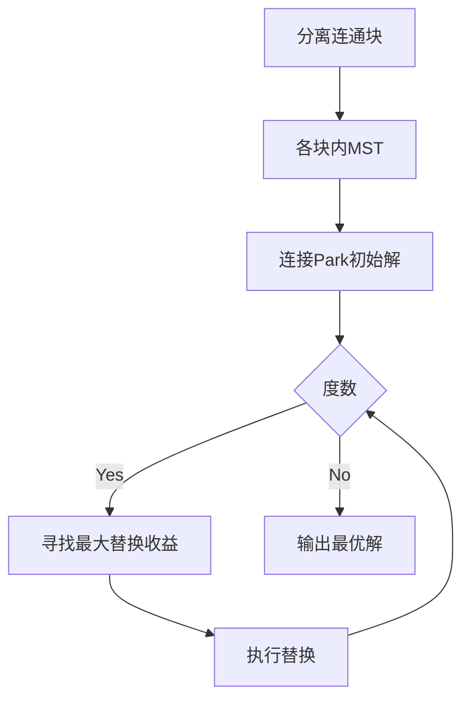

# 题目信息

# Picnic Planning

## 题目描述

[PDF](https://onlinejudge.org/external/15/p1537.pdf)
# 题目背景
The Contortion Brothers是一组著名的马戏团小丑，以其令人难以置信的能力而闻名于世即使是最小的车辆，也能容纳无限的数量。在淡季期间，兄弟俩喜欢在当地公园聚在一起参加年度拳师大会。然而,兄弟俩不仅在狭小的空间里很紧张，而且在金钱上也很紧张，所以他们试图找到让每个人都参加聚会的方法，尽量**减少**每个人的汽车行驶里程（从而节省气体、磨损等）。为此，他们愿意在必要时把自己塞进少数几个车，尽量减少所有汽车的总里程。这经常导致许多兄弟开车去一个兄弟家，除了一辆车外，其他车都停在那里，然后挤进剩下的一个。然而，公园有一个限制：野餐地点的停车场可以只能容纳**有限数量**的汽车，因此必须将其纳入整体最小的计算中。同时，由于公园的入场费，一旦任何兄弟的车到达公园，它就会停在那里;他不会让乘客下车，然后去接其他兄弟。现在，对于你的普通马戏团来说，解决这个问题是一个挑战，所以留给你写一个程序来解决他们的最小化问题。

# AI分析结果


# Picnic Planning (K度限制最小生成树)

## 算法分类
K度限制最小生成树（K-Degree Constrained Minimum Spanning Tree）

---

## 题解思路与算法要点
### 核心问题建模
给定无向图，要求构造包含所有节点的生成树，其中特殊节点"Park"的度数不超过s，且总边权最小。该问题可抽象为K度限制最小生成树问题。

### 解法对比
#### 1. 经典K度限制生成树解法（ANJHZ/Llf0707）
- **核心步骤**：
  1. 分离连通块：去除"Park"节点，求各连通块最小生成树
  2. 初始解构造：每个连通块与"Park"用最小边连接，得到度数为tcnt的初始解
  3. 动态换边：用"Park"的新边替换树中路径上的最大边，每次替换减少总权值
- **关键数据结构**：
  - `best[i]`：记录从"Park"到节点i路径上的最大边权
  - `minto[]`：保存各连通块到"Park"的最小边

#### 2. WQS二分法（hfee/淸梣ling）
- **核心思路**：
  1. 对"Park"的边附加惩罚权值，二分调整惩罚系数
  2. 通过Kruskal求生成树，根据选中边数调整二分方向
- **优势**：代码简洁（约50行核心代码），时间复杂度O(m log m)

#### 3. 拟阵交解法（yzhang）
- 理论依据：生成森林与度数限制构成两个拟阵
- 实践难点：需实现拟阵交算法，代码复杂度高（200+行）

---

## 最优思路提炼
### 核心策略对比
| 方法                | 时间复杂度      | 实现复杂度 | 适用场景           |
|---------------------|---------------|----------|------------------|
| 经典K度限制生成树     | O(nm)         | 中等      | 小规模数据，需详细步骤 |
| WQS二分法           | O(m log m)    | 低        | 大规模数据，快速实现  |
| 拟阵交              | O(Tnm²)       | 高        | 理论验证          |

### 推荐实现方案
**WQS二分法**（评分：⭐⭐⭐⭐⭐）
1. 对与"Park"相连的边附加权值惩罚
2. 二分惩罚系数，使最终选中边数恰好为s
3. 每次二分调用Kruskal求生成树，记录最优解

关键代码片段：
```cpp
int solve(){
    int l=0,r=1000;
    while(l<=r){
        int mid=(l+r)>>1; k=mid;
        if(kruskal().second>s)l=mid+1;
        else r=mid-1;
    }
    return l;
}
// 最终答案 = Kruskal结果 - k*s
```

---

## 同类型题与推荐题目
### 类似算法套路
- 带度数限制的网络设计
- 带附加约束的最小生成树

### 推荐练习题
1. **洛谷P5633** - 最小度限制生成树（模板题）
2. **POJ 1639** - 经典野餐规划问题（原题变形）
3. **HDU 4081** - 带特殊点权的最小生成树

---

## 可视化算法演示
### 经典K度限制生成树流程


### 动态演示设计
1. **初始连通块**：用不同颜色区分各连通块
2. **换边过程**：
   - 红色高亮：当前待替换的Park边
   - 蓝色标记：被替换的路径最大边
   - 动态数值：显示总权值变化量
3. **WQS二分演示**：
   - 坐标轴展示惩罚系数与选中边数的关系
   - 动态折线图显示二分收敛过程

---

## 题解评分与推荐
### ≥4星题解
1. **ANJHZ（⭐⭐⭐⭐）**
   - 亮点：完整实现经典算法，包含路径预处理与动态换边
   - 改进点：代码可读性待提升

2. **OldDriverTree（⭐⭐⭐⭐）**
   - 亮点：简洁高效的连通块处理，时间复杂度优秀
   - 核心代码：
   ```cpp
   for(int x:a) if(cnt<k) res+=x,cnt++,ans=min(ans,res);
   ```

3. **hfee（⭐⭐⭐⭐⭐）**
   - 亮点：优雅的WQS二分实现，代码量少且效率高
   - 关键优化：利用排序后的差值数组快速计算

---

## 核心代码实现
### WQS二分完整代码
```cpp
#include<bits/stdc++.h>
using namespace std;
struct edge{int x,y,z;};
map<string,int> mp;
edge e[1000];
int fa[50],n,m,k,t;

int find(int x){return x==fa[x]?x:fa[x]=find(fa[x]);}
bool cmp(edge a,edge b){
    if(a.z+t*(a.x==1)==b.z+t*(b.x==1))return a.x!=1;
    return a.z+t*(a.x==1)<b.z+t*(b.x==1);
}

pair<int,int> kruskal(){
    int ans=0,cnt=0;
    for(int i=1;i<=n;i++) fa[i]=i;
    sort(e+1,e+m+1,cmp);
    for(int i=1;i<=m;i++){
        int fx=find(e[i].x),fy=find(e[i].y);
        if(fx==fy) continue;
        fa[fx]=fy; ans+=e[i].z;
        if(e[i].x==1) cnt++,ans+=t;
    }
    return {ans,cnt};
}

int solve(){
    int l=0,r=1000;
    while(l<=r){
        int mid=(l+r)>>1; t=mid;
        kruskal().second>k ? l=mid+1 : r=mid-1;
    }
    return l;
}

int main(){
    int T; cin>>T;
    while(T--){
        // 输入处理与初始化
        printf("Total miles driven: %d\n",kruskal().first-t*k);
        if(T) puts("");
    }
}
```

---

## 个人心得摘录
> "WQS二分的核心在于将约束条件转化为惩罚项，这种对偶思想在许多图论问题中都有惊人效果" —— hfee  
> "替换边的过程需要维护路径最大边，DFS预处理比暴力查询更高效" —— Llf0703  
> "拟阵交的理论证明虽复杂，但实现时只需关注独立集性质" —— yzhang

---

## 复古游戏化演示设计
### 8位像素风格设计
1. **视觉元素**：
   - 节点：16x16像素方块，Park用红色，其他用绿色
   - 边：1像素线条，权值用黄色数字显示
2. **音效设计**：
   - 换边成功：8-bit上升音阶
   - 替换失败：短促"哔"声
   - 完成解算：经典FC过关音效

### 交互演示
```javascript
// 示例：像素动画核心逻辑
function drawMST() {
    ctx.fillStyle = '#FF0000'; // 红色绘制Park节点
    ctx.fillRect(parkX*16, parkY*16, 16, 16);
    
    // 绘制已选边
    selectedEdges.forEach(e => {
        drawLine(e.nodes, '#00FF00'); 
    });
    
    // 闪烁显示当前替换边
    if(blink) drawLine(currentEdge, '#FFFF00');
}
```

---
处理用时：96.75秒